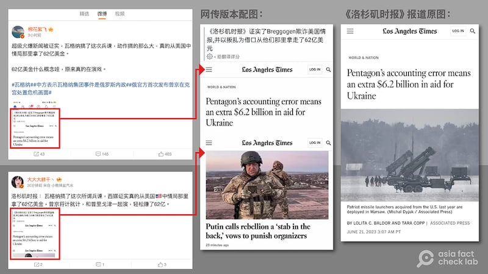
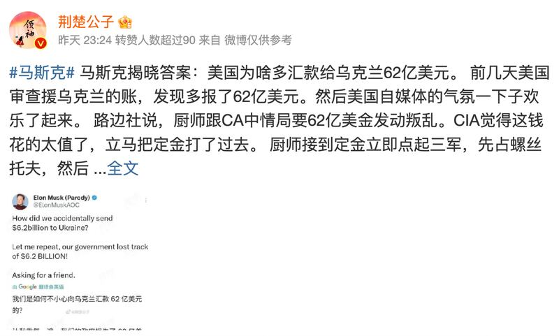

# 事實查覈｜美媒證實瓦格納拿美國中情局62億美元？

作者：莊敬、鄭崇生，發自臺北、華府

2023.06.28 13:14 EDT

## 標籤：錯誤

## 一分鐘完讀：

俄羅斯傭兵組織瓦格納集團6月24日發動武裝叛變，隔日在白俄羅斯的調停下落幕。亞洲事實查覈實驗室注意到，微博上多位“大V”用戶聲稱《洛杉磯時報》已證實，瓦格納集團從美國中情局（CIA）拿了62億美元，並附上報道截圖。

經查，《洛杉磯時報》並未發表所謂證實瓦格納從CIA拿錢的報道；網傳的報道截圖疑爲經改造的假圖，其原文是美國國防部說明軍援烏克蘭浮報62億美元的新聞，未提及瓦格納，卻被人將報道標題配上錯誤的中文翻譯，以及瓦格納領袖的照片轉發至中文社媒。

## 深度解析：

俄烏戰爭進入第16個月，俄羅斯傭兵組織瓦格納集團（Wagner Group）在領袖普里戈任（又稱普里戈津）Yevgeny Prigozhin號召下，於6月24日發動叛變，隔日，經白俄羅斯調停後撤軍。戲劇性的“一日叛變”吸引全球目光，“瓦格納”一度登上微博熱搜，引發各種評論和猜想。

亞洲事實查覈實驗室發現，在微博、推特等平臺上，一張《洛杉磯時報》報道的截圖被廣泛傳播，傳播者聲稱美媒已證實：“瓦格納搞了這次兵諫，動作搞那麼大，真的從美國中情局那裏拿了62億美元”；轉發者包括多位獲微博認證，擁有數十萬、上百萬粉絲的博主，迅速掀起輿論熱潮。

## 網傳截圖疑經改造和錯誤翻譯

網傳截圖來自《洛杉磯時報》的報道《五角大廈會計失誤，軍援烏克蘭多算了62億美元》（Pentagon’s accounting error means an extra $6.2 billion in aid for Ukraine）。但《洛杉磯時報》原報道配用的照片是美國愛國者飛彈，網傳版本配圖卻變成普里戈任的照片。一些博主還在截圖配上錯誤的中文翻譯（下圖）。

組圖：微博、推特等平臺流傳《洛杉磯時報》報道截圖，聲稱證實瓦格納集團拿了美國中情局62億美元。但《洛杉磯時報》這篇報道並未提及瓦格納集團，且兩者配圖不符。（圖取自微博、《洛杉磯時報》網站）

亞洲事實查覈實驗室找到 [《洛杉磯時報》6月21日刊出的報道](https://www.latimes.com/world-nation/story/2023-06-21/pentagon-accounting-error-extra-money-ukraine-aid#:~:text=The%20Pentagon%20said%20Tuesday%20that,used%20for%20future%20security%20packages.),原報道通篇未提瓦格納。再以"瓦格納"、"中情局"等關鍵詞搜尋,也沒有找到美國媒體"證實瓦格納從CIA拿了62億美元"的報道。

另有 [網民聲稱](https://m.weibo.cn/status/4917513164689387),特斯拉總裁馬斯克(Elon Musk)發推"坐實"瓦格納跟CIA要62億美元,發動叛變。不過,該推特號註明爲"模仿"(parody)帳號,且其推文原文也只是在質疑"多給烏克蘭62億美元"的事,並沒有提到瓦格納與此事有什麼關係。

微博“大V”用戶轉傳馬斯克“模仿”帳號推文。（圖取自微博）

有關美國國防部因會計失誤而浮報軍援烏克蘭62億美元, [國防部副發言人辛格(Sabrina Singh)已於6月20日的記者會說明](https://www.defense.gov/News/Transcripts/Transcript/Article/3433535/deputy-pentagon-press-secretary-sabrina-singh-holds-a-press-briefing/),發生錯誤的原因是,美國軍援烏克蘭多爲舊武器,應以帳面淨值估算,但官員在某些情況下采用重置成本(又稱現行成本)計算,以致高估軍援烏克蘭的金額。

## 拜登：美國未涉入瓦格納叛變

[美國總統拜登26日首度對瓦格納叛變事件發言](https://www.whitehouse.gov/briefing-room/press-briefings/2023/06/26/press-briefing-by-press-secretary-karine-jean-pierre-and-nsc-coordinator-for-strategic-communications-john-kirby-17/):"我們明確表示,我們沒有涉入。我們與此無關。這是俄羅斯體制內部鬥爭的一部分。"拜登並說,美國與主要盟友聯繫並達成共識,必須確保沒有給俄羅斯總統普京任何藉口,將此事歸咎於西方或北約(NATO)。

普里戈任與瓦格納集團被美國、歐盟等地實施多輪制裁。 [美國財政部6月27日發佈聲明](https://home.treasury.gov/news/press-releases/jy1581)指出,對俄羅斯、阿拉伯聯合酋長國、中非共和國的4家公司實施制裁,他們被指控與瓦格納集團及普里戈任過從甚密,涉嫌從事非法黃金交易,向瓦格納提供資金。 [美國國務院表示](https://www.state.gov/briefings/department-press-briefing-june-27-2023/#post-457240-RussiaBelarusUkraine),制裁與上週末的叛變無關。

亞洲事實查覈實驗室26日以郵件詢問美國中情局及國務院，中情局拒絕置評，國務院則以拜登上述聲明作爲回覆。

## 結論：

經查覈，《洛杉磯時報》並未發佈所謂證實瓦格納集團拿美國中情局62億美元的報道，網民轉發的報道截圖中文標題有誤、配圖經更換。網傳“美媒證實：瓦格納拿美國中情局62億美元”爲不實謠言。

*亞洲事實查覈實驗室（Asia Fact Check Lab）是針對當今複雜媒體環境以及新興傳播生態而成立的新單位。我們本於新聞專業，提供正確的查覈報告及深度報道，期待讀者對公共議題獲得多元而全面的認識。讀者若對任何媒體及社交軟件傳播的信息有疑問，歡迎以電郵 [afcl@rfa.org](http://afcl@rfa.org)寄給亞洲事實查覈實驗室，由我們爲您查證覈實。*

[Original Source](https://www.rfa.org/mandarin/shishi-hecha/hc-06282023131020.html)