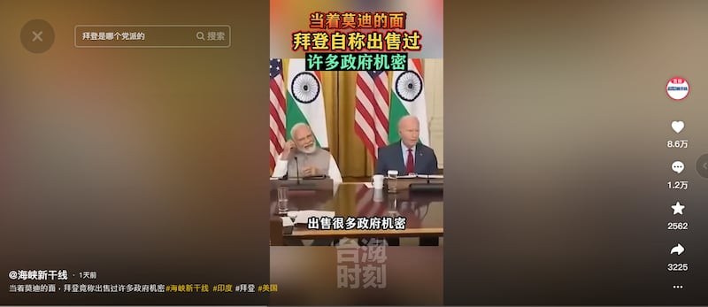

# 事實查覈｜美國總統拜登承認出售國家機密？

作者：莊敬

2023.06.29 13:00 EDT

## 標籤：斷章取義

## 一分鐘完讀：

中國多家官方媒體近日在社交媒體平臺發佈短視頻，指美國總統拜登當着印度總理莫迪的面，承認出售過許多政府機密。

亞洲事實查覈實驗室發現，這是6月23日，拜登與莫迪在白宮會見科技公司高層時一開場就講的活躍氣氛的玩笑話。白宮的文字記錄和完整影片顯示，拜登緊接着言歸正傳，說：“現在玩笑先放一邊”，網傳短視頻卻沒有這句話，是脫離上下文斷章取義。

## 深度解析：

中國社交媒體上廣泛傳播的短視頻指美國總統拜登自稱出售過許多政府機密。（圖取自抖音）

“總之，我開始背著你們，出售很多政府機密，和我們談論過的非常重要的訊息。”畫面中，美國總統拜登面向在座的美國科技界代表說這句話時，身旁坐著印度總理莫迪（Narendra Modi）。

[東南衛視"海峽新幹線"官方抖音號](https://twitter.com/TongMediaHK/status/1673861161304096768)28日發佈這段僅9秒的短視頻,配上大標題"當著莫迪的面,拜登自稱出售過許多政府機密"。 [《東南早報》](https://www.douyin.com/video/7249544527478885636)和香港中通社旗下 ["通傳媒"](https://twitter.com/TongMediaHK/status/1673861161304096768)同日也在抖音、推特轉傳這段短視頻。

這段畫面來自拜登與莫迪於6月23日在白宮會見和科技公司高層的活動, [白宮文字記錄](https://www.whitehouse.gov/briefing-room/speeches-remarks/2023/06/23/remarks-by-president-biden-and-prime-minister-modi-of-the-republic-of-india-in-meeting-with-senior-officials-and-ceos-of-technology-companies/)與 [完整影片](https://www.google.com/search?q=President+Biden+and+Prime+Minister+Modi+of+the+Republic+of+India+in+Meeting+with+Senior+Officials+and+CEOs+of+Technology+Companies&source=hp&ei=obOdZP2hFZGu5NoP-byMoAE&iflsig=AOEireoAAAAAZJ3BseJ6soMryLiQ7cucLNeifHuI5fqW&ved=0ahUKEwi99sKx9ej_AhURF1kFHXkeAxQQ4dUDCAs&uact=5&oq=President+Biden+and+Prime+Minister+Modi+of+the+Republic+of+India+in+Meeting+with+Senior+Officials+and+CEOs+of+Technology+Companies&gs_lcp=Cgdnd3Mtd2l6EANQAFgAYABoAHAAeACAAQCIAQCSAQCYAQCgAQKgAQE&sclient=gws-wiz#fpstate=ive&vld=cid:defaca7b,vid:xxlKUl-z368)顯示,拜登開場時說出"已經賣了很多國家機密"時,包括莫迪在內的與會者當時都笑了,緊接著拜登說"現在玩笑先放一邊",開始討論將會"改變世界各地人民生活"的新技術領域合作前景。

拜登還鼓勵在座的蘋果執行長庫克（Tim Cook）等業界代表在兩國加強經濟合作時扮演積極的角色。

## 反對者借題發揮 外媒速查覈

在中國媒體轉發前,拜登開玩笑的短視頻已在英文傳播世界廣泛傳播,網傳版本大多失去上下文,剪掉了拜登明確表示這是玩笑話的一段,一些反對者開始譴責拜登"公開承認出賣國家機密"。其中包括由美國共和黨全國委員會(RNC)運作的推特帳號 ["RNC Research"](https://twitter.com/RNCResearch/status/1673436267634388992)、共和黨聯邦衆議員 [馬特·蓋茨(Matt Gaetz)](https://twitter.com/mattgaetz/status/1673462794258096129) 、 [馬喬麗·泰勒·格林(Marjorie Taylor Greene)](https://twitter.com/RepMTG/status/1673446541523136513)等人,其中格林的配文寫道:拜登承認自己的"罪行"。

美國事實查覈組織 ["FactCheck.org"](https://www.factcheck.org/2023/06/misleading-online-posts-distort-bidens-joke-at-meeting-with-indian-prime-minister/)、 [美聯社](https://apnews.com/article/fact-check-biden-india-modi-microsoft-google-738627587204)、 [法新社](https://factcheck.afp.com/doc.afp.com.33L82KV?utm_source=headtopics&utm_medium=news&utm_campaign=2023-06-28)已針對拜登開玩笑的短視頻發佈查覈報告,指經剪輯視頻提供的背景資訊不足,誤導受衆。美聯社、法新社皆曾就此事詢問白宮,但白宮拒絕置評。

《環球網》《參考消息》等中國“中央級”媒體平臺也在社交媒體帳號發佈相關視頻，畫面均未納入拜登當時表示“現在不開玩笑了”的話，但有在字幕或配文中提及拜登自稱是開玩笑。

然而，在抖音上擁有逾3400萬粉絲的“海峽新幹線”、粉絲數達682萬的《東南早報》等媒體，不僅傳播斷章取義的視頻，且在外媒已發佈查覈報告“闢謠”後，仍持續傳播不實信息。

## 結論：

拜登總統在與莫迪總理會見科技界代表並討論兩國的科技領域合作時，以一個玩笑開場，顯示與印度的關係親密，包括莫迪在內的現場的與會者當即笑起來，拜登也隨即表示“玩笑先放一邊”。反對者和中國媒體脫離上下文截出“拜登承認出售國家機密”的視頻，是在斷章取義誤導民衆。

*亞洲事實查覈實驗室（Asia Fact Check Lab）是針對當今複雜媒體環境以及新興傳播生態而成立的新單位。我們本於新聞專業，提供正確的查覈報告及深度報道，期待讀者對公共議題獲得多元而全面的認識。讀者若對任何媒體及社交軟件傳播的信息有疑問，歡迎以電郵 [afcl@rfa.org](http://afcl@rfa.org)寄給亞洲事實查覈實驗室，由我們爲您查證覈實。*

[Original Source](https://www.rfa.org/mandarin/shishi-hecha/hc-06292023125747.html)