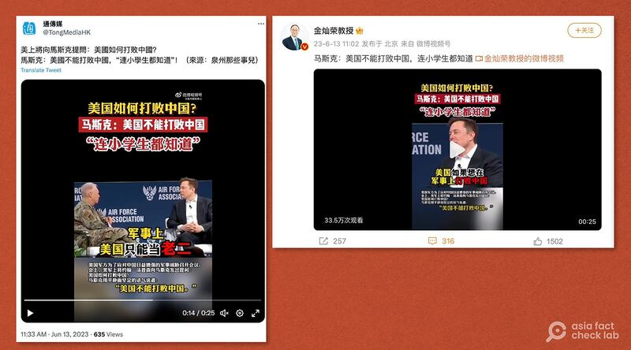
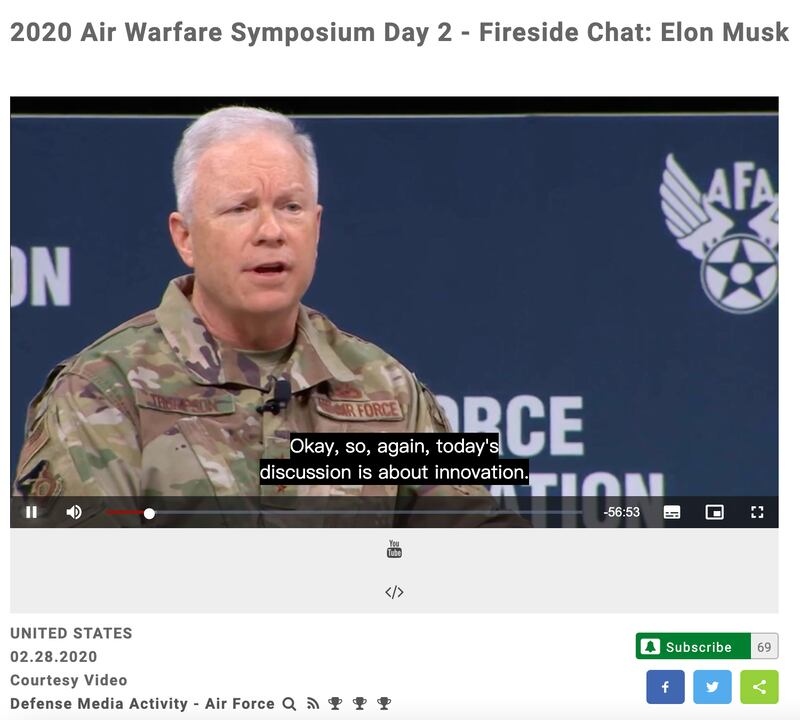

# 事實查覈｜馬斯克說“美國不能打敗中國”？

作者：莊敬

2023.07.04 10:19 EDT

## 標籤：部分錯誤

## 一分鐘完讀：

近期，一條特斯拉總裁馬斯克（Elon Musk）稱“美國不能打敗中國，連小學生都知道”的中文字幕視頻在微博、推特、YouTube、Bilibili（B站）等多個社交媒體平臺廣泛傳播，轉發者包括中通社旗下“通傳媒”官方帳號以及中國”國際關係專家”金燦榮等。

經亞洲事實查覈實驗室查證，短視頻畫面是馬斯克2020年參加美國空軍協會活動上的發言，但原本約一小時的對談被剪輯成25秒，中文標題與字幕更有多處錯誤和不準確的翻譯，包括對談人並未提問字幕所寫的“美國如何打敗中國”，馬斯克也沒有回答“美國不能打敗中國”。

## 深度解析：

在微博擁有265萬粉絲的 [中國國際關係學者金燦榮](https://weibo.com/7264589101/N55qxeHuY?type=repost)6月13日分享了一段短視頻,主題爲「馬斯克:美國不能打敗中國,連小學生都知道」,截至26日,觀看次數已逾33萬。

金燦榮在微博發文的時間顯示爲6月13日11點02分,緊接着《中通社》旗下 [「通傳媒」](https://twitter.com/TongMediaHK/status/1668461644949880833)同天11點33分在推特發佈同一段短視頻,山東省濟寧市委機關報 [《濟寧日報》](https://www.bilibili.com/video/BV1WX4y1b7qV/)11點43分在B站發佈。

中國知名國際關係專家金燦榮(右)、中通社旗下“通傳媒”(左)6月13日在社媒發文，指特斯拉總裁馬斯克稱“美國不能打敗中國”。（圖取自微博、推特）

這條視頻的畫面是馬斯克2020年2月參加美國空軍協會主辦的研討會時，與美國空軍上將湯普森（John Thompson）對談的部分內容。這場對談約持續一小時，社媒上流傳的短視頻從中截取了25秒的畫面，馬斯克的話被打斷拼接，且配上的中文字幕有多處翻錯誤。

亞洲事實查覈實驗室以“馬斯克”、“美國空軍協會”等字詞搜尋，發現自2020年以來，這場對話已有不少相關報道與討論。金燦榮、通傳媒並未說明爲何此時分享舊資訊，但就發文時間點來看，或與馬斯克5月底訪問中國有關。

## 美軍上將問馬斯克什麼？

視頻下方的中文字幕寫道，“美國軍方爲了應對中國日益增強的軍事威脅召開會議。會上，美軍上將約翰・湯普森向馬斯克發出提問：美國如何打敗中國？”

事實上,這是 [美國空軍協會的年度空戰研討會](https://www.dvidshub.net/feature/AWS2020),並不是因應中國軍事威脅而召開的會議,湯普森在開場時已說明,當天的討論圍繞「創新」,以及如何讓空軍成爲國防部最創新的單位。至於湯普森針對美中關係的提問,也並非字幕所寫的「美國如何打敗中國」。

在 [完整視頻](https://www.af.mil/About-Us/Events-2021/videoid/741194/)47分12秒處,湯普森問馬斯克,對於美中之間在經濟或軍事上的競爭,他有什麼想法可以和在座的觀衆分享?

會議主持人、美軍上將湯普森說明，當天討論主題是創新。（圖截自DVIDS網站）

## 馬斯克怎麼回答？

視頻下方的字幕解釋說：“馬斯克用平靜而堅定的語氣說道：‘美國不能打敗中國’。”

馬斯克發言時,視頻中配的中文翻譯是:"**美國如果想在軍事上打敗中國**,就必須克服中美經濟的巨大差距,如果美國沒有創新的辦法,美國就輸定了。如果美國一直不思進取,軍事上美國只能當老二,這是連小學生都懂的道理。讓美國人非常詫異的是,**中國經濟竟然已經是美國的兩三倍了,至少已經兩倍了**,我相信有常識的人都知道,戰爭的基礎是經濟。"

前段引文中的底線及粗體爲亞洲事實查覈實驗室所加，這是兩處錯誤翻譯。

第一，馬斯克並沒說“中國經濟竟然已經是美國的兩三倍，至少已經兩倍了”，他說的話是未來時態，也就是“中國經濟將會是美國經濟的兩三倍，至少兩倍”。

其次，馬斯克也沒說，“美國如果想在軍事上打敗中國”，他說的是：“爲了讓美國在軍事上具有競爭力”。此外，“如果美國一直不思進取”翻譯不準確，馬斯克的原文是：“如果沒有根本性的創新”

更重要的是馬斯克在這段關於美中競爭的問答中，並沒有說出中文字幕強調的：“美國不能打敗中國”。

## 馬斯克呼籲美國保持創新優勢

在這場對話中，馬斯克的原意是：由於中國的人口大約是美國的四、五倍，若中國人均GDP達到美國的一半，經濟規模將可能達美國的兩倍。而戰爭的根本在於經濟，這種情況下只能靠技術創新來獲取優勢，因此他說“如果你只擁有對手一半的資源，那麼你最好是真正的創新者，如果沒有創新，就會失敗。”

## 結論：

在這場聚焦創新的討論中，馬斯克是在強調科技創新對綜合國力的重要性，並呼籲美國保持創新優勢，但經剪輯的短視頻卻明顯“離題”，並以錯誤的中文字幕扭曲馬斯克與對談人的原意，誤導受衆。

*亞洲事實查覈實驗室（Asia Fact Check Lab）是針對當今複雜媒體環境以及新興傳播生態而成立的新單位。我們本於新聞專業，提供正確的查覈報告及深度報道，期待讀者對公共議題獲得多元而全面的認識。讀者若對任何媒體及社交軟件傳播的信息有疑問，歡迎以電郵 [afcl@rfa.org](http://afcl@rfa.org)寄給亞洲事實查覈實驗室，由我們爲您查證覈實。*

[Original Source](https://www.rfa.org/mandarin/shishi-hecha/hc-07042023100850.html)