# 事實查覈｜華語世界關於法國騷亂現場的四條假新聞

作者：董喆

2023.07.05 18:55 EDT

## 標籤：錯誤

## 一分鐘完讀：

法國非裔青少年因路檢衝突遭警察開槍射殺，此案件引發法國社會譁然，進一步衍生爲警民衝突和持續的騷亂。近日，推特上的華語帳號大量傳播“法國騷亂現場”的照片及影片，但有的爲英語世界早已闢謠的不實信息，有的是移花接木的“舊照新用”，有的假消息還被其他假圖片“印證”，彼此形成呼應。亞洲事實查覈實驗室發現了四則廣泛傳播的假消息，並以查覈工具逐一破解。

**深度分析**:

1.法國暴動，動物街上亂竄？

《環球》雜誌前副總編輯劉洪的公衆號“牛彈琴”7月2日以“這是一個不祥的信號，全歐洲現在都很緊張”爲題，在《今日頭條》上發表了一篇講述法國暴動的文章。

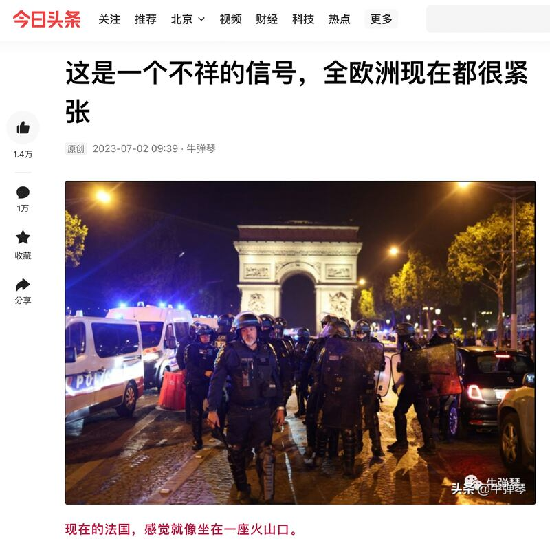

《環球》雜誌前副總編輯劉洪的公衆號“牛彈琴”在《今日頭條》發表描述法國暴動的文章。圖截取自今日頭條

文中，他提到“多個動物園遭到衝擊，一些獅子大象也被釋放出來，可憐的動物都不知道去哪裏纔好”，但並未附上任何影像佐證。

亞洲事實查覈實驗室以“法國暴動”“動物園”等關鍵字在推特以及臉書上搜尋，發現數個帳號轉貼相關內容並附上不同影片。其中流傳最廣的是斑馬與獅子“逃出動物園”的片段。

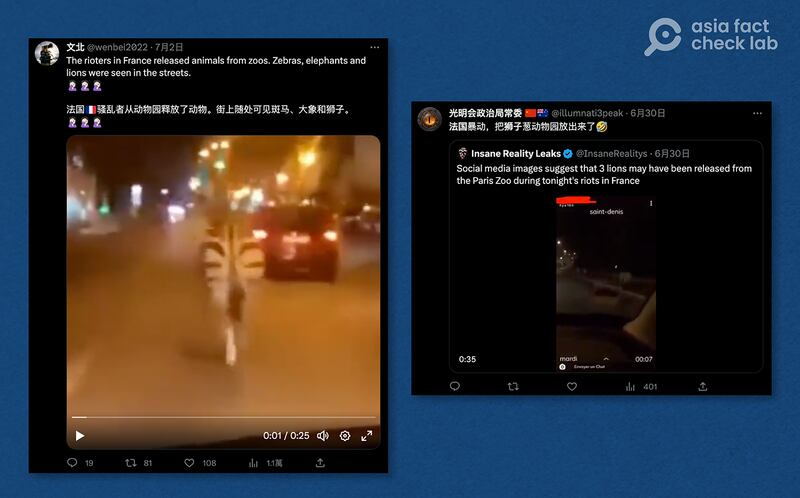

推特上華語使用者轉傳法國暴動中動物脫逃的影片。圖截取自推特

亞洲事實查覈實驗室首先將兩則影片的截圖上傳至搜尋引擎查詢，但因畫質不佳難以辨識。但以“zebra（斑馬） escape（逃脫） france（法國）”等關鍵字搜尋相關新聞，得出的結果顯示，最接近原片段的視頻來源於英國《每日郵報》2020年4月13日發佈的新聞。

以關鍵字查詢相關影片，最接近原片段的是英國《每日郵報》的新聞。圖截取自Google

[每日郵報報導](https://www.dailymail.co.uk/news/article-8214085/Escaped-zebra-canters-road-Parisian-suburb.html%20%E4%B8%8B%E5%8D%882:17),2020年法國疫情封鎖期間,法國巴黎郊區有一隻斑馬在道路上奔跑,據瞭解該只斑馬從馬恩河畔奧爾梅松(Ormesson-sur-Marne)的動物園逃脫。

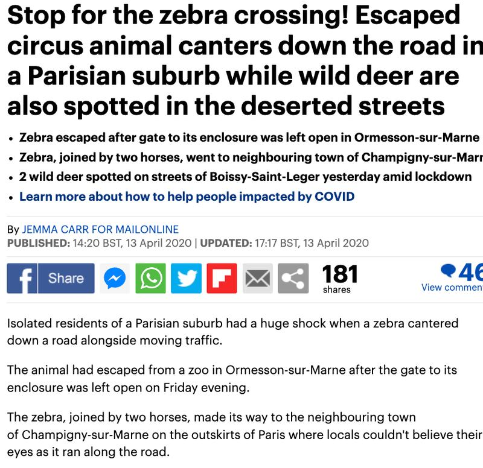

《每日郵報》報道，2020年疫情封鎖期間，法國巴黎郊區有一隻斑馬在道路上奔跑。 圖截取自《每日郵報》

比對《每日郵報》影片與推特上傳播的影片，可以發現推特上的影片是由2020年新聞片段中擷取出來的。

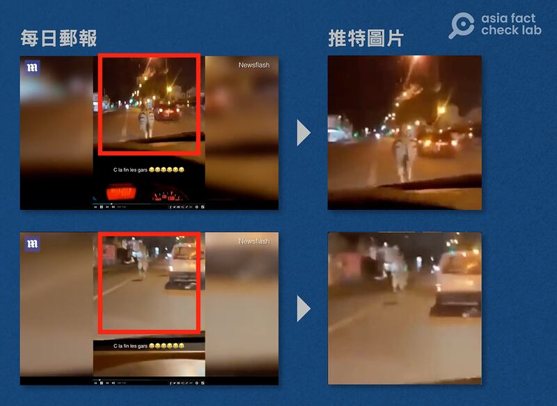

推特流傳的影片是從《每日郵報》的片段中截取重製。圖截取自《每日郵報》、推特

至於獅子逃脫的影片，亞洲事實查覈實驗室發現，影片上有出現一法文關鍵字“saint-denis”，因此將“saint denis（聖德尼）lion（獅子）”作爲關鍵字搜尋影片，發現3年前就有使用者將這則影片發佈在YouTube上。

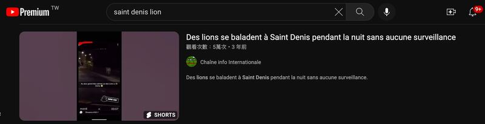

搜尋結果顯示3年前就有使用者將這則影片發佈在YouTube上。圖截取自YouTube

比對推特上的影片以及YouTube使用者上傳的內容，雖然影片上的水印有所出入，但根據上傳者以及影像中的多處光點，可以確定兩者系出自於同一個素材。

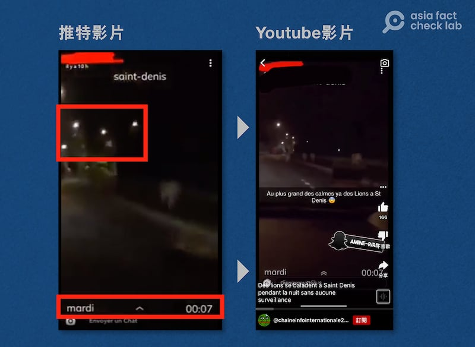

比對兩則影像中的多處光點，可以確定兩者系出同一個素材。圖截取自推特、YouTube

2. 法國青少年持武器狹持警車？

同樣在公衆號“牛彈琴”的文章中，他使用了一張青年持法國國旗並持槍劫持警車的影片，提醒旅法中國公民提高警覺。這張照片也出現在推特的華語使用者帳號上，並被加上抗議者持有軍用武器並搶走警車的描述。

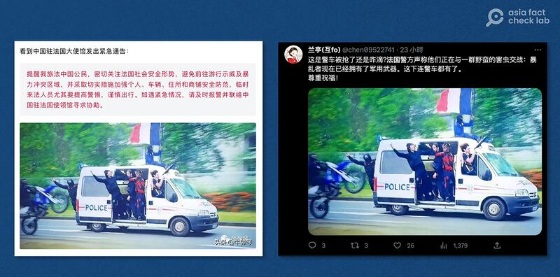

華語社羣中流傳法國青少年劫持警車的照。圖截取自今日頭條、推特

微博上也出現許多帳號轉載，聲稱法國騷亂中“警車變匪車”。

微博上也有許多帳號轉載法國青年劫走警車的照片。圖截取自Google

亞洲事實查覈實驗室利用Google查詢這張照片，發現在暴動之前的2023年1月，這張照片就已經存在。利用抖音上出現的關鍵字“雅典娜電影”搜尋，發現這張照片其實是2022年由Netflix發行的電影《雅典娜》（ATHENA）劇照。

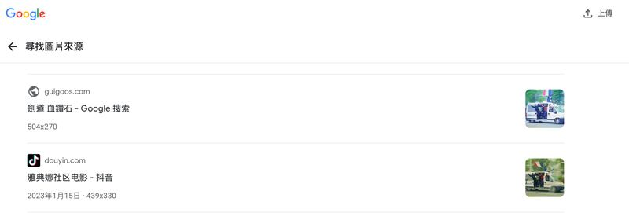

Google搜尋結果顯示，在抖音上的影片曾出現相關關鍵字“雅典娜電影”。圖截取自Google

電影《雅典娜》 [預告片1分26秒處](https://youtu.be/NuAzwWGFJVI?t=86)出現同樣的影像,因此可以確定這張照片是擷取自電影,而非法國暴動的照片。

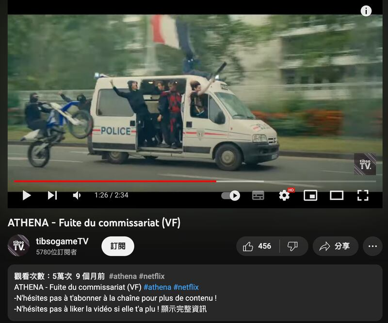

電影《雅典娜》預告片曾出現同一畫面（擷取自YouTube）

3. 法國青年持長槍從頂樓狙擊？

在華語社羣中還有一張照片廣泛流傳：一名身穿黑色羽絨外套的年輕人手持無法判斷真僞的狙擊槍，從高樓向下瞄準。一些推特帳號將這張照片的描述爲“法國騷亂中的青少年狙擊手”。

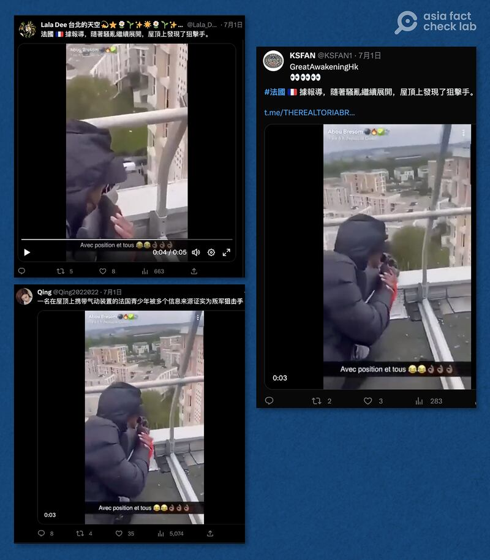

推特上多個華語使用者轉傳宣稱法國暴動中有人手持狙擊槍的影像。圖截取自推特

亞洲事實查覈實驗室將照片上傳至Google，找到一則2023年6月9日由推特用戶上傳的影片，推文意思爲“在上午10點的休息時間，我從CDI的屋頂上打獵，爲午餐做準備”。以發佈時間以及內容皆可判斷，此影片與法國暴動無關。

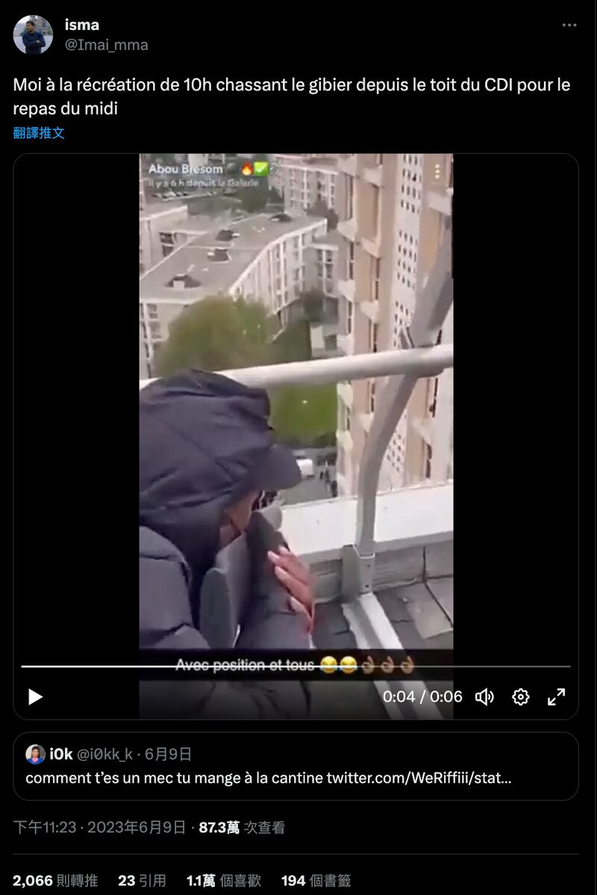

2023年6月9日就曾經有推特用戶上傳同樣的影片。圖截取自推特

且翻閱更早以前的來源，可知早在2022年，這張圖片就已存在。但點入相關連結皆已遺失，我們無法從照片中的其他細節取得近一步資訊，無法確定這支影片中的主角是真實的狙擊手抑或是惡作劇影片。

但能確定的是，在此次法國暴動前，這則影像就已存在，因此這則影片與暴動無關。

2022年網上就已出現這則影片，但因鏈接失效，無法追溯原始內容。圖截取自推特

4.法國民衆暴動之下仍能淡定品酒？

在推特上也出現數個帳號同時發表“法國人的心比較大……找個好位置看熱鬧”的推文，並附上同一張照片，照片中一男一女在街邊品酒，他們的正後方正有大火在燃燒。

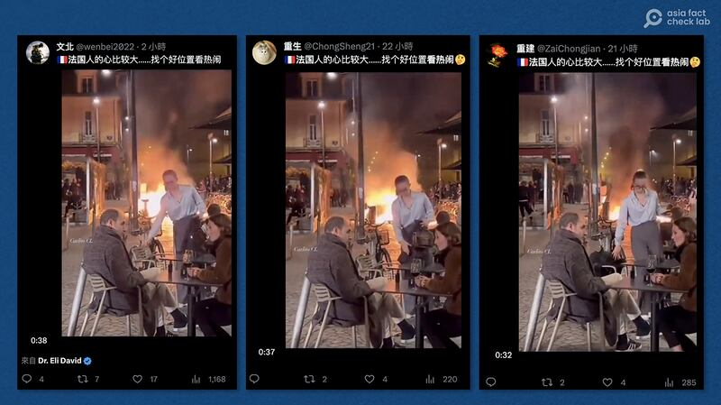

推特上多個華語使用者轉傳法國民衆在暴動中品酒的照片。圖截取自推特

同樣以Google查詢此張照片,亞洲事實查覈實驗室發現2023年3月時這張照片在中英文世界就曾廣泛流傳,根據英國《獨立報》 [報導](https://www.independent.co.uk/news/world/europe/france-pension-protest-macron-fire-b2308516.html),這張照片的拍攝時間是在今年3月,當時法國民衆正在抗議總統馬克龍推行的退休金改革。當時微博上也有諸多討論,認爲法國人面對騷亂時仍能保持淡定精神。

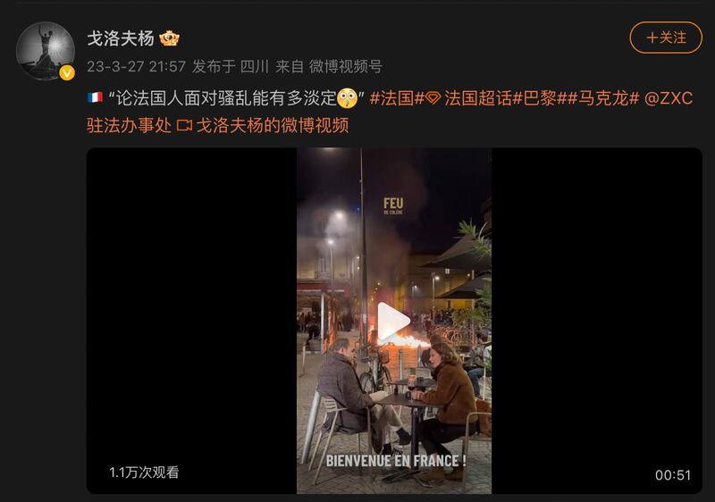

2023年3月在微博上就已經有民衆討論過這張照片。圖截取自微博

由此判斷，這次法國暴動在推特上廣傳的民衆淡定品酒照，其實是從2023年3月的舊影片中擷取出來的，與此次暴動無關，是又一例舊照遭誤用的個案。

*亞洲事實查覈實驗室(* *Asia Fact Check Lab* *)是針對當今複雜媒體環境以及新興傳播生態而成立的新單位。我們本於新聞專業,提供正確的查覈報告及深度報道,期待讀者對公共議題獲得多元而全面的認識。讀者若對任何媒體及社交軟件傳播的信息有疑問,歡迎以電郵* [afcl@rfa.org](http://afcl@rfa.org) *寄給亞洲事實查覈實驗室,由我們爲您查證覈實。*

[Original Source](https://www.rfa.org/mandarin/shishi-hecha/hc-07052023172717.html)