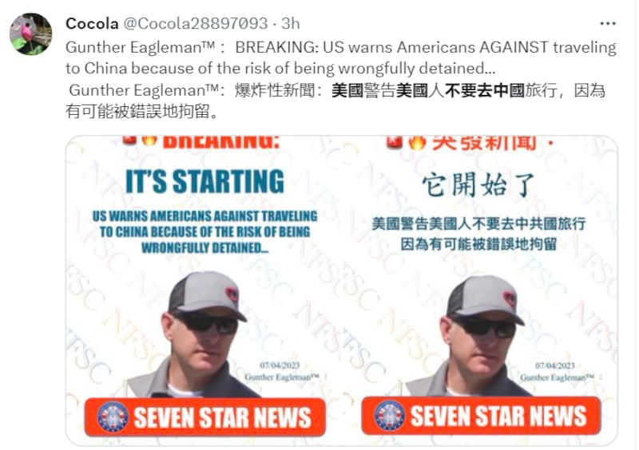
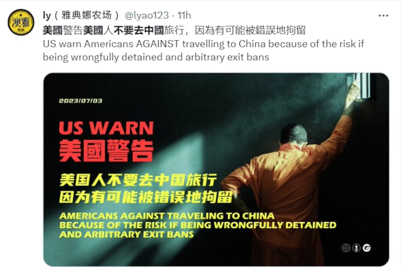
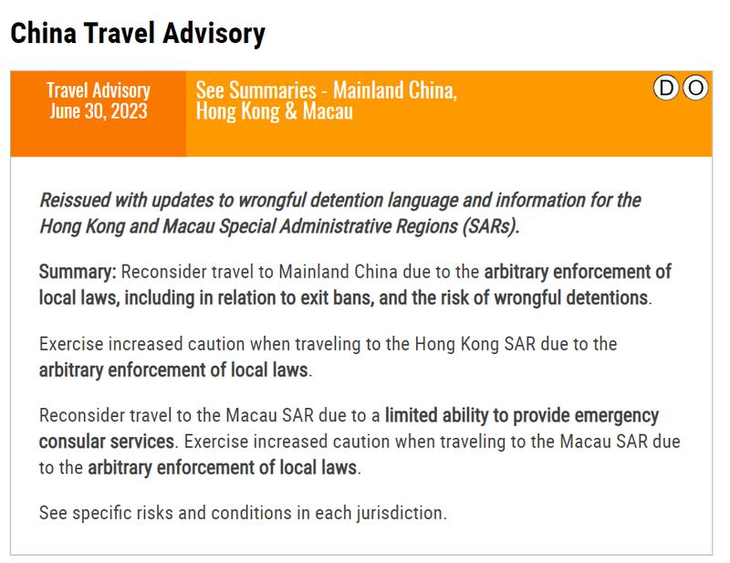
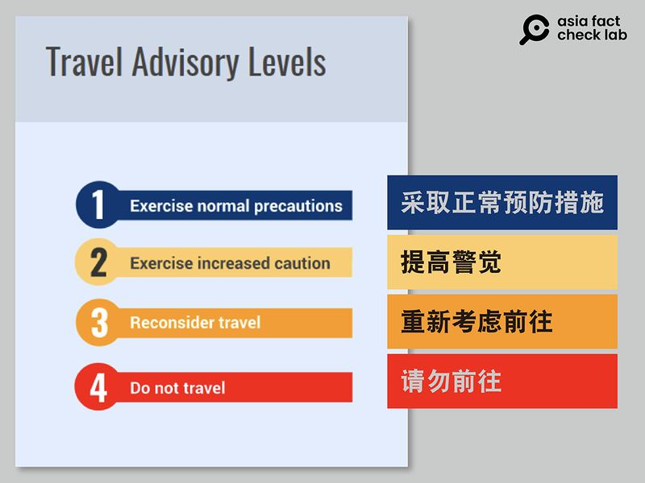

# 事實查覈｜美國警告美國人不要去中國？

作者：莊敬

2023.07.06 18:21 EDT

## 標籤：部分錯誤

推特多名用戶轉發“美國警告美國人不要去中國旅行”消息。圖取自推特

亞洲事實查覈實驗室注意到，近日，推特上大量用戶轉發評論以上圖卡，稱“美國警告美國人不要去中國旅行，因爲有可能被錯誤地拘留”。

經查，美國政府並未警告美國人“不要去”中國，而是建議美國人“重新考慮”前往中國的旅行。

美國國務院根據世界各地存在的各類風險等級，將旅行警告分爲四級，第一級爲“採取正常預防措施”，第二級敦促旅行者“提高警覺”，第三級建議民衆“重新考慮前往”，第四級是最嚴重的“請勿前往”。

中國《對外關係法》及修訂版《反間諜法》7月1日生效。 [美國國務院即更新前往中華人民共和國的旅行警告](https://travel.state.gov/content/travel/en/traveladvisories/traveladvisories/china-travel-advisory.html),稱由於當地法律的任意執行,包括與出境禁令有關的法律,以及不當拘押的風險,"請重新考慮前往中國的旅行"。

美國政府確實提出前往中國存在不當拘押等風險，但目前針對中國的旅行警告仍爲第三級“重新考慮前往”，尚未升至網傳的第四級“不要去”“勿前往”。因此網傳信息沒有準確描述中國作爲旅行目的地的風險等級，部分失實。

美國國務院針對目的地爲中國（包括香港、澳門）的旅行建議，提到當地存在法律被任意執行的風險。 圖取自國務院官網

美國國務院最新發布前往中華人民共和國的旅行警告爲第三級“重新考慮前往”。圖取自美國國務院官網

*亞洲事實查覈實驗室(* *Asia Fact Check Lab* *)是針對當今複雜媒體環境以及新興傳播生態而成立的新單位。我們本於新聞專業,提供正確的查覈報告及深度報道,期待讀者對公共議題獲得多元而全面的認識。讀者若對任何媒體及社交軟件傳播的信息有疑問,歡迎以電郵* *afcl@rfa.org* *寄給亞洲事實查覈實驗室,由我們爲您查證覈實。*

[Original Source](https://www.rfa.org/mandarin/shishi-hecha/hc-07062023181406.html)