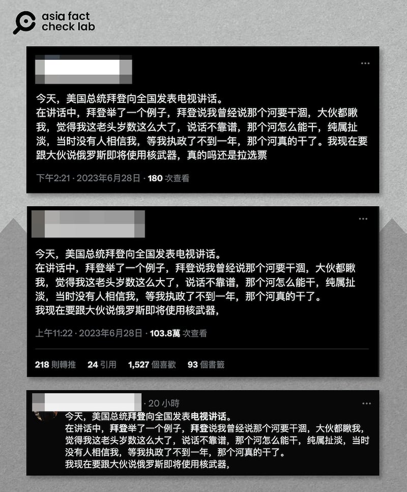
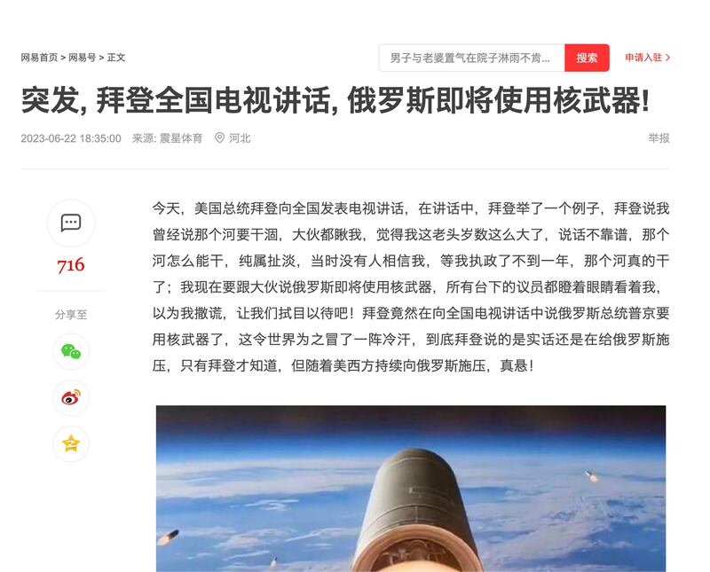

# 事實查覈｜拜登發表全國電視講話宣佈俄羅斯將使用核武？

作者：董喆

2023.07.07 14:50 EDT

## 標籤：錯誤

## 一分鐘完讀：

近日，多個推特及微博帳號宣稱：美國總統拜登發表全國電視講話，宣佈俄羅斯將使用核武器。

亞洲事實查覈實驗室查證後發現，拜登近日並未發表全國電視講話。且拜登在其它公開講話中也並未宣佈俄羅斯“將使用核武”。接近的談話內容是，拜登曾在加州參加一場選舉活動時提到，自己“擔心普京使用核武但周遭人不太當回事”，並以此爲例說明氣候變化議題面臨同樣的分歧。他表示，俄羅斯動用核武和氣候變遷，這兩個威脅都是真實存在的。他的上述言論也並不是在發佈核戰爭警告。

## 深度分析：

近日，微博和推特出現了字句高度雷同的貼文，內容皆稱美國總統拜登發表全國電視講話，宣佈俄羅斯將動用核武器，這些貼文的發佈日期集中在6月28日與29日，形成輿論熱點，其中更有一則推文有超過百萬次瀏覽量。

6月28日至29日，推特上出現的雷同推文稱拜登發表電視講話，宣佈俄羅斯即將使用核武器。 圖截取自推特

亞洲事實查覈實驗室以貼文中的關鍵字進行搜尋，發現早在一週前“網易號”就已出現雷同的文章，並以“突發”強調拜登以全國電視講話宣佈俄羅斯將動用核武的急迫性。

6月22日“網易號”上出現的文章，將拜登的“電視講話”當作突發新聞。 圖截取自網易

在貼文評論區,有發文者稱新聞來源是路透社20日發表的報道 [《拜登稱普京使用戰術核武器的威脅是"真實的"》](https://www.reuters.com/world/biden-says-threat-putin-using-tactical-nuclear-weapons-is-real-2023-06-20/)

發文者引述了拜登兩段發言：第一段是“大約兩年前，當我在這裏說我擔心科羅拉多河干涸時，每個人都看着我，就像我瘋了一樣”。第二段是“他們看着我，就像我說我擔心普京使用戰術核武器一樣，這是真的。”

爲了瞭解拜登發言的語境，亞洲事實查覈實驗室找到了完整的新聞稿。這段發言發生在6月19日加州阿瑟頓一場競選活動現場，拜登當時主要是在說氣候變化問題。

根據 [白宮新聞稿原文](https://www.whitehouse.gov/briefing-room/speeches-remarks/2023/06/19/remarks-by-president-biden-at-a-campaign-reception-atherton-ca/),拜登先是提到他上任以來,已經有相當於整個馬里蘭州面積的土地因氣候變化而燒燬。他接着說:"大約三年前,當我說我擔心科羅拉多河干涸時,每個人都像看瘋子一樣看着我。當我說我擔心普京使用戰術核武器時,他們也是這樣看我的。 "接着他說:"這(威脅)是真實存在的,但我們可以應對它。"

## 結論：

美國總統拜登在加州競選活動現場的講話並不是在預告核戰爭即將爆發，而是在描述大家對這個世界面臨的一些風險有不同的看法，而他自己則是“既有遠慮亦有對策”。迄今爲止他也沒有發表過電視講話宣佈俄羅斯“即將使用核武器”，推特和微博上的大量貼文將他發言的內容和背景都進行了篡改，是在傳播錯誤信息。

*亞洲事實查覈實驗室（Asia Fact Check Lab）是針對當今複雜媒體環境以及新興傳播生態而成立的新單位。我們本於新聞專業，提供正確的查覈報告及深度報道，期待讀者對公共議題獲得多元而全面的認識。讀者若對任何媒體及社交軟件傳播的信息有疑問，歡迎以電郵afcl@rfa.org寄給亞洲事實查覈實驗室，由我們爲您查證覈實。*

[Original Source](https://www.rfa.org/mandarin/shishi-hecha/hc-07072023144404.html)