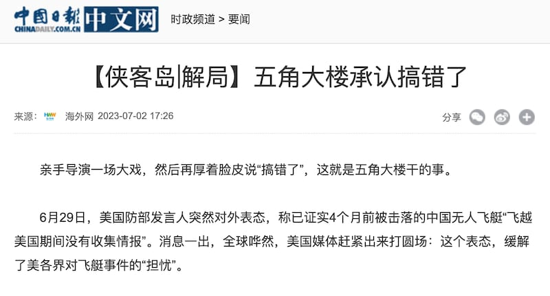
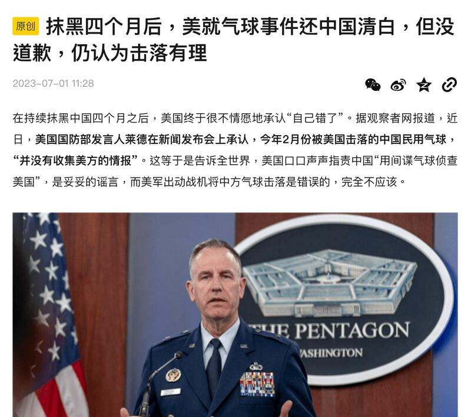

# 事實查覈｜美國承認中國間諜氣球事件"搞錯了"？

作者：莊敬

2023.07.10 19:01 EDT

## 標籤：錯誤

## 一分鐘完讀：

環球網、《中國日報》等媒體近日刊登文章，引述美國國防部發言人萊德6月29日在記者會上的談話，證實四個月前被擊落的中國無人飛艇飛越美國期間沒有收集情報，“五角大樓承認搞錯了”。

但據亞洲事實查覈實驗室覈實，萊德準確的說法是該氣球具備蒐集情報的能力，但經評估，它飛越美國時沒有蒐集到情報，且美國採取了措施，降低了氣球的情報蒐集能力。然而，部分中國官媒、網民僅引述“沒有收集情報”，並因此聲稱美國“承認搞錯”，屬於斷章取義的不實信息。

## 深度解析：

中國《人民日報》旗下帳號、在微博擁有逾千萬粉絲的"俠客島"6月30日發文,以 [《五角大樓承認搞錯了》](https://weibo.com/5476386628/N7JZX6hyg)爲題,指美國防部發言人萊德(Patrick Ryder)表態稱,已證實4個月前被擊落的中國無人飛艇"飛越美國期間沒有收集情報";包括 [環球網](https://3w.huanqiu.com/a/21eee3/4DXvZ92XB3d?agt=61_2.undefined)、 [《中國日報》](https://china.chinadaily.com.cn/a/202307/02/WS64a13b60a310ba94c5614732.html)等媒體都轉載了這篇文章。

在官媒的輿論引導下，搜狐、網易等多個平臺上都有類似論點的文章發佈，稱美國就氣球事件“還中國清白”，“承認自己錯了，卻不爲抹黑中國道歉”。

《人民日報》旗下帳號“俠客島”近日發文，稱氣球事件美國五角大樓承認搞錯了。圖取自《中國日報》官網

搜狐網刊登的評論文章，指美國就氣球事件抹黑中國四個月後，終於承認自己錯了，但沒道歉。圖取自搜狐

## 美國國防部說了什麼？

今年初,中國氣球飛越美國領空,美方懷疑爲情蒐所用的高空偵測氣球(或稱"間諜氣球"),中方則宣稱爲氣象研究的民用氣球;美軍在追蹤氣球數日後,於南卡羅來納州附近海域上空擊落,殘骸由美國情報部門檢測分析,最近初步調查結果出爐。據 [《華爾街日報》6月29日報道](https://www.wsj.com/articles/chinese-balloon-used-american-tech-to-spy-on-americans-2e3f5039),該氣球上裝了美國製造的設備,協助氣球蒐集照片、影片等資訊,但當時資料未傳回中國。

6月29日美國國防部記者會上，有記者就《華爾街日報》的報道詢問發言人萊德：中國的間諜氣球上是否有敏感的美國設備？中方如何取得這些設備？設備有什麼功能？

根據 [國防部發布的記錄](https://www.defense.gov/News/Transcripts/Transcript/Article/3444912/pentagon-press-secretary-air-force-brig-gen-pat-ryder-holds-a-press-briefing/),萊德表示,美方清楚該氣球具備蒐集情報的能力。"我們現在的評估是,它在經過美國或飛越美國時沒有收集(情報)。正如我們當時所說,我們採取了措施,以降低氣球蒐集(情報)的可能性。"

記者再問，美方採取的措施是阻礙了氣球蒐集和傳輸信息，還是它能夠蒐集但只是無法傳回？萊德回應，美方認爲它在經過或飛越美國時“沒有蒐集到”，也確信美方的措施有助於此。

"**沒有獲取情報"vs"沒有蒐集情報"?**

萊德的原文是： “it has been our assessment now that it did not collect while it was transiting the United States or over-flying the United States.”

上述這段話中的"collect"出現不同翻譯版本, [美國之音報道](https://www.voacantonese.com/a/chinese-spy-balloon-did-not-gather-data-over-us-pentagon-20230630/7161478.html)稱"五角大樓稱中國間諜氣球未有在美國上空獲取情報", [德國之聲中文網報道](https://www.dw.com/zh/%E4%BA%94%E8%A7%92%E5%A4%A7%E6%A5%BC%E7%A7%B0%E4%B8%AD%E5%9B%BD%E6%B0%94%E7%90%83%E6%B2%A1%E6%9C%89%E6%94%B6%E9%9B%86%E6%83%85%E6%8A%A5/a-66066375)稱"五角大樓稱中國間諜氣球沒有收集情報"。在英語中,"collect"這個詞既可以表示主動的行動,也可以表示行動的結果。在一個句子裏,它可以表示一個人正在收集某物(行動),也可以表示一個人已經收集到了某物(結果),美國之音在翻譯的時候採用了更強調結果的"獲取",而德國之聲則採用了更強調行動的"蒐集",而萊德的原話中,並沒有明確中國的氣球是否有"主動蒐集情報"的行爲,只是強調氣球具備這樣的能力,而美國的措施防範了氣球"蒐集到"情報的結果。

在中國輿論場上，官媒與網民僅引述“中國氣球飛越美國期間沒有收集情報”一句話，不僅省略了前後文，也沒有提及萊德強調的氣球具備的能力和美國的措施。

更重要的是，萊德並沒有承認“美國搞錯”，這完全是斷章取義後臆造出來的信息。

亞洲事實查覈實驗室詢問美國國防部是否回應中國官媒及互聯網的輿論，國防部表示：除了萊德在記者會上的發言，沒有更多評論。

## 結論：

“俠客島”的文章省略了美國國防部發言人講話的上下文，並將其語義扭曲解讀爲美國承認自己搞錯；再經環球網、《中國日報》等多家官媒刊發和輿論發酵，擴大傳播了不實內容，誤導受衆。

*亞洲事實查覈實驗室(* *Asia Fact Check Lab* *)是針對當今複雜媒體環境以及新興傳播生態而成立的新單位。我們本於新聞專業,提供正確的查覈報告及深度報道,期待讀者對公共議題獲得多元而全面的認識。讀者若對任何媒體及社交軟件傳播的信息有疑問,歡迎以電郵* *afcl@rfa.org* *寄給亞洲事實查覈實驗室,由我們爲您查證覈實。*

[Original Source](https://www.rfa.org/mandarin/shishi-hecha/hc-07102023184903.html)