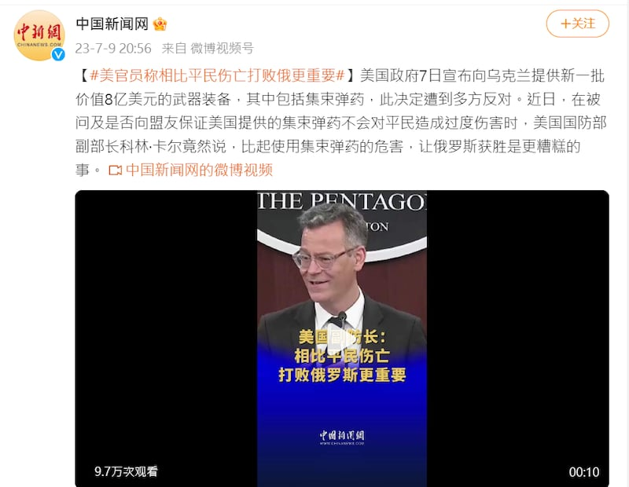
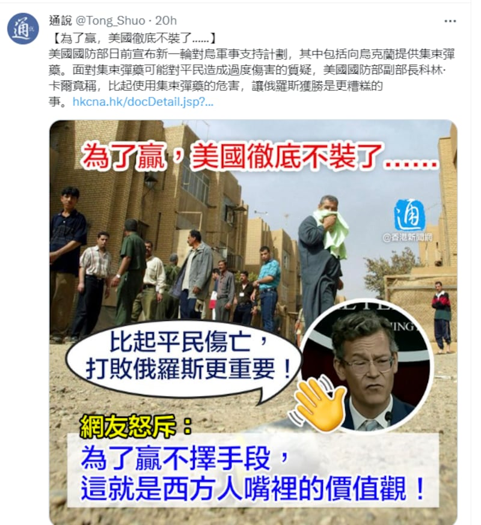

# 事實查覈｜美國防部稱"比起平民傷亡，打敗俄更重要"？

作者：莊敬

2023.07.11 15:54 EDT

## 標籤：誤導

## 一分鐘完讀：

美國宣佈向烏克蘭提供集束彈藥，引發可能致平民傷亡爭議。多家中國官媒報道稱，美國國防部副部長科林∙卡爾（Colin Kahl）說，比起平民傷亡，打敗俄羅斯更重要。

但在美國國防部7日的記者會上，卡爾並沒有說“比起平民傷亡，打敗俄更重要”這句話，其原意是：對烏克蘭平民而言，最壞的情況是俄羅斯贏得戰爭，所以重要的是他們不能贏。而且，卡爾也解釋了美國援烏集束彈藥的前提，包括烏克蘭承諾不在平民居住區使用這些彈藥。多家中國官媒扭曲卡爾的原意，傳播誤導資訊。

## 深度解析：

美國7月7日宣佈 [新一批軍援烏克蘭計劃](https://www.defense.gov/News/Releases/Release/Article/3451570/biden-administration-announces-additional-security-assistance-for-ukraine/),援助武器中包含具爭議性的集束彈藥,美國總統 [拜登日前受訪時表示](https://edition.cnn.com/2023/07/07/politics/joe-biden-cluster-munitions-ukraine/index.html),這是"非常艱難的決定",因爲烏克蘭的彈藥快用完了。美國並未簽署《集束炸彈公約》,但此舉遭到英國、加拿大等簽署國反對,以及人權組織批評。

同樣未簽署《集束炸彈公約》的中國未明確反對,但 [外交部表態](https://www.fmprc.gov.cn/fyrbt_673021/202307/t20230710_11110822.shtml)稱"不負責任轉讓集束彈藥極易引發人道主義問題"。官媒則大量報道相關消息,7月9日晚,環球網以 [《美副防長說相比平民傷亡,打敗俄羅斯更重要》](https://world.huanqiu.com/article/4DeIjb7kSHG)爲標題報道此事;緊接着,央視亦以 [《美國將向烏克蘭提供集束彈藥 美副防長:比起平民傷亡 打敗俄更重要》](https://tv.cctv.com/2023/07/09/VIDEcbq6bKo4u8AvpZw3a0or230709.shtml)爲題進行了電視新聞播報,衆多媒體相繼引用官媒報道,再製作圖卡或剪輯成短視頻,在各大社媒平臺傳播卡爾認爲"打敗俄羅斯比平民傷亡更重要"的言論。

中新網、中通社在社媒發佈短視頻、圖卡，稱美國國防部副部長說比起平民傷亡，打敗俄羅斯更重要。圖取自微博、推特

## 卡爾說了什麼？

無論是中國官媒的報道，或網民在社媒的討論，引述卡爾的話都高度相似，人們聚焦並譴責“比起平民傷亡 打敗俄更重要”這句話。

負責制定國防政策的美國國防部副部長卡爾 [7日在記者會](https://www.defense.gov/News/Transcripts/Transcript/Article/3452000/under-secretary-of-defense-for-policy-dr-colin-kahl-holds-press-briefing/)上的發言原文爲:"I'm as concerned about the humanitarian circumstance as anybody but the worst thing for civilians in Ukraine is for Russia to win the war. And so it's important that they don't."(我和大家一樣關心人道主義狀況,但對烏克蘭平民而言,最糟糕的事情是俄羅斯贏得戰爭,所以重要的是他們不能贏。)

央視爲卡爾這段話所配的中文字幕中，將沒有比較級的"it’s important”不準確地譯爲“更重要”，標題更是用了卡爾根本沒有說的“比起平民傷亡，打敗俄羅斯更重要”這句話。

除此之外，報道還省略了卡爾在這段話之前的重要說明。卡爾在記者會表示，美國獲得烏克蘭保證會慎用這些武器，包括不會在平民聚集的地區使用集束彈藥，並會仔細記錄使用地點，以利未來清除未爆彈等工作。

## 結論：

美國向烏克蘭提供集束彈藥確實引發了國際爭議，國防部官員並沒有否定人道主義風險的存在，但也並沒有說過“比起平民傷亡，打敗俄羅斯更重要”。環球網、央視等中國官媒的報道不僅斷章取義，也曲解美國國防部官員的發言，營造美國只在乎打敗俄羅斯，不在乎烏克蘭平民死活的“不負責任”的形象，呼應了中國外交部批評美國的“不負責任”，誤導受衆。

*亞洲事實查覈實驗室（Asia Fact Check Lab）是針對當今複雜媒體環境以及新興傳播生態而成立的新單位。我們本於新聞專業，提供正確的查覈報告及深度報道，期待讀者對公共議題獲得多元而全面的認識。讀者若對任何媒體及社交軟件傳播的信息有疑問，歡迎以電郵afcl@rfa.org寄給亞洲事實查覈實驗室，由我們爲您查證覈實。*

[Original Source](https://www.rfa.org/mandarin/shishi-hecha/hc-07112023154706.html)