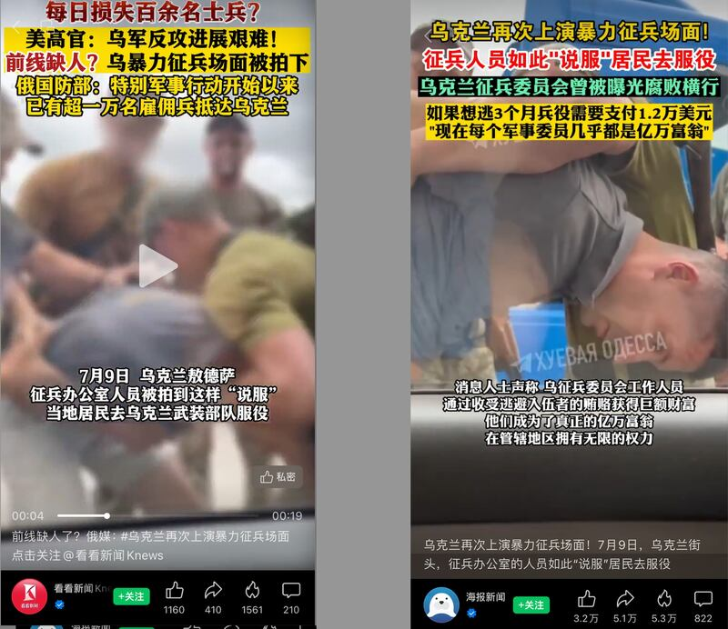
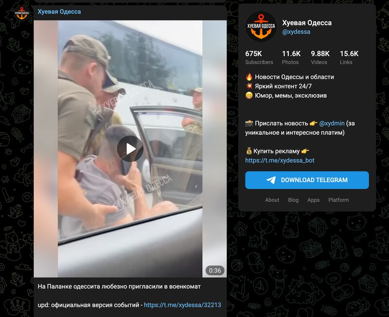
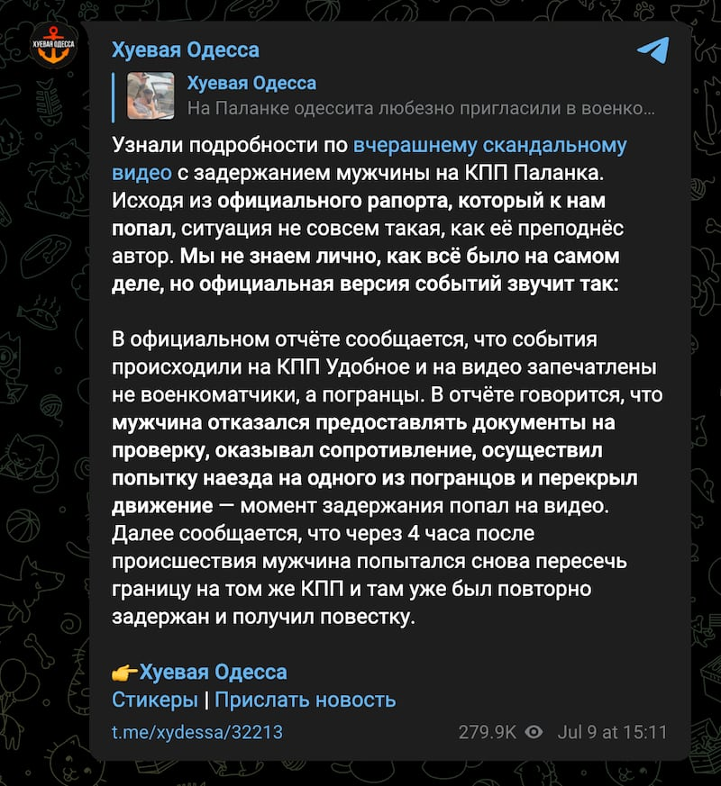
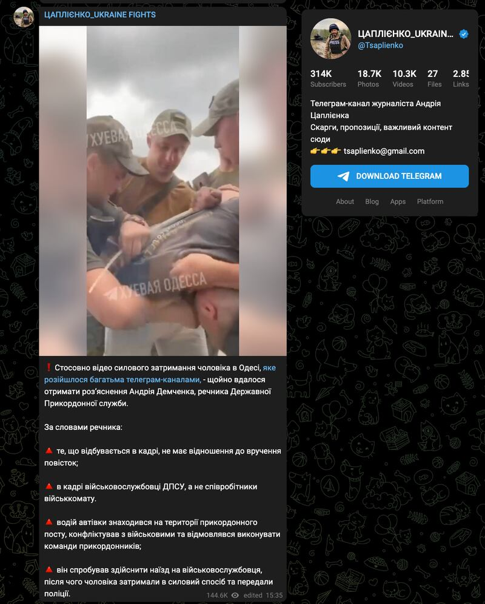
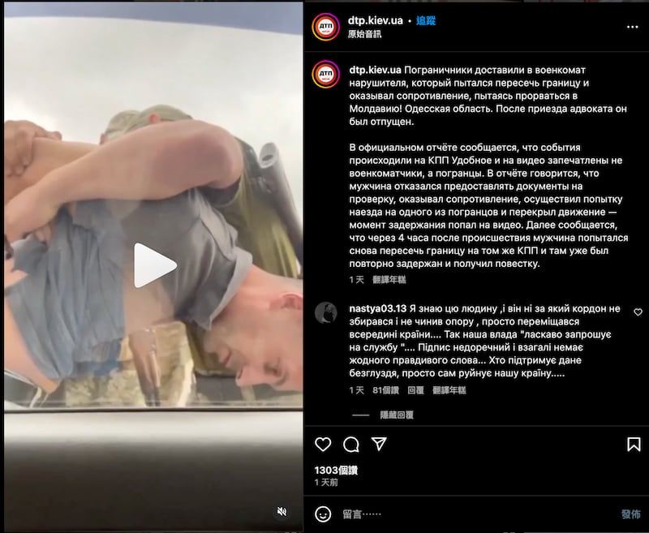

# 事實查覈 │因前線缺人，烏克蘭再次上演暴力征兵？

作者：董喆

2023.07.13 15:23 EDT

## 標籤：證據不足

## 一分鐘完讀：

近日，“今日俄羅斯”在嗶哩嗶哩bilibili及微博等媒體平臺發佈一則36秒影片，指烏克蘭敖德薩徵兵辦公室暴力強徵男性入伍。隨即，該影片在大陸新聞、社交媒體大量流傳。亞洲事實查覈實驗室溯源發現，其原始影片來自一個自稱報道敖德薩周邊動態的社交媒體telegram帳號“＠xydessa”，該帳號在發佈該視頻後，又引述官方聲明澄清，該男子並非是被徵兵，而是因違反邊境規定遭拘捕。並且，該男子是否真的有跨越邊境的犯行，在烏克蘭社羣中仍有爭議。

## 深度分析：

7月9日,俄羅斯國營媒體"今日俄羅斯"(Russia Today, RT)在 [嗶哩嗶哩bilibili](https://www.bilibili.com/video/BV1oz4y1E793/?share_source=copy_web)以及 [微博](https://weibo.com/6244553417/N95Qj0Nj2)發表影片,標題爲"前線缺人了?烏克蘭再次上演暴力征兵場面"的影片,並搭配文字描述稱"7月9日,在烏克蘭的敖德薩,徵兵辦公室的人員就是這樣"說服"當地居民去烏克蘭武裝部隊服役的。"隨後,同一則影片開始在中文互聯網熱傳,經"看看新聞"、"海報新聞"等省市級媒體的視頻號轉發,並將此視頻進一步解讀爲烏克蘭前線損失慘重,需要補充兵力,其影響甚廣。

"今日俄羅斯"在bilibili發表影片，指烏克蘭在暴力征兵。（圖截取自bilibili）

該影片經多個省市級媒體視頻號轉發（微信視頻號截圖）

該影片視角爲車內民衆向外拍攝，有4名穿着軍綠色系衣服並配槍的男子，正制伏一名灰衣男子，並用束帶捆綁他的雙手。背景有數輛卡車開過，但並未有更多線索確認事發地點。

## 影片源自何處？

根據影片中出現的浮水印"XYEBAЯ OДECCA"以及一個紙飛機圖案,我們反查到這段影片 [在7月9日發佈於社交媒體Telegram帳號@xydessa](https://t.me/xydessa/32207)。影片描述"敖得薩居民正"親切地"被邀請到軍事招募辦公室"。然而,該telegram帳號隨後在帖子下方更新說明,表示官方宣稱,影片中制伏該男子的人並非軍人而是邊防人員,該男子因拒絕提供文件且試圖輾壓邊防人員並影響交通而被捕。

XYEBAЯ OДECCA發表的衝突影片（圖截取自Telegram）

XYEBAЯ OДECCA發表的官方澄清（圖截取自Telegram）

根據以上資訊可以初步判定，事發地的確是在烏克蘭，且影片最初的確被當作徵兵事件，但發佈影片的帳號做出了更正，否定了這是徵兵的說法。

## 影片中有證據顯示是徵兵嗎？

爲了覈實該影片是否與暴力征兵相關，我們進一步分析了該影片的音頻和畫面。

首先，烏克蘭戰略學者、曾任臺灣國防安全研究院駐研學者溥猷立（Yurii Poita）協助我們分析了該影片音頻，並轉寫了影片中音頻逐字內容。影片中的女性聲音表示自己很害怕，且不知道會發生什麼事，並不敢下車。對話當中提到“我根本不知道大衛在哪裏。”

Скрутили, ужас, боже мой. Я не имею представления где Давид вообще. Ужас, боже мой, ты уверена мам? Я просто боюсь выходить с машины. Я не знаю просто сейчас что будет, ужас. Пусти меня, сама в машине сиди.

上述內容無法判斷“大衛”是否就是被捕男子，也未提到任何與徵兵相關的內容。

同時，影片中被捕男子身穿的衣服背上印有“Enabling better lives”以及“ingeus.co.uk”的字樣，根據該網址，我們找到這是一間位在英國的職涯培訓公司，而其德國分公司有烏克蘭難民的相關計劃。我們去信詢問，希望能覈實該名男子的身份，但發稿前尚未收到回覆。

影片截圖中被捕者衣服上的圖樣與英國一間公司相符合（亞洲事實查覈實驗室製圖）

## 烏克蘭官方回應再起爭議

該影片不僅在中國傳播，也引起了烏克蘭方面的注意。烏克蘭軍事記者安德烈·查普利恩科（Andriy Tsaplienko）在Telegram貼出烏克蘭國家邊防局發言人Andriy Demchenko的四點聲明，分別爲：

1.影片中的事件與徵兵令無關。

2.照片中的爲國家邊防局的軍人，而非徵兵處人員。

3.該車輛的司機在邊境檢查站內發生了衝突，並拒絕遵從邊防人員的指令。

4.他試圖撞倒一名軍人，之後這名男子被強行拘留並移交給警方。

發佈此聲明的記者同時指出，雖然這份影片中的行爲並非是暴力征兵，但並不代表敖德薩徵兵辦公室僱員沒有濫用權力的行爲。

雖然烏克蘭國家邊防局並未公開回應此事,但這份聲明也經其他媒體報道,例如 [烏克蘭調查報道組織NikCenter](https://nikcenter.org/2023/07/v-merezhi-zyavylosya-video-yak-v-odesi-vijskovi-zalamuyut-ruky-cholovikovi-yakyj-nibyto-vidmovyvsya-otrymuvaty-povistku/),可信度較高。

烏克蘭軍事記者安德烈·查普利恩科（Andriy Tsaplienko）在Telegram貼出來自烏克蘭國家邊防局發言人Andriy Demchenko的聲明（圖截取自Telegram）

而另一個Instagram帳號"@dtp.kiev.ua"也 [在7月10日貼出這則影片](https://www.instagram.com/p/CufV9MrALo6/)以及官方聲明。這個帳號由Accidents.kiev.ua 經營,提供有關基輔和烏克蘭的道路事故、緊急情況和犯罪的即時資訊。

另一個轉貼影片的Instagram帳號@dtp.kiev.ua（圖截取自Instagram）

此帳號的貼文下面，出現了多個留言質疑官方聲明，認爲該名男子並沒有闖越邊境，有留言稱自己認識影片中男子，指出這名男子是正要去露營，也有帳號說這名男子是要去從事教會活動。

爲了驗證上述說法，我們嘗試私訊留言者，但皆因消息限制並未成功。

## 結論：

“今日俄羅斯”中文帳號發佈影片稱烏克蘭民衆被暴力征兵，並獲大量中國媒體轉載。經查證，發佈原始影片的telegram帳號最初稱該影片是居民被徵兵，但之後發佈補充說明澄清，依據官方聲明，影片中男子被拘捕的原因是在邊境拒絕提供文件，且試圖輾壓邊防人員並影響交通。影片中制伏人員是邊防人員，而非徵兵軍人。

此外，烏克蘭記者也取得國家邊防局發言人的聲明，稱該影片記錄的並非徵兵衝突，而是民衆與邊境檢查局的衝突。因此，本視頻並未提供足夠證據證明烏克蘭正在暴力征兵。

*亞洲事實查覈實驗室(* *Asia Fact Check Lab* *)是針對當今複雜媒體環境以及新興傳播生態而成立的新單位。我們本於新聞專業,提供正確的查覈報告及深度報道,期待讀者對公共議題獲得多元而全面的認識。讀者若對任何媒體及社交軟件傳播的信息有疑問,歡迎以電郵* *afcl@rfa.org* *寄給亞洲事實查覈實驗室,由我們爲您查證覈實。*

[Original Source](https://www.rfa.org/mandarin/shishi-hecha/hc-07132023151138.html)