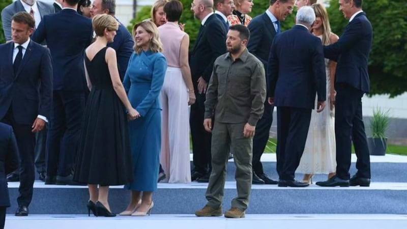
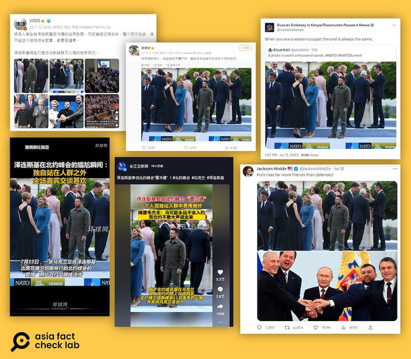
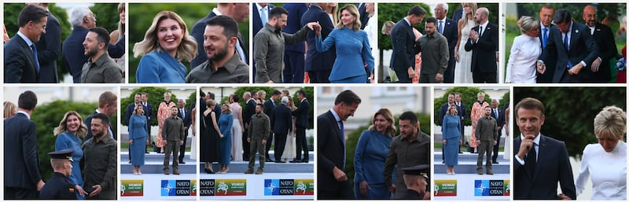
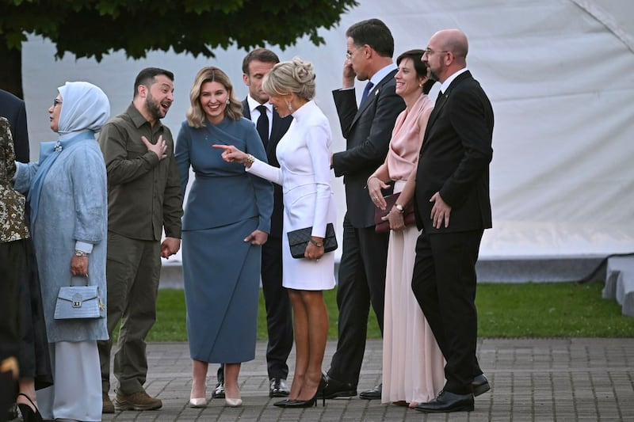

# 事實查覈｜澤連斯基在北約峯會上"受冷落"了嗎？

作者：莊敬

2023.07.14 17:25 EDT

## 標籤：誤導

## 一分鐘完讀：

近日，在推特、微博、抖音等社媒平臺上，一張照片廣泛傳播——在立陶宛北約峯會社交晚宴上，烏克蘭總統澤連斯基孤零零站在一旁；包括俄羅斯駐外使館官號、中國官媒和大量社羣帳號轉發照片，部分配文稱澤連斯基“受冷落”或“格格不入”，但也有人質疑照片的真實性。

亞洲事實查覈實驗室在Getty Images圖庫找到這張照片，以及其他許多澤連斯基與他國政要互動的照片，證實澤連斯基當天並未受冷落。中、俄媒體和大量社羣用戶僅以單一照片“看圖說故事”，傳播不符事實的資訊。

## 深度解析：

推特、微博等平臺近日瘋傳的烏克蘭總統澤連斯基參加北約峯會晚宴時“被晾在一旁”的照片。圖取自推特

積極爭取烏克蘭加入北大西洋公約組織（NATO）的烏國總統澤連斯基（Volodymyr Zelenskyy）獲邀出席7月11日起在立陶宛舉行的北約峯會。在社交晚宴上，一張照片捕捉到澤連斯基獨自站在一旁，未與他國政要互動的情境。

這張照片在社媒瘋傳，包括俄羅斯駐外使館官方帳號、俄國媒體“今日俄羅斯”、中國媒體“環球網”、湖北廣播電視臺“長江雲新聞”、《環球時報》前總編輯胡錫進，以及許多推特認證用戶和微博“大V”用戶都參與了轉發。 “環球網”短視頻上的字幕指，這是澤連斯基出席北約峯會的“窘境”，胡錫進微博發文寫“這裏其實不屬於你”，“長江雲新聞”則稱澤連斯基“遭冷遇”。

中國媒體“環球網”、“長江雲新聞”，《環球時報》前總編輯胡錫進等社媒帳號轉發烏克蘭總統澤連斯基出席北約峯會晚宴的照片，嘲諷澤連斯基遭冷落。圖取自推特、微博、抖音

臺灣的"Newtalk新聞"(原稱新頭殼)報道 [《澤連斯基臉超臭!疑似北約峯會受冷落畫面曝 他站一旁面露尷尬》](https://newtalk.tw/news/view/2023-07-12/879343),內文提及,通過各大瀏覽器搜圖功能等查證,尚未獲悉照片出處,且在推特上流傳的大多非爲原始檔案,有網友稱出自修圖軟體,但這一說法也沒被證實。

## 照片是真的嗎？

部分媒體與用戶在社媒轉發這張照片時，並未註明來源，許多網民在發文底下留言質疑照片造假。

亞洲事實查覈實驗室在 [Getty Images圖庫](https://www.gettyimages.co.uk/detail/news-photo/ukrainian-president-volodymyr-zelenskiy-and-his-wife-the-news-photo/1524016160?adppopup=true)找到了這張由攝影師Yves Herman所拍的照片,且圖庫內還有許多澤連斯基夫妻與他國政要互動的照片,從兩天峯會大量照片看來,澤連斯基並沒有如網傳的"受冷落"。其他媒體如 [美聯社](https://apnews.com/article/nato-summit-lithuania-ukraine-sweden-08463686d0d6c613010c2ef7a9955d5b)刊登的照片,也顯示澤連斯基夫妻和其他與會者互動熱絡。

Getty Images圖庫照片集，下排左3爲網路瘋傳的照片，而圖庫內也有多張澤連斯基及夫人與他國政要互動的照片。截圖自Getty Images網頁

澤連斯基夫婦與法國第一夫人互動的照片。圖源：美聯社

## 結論：

網傳的澤連斯基照片爲真，攝影師確實捕捉到澤連斯基一人站在旁的瞬間，但攝影師也拍下許多澤連斯基夫婦與他國政要互動熱絡的畫面。網上可以找到許多澤連斯基參加北約峯會的照片，部分媒體與網民卻仍以單一照片“看圖說故事”，藉此嘲諷澤連斯基受冷落，不僅脫離事實，更是刻意帶風向、誤導受衆。

*亞洲事實查覈實驗室(* *Asia Fact Check Lab* *)是針對當今複雜媒體環境以及新興傳播生態而成立的新單位。我們本於新聞專業,提供正確的查覈報告及深度報道,期待讀者對公共議題獲得多元而全面的認識。讀者若對任何媒體及社交軟件傳播的信息有疑問,歡迎以電郵* *afcl@rfa.org* *寄給亞洲事實查覈實驗室,由我們爲您查證覈實。*

[Original Source](https://www.rfa.org/mandarin/shishi-hecha/hc-07142023171650.html)