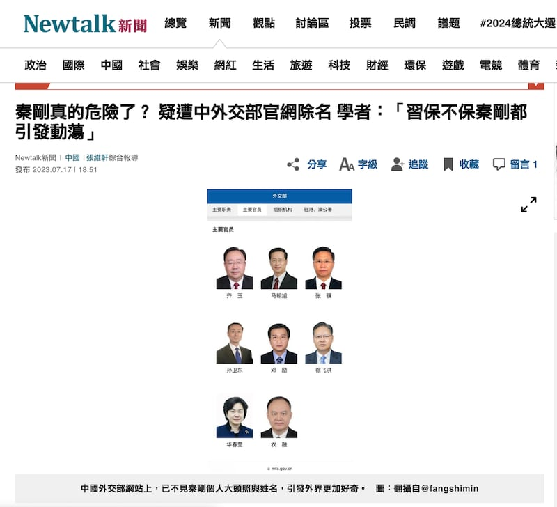
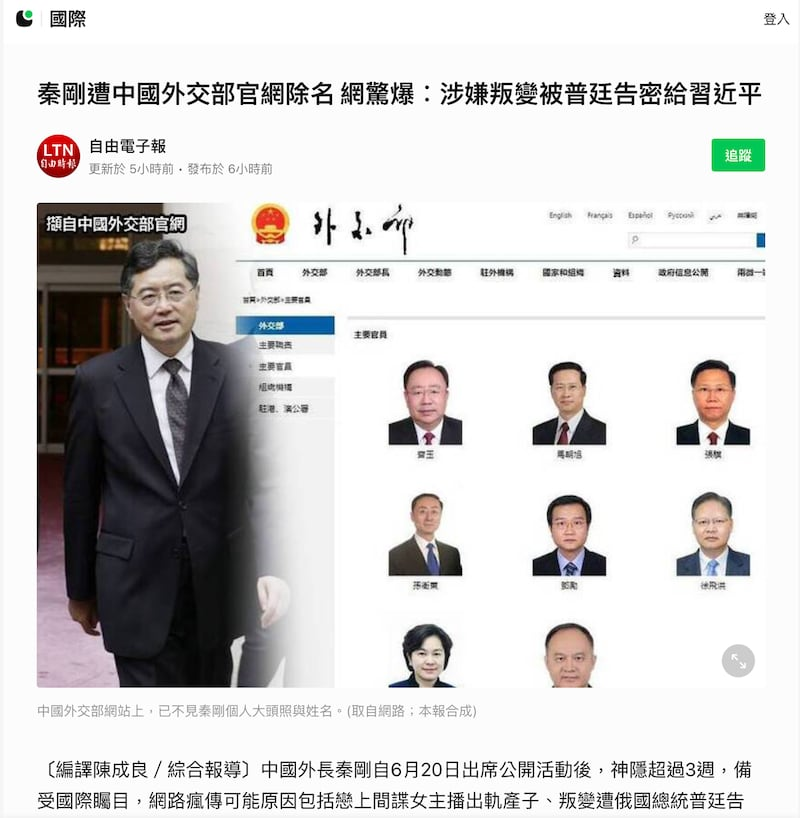
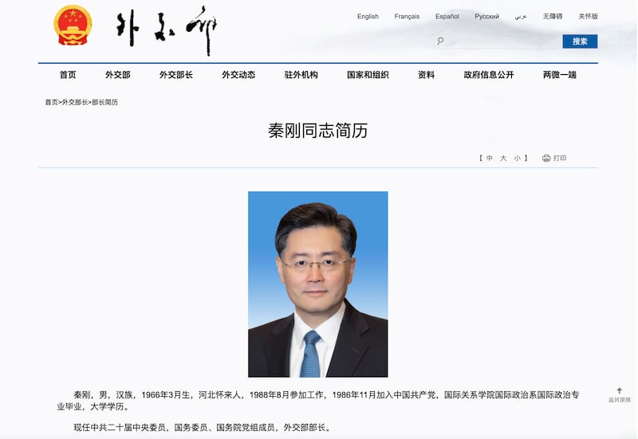
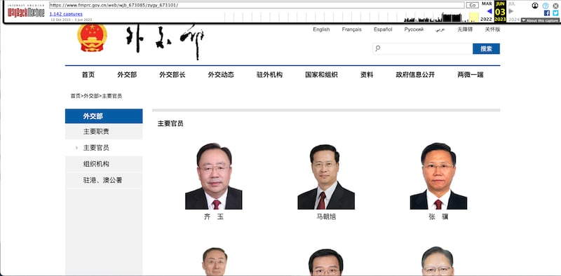
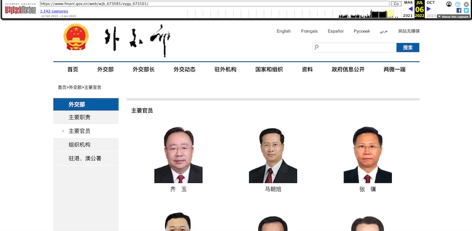

# 事實查覈｜秦剛遭外交部官網除名了嗎？

作者：莊敬

2023.07.17 16:00 EDT

## 標籤：錯誤

## 一分鐘完讀：

自6月25日出席公開活動後的三週多時間中，中國外交部長秦剛再無露面，引各界猜測其“消失”原因。近日更傳出秦剛已“遭中國外交部官網除名”的消息，臺灣的“Newtalk新聞網”、《自由時報》7月17日都報導此事，並附上中國外交部官網截圖，指“主要官員”欄目已不見秦剛的肖像照和介紹鏈接。

亞洲事實查覈實驗室於北京時間17日晚檢視中國外交部官網，發現“外交部長”欄目仍有秦剛的照片與資訊。透過“網站時光機”確認，在報道稱秦剛“消失”之前，其照片也並沒有出現在“主要官員”頁面，另，前部長王毅任部長期間，“主要官員”欄目也沒有展示部長照片。部長介紹設專頁，應爲外交部網站設置的慣例。

因此，部分媒體報導及網上盛傳的“秦剛遭中國外交部官網除名”，爲錯誤資訊。

## 深度解析：

## 中國外交部網站"除名"秦剛？

中國外交部長秦剛自6月25日公開會見俄羅斯、越南、斯里蘭卡外交官後便消失在公衆面前,至今逾三週,秦剛"失蹤"傳言四起,包括確診新冠、出軌間諜女主播、捲入內鬥等。近日網上更傳出秦剛已遭中國外交部官網"除名"的消息,臺灣的 ["Newtalk新聞"](https://newtalk.tw/news/view/2023-07-17/880170)、 [《自由時報》](https://news.ltn.com.tw/news/world/breakingnews/4367048)網站7月17日晚間都報導此事,並附上中國外交部官網截圖,顯示"主要官員"欄目已不見秦剛的照片。

上述兩則報導迅速傳播, ["Yahoo奇摩新聞"](https://tw.stock.yahoo.com/news/%E7%A7%A6%E5%89%9B%E7%9C%9F%E7%9A%84%E5%8D%B1%E9%9A%AA%E4%BA%86-%E7%96%91%E9%81%AD%E4%B8%AD%E5%A4%96%E4%BA%A4%E9%83%A8%E5%AE%98%E7%B6%B2%E9%99%A4%E5%90%8D-%E5%AD%B8%E8%80%85-%E7%BF%92%E4%BF%9D%E4%B8%8D%E4%BF%9D%E7%A7%A6%E5%89%9B%E9%83%BD%E5%BC%95%E7%99%BC%E5%8B%95%E8%95%A9-105227583.html)轉載了"Newtalk新聞"的報導,其內文指出"現在中國外交部網站上竟然去掉堂堂外交部長的個人大頭照,更令外界好奇秦剛現況"。臺灣人常用通訊軟體"LINE"提供的新聞及資訊服務 ["LINE TODAY"](https://today.line.me/tw/v2/article/9m8xyyV?utm_source=lineshare&liff.referrer=https%3A%2F%2Ft.co%2F)則轉載《自由時報》的報導。不過,亞洲事實查覈實驗室北京時間18日凌晨發現,《自由時報》網站已移除該報導。

臺灣媒體自由時報、Newstalk等報道秦剛被外交部網站“除名”（圖/“Newtalk新聞網”、“LINE TODAY”截圖）

亞洲事實查覈實驗室北京17日晚間檢視中國外交部官網，在“外交部長”欄目下，仍有秦剛的大頭照與資訊。

北京時間7月17日晚間，中國外交部官網，"外交部長"欄目仍有現任部長秦剛的照片與資訊。（中國外交部官網截圖）

## 外交部長並不列名"主要官員"

亞洲事實查覈實驗室並使用“網站時光機”（Wayback Machine），檢視中國外交部官網過去的網頁記錄，發現今年6月12日，秦剛就未列在“主要官員”之中。而2022年10月1日的記錄顯示，前外交部長王毅任內，王毅同樣列在“外交部長”欄目，也未列名網站的“主要官員”。

上圖爲“網站時光機”（Wayback Machine）今年6月3日的中國外交部官網“主要官員”網頁記錄，下圖爲2022年6月6日，前外交部長王毅任內時，中國外交部官網"主要官員"網頁記錄。 （Wayback Machine 截圖）

## 秦剛去向仍成謎

對於秦剛缺席多個重要外交活動，中國外交部日前曾稱是“身體原因”。但據報導，外交部發言人毛寧17日在記者會上被外媒追問秦剛情況時，稱沒有可提供的訊息，而被問到秦剛是否仍是外長，毛寧則建議查詢外交部網站；但有關秦剛的問答，都未列入中國外交部網站上例行記者會的文字紀錄。

## 結論：

外交部長秦剛數週無公開露面，且官方不直接回答其去向，是中國外交史上的罕見現象。 對此，坊間有多種猜測。然而，部分媒體引用網絡傳言，將秦剛照片不出現在外交部“主要官員”網頁作爲秦剛“有大麻煩”、“遭中國外交部官網除名”等報道，爲錯誤資訊。

*亞洲事實查覈實驗室(* *Asia Fact Check Lab* *)是針對當今複雜媒體環境以及新興傳播生態而成立的新單位。我們本於新聞專業,提供正確的查覈報告及深度報道,期待讀者對公共議題獲得多元而全面的認識。讀者若對任何媒體及社交軟件傳播的信息有疑問,歡迎以電郵* *afcl@rfa.org* *寄給亞洲事實查覈實驗室,由我們爲您查證覈實。*

[Original Source](https://www.rfa.org/mandarin/shishi-hecha/hc-07172023154855.html)