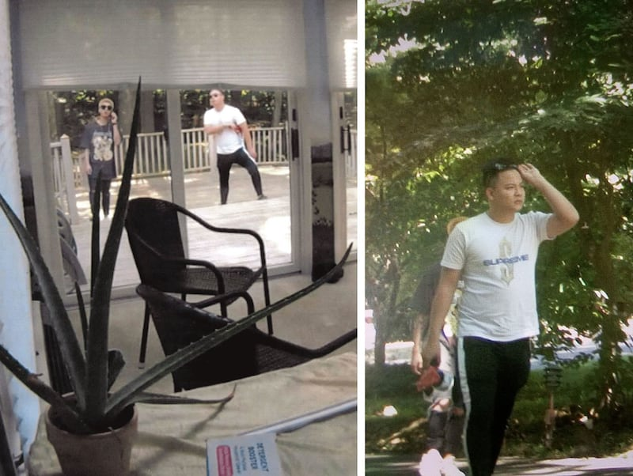
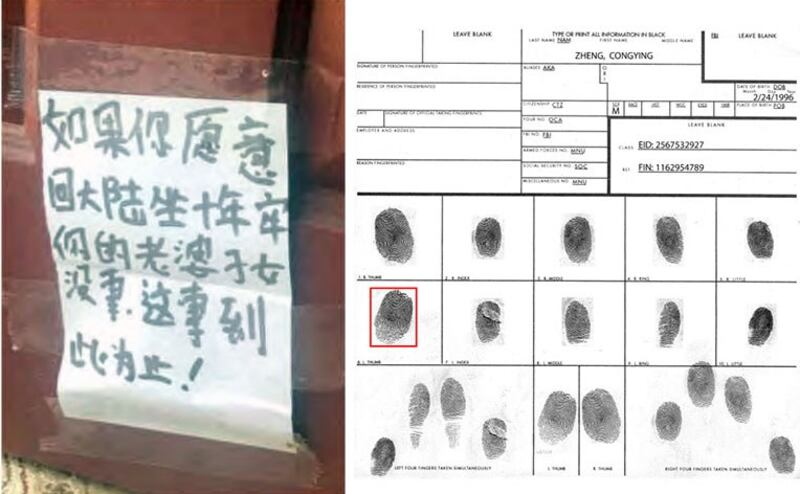
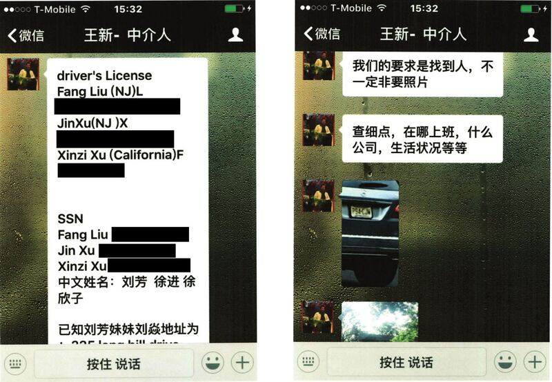

# 事實查覈｜中國在美“獵狐行動”沒有違反美國的法律嗎？

作者：沈軻

2023.07.19 14:22 EDT

## 標籤：錯誤

## 一分鐘完讀：

6月20日,3名涉及中國"獵狐行動"的被告因跨州跟蹤、串謀和非法充當外國代理人 [被紐約法院判爲有罪](https://www.justice.gov/opa/pr/federal-jury-convicts-three-defendants-interstate-stalking-chinese-nationals-united-states),其中兩人是中國公民。 [中國外交部在回應相關問題](https://www.mfa.gov.cn/web/fyrbt_673021/202306/t20230621_11101904.shtml)時指出,中國的"對外執法合作"充分尊重外國法律和司法主權,其行爲"無可非議"。

亞洲事實覈查實驗室（AFCL）發現，中國外交部的解釋是錯誤的。跨境追捕本身有合法的引渡渠道，中國的跨境追捕行動沒有在合乎國際法的邊界內推進，並且，3名被告企圖強迫住在美國的中國公民返回中國的行爲也違反了美國的法律，他們被獨立陪審團認定有罪。

## 深度分析：

雖然中國的祕密遣返計劃"獵狐行動"及其姊妹計劃"天網行動"自2014年以來就受到 [媒體的關注](https://www.nytimes.com/2015/08/17/us/politics/obama-administration-warns-beijing-about-agents-operating-in-us.html),但隨着住在美國的2名持有美國綠卡的中國公民——鄭聰穎(Zheng Congying 音譯)和朱勇(Zhu Yong 音譯)於2020年10月 [被捕](https://www.justice.gov/opa/pr/eight-individuals-charged-conspiring-act-illegal-agents-people-s-republic-china),和行動細節的曝光,人們越來越擔憂,對這些計劃可能被用來 [打壓中國在海外的異議人士](https://www.propublica.org/article/operation-fox-hunt-how-china-exports-repression-using-a-network-of-spies-hidden-in-plain-sight)。

鄭聰穎和朱勇因在美國跟蹤中國公民徐進而遭到美國聯邦調查局逮捕。徐進是中國政府前官員,曾任湖北省武漢市發改委主任,因被控鉅額貪污、受賄,名列中國 [百大通緝犯名單](https://www.chinadaily.com.cn/china/att/site1/20150423/002170196e1c16a28b910f.pdf)。在過去幾年中,中國試圖通過各種方式迫使其回國,而執行者鄭聰穎和朱勇,連同一名美國私家偵探因"獵狐"徐進的行爲而被美國拘捕、控罪。

## 中美之間有正常引渡、遣返的渠道嗎？

美中之間雖沒有任何雙邊引渡條約,但仍可向對方提出引渡請求。多倫多大學公民實驗室研究助理 [埃米爾·德克斯(Emile Dirks)](https://media.utoronto.ca/bluebook/emile-dirks/)表示,"這些引渡請求可以促成兩國之間的執法合作。2015年,美國就曾 [強制遣返](https://usa.chinadaily.com.cn/china/2015-09/24/content_21968836.htm)2名被中國政府指控經濟犯罪的中國公民。"

然而，對於一些案例，美國也可以拒絕遣返。

雖然受限於司法部門所監督的引渡聽證會,但國務卿仍有 [批准引渡請求的最終裁量權](https://www.nyujlpp.org/wp-content/uploads/2012/11/Anna-MacCormack-The-United-States-China-and-Extradition-Ready-for-the-Next-Step-.pdf)。如果聽證會和國務卿都認爲有導致政治迫害的可能,則可拒絕該請求。這與多項 [國際公約](https://www.ohchr.org/en/instruments-mechanisms/instruments/international-convention-protection-all-persons-enforced)廣泛認可的 ["不遣返原則"](https://www.ohchr.org/sites/default/files/Documents/Issues/Migration/GlobalCompactMigration/ThePrincipleNon-RefoulementUnderInternationalHumanRightsLaw.pdf)一致,該原則禁止遣返或引渡任何被合理懷疑,可能會面臨"重大傷害,如虐待、酷刑或死亡風險"的個人。

德克斯聲稱，出於對中國侵犯人權和缺乏正當法律程序之擔憂，這種懷疑是有道理的。

“在處理任何潛在引渡案件時，中國司法不公正和人權侵犯的問題都應考量在內，即使中國當局對嫌疑人的控罪看似與政治無關，比如貪污。”

德克斯並表示, [中國的引渡法](https://sherloc.unodc.org/cld/uploads/res/document/chn/2000/extradition_law_of_the_peoples_republic_of_china_html/China_Extradition_Law_2000.pdf)也有拒絕引渡請求的條款,中國過去就曾 [拒絕引渡](https://www.scmp.com/news/hong-kong/hong-kong-law-and-crime/article/2148434/first-hong-kong-refused-us-extradition-bid)一名在澳門的美國公民,他被指控曾於2018年入侵美國律師事務所的電腦。

## 鄭聰穎和朱勇違反美國法律了嗎

在審理過程中，美國檢方出示了大量的證據。

監視器拍攝的照片顯示，鄭聰穎和另一名未具名的同謀，站在徐進家外頭的門廊。司法部公佈的案件細節顯示，二人重敲前門，試圖將門推開，並留了張紙條在他的前門上。

2020年，鄭聰穎在徐進家外面被拍到，身邊還有一名不知名的同謀者。(圖片來源：美國檢察官辦公室，紐約東區)

紙條是用中文寫的，上面寫着：“如果你願意回大陸坐10年牢，你的老婆子女沒事。這事到此爲止！” 美國聯邦調查局隨後收集了紙條上的指紋，隨後證實，與鄭聰穎的指紋相符。

門口留下的紙條有與鄭聰穎相符的指紋。上頭寫著：“如果你願意回大陸坐10年牢，你的老婆子女沒事。”圖片來源：美國檢察官辦公室，紐約東區

法庭上展示的朱勇手機信息也顯示，他化名“王新”，要求獲得有關徐進和他家人的個人資訊，包括社會安全碼、在哪工作、生活條件、駕照、車輛註冊證。訊息進一步顯示，朱勇明確表示“我們的要求是找到人”。

朱勇通過微信，提供了徐進及其家人的社會安全碼、駕照、車輛註冊證等資訊，並詢問更多細節。朱勇以“中介人王新”的化名註冊了帳號。圖片來源：美國檢察官辦公室，紐約東區

鄭、朱二人被捕2年半後，獨立陪審團判定他們有罪。 根據檢方的說法，朱勇可能面臨最高25年監禁，而鄭聰穎則面臨最高10年監禁。

## 結論

中國官方聲稱“獵狐行動”充分尊重美國法律的說法是錯誤的。美國檢方在審判中出示了大量證據，證明鄭聰穎和朱勇的“獵狐”行動違反了美國法律。陪審團裁定二人違反了美國法律，跨州跟蹤等罪名成立。

*亞洲事實查覈實驗室（Asia Fact Check Lab）是針對當今複雜媒體環境以及新興傳播生態而成立的新單位。我們本於新聞專業，提供正確的查覈報告及深度報道，期待讀者對公共議題獲得多元而全面的認識。讀者若對任何媒體及社交軟件傳播的信息有疑問，歡迎以電郵 [afcl@rfa.org](http://afcl@rfa.org)寄給亞洲事實查覈實驗室，由我們爲您查證覈實。*

[Original Source](https://www.rfa.org/mandarin/shishi-hecha/hc-07192023141215.html)