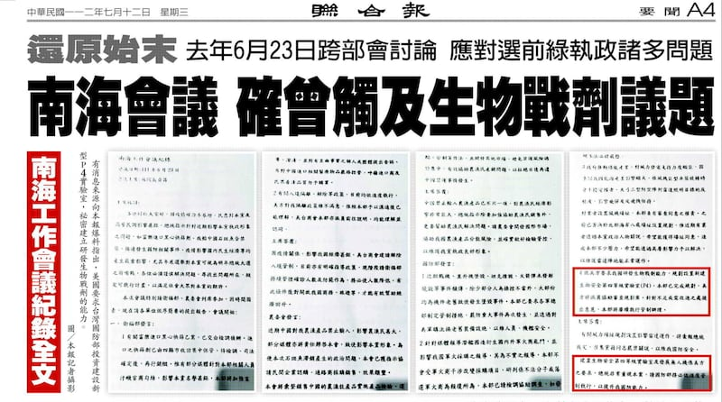
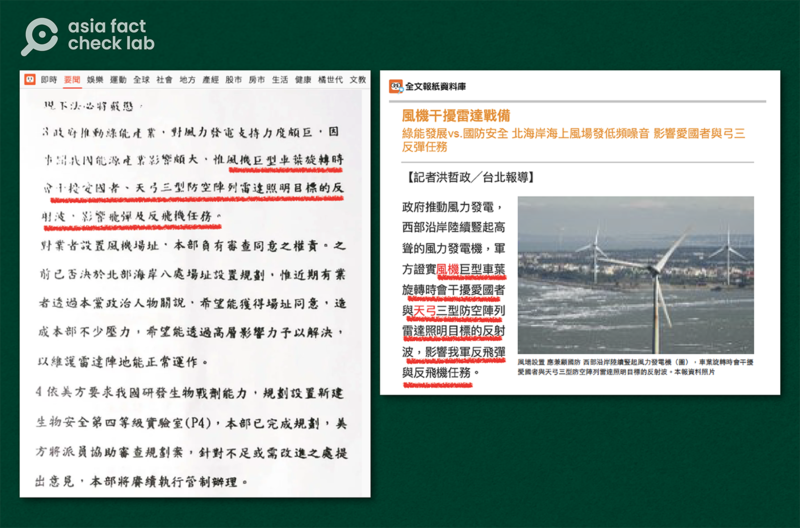
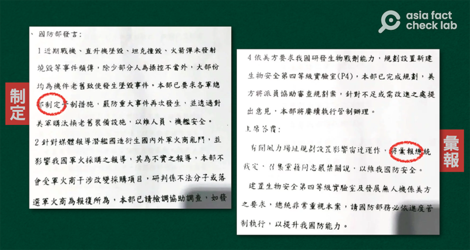
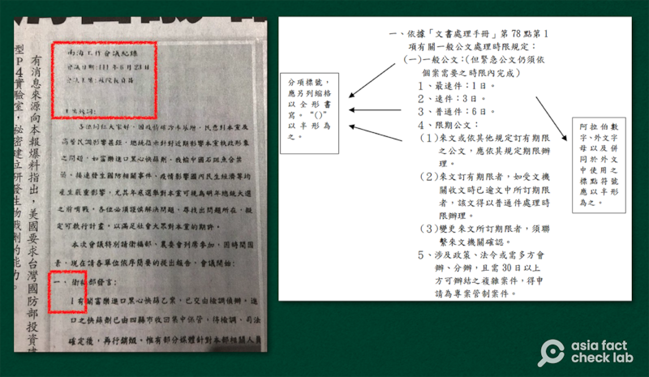

# 事實查覈｜媒體披露的"會議紀錄"證明了美國要求臺灣發展生化武器嗎？

作者：李志德、董喆，發自臺北

2023.07.20 15:00 EDT

## 標籤：證據不足

## 一分鐘完讀

2023年7月9日,臺灣《聯合報》於付費數位版報道" [美要臺灣設P4實驗室開發生物戰劑?文件顯示民進黨政府曾開會討論](https://vip.udn.com/vip/story/121940/7287777)",報道稱,根據一份獨家取得的"南海工作會議紀錄",指美國政府要求臺灣國防部預防醫學研究所投資新設P4(第四級生物安全)實驗室,用以開發生物戰劑。《聯合報》並且在7月12日的紙本報道中,刊出了四頁"南海工作會議紀錄"照片。

亞洲事實查覈實驗室從文本內容、用語及公文格式三部分切入，通過非官方的公開渠道查覈、比對，發現這份“會議紀錄”存在許多疑點，真實性成謎。單單依靠這份紀錄，不足以證明“美國要求臺灣發展生化武器”。

《聯合報》在7月12日的紙本報道中，刊出了四頁"南海工作會議紀錄"影像。(翻攝自《聯合報》)

## 深度分析

針對《聯合報》7月9日發出第一次報道，臺灣總統府、行政院、國防部陸續發文澄清，美國國務院及美國在臺協會也聲明駁斥。《聯合報》則在7月12日於報版及數位版再發出報道，公佈了顯示爲2022年6月23日舉行的“南海工作會議紀錄”。

雖然雙方政府已經發表聲明，坊間仍然傳聞不斷，尤其在中國大陸，多家媒體以該文件爲依據，持續報道美國將在臺灣發展生化武器的消息。

亞洲事實查覈實驗室不依賴臺灣政府提供資訊，運用獨立、公開的資訊對《聯合報》公佈的“南海工作會議紀錄”進行查覈，發現這一份文件有許多疑點及邏輯漏洞，甚至有一小段內容和此前《聯合報》相關報道內容一字不差。

以下分別就文本內容、用語及公文格式等方面說明查覈結果：

## 《聯合報》報道原文出現在"會議紀錄"裏

亞洲事實查覈實驗室查覈“南海工作會議紀錄”文本內容時，發現原文“國防部發言”中有一段內容提及風力發電的海上風機對國防的影響，原文寫道：

“風機巨型車葉旋轉時會干擾愛國者與天弓三型防空陣列雷達照明目標的反射波，影響我軍反飛彈與反飛機任務。”

《聯合報》曾在2022年6月20日A1版發表一則報道，標題爲“風機干擾雷達戰備”。事實查覈實驗室發現，“南海工作會議紀錄”上這47個字，和《聯合報》相關報道的第一段後半只有“及”、“與”等連接詞和使用頓號的不同。撰寫、整理該“會議紀錄”的人員，幾乎完全照抄了聯合報的報道。

"南海工作會議紀錄"中用來描述風力發電機影響國防的字句(左圖，翻攝自《聯合報》)，和《聯合報》報道同一議題新聞的內容(右圖)幾乎相同。

## "會議紀錄"中出現臺灣少見，但中國大陸常用詞彙

《聯合報》報道發表之後，臺灣總統府及行政院等機關在反駁聲明中列舉紀錄中出現的部分用詞，不可能在行政機關的公文中出現，特別是“本黨”這種黨政不分的用語。此外，臺灣軍隊已經在2006年改制，原本陸、海、空軍“總部”已經改稱“司令部”，因此也不可能再使用“各軍總部”這種稱呼。

除了政府部門列舉的問題詞句外，亞洲事實查覈實驗室也從“會議紀錄”文本中發現其它可疑詞句，包括：

第三頁，國防部報告：“本部已要求各軍總部制定管制措施......”。但這裏的“管制措施”屬於行政命令，依照臺灣行政院《文書處理手冊》的規定，應該使用“訂定”；如果是研擬立法或修法，才使用“制定”。當然，也可能是紀錄撰寫人沒有使用行政院規定的正確用詞。

第四頁的主席答覆中提到，有關風力場址規劃將“彙報”總統裁定。“彙報”和“匯報”均爲爲簡體字“彙報”的正體字變體，“彙報”作爲指“向上級報告”，同樣常見於中國大陸的公文和口語中，然而，“彙報”在臺灣公文中通常不做動詞，而一般使用“報告”。

會議紀錄中出現做爲動詞使用的"彙報"，在臺灣動詞，但簡化體"彙報"常用於中國大陸公文或口語中（亞洲事實查覈實驗室製圖）

## "會議紀錄"與政府規定格式不符

臺灣政府機關人員撰寫公文書，必須依照行政院《文書處理手冊》規定的格式，這本手冊可以從網路下載，是公開資料。以《文書處理手冊》內的規定檢視聯合報公佈的“會議紀錄”，可以發現“會議紀錄”的多處格式並不符合規定。

1. 分項符號不符

依照行政院的規定，公文書分項分點時，必須依照以下的階層排列：

中文國字：壹、貳、叄......

中文數字：一、二、三......

帶半型括號的中文數字：(一)、(二)、(三)

阿拉伯數字：1、2、3

但聯合報公佈的“會議紀錄”，以衛福部發言部分爲例，分項分點符號爲：

一、衛福部發言

1 有關富樂進口黑心快篩一案......。

2 有關入境隔離，解除等政策......。

這樣的格式與行政院文書手冊的規定全然不符。亞洲事實查覈實驗室從各部門官網上隨機下載了行政院“改善所得分配專案小組”、國防部“性別平等專案小組”和教育部“教育經費分配審議委員會”等會議紀錄，都符合行政院文書處理手冊的規定。

《聯合報》公佈的"會議紀錄"(左圖)上明顯可以看出它只記載了會議名稱、主席和時間，分項符號(左下紅框)的數字編排和臺灣行政院規定的格式(右圖)完全不同。

1. 會議項目記載不足

在我們查閱的會議紀錄中，開頭都會列舉以下信息：

會議名稱，如果是例會，會寫明“第幾次”會議。

會議時間

會議地點

會議主席

出席人員

列席人員

紀錄者

但聯合報公佈的“南海工作會議紀錄”中，並沒有列舉這是第幾次會議，同時也只列出“日期”和“主席”，和一般公開的政府“會議紀錄”列舉的信息並不相同。

## 結論：

即便是不依賴政府提供的闢謠信息，僅以公開資料進行查覈，就可以發現《聯合報》公佈的“南海工作會議紀錄”在文本中出現許多不符合臺灣語言習慣和規範的措辭；撰寫紀錄的格式也不符合政府的規定。而更有一小段內容和《聯合報》一年前的報道一字不差。因爲前述諸多疑點，若僅僅以這一紙“南海工作會議紀錄”認定臺灣政府受美國指使發展生化武器，證據並不足夠。

*亞洲事實查覈實驗室（Asia Fact Check Lab）是針對當今複雜媒體環境以及新興傳播生態而成立的新單位。我們本於新聞專業，提供正確的查覈報告及深度報道，期待讀者對公共議題獲得多元而全面的認識。讀者若對任何媒體及社交軟件傳播的信息有疑問，歡迎以電郵afcl@rfa.org寄給亞洲事實查覈實驗室，由我們爲您查證覈實。*

[Original Source](https://www.rfa.org/mandarin/shishi-hecha/hc-07202023145110.html)