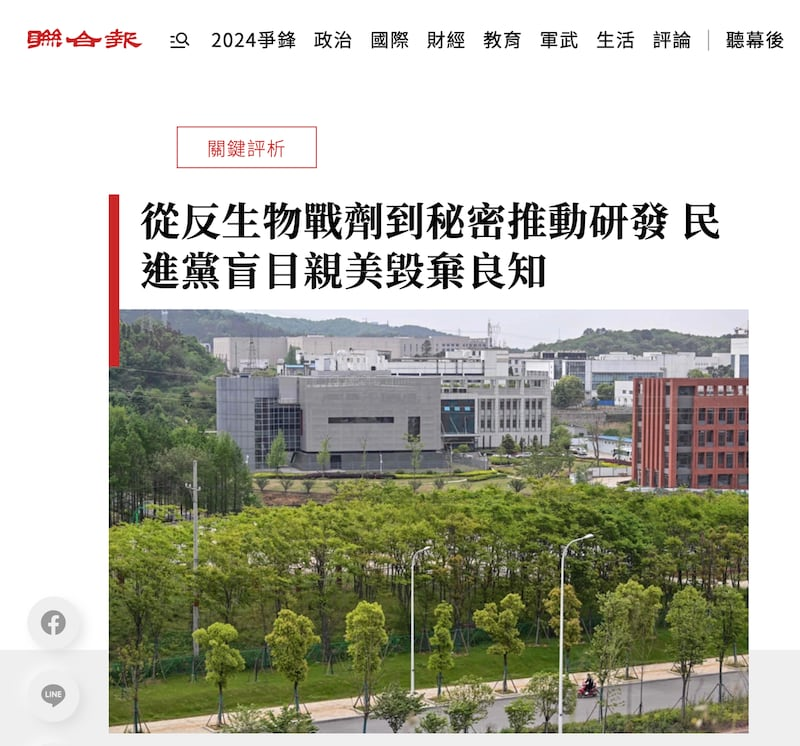

# 傳播觀察｜真僞未知的"南海工作會議紀錄"是如何經中文媒體傳播開的？

作者：董喆

2023.07.20 15:20 EDT

亞洲事實查覈實驗室針對臺灣《聯合報》公佈的“南海工作會議紀錄”進行了查覈，結論是這份文件真僞未知，無法據此證明民進黨政府確實正依照美國的要求發展生化武器。

然而儘管臺灣政府已經公開否認，民間也提出諸多質疑，大量中文媒體及社羣平臺自7月9日起大肆傳播這份真僞未知的文件，也少有媒體報道質疑或澄清的意見，卻附加了更多的傳言。

## 官媒與自媒體協力疑美 焦點鎖定"生物戰劑"

《聯合報》7月9日刊出文章後,10日起中國大陸各大官媒跟進,除了轉引《聯合報》內容,多數官媒及自媒體視頻標題帶有情緒性評價,例如"美國唯恐天下不亂""美國向臺灣提出了一個喪心病狂的要求""民進黨盲目親美,徹底自毀良知"等用語,甚至有網易號將內容誇大爲" [要對解放軍投毒](https://www.163.com/dy/article/I9AFPIN00553IX1I.html)"。

例如環球網10日刊出" [美國要求臺灣建P4實驗室開發生物戰劑?島內網友:美國唯恐天下不亂](https://weibo.com/1686546714/N9dUuy2Cv)",《環球時報》11日報道" [美竟要求臺灣研發生物戰劑?臺媒:民進黨盲目親美,譭棄該有的良知](https://weibo.com/1974576991/N9mmotEMB)"

經查，“美國唯恐天下不亂”的確引自臺灣社羣平臺上的單一網友留言，但針對“美國向臺灣提出了一個喪心病狂的要求”，我們發現有多個平臺一字不漏的同時使用了一樣的說法，包含網易號、搜狐號“憑海觀島 ”、Youtube頻道“兵鑑堂”以及Bilibili軍事專家“邵永靈”。

多箇中國社羣平臺針對臺灣研發生物戰劑的傳言有相同的標題 （圖截取自google搜尋頁面）

“民進黨徹底自毀良知”則是出自於《聯合報》的評論專欄，中國大陸不少媒體將這句話直接扣在“臺媒”二字下，不提這是意見表達的評論專欄。同樣的標題也可見於東南衛視評論員謝志傳的評論影片。這些媒體的標題將美國形容爲邪惡大國，而民進黨執政當局是盲目的無知追隨者。

中國大陸媒體報道中還同時出現關於臺灣現有的P4實驗室的不實信息，如中國軍事網7月15日的報道稱“美國想讓寶島變毒島”，影片中提到“2003臺灣P4研究員泄漏SARS病毒，臺灣當局在生物研究上走上邪路，最終倒黴的還是島內民衆”。

這也並非事實。

根據臺灣立法院法制局於2004年發表的 [研究報告](https://www.ly.gov.tw/Pages/Detail.aspx?nodeid=6586&pid=85160),2003年12月17日國防醫學院預防醫學實驗室(即P4實驗室)發生詹姓中校感染SARS,屬於特殊個案且並未擴散,該名中校亦是臺灣最後一位SARS確診個案。據當時 [報道](https://news.cts.com.tw/cts/general/200312/200312170127873.html),詹姓中校是在滅菌過程時防護不足遭感染,而並未有泄漏SARS病毒。

"民進黨盲目親美棄毀良知"的說法出自《聯合報》的"關鍵評析"專欄（圖截取自《聯合報》）

《聯合報》在7月12日公佈自己掌握，共四頁的“南海工作會議紀錄”，文本除了宣稱還原生物戰劑說法始末，紀錄中更提及新冠肺炎確診數暴增影響民衆支持度，進口黑心快篩、臺灣輸中石斑魚含禁藥、接連發生國防相關事件等影響民進黨執政形象。不過中國大陸媒體對這部份報道數量很少，尤其大陸食品安全相關的禁運石斑魚也未見曝光，主要還是集中火力操作“P4實驗室研發生物戰劑”等議題。

## 臺灣極端政治評論言論成中國虛假信息素材

美方要求臺設立P4實驗室的傳言一出，立刻成爲臺灣部分持親中立場政治評論員的話題焦點，而他們對於此事的評論亦被中國大陸各大媒體剪輯成短影片廣傳。亞洲事實查覈實驗室截取幾段在網路上廣傳的內容，發現其中附加進更多誤導或不實信息。

虛假信息之一爲，美國將在臺開發“針對中國人DNA的生物武器”。

首先是臺灣前立委雷倩於中天電視新聞節目的發言，被剪輯成短影音廣傳，內容基調爲“美國要臺灣設P4實驗室開發生物武器 雷倩擔憂因爲能代表中國DNA”，當中雷倩提到因爲臺灣人來自全中國各地，臺灣人的DNA某種程度可以代表全中國人的DNA。

另一位知名政治評論人賴嶽謙亦在臺海時刻頻道中提到有人高度懷疑，“會不會是美國想要掌控中國人的DNA，以臺灣作樣本”。

臺灣前立委雷倩於中天電視節目的言論被剪輯上傳到中國大陸視頻平臺（圖截取自Bilibili）

知名政治評論人賴嶽謙亦在臺海時刻頻道中提到有人懷疑美國想取得中國人DNA樣本 （圖截取自臺海時刻）

亞洲事實查覈實驗室曾針對“美國是否開發對準華人基因的生化武器”撰寫查覈報告，當中提到，中國媒體發表美國軍方收集華人基因以製造武器方面的內容不少，而且不少來自官方媒體，新冠疫情和俄烏戰爭期間，“基因戰”和“基因武器”的傳言也多次在網路空間重複，但都未有實證。

且2022年4月劍橋大學旗下科普網站"裸體科學家"(The Naked Scientists)發佈文章《007電影中的生物武器可信嗎? 》,明確說明按特定基因殺人的武器在當前的技術水平上無法實現。 (完整報告可見 [事實查覈│美國計劃研發基因武器,精準殺害華裔歐裔和中東人?](2023-05-17_事實查覈│美國計劃研發基因武器，精準殺害華裔歐裔和中東人？.md) )

虛假信息之二爲，稱總統“罕見”視察P4實驗室爲生產生物戰劑的信號。

另一則廣傳的影片則是提到臺灣總統蔡英文在《聯合報》揭露的南海工作會議前三週，曾“罕見”視察P4實驗室，臺灣時事評論員董智森在中天新聞節目中的發言，同樣被中國媒體剪輯引述。董智森表示，過去歷任總統“不曾”視察預醫所，因此蔡英文的視察是臺灣製作生物戰劑的重要證據。

臺灣時事評論員董智森在中天新聞節目中表示，過去歷任總統不曾視察預醫所。 （圖截取自微博）

亞洲事實查覈實驗室檢視歷史文件,根據2003年5月13日 [總統府新聞稿](https://www.president.gov.tw/NEWS/288),時任總統陳水扁在時任國防部部長湯曜明、中研院院長李遠哲陪同下,視導國防大學預防醫學研究所,聽取有關SARS病毒檢驗、研究簡報。新聞稿中明確提到"阿扁和李院長與各位院士來到預防醫學研究所視察的第四級安全實驗室。"

前總統馬英九造訪預醫所的紀錄則可在臺灣媒體Ettoday2013年6月17日的報道中找到,當時預醫所取得中國H7N9病毒株,P4實驗室正在進行動物實驗,準備量產20萬劑疫苗,馬英九前往預醫所鼓勵軍方人員的奉獻。相關照片也可在國防部發言人臉書找到。當時中國大陸官方媒體人民網甚至也有轉引消息,以" [馬英九視察臺預醫所 揭臺軍神祕生化防護機](http://tw.people.com.cn/BIG5/n/2013/0617/c14657-21859205.html)"爲題進行報道。

國防部臉書帳號"國防部發言人"曾於2013年貼出時任總統馬英九視導預醫所的照片 （圖／國防部發言人）

上述資料顯示，臺灣近三任總統都曾有視察P4實驗室的紀錄，且三次都與公共衛生事項相關，陳水扁總統是爲了SARS病毒，馬英九總統是爲了H7N9疫情，蔡英文總統則是在新冠肺炎疫情穩定後前往P4實驗室勉勵研究人員。因此董智森所言的“歷任總統不曾視察”爲錯誤資訊。

《聯合報》載四大頁據傳是南海工作會議紀錄，當中諸多細節有待商榷，在臺灣社會仍未有定論。不過臺灣親中新聞節目中政治評論員以此延伸的揣測與評論，成爲中國官媒與自媒體的素材，當中多個針對事實的闡述明顯有誤，已形成錯假資訊的傳播鏈。

*亞洲事實查覈實驗室（Asia Fact Check Lab）是針對當今複雜媒體環境以及新興傳播生態而成立的新單位，我們本於新聞專業，提供正確的查覈報告及深度報道，期待讀者對公共議題獲得多元而全面的認識。讀者若對任何媒體及社交軟件傳播的信息有疑問，歡迎以電郵 afcl@rfa.org寄給亞洲事實查覈實驗室，由我們爲您查證覈實。*

[Original Source](https://www.rfa.org/mandarin/shishi-hecha/hc2-07202023150932.html)