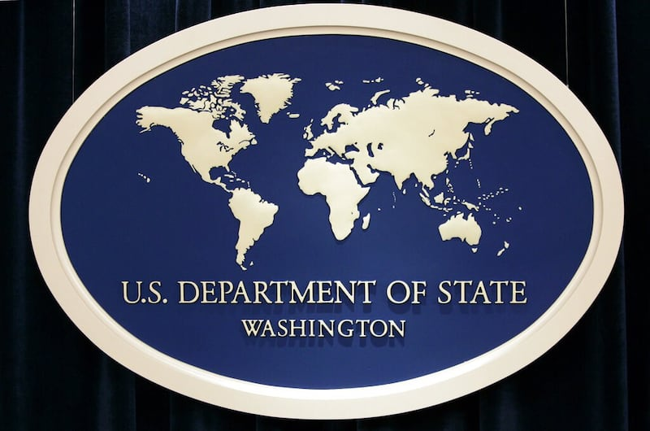

# 事實查覈｜美國國務院估算每年有十萬人被販運到美國？

作者：沈軻，發自華盛頓

2023.07.21 13:40 EDT

## 標籤：證據不足

## 一分鐘完讀

美國國務院在6月16日發佈的《2023年度販運人口報告》中批評香港政府打擊人口販運不力，引發港府不滿，反指美國纔是全球最大的人口販運國家，聲稱美國國務院自己公佈的數據顯示，每年有多達十萬名人口販運受害者被送入美國。

亞洲事實覈查實驗室發現，美國國務院不曾發佈美國人口販運受害人的總數，主要原因是難以統計。因此香港政府指稱每年有多達十萬名人口販運受害者被送入美國，並沒有證據。

## 深度解析

美國國務院人口販運防治辦公室最近發佈了2023年《 [人口販運問題報告](https://www.state.gov/reports/2023-trafficking-in-persons-report/)》,簡稱"TIP報告"(Trafficking in Persons Report),針對全世界188個政府打擊人口販運方面的工作進行評價。

報告將所有受調查的區域劃分爲四級,第一級最優,第四級最劣,香港被列爲第2級地區。 [報告](https://www.state.gov/reports/2023-trafficking-in-persons-report/hong-kong/)指出,儘管港府付出巨大努力打擊人口販運,但關鍵領域作爲仍有不足,包括沒有涉嫌人口販運者被定罪,對被販運受害者的識別成果也不盡理想。

中國外交部駐港公署以發言人 [聲明](http://hk.ocmfa.gov.cn/eng/fyrth/202306/t20230616_11098709.htm)回應了"TIP報告"。發言人批評這份報告完全不可信,帶有政治偏見,企圖扭曲《國安法》並毀謗中國。

這位不具名的發言人進一步指出：美國“粉飾”了自己纔是“世上最大人口販運國家”的事實，並聲稱國務院自己都估計每年有多達十萬人被從海外販運至美國，從事“強迫勞動”。

美國國務院每年發佈人口販運報告，總結各個國家和地區在打擊人口販運方面的努力。（圖／美聯社）

## 美國國務院自己估算每年有 10  萬人被販運到美國?

亞洲事實查覈實驗室檢視了美國國務院介紹人口販運問題的 [網頁](https://www.state.gov/humantrafficking-about-human-trafficking/#who),關於"究竟有多少人口販運受害者的問題",其描述是"很難找到與人口販運有關的可靠統計。可用數據的質量和數量往往受到以下因素影響:犯罪的隱蔽性、如何分辨出個別受害者、數據在準確性和完整性方面的差距、各利益關係方對於共享受害者資訊存在重大障礙。基於這些原因,資料和數據可能無法反映出問題的全貌。"

美國國務院人口販運防治辦公室也回應了亞洲事實查覈實驗室的查詢，辦公室強調“每年10萬人”這個數字並沒有出現在2023年的人口販運報告中，該部門也沒有在最近的報告裏引用過這樣的數據。

檢視“TIP報告”可以發現，從 2008 年起，報告中確實會提供全球和各地區已經被確認的人口販運受害者數據，如2008年的30961人和 2019年的118932人。報告更明確指出，由於各國報告的差異，這些數字應被視爲近似值。

全球或個別國家人口販運受害者總人數難以估算，要獲得可靠的數字非常困難。（圖／美聯社）

## 結論

儘管每年確實有人口販運受害者被販運到美國，但官方並沒有準確的統計或者估算數據。中國或香港官員引用所謂“美國國務院估計”，聲稱每年有 10 萬名人口販運的受害者被送進美國，這個說法並無根據。

*亞洲事實查覈實驗室（Asia Fact Check Lab）是針對當今複雜媒體環境以及新興傳播生態而成立的新單位。我們本於新聞專業，提供正確的查覈報告及深度報道，期待讀者對公共議題獲得多元而全面的認識。讀者若對任何媒體及社交軟件傳播的信息有疑問，歡迎以電郵 [afcl@rfa.org](http://afcl@rfa.org)寄給亞洲事實查覈實驗室，由我們爲您查證覈實。*

[Original Source](https://www.rfa.org/mandarin/shishi-hecha/hc-07212023132655.html)