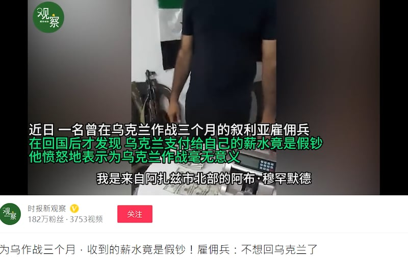
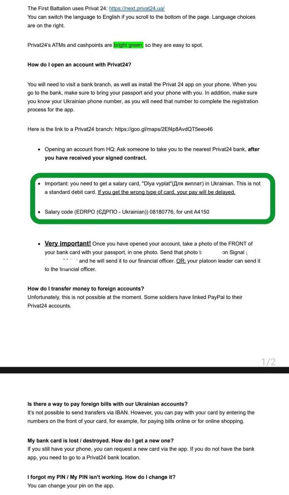

# 事實查覈｜僱傭兵爲烏克蘭作戰，收到的薪水竟是假鈔？

作者：莊敬

2023.07.24 13:47 EDT

## 標籤：錯誤

## 一分鐘完讀：

《中國國防時報》視頻頻道“時報新觀察”於7月16日發佈一則視頻報道，一名黑衣男子手持美鈔，說着外語。中文字幕寫着：“一名曾在烏克蘭作戰三個月的敘利亞僱傭兵，回國後才發現烏克蘭支付給自己的薪水竟是假鈔”，並喊話“兄弟們不要再爲烏克蘭而戰了”。

亞洲事實查覈實驗室通過包括“烏克蘭領土防衛國際軍團”在內的兩個獨立消息源查詢，證實烏克蘭國際軍團不以美元支付軍團成員薪水，也不發現金，因此影片所述並不是事實。

## 深度解析：

“時報新觀察”7月16日在西瓜視頻發佈視頻，指一名敘利亞僱傭兵收到烏克蘭支付假美鈔。 （圖/西瓜視頻 “時報新觀察”賬號截圖）

《中國國防時報》視頻頻道"時報新觀察"7月16日在 [西瓜視頻](https://www.ixigua.com/7256073119620989451?logTag=5354defc73854337f489)、 [抖音](https://www.douyin.com/user/MS4wLjABAAAAV1Fqqc4zbYKGx4HRtl96GPbD7z_b3xNZal2g-7PqtDQFwHmM409Dqqun9tqjbQmV?modal_id=7256214771534449956)發佈1分6秒的視頻,標題寫着"爲烏作戰三個月,收到的薪水竟是假鈔!僱傭兵:不想回烏克蘭了"。鳳凰衛視旗下的新媒體 [鳳凰網視頻](https://gs.ifeng.com/c/8RSbnn4zEtj),以及在微博擁有逾130萬粉絲的大V用戶 ["衝鋒號角"](https://weibo.com/2343014623/Na64ElhiL?type=repost)也在16日轉發了視頻。

視頻中，一名未露臉的黑衣男子說着外語，前面的小桌子放着幾張美鈔和一個點鈔機。根據中文字幕，這名男子自稱阿布.穆罕默德，來自敘利亞阿札茲市北部，曾在烏克蘭與俄羅斯作戰，回國後想到市場買輛摩托車，但嘗試付款時，小販向敘利亞國民軍軍警告發，他才知道這些美鈔有一部分是假的。他說，“兄弟們不要再爲烏克蘭而戰了”、“烏克蘭人不誠實”。

外籍志願者若要加入烏克蘭軍隊抗俄羅斯，需申請加入2022年烏克蘭政府創立的軍事單位“烏克蘭領土防衛國際軍團”（International Legion for the Defense of Ukraine）。亞洲事實查覈實驗室發送電郵向該軍團查覈視頻，軍團代表Oleksandr Shahuri回覆，“那是假的。我們不付美元，只付格里夫納（Hryvnias，編按：烏克蘭法定貨幣）。且不付現金，而是透過銀行轉錢。 ”

亞洲事實查覈實驗室另詢問曾加入烏克蘭國際軍團、投身烏俄戰場的臺灣人陳晞，他說，官方的國際軍團都是採用銀行每月匯款，並支付烏克蘭格里夫納。陳晞並提供申請加入烏克蘭國際軍團後所獲得的相關資料（下圖），內有說明支付方式。

臺灣男子陳晞申請加入“烏克蘭領土防衛國際軍團”後獲得資料，內有說明支付方式。（圖/陳晞提供資料）

亞洲事實查覈實驗室另發現,上述視頻的英文字幕版也在流傳,並且"烏克蘭國家通訊社"(UKRINFORM)已注意到Telegram帳號 [「Портфель Генштаба」](https://t.me/genshtab24/27892)(中譯:總參謀部的作品集)7月12日上傳這段視頻,並於7月13日發佈查覈報告指出,"烏克蘭領土防衛國際軍團"透過銀行帳號支付外國志願軍格里夫納,而非視頻所說的美元現鈔。

該報告還提及，將外國志願軍稱爲“僱傭兵”也並不妥當，俄羅斯方面經常宣稱僱傭兵爲烏克蘭作戰，但僱傭兵不享有《日內瓦公約》所賦予的戰俘待遇，而志願加入“烏克蘭領土防衛國際軍團”的戰鬥人員合法參與軍事行動，與僱傭兵不同。

## 結論：

視頻中的男子自稱作爲外國志願軍加入烏克蘭抗俄行列，但他所說的獲得報酬的支付方式與貨幣並不正確。中國官媒“時報新觀察”、“鳳凰網”在發佈來源不明的視頻和未經證實的文字信息，也未向烏克蘭相關單位查證，甚至在烏克蘭媒體已發佈查覈報告後，仍在中文傳播世界散佈這段含有錯誤資訊的視頻。

亞洲事實查覈實驗室(Asia Fact Check Labspan>)是針對當今複雜媒體環境以及新興傳播生態而成立的新單位。我們本於新聞專業,提供正確的查覈報告及深度報道,期待讀者對公共議題獲得多元而全面的認識。讀者若對任何媒體及社交軟件傳播的信息有疑問,歡迎以電郵 [afcl@rfa.org](http://afcl@rfa.org)寄給亞洲事實查覈實驗室,由我們爲您查證覈實。

[Original Source](https://www.rfa.org/mandarin/shishi-hecha/hc-07242023134350.html)