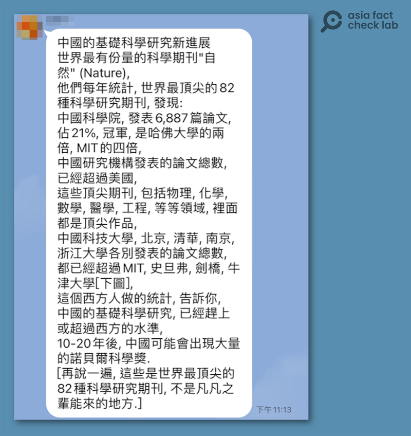
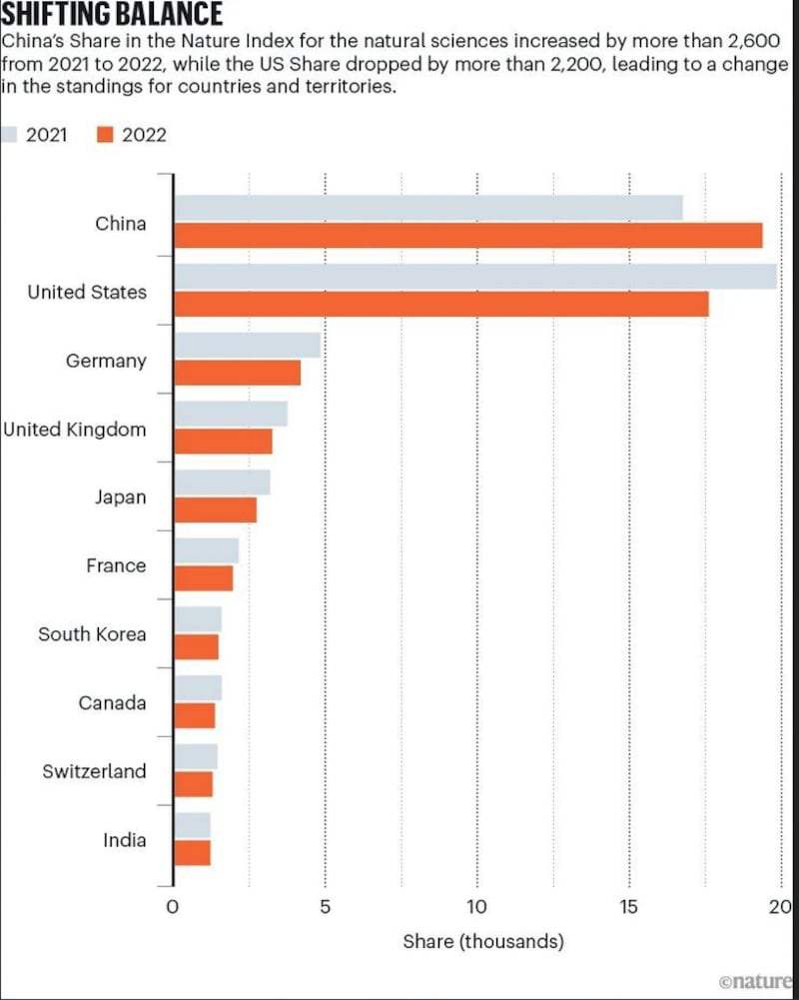
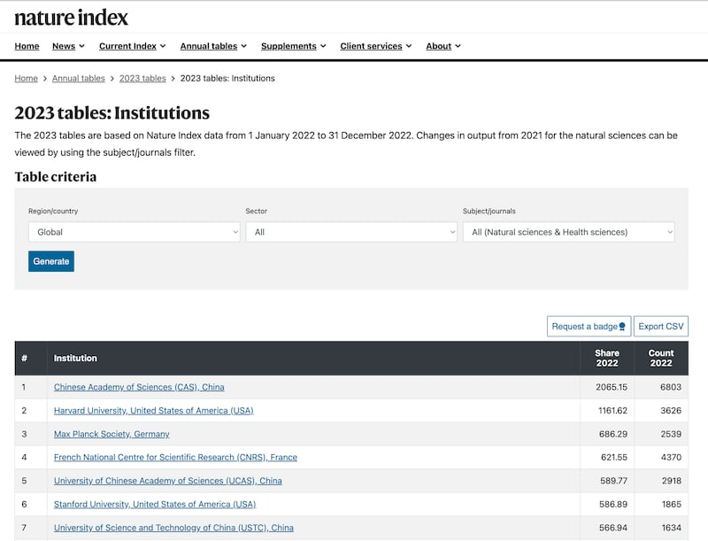
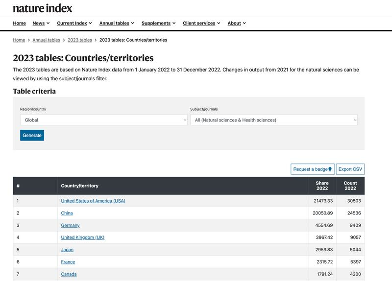
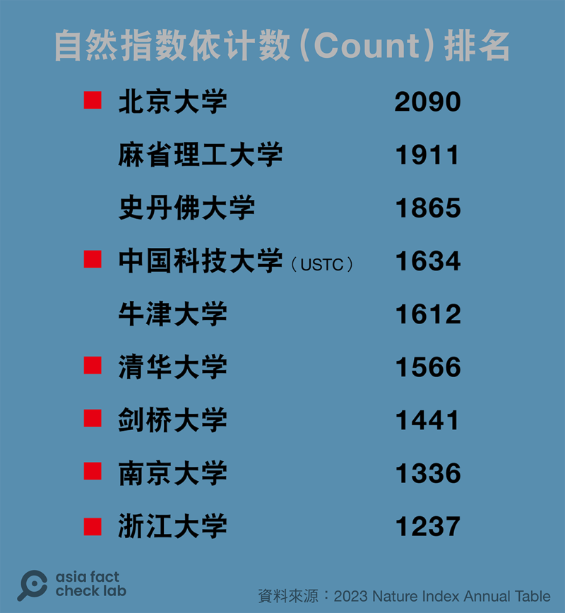
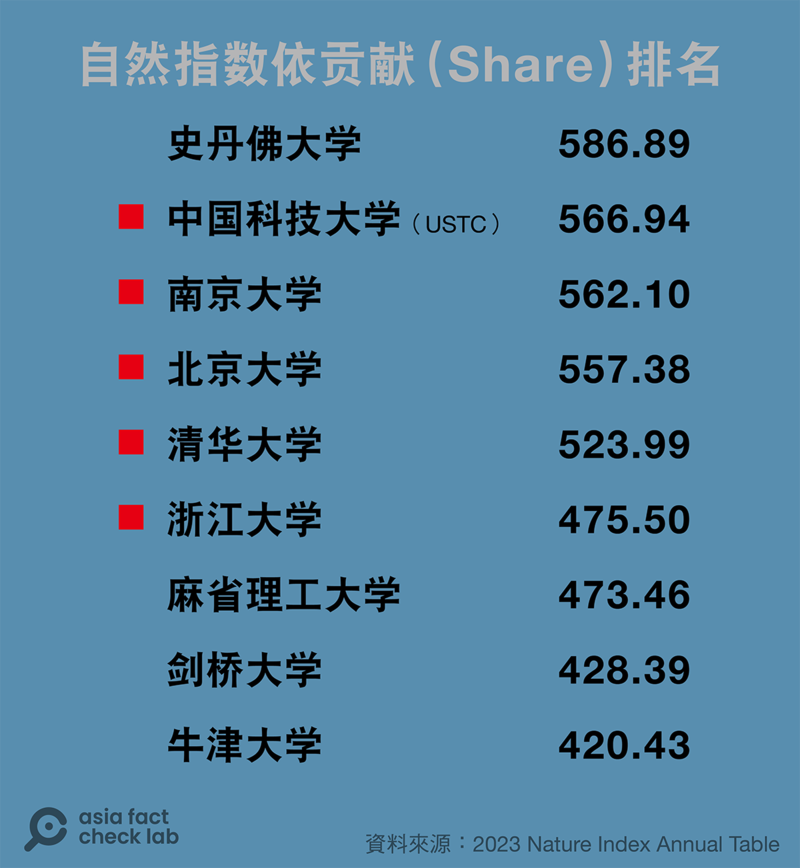

# 事實查覈｜中國登上頂尖期刊的科研論文總數已超越美國？

作者：董喆

2023.07.26 14:53 EDT

## 標籤：正確

## 一分鐘完讀：

亞洲事實查覈實驗室近期接獲讀者提供的一則通訊軟件信息截圖顯示，根據《自然》期刊(Nature)統計，“中國研究機構發表的論文總數已超越美國”，並稱中國基礎科學已經趕超西方國家，未來將出現大量的諾貝爾科學獎。該截圖在中文社交媒體平臺廣泛傳播，引發大量討論。

經查覈，網傳信息與《自然》的新聞稿相同，這項排名出自於《自然》的資料庫“自然指數”。中國科學院在以機構排名的兩項統計指標均排名第一確屬事實。然而，這項排名是否能代表一個國家的科研水平，是否預測一個國家“出現大量諾貝爾獎”，則是該信息作者的主觀判斷。

發佈該項以論文發表數量爲標準排名的自然指數網站也特別提示，評價科學研究質量和機構表現，還有其他很多因素，因此不應該用該指數作爲單一標準用於評估機構和個人。

## 深度分析：

根據讀者提供的流傳於社交軟件LINE的一則訊息，《自然》期刊統計了世界頂尖的82本期刊，結果顯示，中國科學院發表6887篇論文，是哈佛大學的兩倍，MIT（麻省理工學院）的四倍。且中國研究機構發表的論文總數，已經超過美國。中國科技大學、北京、清華、南京、浙江大學各自發表的論文總數都已經超過麻省理工、史丹佛、劍橋以及牛津大學。

該訊息更稱，西方人的統計顯示中國的基礎科學研究已經趕上或超過西方水準，10至20年後，中國可能會出現大量的諾貝爾科學獎。

讀者提供的LINE截圖，其中信息稱中國科研已經趕上或超過西方水平。（亞洲事實查覈實驗室製圖）

## 一、《自然》科研統計是否爲真？

亞洲事實查覈實驗室查證發現，《自然》期刊機構中有一個名爲自然指數（Nature Index）的自然科學研究資料庫，追蹤國家與各大學、研究機構等科研產出，並於每年根據前一年度表現，發佈研究成果排行榜（Nature Index Annual Table）。

根據官網介紹 ，“自然指數”是評估機構研究績效的一個指標，由獨立的科學家小組根據期刊聲譽選擇。其中針對“計數”（Count）以及“貢獻”（Share）兩項指標排行，統計的總體爲機構或國家在82本自然科學期刊中的發表成果。

不過根據自然指數發表的 [新聞稿](https://www.nature.com/nature-index/news/health-sciences-added-to-nature-index),2023年推出的排行榜擴大增加64本醫學期刊,統計總體達146本。

我們進一步瀏覽《自然》針對2023排行榜的系列新聞稿,發現這則訊息的出處應是來自" [Nature Index Annual Tables 2023: China tops natural-science table](https://www.nature.com/articles/d41586-023-01868-3)",由於爲了與前一年度比較,《自然》在此篇新聞稿中僅比較82本期刊內容。

2023年自然指數中，中國論文數排名超過美國。（圖/Nature）

因此LINE流傳的中國發表論文數“已經超過美國”的信息確實與《自然》官方新聞稿內容一致。

2022年《自然》的研究排名計算樣本爲82本，但2023年加入64本醫學期刊，成爲146本。本文以下的查覈、分析，都以146本爲基準。

## 二、中國科學院發表6887篇論文，是哈佛兩倍、MIT四倍？

自然指數是針對"計數"(Count)以及"貢獻"(Share)兩項指標進行排行,根據自然指數官方網站的 [說明](https://www.nature.com/nature-index/using-the-index),每篇至少有一名來自該國家、地區或機構的作者的文章,該國家、地區或機構的"計數"計爲1;每篇文章的貢獻(Share)則爲1,這個數量會由每位作者平均分配。例如,一篇有10位作者的文章意味着每位作者將獲得0.1的貢獻分。

LINE中的數字較符合Nature Index Annual Table中的“計數”統計，中國科學院2022年計數爲6803，哈佛大學爲3626，麻省理工爲1911。

中國科學院是哈佛大學的1.87倍、麻省理工的3.55倍，大約符合LINE訊息內容。確切計數的出入，可能出自資料庫定期更新、更正帶來的變動。

## 三、如果以國家爲單位，中國已經超過美國？

自然指數的排行榜區分“機構”與“國家”兩種分類，如果以國家爲範圍，必需同時考慮“貢獻”和“計數”兩個統計指標。

自然機構的統計排名主要是依"貢獻"分數高低,若以" [機構](https://www.nature.com/nature-index/annual-tables/2023/institution/all/all/global)"分類來看,中國科學院排名第一,貢獻分2065.15,計數分爲6803。

以機構分類，自然指數統計排名結果。（自然指數網站截圖）

若以" [國家/地區](https://www.nature.com/nature-index/annual-tables/2023/country/all/all)"分類,美國貢獻分21473.33、計數分30503,排名第一,中國則排名第二,貢獻分20050.89、計數分24536。

以國家/地區分類，自然指數統計排名結果。（自然指數網站截圖）

因此，根據自然指數的最新網站結果，如果以國家分類、以論文的“數量”或“貢獻”來比較，第一名爲美國，第二爲中國。

## 四、中國科技大學、北京、清華、南京、浙江大學各自發表論文總數，已超過麻省理工、史丹佛、劍橋、牛津大學？

如同上一點，訊息中並未明確點出是以“計數”或是“貢獻”來計算，以下分別呈現以計數、貢獻排名結果。

若以“計數”來計，北京大學排名第一，麻省理工與史丹佛(斯坦福)居二、三。

若以"貢獻"來計，史丹佛(斯坦福)排名第一，中國科技大學與南京大學居二、三，這也是自然指數總排名的依據。

以兩種排名方式都可見來自中國的幾所大學並未全數超越歐美大學，以自然指數的總排名來看，第一名爲史丹佛、第二名爲中國科技大學（USTC），但南京、北京、清華、浙江大學的確超越麻省理工以及劍橋、牛津。

## 結論：

該則LINE訊息的來源是《自然》發佈的調查，陳述與《自然》官方新聞稿大致相同。但亞洲事實查覈實驗室更進一步分析這份資料庫，發現如果以國家爲單位，美國在兩個指數上仍然小幅領先中國。

但網傳信息指“西方人的統計顯示中國的基礎科學研究已經趕上或超過西方水準，10至20年後，中國可能會出現大量的諾貝爾科學獎”。這項訊息是主觀的預測或期待，不屬於查覈範疇。

至於這些論文數量的統計是否反應一個國家的科研水平，自然指數在資料庫表格下特別註記：排行榜結果的數據僅是整體研究論文的一小部分，只涵蓋自然科學領域，且統計結果並沒有經過標準化處理，未能反映國家或機構的規模，“依靠自然指數的指標來評估機構或個人是不合適的。”

*亞洲事實查覈實驗室(Asia Fact Check Lab)是針對當今複雜媒體環境以及新興傳播生態而成立的新單位,我們本於新聞專業,提供正確的查覈報告及深度報道,期待讀者對公共議題獲得多元而全面的認識。讀者若對任何媒體及社交軟件傳播的信息有疑問,歡迎以電郵*  [*afcl@rfa.org*](mailto:afcl@rfa.org)  *寄給亞洲事實查覈實驗室,由我們爲您查證覈實。*

[Original Source](https://www.rfa.org/mandarin/shishi-hecha/hc-07262023143808.html)