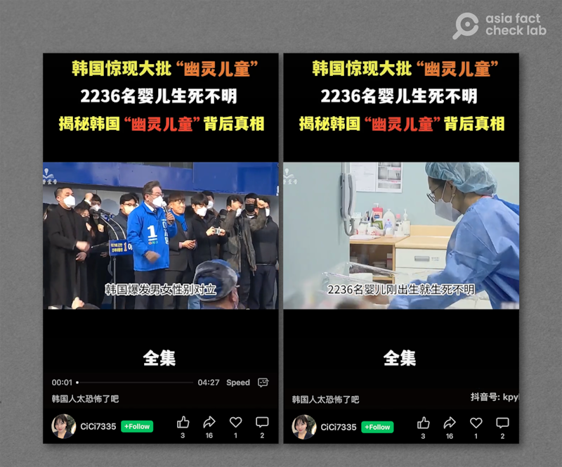

# 事實查覈｜韓國驚現"大批幽靈兒童"？ 2236名嬰兒"生死不明"？

作者：鄭崇生，發自華盛頓

2023.07.27 14:24 EDT

## 標籤：部分正確

## 一分鐘完讀：

韓國保健福祉部6月28日 [宣佈](https://cn.yna.co.kr/view/ACK20230628003100881),從2015到2022年間清查到2123名"無戶兒童",即有出生登記,卻沒有報戶口的兒童,這個羣體又被媒體成爲"幽靈兒童"。 7月中,韓國政府 [發佈信息](https://en.yna.co.kr/view/AEN20230718002700320),已確認其中1025人存活、249人死亡,849人情況不明。

韓國政府這項戶口清查工作也被中國媒體廣爲傳播，大部分媒體報道了該事件的基本事實，但也有不少網絡視頻、新聞媒體標題只片面展示部分事實，採用“韓國驚現大批幽靈兒童，2236名嬰兒生死不明”等標題，對照韓國政府公佈的結果，爲誤導信息。

## 深度分析：

在韓國，“幽靈兒童”指的是在醫院有出生登記，卻沒有辦理戶籍登記的幼兒。韓國國家通訊社韓聯社報導，韓國政府針對在2015年到2022年間的“幽靈兒童”展開調查，這次普查是韓國監查院對保健福利部的定期審計。原本公佈的“幽靈兒童”爲2236人，六月底修正爲2123人。

7月18日,韓國福祉部發布消息,在已確認的2123名"幽靈兒童"中,已知1025人存活、249人死亡,849人情況不明。 [據報道](https://www.koreatimes.co.kr/www/nation/2023/07/113_355158.html),其中有7例死亡案例正在接受進一步的調查。

官方調查“幽靈兒童”的行動，也讓幾起惡性重大的刑事案件曝光，在韓國水原，發生一名女子謀殺兩名親生嬰兒，並且將屍體藏在家中冰櫃長達5年；在韓國巨濟，一名男嬰出生五天後被父親掐死、埋屍山中；也有家長殺死罹患先天罕見疾病的孩子……這些真實案件的戲劇性，伴隨“幽靈兒童”的調查數字，成了在中國抖音平臺上標註爲熱榜的視頻內容。

抖音平臺上大量製作轉發"幽靈兒童"相關視頻 （抖音截圖）

#韓國幽靈嬰兒已確認249人死亡#的這一關鍵句標註,19日一度衝上新浪微博熱搜榜第一位,例如抖音賬戶"科普壹號"於7月19日發佈的 [視頻](https://www.douyin.com/user/MS4wLjABAAAAnQ99nGAs5bWzgMaQJXDRjB-LPASdbQqEvydDFS2BrwfZaUAL2jb2vkHSCoSZUtew?modal_id=7257471178263088403),提到"2236名嬰兒剛出生就生死不明",明顯是引述了舊數據。中共中央政法委更分別在其官方微博及微信賬號" [中國長安網](https://weibo.com/5617030362/NaImvjR7G#repost)"及" [中央政法委長安劍](https://mp.weixin.qq.com/s/P66QHKr4I4kRFWq_CBXXQA)"上標註並轉述相關資訊,卻未提調查的時間背景是從2015至2022年間。

"幽靈嬰兒"事件登上新浪微博熱搜，不少媒體和社交媒體賬戶片面轉發信息。（新浪微博截圖）

## 結論：

韓國官方清查幽靈兒童的行動，查出了幾起惡性犯罪事件，讓“韓國驚現大批幽靈嬰兒”的信息在中國社交平臺上傳播，一些媒體和黨政機關帳號都加入傳播的行列。但這些信息有些引用未更新或錯誤資訊，內容也不完整，並沒有呈現這起事件的全貌。

*亞洲事實查覈實驗室(Asia Fact Check Lab)是針對當今複雜媒體環境以及新興傳播生態而成立的新單位,我們本於新聞專業,提供正確的查覈報告及深度報道,期待讀者對公共議題獲得多元而全面的認識。讀者若對任何媒體及社交軟件傳播的信息有疑問,歡迎以電郵*  [*afcl@rfa.org*](mailto:afcl@rfa.org)  *寄給亞洲事實查覈實驗室,由我們爲您查證覈實。*

[Original Source](https://www.rfa.org/mandarin/shishi-hecha/hc-07272023140819.html)