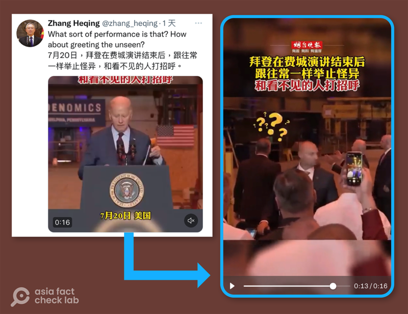

# 事實查覈｜美國總統拜登又和"看不見的人"打招呼"？

作者：莊敬

2023.07.28 14:33 EDT

## 標籤：錯誤

## 一分鐘完讀：

近日，中國的媒體和外交官在網上發佈短視頻，畫面爲美國總統拜登演講完後看向某處並舉手打招呼，配上簡體中文字幕：“拜登跟往常一樣舉止怪異，和看不見的人打招呼”。

亞洲事實查覈實驗室檢視拜登7月20日在費城演講的完整影片及多張照片，發現拜登面對的方向有高層看臺，上面站着不少聽衆，拜登演講後的舉止應是與他們互動。網傳視頻的畫面範圍不夠廣、沒拍到看臺上的羣衆，中國外交官、官媒都是以不完整的畫面，散播“拜登和看不見的人打招呼”假訊息。

## 深度解析：

中國駐巴基斯坦外交官 [張和清](https://twitter.com/zhang_heqing/status/1682184313717006337)7月21日在推特發佈一段視頻,配文寫着:"7月20日,拜登在費城演講結束後,跟往常一樣舉止怪異,和看不見的人打招呼。"

中國駐巴基斯坦外交官張和清7月21日轉推一段出自《煙臺晚報》的視頻，稱拜登在費城演講結束後，和看不見的人打招呼。（推特截圖）

經查證，這則視頻出自中國《煙臺晚報》的視頻賬號。16秒的畫面中，拜登演講完先看向他的左手邊，之後走向右手邊階梯，接着抬頭並舉起雙手，像是在對某人打招呼；但在這段畫面中，看不到拜登打招呼的對象。

《煙臺晚報》視頻字幕寫着,"拜登在費城演講結束後,跟往常一樣舉止怪異,和看不見的人打招呼",還爲拜登身旁的黑衣工作人員頭上加了幾個問號。《煙臺晚報》也在"西瓜視頻"發佈同主題的 [視頻](https://www.ixigua.com/7258186308466508351?logTag=df69fad2a98ae43ff3a3),但剪輯爲更短、僅9秒的版本。

臺灣的 [中天新聞](https://www.youtube.com/watch?v=4Gvd6IoC9Qg)21日也播放相似畫面,主播說:"美國總統拜登今天到賓州費城造船廠推銷他的拜登經濟學,但是網友最關注的是這個畫面,拜登在結束之後突然在臺上來段即興演出,他好像在跟看不到的人打招呼。

臺灣的中天新聞報道拜登到費城推銷"拜登經濟學"，結束後卻好像在跟看不到的人打招呼。（YouTube截圖）

## 拜登在看誰？

拜登7月20日造訪賓州費城造船廠,發表演說大談"拜登經濟學", [白宮完整影片](https://www.youtube.com/watch?v=_ZA5m8oUA7Y&t=1577s)26分15秒處可看到在拜登的右手邊,也就是網傳短視頻中,拜登走下講臺後所看的方向,其實有三層看臺,第二層、三層上面站着不少聽衆,直到拜登演講完都在現場。

白宮發佈影片顯示，美國總統拜登7月20日在費城演講時，右手邊看臺上站着許多聽衆。（白宮YouTube賬號截圖）

[路透社](https://www.reuters.com/world/us/bidens-tough-sell-pennsylvania-green-energy-union-workers-2023-07-20/)、 [《華爾街日報》](https://www.wsj.com/articles/biden-goes-all-in-on-bidenomics-voters-arent-buying-it-102be20a)、 [CNBC](https://www.cnbc.com/2023/07/20/white-house-bidenomics-low-poll-numbers.html)等多家媒體報道搭配的照片,也都拍攝到拜登與站在其右手邊看臺的羣衆。網上可找到大量影片和照片,顯示該場活動的真實狀況。但上述中國外交官張和清,以及中國、臺灣的媒體卻未經查證,傳播不實資訊。

## 中國輿論場試圖塑造拜登怪異形象？

亞洲事實查覈實驗室今年4月曾發佈 [查覈報告](https://www.rfa.org/cantonese/news/factcheck/biden-04202023074358.html),針對"今日俄羅斯""四川觀察"在微博等中文平臺熱傳視頻,稱拜登在北愛爾蘭大學演講後轉身向牆壁說話,是"向隱形人道歉"。但經檢視現場其它角度照片,拜登的背後有三層看臺,轉身是爲與看臺上的人羣互動。

另一個相似案例爲今年6月拜登在白宮接見"超級盃"冠軍、堪薩斯城酋長隊時,中國媒體"環球網"在抖音發佈 [短視頻](https://www.douyin.com/video/7241764557264342330),標題爲"拜登參加活動時再次陷入迷茫,靈魂發問:我在做什麼?"

這段9秒短視頻的字幕寫着:隊員們向拜登贈送球衣合照時,拜登似乎不知道自己在幹什麼,嘴裏直接嘟囔出"我在做什麼"?但只要檢視 [完整影片](https://www.youtube.com/watch?v=Iw5kC54Ooq0)即可知道,拜登並非自言自語,而是在和一旁的工作人員對話,確認活動的下一步驟。

## 結論：

今年八十歲的拜登爲美國史上最高齡總統，偶爾發生摔倒、口誤等情況，都引起外界關注其身體狀況。但亞洲事實查覈實驗室注意到，中文輿論場上不少短視頻以不完整的片段呈現，加上中文字幕引導，力圖爲拜登塑造一個行爲怪異的“老年癡呆”人，加深外界對拜登心智能力的疑慮，本報告查覈的“拜登和看不見的人打招呼”即是一例。

*亞洲事實查覈實驗室(* *Asia Fact Check Lab* *)是針對當今複雜媒體環境以及新興傳播生態而成立的新單位。我們本於新聞專業,提供正確的查覈報告及深度報道,期待讀者對公共議題獲得多元而全面的認識。讀者若對任何媒體及社交軟件傳播的信息有疑問,歡迎以電郵* *afcl@rfa.org* *寄給亞洲事實查覈實驗室,由我們爲您查證覈實。*

[Original Source](https://www.rfa.org/mandarin/shishi-hecha/hc-07282023142407.html)