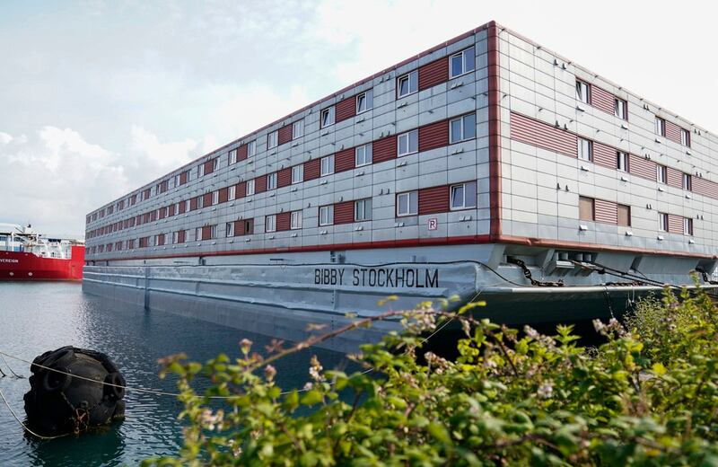
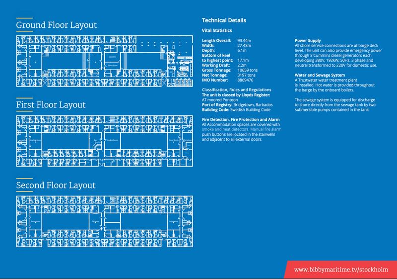
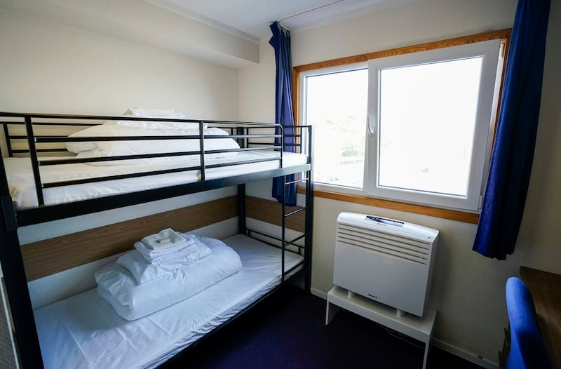
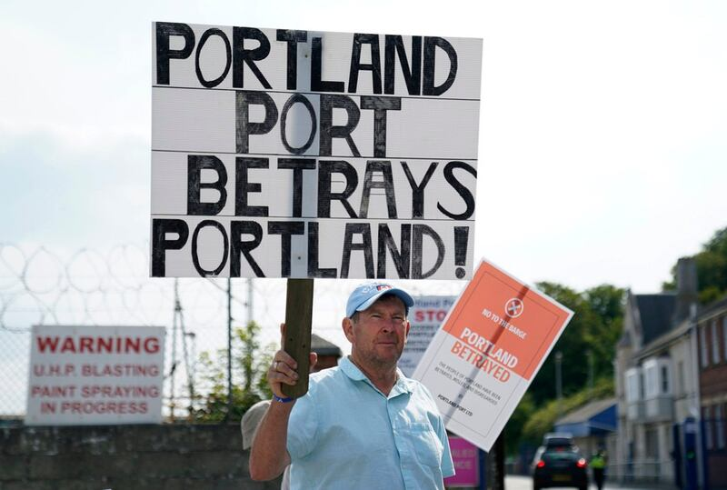

# 事實查覈｜英國打造"海上監獄"關押非法移民？

作者：董喆，發自臺北

2023.07.31 15:13 EDT

## 標籤：錯誤

## 一分鐘完讀：

中通社旗下“通傳媒”推特帳號7月24日發表一則短視頻，稱英國爲關押非法移民，在海上打造了一座”漂浮監獄”，微博上也有多位“大Ｖ”發佈相關視頻，稱英國囚禁移民。

亞洲事實查覈實驗室查證後確認，該艘船名爲“Bibby Stockholm”，是因當地庇護所超載，政府改以庇護船臨時安置無證移民。英國廣播公司（BBC）記者亦獲邀上船，船上有健身房、電視間以及多種宗教的祈禱室，並且居住者可自由離開船隻進入碼頭的特定空間活動。儘管有人站在人道主義立場對這類庇護設施提出批評，但這既不是“監獄”，移民也並未被“關押”或“囚禁”。英國打造海上監獄關押移民的報道是錯誤的。

深度分析：

近日，微博上有多位“大V”分享來源不同的影片，稱英國政府爲了阻止非法移民入境，打造了一艘漂浮監獄。中通社旗下“通傳媒”也在推特上發短視頻傳播這艘“海上監獄”的傳言，稱這是要斷了非法移民的念頭。

**"海上監獄"是哪艘船**?

亞洲事實查覈實驗室以海上監獄作爲關鍵字搜尋，並未發現任何華文或外文報道，改以庇護、船隻等關鍵字搜尋，發現英國英國廣播公司（BBC）、《衛報》和《金融時報》等媒體近日皆有報道一艘名叫“Bibby Stockholm”的船停泊在英國波特蘭的消息。該船隻照片與中國社媒上流傳的一致。綜合各家英國媒體報道，因爲最近湧入的無證移民超過了英國庇護所的承載能力，這艘船目前用以安置部分等待庇護的無證移民。

中文互聯網上傳播的各類“海上監獄”信息 圖截取自微博、推特

## 英國是否有無證移民超量湧入的問題？

根據英國政府於2023年2月發表的 [統計資料](https://www.gov.uk/government/statistics/irregular-migration-to-the-uk-year-ending-december-2022/irregular-migration-to-the-uk-year-ending-december-2022#how-many-migrants-were-detected-arriving-in-the-uk-via-small-boats),從2019年開始,有大量的無證移民乘坐小船穿越英吉利海峽。2022年總計有4萬4666人尋求此路徑抵達英國,當中有9成目的要尋求庇護。統計資料更指出,2022年搭乘小船的尋求庇護者有97%仍在等待審理結果,全英國待審理的庇護案件截至2022年6月底則有16萬6085件。

## Bibby Stockholm的實際用途爲何？

BBC引用牛津移民觀察站智庫的數據，顯示英國處理庇護案件的平均等待時間爲15.5個月，英國總理蘇納克允諾在2023年底前儘可能審理完畢，而Bibby Stockholm便是蘇納克降低庇護住宿費用的第一步，第一階段將安置500名單身男性，預計停靠18個月。

Bibby Stockholm外觀（美聯社圖片）

根據Bibby Stockholm所屬的船公司(Bibby Marine) [官方簡介](https://www.bibbymarine.com/bibby-stockholm/),Bibby Stockholm原本就是一艘住宿船,共計三層樓,長93.44公尺,共有222個寢室,附有健身房、電視房、檯球室等。

Bibby Stockholm所屬的船公司（Bibby Marine）官方簡介（截取自Bibby Marine官網）

根據 [BBC報道](https://www.bbc.com/news/uk-england-dorset-66099583),英國政府已將牀鋪改爲雙層牀,增加可容納人數。在等待庇護審批期間,臨時安置在這裏的移民可以搭乘每小時一班的巴士,經安檢後上岸,前往特定範圍內的商店購物或者活動,英國政府並未對船上的居民下達宵禁令,但鼓勵居民每晚11點以前返回船上。

英國政府已將Bibby Stockholm的牀鋪改爲雙層牀，增加可容納人數。（美聯社圖片）

根據上述資訊，英國政府並未如中國官媒以及社羣上所稱以“海上監獄”囚禁非法移民，且該艘船隻目的是要收容等待庇護申請者，並非要“斷了他們移民念頭”。

## 用Bibby Stockholm安置移民的爭議

“海上監獄”之說從何而來？亞洲事實查覈實驗室翻閱了各大外媒報道，發現極有可能是挪用了英國境內批評此一收容政策的說法。

綜合各媒報道，英國政府以Bibby Stockholm安置移民的做法招來了兩類不同的批評。

根據 [《紐約時報》報道](https://www.nytimes.com/2023/07/18/world/europe/asylum-seekers-uk-barge-bibby-stockholm.html?smid=nytcore-ios-share&referringSource=articleShare),鄰近船隻的韋茅斯(Weymouth)地區居民擔心這些無證移民因爲等待庇護申請無法工作,將聚集在港口無所事事,存在治安隱患。另外,政府提供尋求庇護者免費交通接駁及便捷的醫療服務,讓本來就 [屬於英國貧困地區](https://www.publichealthdorset.org.uk/documents/40757/496828/Appendix+R+-+Weymouth+%26+Portland+profile.pdf/2a7f148a-dfdf-7059-3a17-fc1837cdfc1c)的韋茅斯居民不滿。

Bibby Stockholm停靠處附近的居民抗議收容政策（美聯社圖片）

也有人基於人權保障的考量反對Bibby Stockholm收容措施。 [BBC7月初報道](https://www.bbc.com/news/uk-england-dorset-66094832),有40多個組織與個人撰寫 [公開信](https://www.refugeecouncil.org.uk/latest/news/an-open-letter-to-bibby-marine/)給Bibby Stockholm所屬的Bibby Marine公司,呼籲該公司退出租船協議,因爲在浮動的船上收容有過創傷經歷的人是"殘酷且不人道"的。

## 結論：

Bibby Stockholm是一艘住宿船，由英國政府與Bibby Marine公司協議，爲500名單身男性無證移民提供臨時安置的住宿，以等待庇護申請結果，而非中國社媒所稱的以“海上監獄關押非法移民”並且目的是要“斷了他們的移民念頭”。

中國社媒的“海上監獄”之說，極有可能挪用來自英國境內人權組織及反對者批評政府的措辭，因他們反對用浮動船隻收容有創傷經歷的無證移民，認爲這種安置手段不夠人性化。

*亞洲事實查覈實驗室(* *Asia Fact Check Lab* *)是針對當今複雜媒體環境以及新興傳播生態而成立的新單位。我們本於新聞專業,提供正確的查覈報告及深度報道,期待讀者對公共議題獲得多元而全面的認識。讀者若對任何媒體及社交軟件傳播的信息有疑問,歡迎以電郵* *afcl@rfa.org* *寄給亞洲事實查覈實驗室,由我們爲您查證覈實。*

[Original Source](https://www.rfa.org/mandarin/shishi-hecha/hc-07312023150340.html)