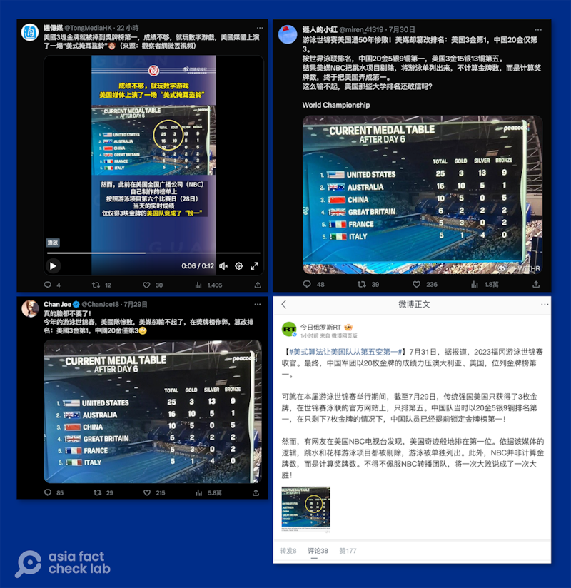
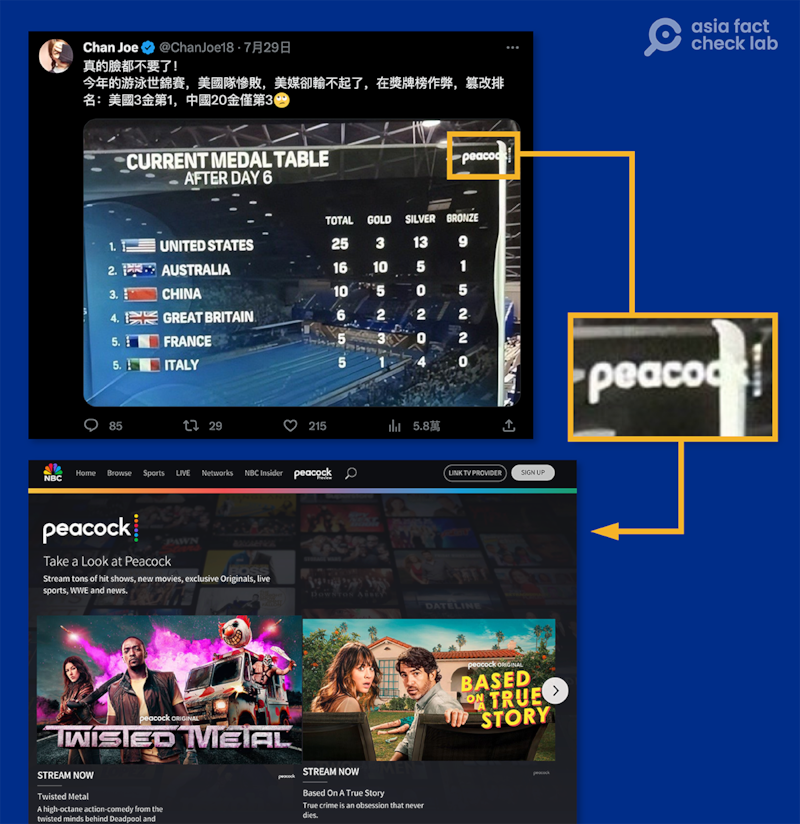
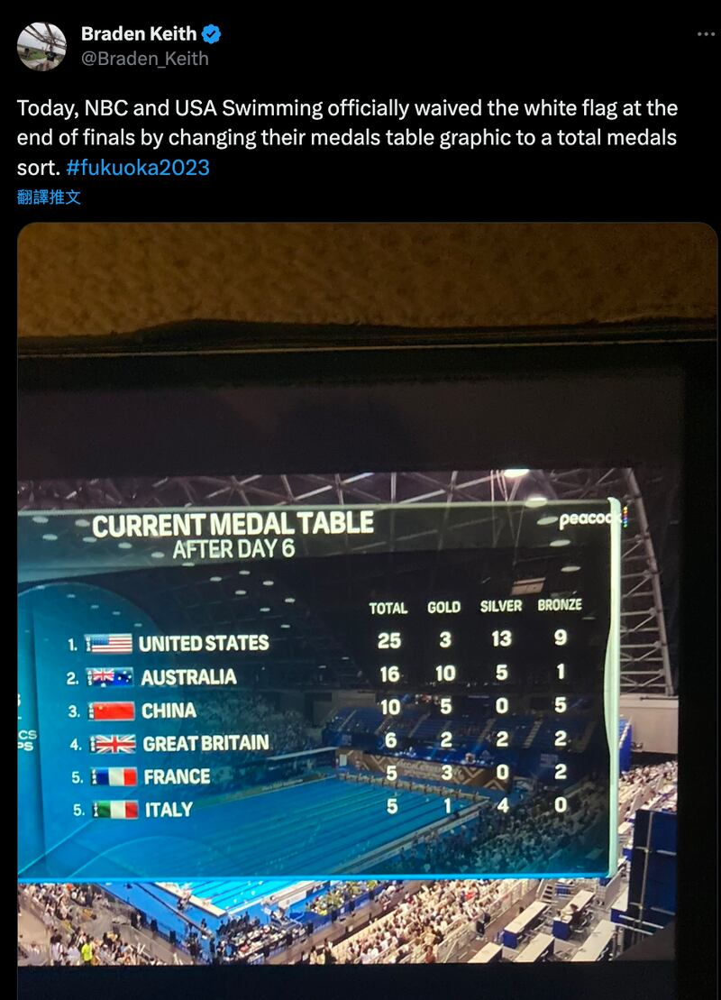
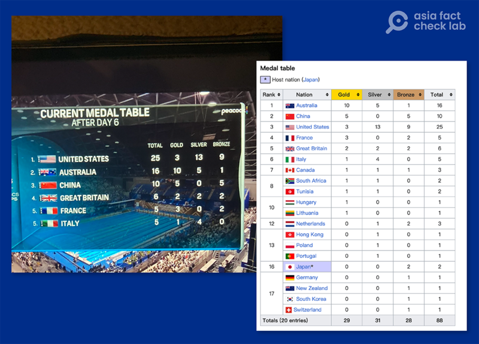

# 事實查覈｜美國媒體造假謊報游泳世錦賽排名？

作者：董喆，發自臺灣

2023.08.02 15:08 EDT

## 標籤：誤導

## 一分鐘完讀：

2023年世界游泳錦標賽於7月30日落幕，當日，中國社交媒體平臺上一張稱美國"在獎牌榜作弊，篡改排名"的截圖被大量轉發。中俄官媒《今日俄羅斯》與《通傳媒》跟進報道，指這是"美式掩耳盜鈴" 。

亞洲事實查覈實驗室查證後發現，原圖出自美國運動雜誌主編髮的推特，是在討論美國以總獎牌數取代金牌數來計算排名的情況，且截圖上的比分與游泳項目賽事第六天的賽果相吻合，原文並不是在表述最終的比賽結果。

## 深度分析：

近日，中國各社交媒體平臺都熱傳一張美國媒體NBC的游泳世錦賽轉播截圖，多個社媒帳號指責美國媒體輸不起，“在獎牌榜作弊，篡改排名：美國3金第1，中國20金僅第3”。這張截圖在中國社羣平臺上廣泛傳播，隨後被《今日俄羅斯》與《通傳媒》跟進報導，分別指責美媒“掩耳盜鈴”。

中文社交媒體平臺上廣泛傳播的“美國媒體篡改排名”帖文截圖 （圖截取自推特、微博）

## 截圖的源頭是哪裏

亞洲事實查覈實驗室首先針對截圖進行查證，確定其出自 NBC旗下的串流（Streaming）平臺Peacock。

示意圖：網傳截圖來源於Peacock

再以關鍵字NBC、USA、Swimming以及這次游泳世錦賽的hashtag #fukuoka2023在推特上搜尋,發現原始圖片出處是美國游泳運動雜誌《SwimSwam》的主編 [Braden Keith](https://swimswam.com/bio/braden-keith/)於7月28日所發的推文附圖。

美國游泳運動雜誌《SwimSwam》的主編Braden Keith所發的推文（圖截取自推特）

《SwimSwam》在臉書與Instagram各自有70萬與37萬訂閱戶，是奧運金牌得主Melvin Stewart與Braden Keith等其他三名合夥人所創立。2016年裏約奧運時，被NBC Sports評爲最值得追蹤的100個運動社羣之一。

Braden Keith在推特發文說: "NBC在游泳項目決賽時,正式揮白旗投降了——他們將獎牌榜改爲獎牌總數排序。" 不過推文留言處有不同意見,指稱美國媒體近年一直是以總獎牌數作爲排名依據,而非金牌總數,此一討論也登上美國知名運動雜誌《 [Sportskeeda](https://www.sportskeeda.com/swimming/news-how-embarrassing-what-powerhouse-usa-swimming-is-netizens-express-mixed-reactions-adding-total-nbc-s-points-table)》。

以總獎牌數亦或是金牌數計算排名的爭議,在美國已非頭一遭。2021年美國奧林匹克委員會(USOPC)、《紐約時報》《華盛頓郵報》以及NBC等媒體皆以總獎牌數作爲排名依據,當時也在社羣上 [引起討論](https://www.bbc.com/zhongwen/trad/sports-58083082)。

## 美國有造假獎牌數量嗎？

儘管兩種獎牌計算方式有爭議，但美國媒體轉播的獎牌數量並沒有錯誤及造假。根據截圖中的幾個線索，亞洲事實查覈實驗室找出了比分的確切日期及數字。

根據截圖中的轉播標題"After Day 6"、底圖的游泳水道,以及Braden Keith在7月28日所發的推文,比對 [官方賽事表](https://www.worldaquatics.com/competitions/1/world-aquatics-championships-fukuoka-2023/schedule?phase=All&disciplines=),可以確定這張截圖轉播的是"游泳項目"的第六天賽事結果。

以維基百科 [世錦賽游泳項目頁面](https://en.wikipedia.org/wiki/Swimming_at_the_2023_World_Aquatics_Championships)回溯7月28日的比分,可以確定與NBC轉播的結果吻合,並不存在造假報道的情況。

網傳截圖顯示的比賽第六日獎牌榜與維基百科歷史頁面記錄的當日榜單內容一致，只是排序方式不同。 （圖截取自維基百科頁面）

另外，2023世界游泳錦標賽包含水上芭蕾、跳水、公開水域游泳、水球、游泳、高空跳水共計6項賽事，中俄媒體和網民強調的“中國20金”是中國在所有項目上獲得的金牌總數。

## 結論：

美國媒體計算游泳世錦賽的排名是按照總獎牌數而非金牌數，此一事件的確在推特上受到專業運動人士的質疑與評論，但只是標準不同，並未涉及“造假”。

中國社媒上宣稱的“美國3金第1，中國20金僅第3”混淆了第六天賽事結果與最終賽事結果，並且忽略這張截圖是單指“游泳項目”而非涵蓋全部6個比賽項目，有誤導之嫌。

*亞洲事實查覈實驗室（Asia Fact Check Lab）是針對當今複雜媒體環境以及新興傳播生態而成立的新單位。我們本於新聞專業，提供正確的查覈報告及深度報道，期待讀者對公共議題獲得多元而全面的認識。讀者若對任何媒體及社交軟件傳播的信息有疑問，歡迎以電郵afcl@rfa.org寄給亞洲事實查覈實驗室，由我們爲您查證覈實。*

[Original Source](https://www.rfa.org/mandarin/shishi-hecha/hc-08022023145914.html)