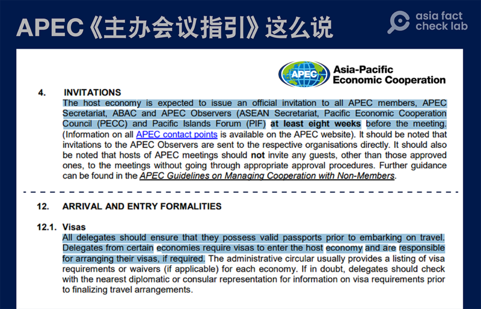
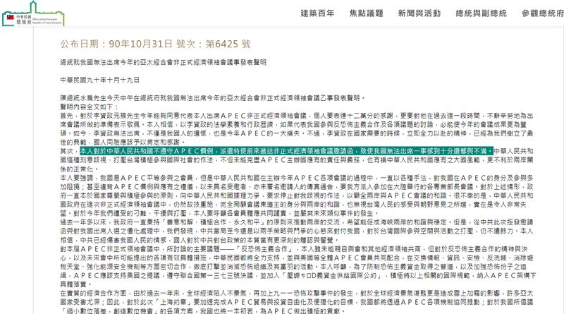

# 事實查覈｜美國若拒發邀請函給李家超，違反APEC規則？

作者：鄭崇生，發自華盛頓

2023.08.03 16:12 EDT

## 標籤：誤導

## 一分鐘完讀：

儘管華盛頓尚未正式宣佈香港特首李家超是否能參與年底的APEC領導人非正式會議，但有媒體報道，基於制裁名單，美國將禁止李家超參加。對此，中國外交部與香港特區政府分別發聲，警告美國若“不邀請香港特區行政長官”，違反亞太經合組織APEC規則，未履行東道主的基本責任。

然而，亞洲事實查覈實驗室詳閱APEC相關規則發現，APEC成員經濟體的領導人是默認被邀請參加會議的，發邀請函確實是主辦國的責任，但邀請函只是一個形式。而受邀人要想進入主辦國，還需取得簽證或可適用的簽證豁免，須由參會代表團自行負責安排相關事宜，與主辦國接洽。APEC規則中， 並沒有提及，主辦國一定要給代表團成員發放簽證。

因此，美國如果禁止李家超參加會議將“違反APEC規則”的說法，有誤導之嫌。

## 深度分析：

2023年APEC非正式領袖會議預計11月15日到17日在舊金山舉辦。《華盛頓郵報》7月27日 [報道](https://www.washingtonpost.com/national-security/2023/07/27/hong-kong-john-lee-apec/?fbclid=IwAR27tKhhtq3ci0cmn7QlbmtJhmWAsWu7n2qJCy-p8Ya74Xc6kZlYoSb74mQ)引述不具名白宮官員,基於李家超2020年已在美國的制裁名單上,華盛頓已決定,將禁止他參與這次會議。

中國外交部發言人毛寧 [在記者會上回應此事](https://www.mfa.gov.cn/web/fyrbt_673021/202307/t20230728_11119206.shtml),稱美國若以制裁爲由、拒絕邀請李家超赴美參加APEC會議,是"錯上加錯,悍然違反APEC規則,嚴重違背美方辦會承諾",香港特區政府在聲明中 [指出](https://www.info.gov.hk/gia/general/202307/28/P2023072800247.htm?fontSize=1),主辦國應按APEC規則和習慣,邀請行政長官以中國香港領導人身份出席會議,這是美國應切實履行東道主的"基本責任"。

## APEC主辦國有邀請的責任嗎？

APEC [主辦會議指引](https://www.apec.org/docs/default-source/aboutus/policiesandprocedures/meetings/17_bmc2_008_2_guidelines-for-hosting-apec-meetings_2017-aug-28_approved-at-bmc.pdf?sfvrsn=f1fa827c_1)第四條中包括對邀請函的發送及簽證的辦理的說明,決定主辦會議的地點、時間及發出正式邀請函,是主辦國的後勤團隊及會議祕書處的責任,主辦國預期在至少開會前八週發出正式邀請函。

但是，指引同時指出，每年底舉行的領導人非正式會議（AELM），各經濟體領導人默認自己已經受邀，邀請函只是一個形式而已。（原文在指引第8.2項： APEC Leaders implicitly understand that they are invited to attend this meeting; the letter of invitation from the host economy’s leader is simply a formality. ）主辦國通常於每年5月、以元首名義發送邀請函給APEC成員；在領導人會議召開前約1個月，東道主元首將再次發函，詳細說明會議議程安排等細節。

APEC關於參會者簽證規則的說明 （圖截取自APEC官網）

## 受邀請的成員代表一定能參會嗎？

經濟體領導人是否進入主辦國，與主辦國的簽證政策相關。

指引特別指出，來自某些經濟體的代表若需要簽證才能入境主辦國，“他們有責任安排自己的簽證事宜”，如有疑問，代表們應與最近的主辦國大使館或總領事館接洽，在確認最終旅行安排定案前，諮詢簽證或是可適用簽證豁免的相關資訊。

也就是說，想要參加今年的APEC領導人非正式會議，包括李家超在內的所有與會者，自己有責任要確認持有效護照與簽證入境美國，或確認可享有簽證豁免。而美國作爲主辦國，可以根據自己國家的法律和規範決定是否允許參會者入境。

曾親身經歷APEC會議安排的前白宮國安會負責國際經濟事務的主任古德曼（Matthew Goodman）告訴亞洲事實查覈實驗室，“（APEC）這些是指引，不是涉及什麼國際法的法律規定，其實不具強制約束力，且任何一個主辦國都有自己國內的法律規範要遵守，指責美國違反規定的說法，並不合適。”

## 受美國製裁 李家超與普京無法獲得簽證

根據美國國務院網站信息,香港特區不是 [簽證豁免地區](https://travel.state.gov/content/travel/en/us-visas/tourism-visit/visa-waiver-program.html),持香港護照入境美國需要辦理簽證。

2020年,時任香港保安局長的李家超與其他10名中國涉港與香港特區政府的官員都因爲推動《香港國安法》、破壞香港自治,違反美國國內法——《香港人權與民主法》及《香港自治法》,而上了 [制裁名單](https://home.treasury.gov/news/press-releases/sm1088);時任總統特朗普更發佈 [總統令](https://www.federalregister.gov/documents/2020/07/17/2020-15646/the-presidents-executive-order-on-hong-kong-normalization),李家超無法獲得美國移民或非移民類簽證。

同樣面臨參與APEC會議、得申辦豁免事宜的還有俄羅斯總統普京，普京因俄羅斯入侵烏克蘭，也遭美國製裁。因此，李家超和普京需要獲得美國的制裁豁免、才得以再辦理入境簽證。

## 美方是否會發邀請函尚無定論

即使“邀請”並非李家超能否參會的關鍵，美方是否會發出邀請函，依然是各方矚目的焦點。

亞洲事實查覈實驗室詢問美國國務院是否會邀請李家超，一名發言人在以背景說明的方式指出，所有代表團成員參加APEC活動，都將遵守美國法律法規，並以APEC精神和原則爲基礎，美國會與俄羅斯及香港合作，確保他們“以合適的方式參與”。

亞洲事實查覈實驗室也致信香港特首辦公室，詢問是否已就李家超參與APEC領導人非正式會議有關的簽證事宜、與美國方面諮商？香港特區政府發言人電郵回覆中重申早前的聲明，呼籲主辦國遵守APEC規則、指引和慣例，邀請各成員經濟體領導人出席APEC領導人非正式會議，並作出必要安排。並補充說，“香港會按照APEC規則、指引和慣例出席APEC會議。”

## 中國也曾拒發APEC邀請函

在APEC會議歷史上，主辦國不發邀請函給成員經濟體也有先例。

2001年,中國主辦APEC非正式領袖會議時, [就未對臺灣發出邀請函](https://www.president.gov.tw/Page/294/35017),時任臺灣總統陳水扁表達希望親自出席或指派前副總統李元簇出席的意願,都遭拒絕。

臺灣前總統陳水扁曾就中國拒絕臺灣代表參加APEC會議表達遺憾和不滿 （圖截取自臺灣總統府官網）

2006年主辦APEC的韓國與2007年的澳大利亞,也都拒絕陳水扁第一時間公佈屬意的領導人代表人選,分別是時任立法院長王金平與當時才卸任行政院副院長的蔡英文,而是 [表達了希望臺灣派經濟界人士](http://news.sohu.com/20051020/n227258639.shtml),而不是政治領導人蔘加會議的意願。

由此可見的是，APEC主辦國對接待會員經濟體的哪位代表作客，確實有一定裁量權。

根據APEC指引，成員經濟體參與會議的方式也可通過遠距線上參會，在非正式領袖會議開會召開前，主辦國還會安排兩次預備會議，第一次通常在每年中至8月間舉行，由主辦國向即將參會的經濟體代表人員簡報會議安排的相關情況，至於香港與俄羅斯是否會安排參與相關預備會議，兩個成員經濟體又會以什麼樣的方式、由誰代表參加領導人非正式會議？至截稿，APEC祕書處沒有回覆亞洲事實查覈實驗室的詢問。

## 結論：

中國外交部、香港政府稱，美國“拒絕邀請”李家超，有違APEC規則，是誤導信息。APEC規則表明，成員經濟體領導人默認被邀請，而邀請函只是一個形式。參會代表進入主辦國，有責任安排自己的簽證事宜。

然而，根據美國目前仍有效的制裁令，香港特首李家超將不能獲得簽證進入美國。他是否能參加11月舉行的APEC領導人非正式會議，並非取決於美國是否“邀請”他，而是他是否能獲得制裁豁免。

*亞洲事實查覈實驗室（Asia Fact Check Lab）是針對當今複雜媒體環境以及新興傳播生態而成立的新單位。我們本於新聞專業，提供正確的查覈報告及深度報道，期待讀者對公共議題獲得多元而全面的認識。讀者若對任何媒體及社交軟件傳播的信息有疑問，歡迎以電郵afcl@rfa.org寄給亞洲事實查覈實驗室，由我們爲您查證覈實。*

[Original Source](https://www.rfa.org/mandarin/shishi-hecha/hc-08032023160635.html)