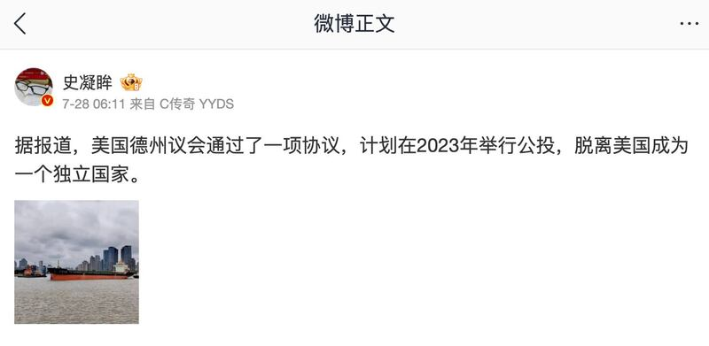
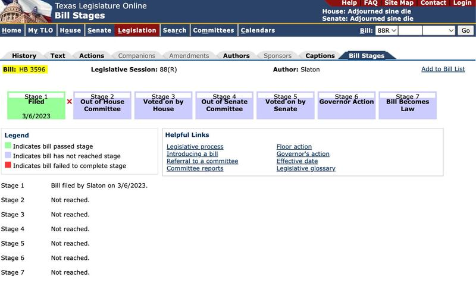
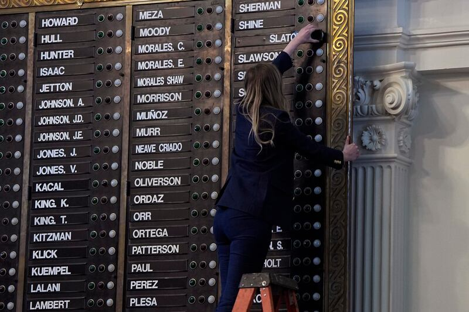

# 事實查覈｜美國德州將在十一月舉行獨立公投？

作者：董喆

2023.08.08 12:29 EDT

## 標籤：錯誤

## 一分鐘完讀：

近日，中國社羣平臺上廣傳一則傳言，稱美國德州將在11月舉行獨立公投，決定是否脫離美國成爲獨立國家。

亞洲事實查覈實驗室查證後發現，2023年3月，美國德州衆議員Bryan Slaton的確曾提案在11月7日公投，決定德州是否應該恢復其獨立國家地位。但該議案未能送出衆議院委員會（House Committee）。因此德州將舉行”獨立公投”是錯誤訊息。

## 深度分析：

微博大V"史凝眸"在微博擁有逾80萬粉絲,他在 [7月28日發帖](http://archive.today/efbga)稱"據報道,美國德州議會通過了一項協議,計劃在2023年舉行公投,脫離美國成爲一個獨立國家。"

微博大V“史凝眸”發帖稱美國德州將舉行獨立公投。 （圖／截取自微博）

這樣的說法迅速在微博發酵,直至8月初仍有不少微博大V跟進發帖,擁有近700萬微博粉絲的臺灣藝人黃安也 [發微博表示](http://archive.today/xbkJn),"支持德州脫離美國,獨立建國成功!"

Youtube與TikTok也出現相關影片，稱“美國德州要“獨立公投”，美國醞釀分裂！德克薩斯獨立公投時間已敲定！”，Youtuber“寒鋒時評”發表的影片“德州宣佈獨立公投，美國開始分裂”等等，獲得數萬次觀看。

社交媒體、視頻網站熱傳德州“獨立公投”的新聞。（圖/亞洲事實查覈實驗室製圖）

亞洲事實查覈實驗室搜尋發現，近期與所謂“獨立公投”相關的時間，或爲2023年3月6日共和黨德州衆議員Bryan Slaton提出的HB3596議案。

根據 [Fox News](https://www.foxnews.com/politics/texas-house-representative-introduces-bill-to-vote-on-secession#google_vignette)、 [Newsweek](https://www.newsweek.com/republicans-face-doomsday-bill-that-could-wreck-their-election-chances-1786112)、等媒體報道,衆議員Bryan Slaton提出的 [HB3596議案](https://capitol.texas.gov/tlodocs/88R/billtext/pdf/HB03596I.pdf#navpanes=0)又稱作"《德克薩斯獨立公投法案》(TEXIT)",該草案計劃在2023年11月7日的大選中進行全民公投,由選民決定是否支持德州恢復獨立國家地位。據Fox News當時的報導,這個議案在共和黨黨內也遭到了反對,同黨衆議員Jeff Leachy [在推特表達反對立場,](https://twitter.com/leachfortexas/status/1632835605645209600)他稱"Slaton違背了效忠美國國旗的就職宣言,而這個荒謬的法案虛僞且煽動叛國"。

衆議員Jeff Leachy在推特表達反對德州獨立法案的立場。 （圖／截取自推特）

至於HB3596議案的後續爲何?亞洲事實查覈實驗室透過 [Texas Legislature Online](https://capitol.texas.gov/BillLookup/BillStages.aspx?LegSess=88R&Bill=HB3596)查詢議案進度,發現此議案止步於提案階段,並未在第88會期送出衆議院委員會,此後再無進展。

HB3596議案止步於提案階段。 （圖／截取自Texas Legislature Online）

此外，該議案的提案人Slaton在提出HB3596議案後不久，便因性醜聞辭去議員職務，因此也不再可能進一步推動這項法案。

根據 [The Texas Tribune報導](https://www.texastribune.org/2023/05/09/bryan-slaton-expel-house-vote/),Bryan Slaton與一名19歲實習生飲酒併發生性關係,衆議院以147比0 的投票結果決定將Slaton開除,即便他在投票前一日遞交辭呈,Slaton仍成爲1927年以來第一位被免職的德州立法機構成員,空缺出來的席次將在2023年11月7日進行補選。

Bryan Slaton遭衆議院免職。 （圖／AP）

## 結論：

確實有德州衆議員Bryan Slaton於2023年3月6日提出HB3596議案，要求11月大選時以公投方式決定德州是否恢復獨立國家地位。但此議案的立法進程止步於提出階段，並未成功送出衆議院委員會，且提案人Bryan Slaton已因性醜聞下臺，不可能繼續推動。

因此，中國社交平臺上稱美國11月將舉辦德州獨立公投是錯誤資訊。

*亞洲事實查覈實驗室（Asia Fact Check Lab）是針對當今複雜媒體環境以及新興傳播生態而成立的新單位。我們本於新聞專業，提供正確的查覈報告及深度報道，期待讀者對公共議題獲得多元而全面的認識。讀者若對任何媒體及社交軟件傳播的信息有疑問，歡迎以電郵 [afcl@rfa.org](http://afcl@rfa.org)寄給亞洲事實查覈實驗室，由我們爲您查證覈實。*

[Original Source](https://www.rfa.org/mandarin/shishi-hecha/hc-08082023115430.html)