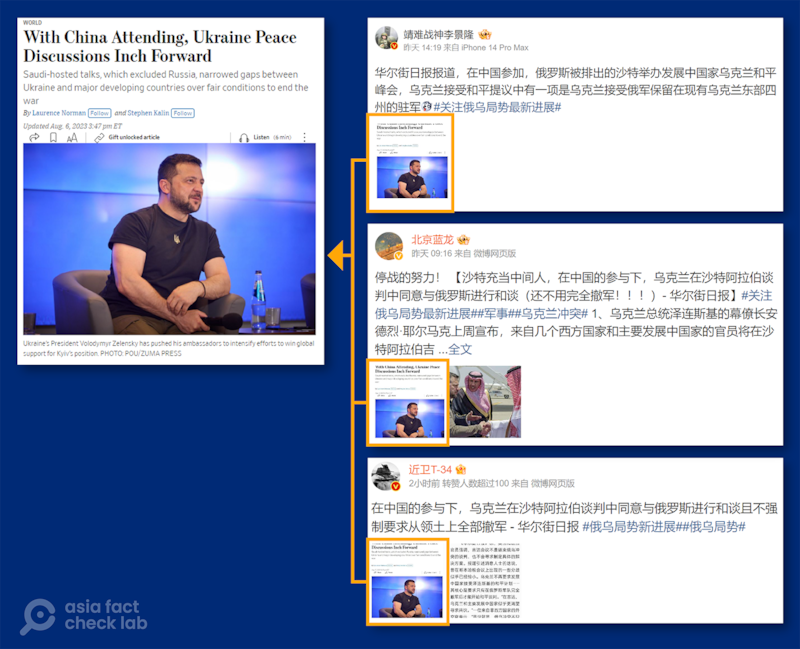

# 事實查覈｜烏克蘭同意與俄羅斯和談，且不要求撤軍？

作者：莊敬，發自臺灣

2023.08.09 11:16 EDT

## 標籤：錯誤

## 一分鐘完讀：

沙特阿拉伯舉行烏克蘭問題國際會談後，中國多個“大V”級微博主發文，稱“在中國的參與下，烏克蘭在沙特阿拉伯談判中同意與俄羅斯進行和談，且不強制要求從領土上全部撤軍”，並配上《華爾街日報》報道截圖。

但《華爾街日報》原報道內容是：烏克蘭稍早提出了一個和平計劃的版本，包括俄羅斯必須完全撤軍。這次烏方不再堅持其它與會國家接受這個方案，同時其它國家也不堅持要求基輔放棄和平計劃。部分大V用戶曲解了《華爾街日報》報道，散佈錯誤資訊。

## 深度解析：

8月5日至6日，沙特阿拉伯舉行了一場關於烏克蘭問題的國際會談，包括美國、中國、烏克蘭等42個國家的高級官員出席，俄羅斯則被排除在外。

亞洲事實查覈實驗室注意到,中國多位微博大V用戶近日發文,聲稱在中國的參與下,烏克蘭在"沙特會談"中同意與俄羅斯進行和談,且不強制要求從領土上全部撤軍;發佈者包括在微博擁有百萬粉絲的軍事博主 ["近衛T-34"](https://m.weibo.cn/detail/4932009593407414)、粉絲逾35萬的科學科普博主 ["北京藍龍"](https://m.weibo.cn/detail/4932029723185742)等用戶,且他們發文都附上《華爾街日報》一篇標題爲《中國出席沙特會談,烏克蘭和平討論取得進展》的報道截圖。

多位微博大V用戶針對沙特會談發文，聲稱在中國的參與下，烏克蘭在沙特阿拉伯中同意與俄羅斯進行和談，也不用俄國完全撤軍；他們的發文都配上一篇《華爾街日報》的報道。（圖取自微博、《華爾街日報》網站）

## 《華爾街日報》報道內容是什麼？

亞洲事實查覈實驗室檢視 [《華爾街日報》](https://cn.wsj.com/articles/%E4%B8%AD%E5%9B%BD%E5%87%BA%E5%B8%AD%E6%B2%99%E7%89%B9%E4%BC%9A%E8%B0%88-%E4%B9%8C%E5%85%8B%E5%85%B0%E5%92%8C%E5%B9%B3%E8%AE%A8%E8%AE%BA%E5%8F%96%E5%BE%97%E8%BF%9B%E5%B1%95-a1acb63f)報道全文,並未看到"烏克蘭同意與俄羅斯進行和談,且不強制要求從領土上全部撤軍"的有關表述。

報道中提及烏克蘭和平計劃、俄羅斯撤軍的內容主要有以下兩段：“外交官們表示，在哥本哈根出現的一些分歧似乎已經縮小。在上次會談中，烏克蘭曾力促主要發展中國家接受澤連斯基的和平計劃，這個計劃是以俄羅斯完全撤軍爲前提。但幾個發展中國家表示不接受烏方的方案。”

“而在吉達，烏克蘭和主要發展中國家似乎更希望達成共識。一位歐洲高級官員說，烏克蘭沒有再次敦促這些國家接受自己早先提出的和平計劃，其他國家亦未堅持要求基輔放棄該和平計劃。在烏克蘭要求俄羅斯撤軍的問題上也沒有出現任何口水戰。據兩位外交官說，烏克蘭沒有強調這一點，也沒有受到發展中國家的質疑。 ”

根據上述報道說明，這是烏克蘭和主要發展中國家爲達共識，而未強調自身立場或質疑對方，避免口水戰，並不代表烏克蘭放棄其和平計劃，甚至同意與俄羅斯和談。

有關烏克蘭的立場, [烏克蘭總統辦公室主任顧問波多利亞克](https://twitter.com/Podolyak_M/status/1688565014968385537)7日在推特發文表明,在目前的局勢下不可能有談判進程。

## 結論：

經檢視烏克蘭官方最新表態，以及《華爾街日報》相關報道，部分微博用戶所謂“烏克蘭在沙特會談中同意與俄羅斯進行和談，且不強制要求從領土上全部撤軍”的說法，爲錯誤資訊。

*亞洲事實查覈實驗室(* *Asia Fact Check Lab* *)是針對當今複雜媒體環境以及新興傳播生態而成立的新單位。我們本於新聞專業,提供正確的查覈報告及深度報道,期待讀者對公共議題獲得多元而全面的認識。讀者若對任何媒體及社交軟件傳播的信息有疑問,歡迎以電郵*  [*afcl@rfa.org*](http://afcl@rfa.org)  *寄給亞洲事實查覈實驗室,由我們爲您查證覈實。*

[Original Source](https://www.rfa.org/mandarin/shishi-hecha/hc-08092023111416.html)