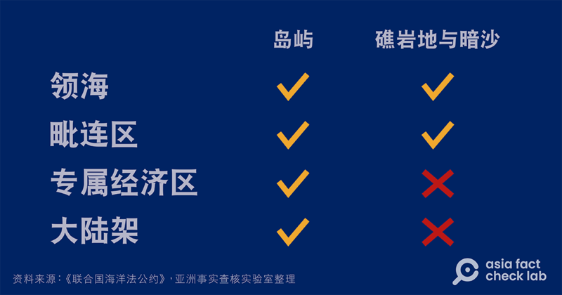
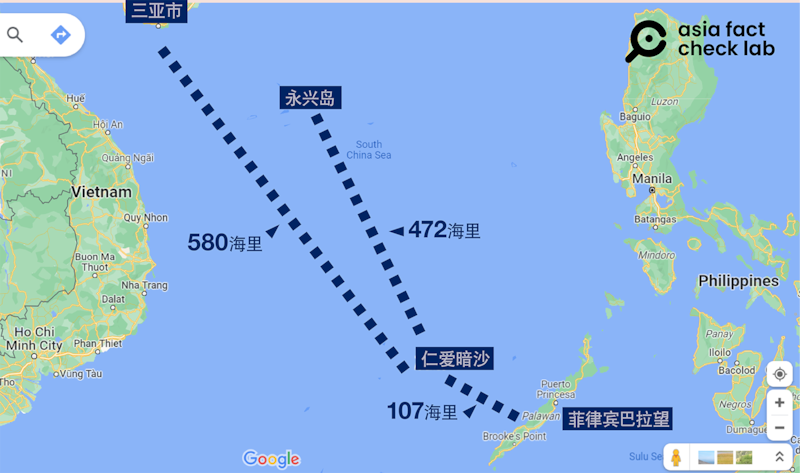

# 事實查覈 | 中國指控菲律賓"非法闖入、坐灘"仁愛礁有依據嗎？

作者：鄭崇生，發自華盛頓

2023.08.10 15:25 EDT

標籤：誤導

## 一分鐘完讀：

中國海警船8月5日以水炮攻擊菲律賓船隻後,海警局 [兩度發表](https://www.ccg.gov.cn/2023/hjyw_0806/2304.html) [聲明](https://www.ccg.gov.cn/2023/hjyw_0807/2305.html),指責菲律賓運補船與海警船"非法闖入"中國南沙羣島仁愛礁海域,更強調菲方的軍艦多年來"非法坐灘"仁愛礁,違反《南海各方行爲宣言》。

亞洲事實查覈實驗室發現，對於仁愛礁的地位，最近一份國際性權威文件是海牙國際常設仲裁法院（PCA）2016年基於《聯合國海洋法公約》做出的裁決。這份裁決認定菲律賓在仁愛礁享有專屬經濟區權利。因此中國關於仁愛礁的宣示，屬於單方面政治主張，以此指責菲方具有誤導性，也違背了國際仲裁法院的裁決。

## 深度分析：

1999年，菲律賓登陸艦馬德雷山號在仁愛礁（Second Thomas Shoal，菲律賓稱“愛尤銀礁”，Ayungin Shoal）擱淺至今，菲國派遣陸戰隊員看守，但軍艦日益風化殘破，生活環境極差，菲律賓需要靠定期運送物資補給，並加固破舊船體。

水炮攻擊事件後,菲律賓提出譴責中國,而中國方面,海警局與 [外交部](https://www.mfa.gov.cn/web/fyrbt_673021/202308/t20230807_11123319.shtml)則接連指責菲律賓故意不拖走廢棄軍艦,還運補建築物資維修軍艦,是"嚴重違反國際法和中國與東盟國家簽署的《南海各方行爲宣言》"。

南海主權爭議存在多年,周邊國家各有主張。2016年,海牙國際常設仲裁法院根據《聯合國海洋法公約》做出 [裁定:](https://pcacases.com/web/sendAttach/2086)美濟礁(Mischief Reef)與仁愛礁都位於菲律賓巴拉望島(Palawan)200海里內,認定菲律賓對這兩個礁地享有專屬經濟區權利。( [詳見](https://pcacases.com/web/sendAttach/2086):第六節,647-648,第259-260頁)

《聯合國海洋法公約》第121條載明，島嶼指四面環水並在高潮時高出水面、自然形成的陸地區域，而關於島、礁地、巖地與暗沙可享有的權利主張：

不同區域地形可享有的權利主張（亞洲事實查覈實驗室製圖）

國際海洋法學者、美國海軍戰爭學院斯托克頓國際法中心主席克拉斯卡(James Kraska)告訴亞洲事實查覈實驗室,根據 [《聯合國海洋法公約》](https://www.un.org/depts/los/convention_agreements/texts/unclos/unclos_e.pdf)第 60 條,菲律賓在仁愛暗沙上,享有包括建造人造島礁和管理建造、操作和使用以探勘、開發和其他經濟目的的設施和結構,"這是菲律賓的專屬權利,中國這次水炮攻擊菲律賓的物資運送船,纔是干涉菲律賓主權與管轄權的'國際不法行爲',菲律賓可以要求賠償,或採取法律上的反制措施。"

## 中國的九段線主張

海牙常設仲裁法院的 [裁決](https://pcacases.com/web/sendAttach/2086)中也指出,中國以"九段線"聲稱擁有南海主權的歷史主張,沒有根據。然而,中國從菲律賓提交南海仲裁以來就堅決反對,在仲裁結果公佈前與後也多次表態不接受仲裁結果,聲稱南海仲裁"廢紙一張"。

中國海警船以水炮攻擊菲律賓船艦已經不是第一次，攻擊的依據是不被國際仲裁法院認可的“九段線”主張。克拉斯卡認爲，中國使用更進一步的脅迫作法，是在法律程序中展現“明顯的惡意”。

中國至今沒有公佈在南海南沙羣島的領海基線,而亞洲事實查覈實驗室依照北京官方宣佈南海"西沙羣島"的 [領海基線](https://www.mfa.gov.cn/web/ziliao_674904/tytj_674911/tyfg_674913/200904/t20090409_9866755.shtml)標定來測算,就算認定中國主張西沙羣島面積最大、沒有淡水的永興島是島嶼,可享有公約下的島嶼權利主張,仁愛暗礁距離中國實際控制的永興島來也有約472海里(875公里)。

仁愛礁與永興島位置示意（亞洲事實查覈實驗室製圖）

如果依照海牙國際常設仲裁法院的裁定，中國事實上無權在此執法。但中國並不承認該裁定，依照單方面的“九段線”主張執法，因而與菲國發生多起衝突。

## 結論：

中國官方指責菲律賓在仁愛礁海域“非法坐攤”，依據是中方單方面認可的九段線。2016年，海牙國際常設仲裁法院的裁決不支持“九段線”，而是認定菲律賓在仁愛礁享有專屬經濟區權利。因此，中方的指責拒絕承認國際社會仲裁結果，屬於單方面政治主張，具有誤導性。

*亞洲事實查覈實驗室(* *Asia Fact Check Lab* *)是針對當今複雜媒體環境以及新興傳播生態而成立的新單位。我們本於新聞專業,提供正確的查覈報告及深度報道,期待讀者對公共議題獲得多元而全面的認識。讀者若對任何媒體及社交軟件傳播的信息有疑問,歡迎以電郵*  [*afcl@rfa.org*](http://afcl@rfa.org)  *寄給亞洲事實查覈實驗室,由我們爲您查證覈實。*

[Original Source](https://www.rfa.org/mandarin/shishi-hecha/hc-08102023151831.html)