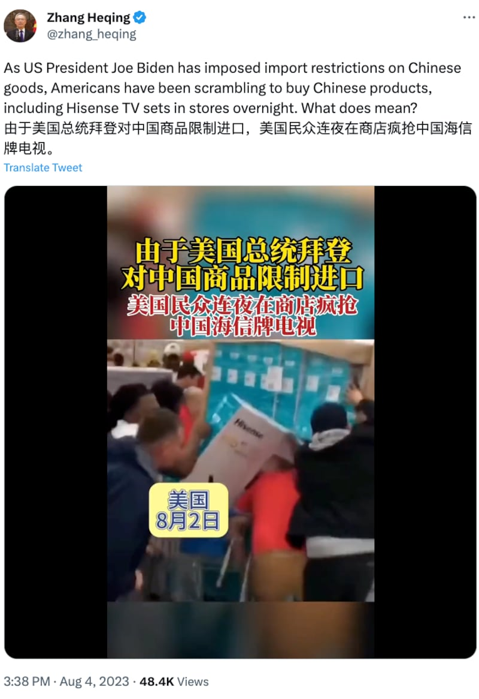
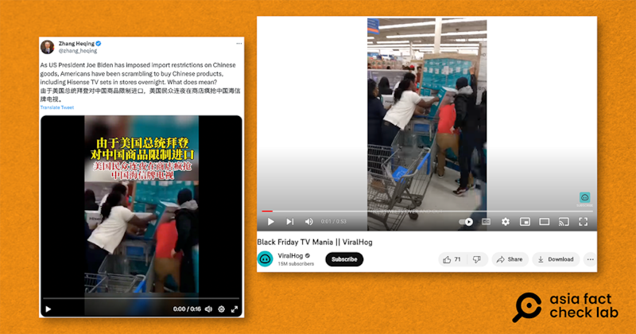
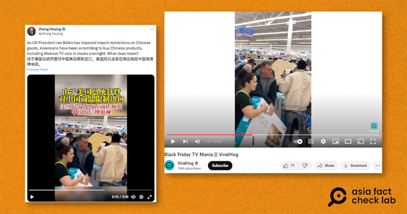
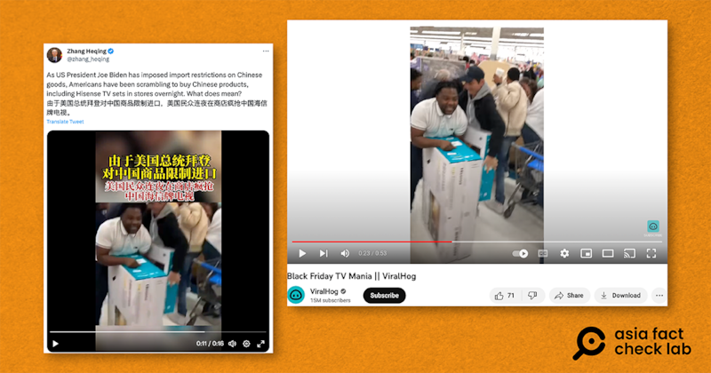

# 事實查覈｜因拜登限制進口中國商品 美國人瘋搶中國品牌電視？

作者：莊敬，發自臺灣

2023.08.11 14:00 EDT

## 標籤：錯誤

## 一分鐘完讀：

中國外交官張和清近日在推特發佈一段短視頻，畫面是人們在商店瘋搶中國海信牌電視，字幕寫着："由於美國總統拜登對中國商品限制進口，美國民衆連夜在商店瘋搶中國海信牌電視"。

經查，這段視頻在2018年11月即出現在網上，根據視頻介紹，這是美國路易斯安那州一家商店的"黑色星期五"購物活動。張和清的推文爲錯誤資訊。

## 深度解析：

中國駐巴基斯坦大使館文化參贊張和清8月4日在推特發佈一段 [14秒的短視頻](https://twitter.com/zhang_heqing/status/1687367411383611393),拍攝地點看似一座電器商場,多位民衆扯下原本排好的全新電視機,導致最上層的數個電視機落下,過程中有民衆推擠。電視機外包裝寫着Hisense,爲中國產海信牌電視。

張和清的推文和視頻字幕都寫着“由於美國總統拜登對中國商品限制進口，美國民衆連夜在商店瘋搶中國海信牌電視”，視頻字幕還有其它資訊，包括“美國8月2日” “民衆因無法用優惠券購買中國產電視導致哄搶”等。

中國外交官張和清8月4日在社媒發佈短視頻，稱由於美國總統拜登對中國商品限制進口，美國民衆連夜在商店瘋搶中國海信牌電視。（推特截圖）

亞洲事實查覈實驗室注意到這段影片中,除了民衆搶購海信牌電視,後方也可見許多民衆和其它商品,疑似爲商店的購物活動,即以知名的購物節"黑色星期五"(Black Friday)、電視等英文關鍵字在網上搜尋,找到Youtube頻道"ViralHog"在2018年11月22日發佈一段 [53秒的視頻](https://www.youtube.com/watch?v=b8wW8H6VH-U);經比對,兩個視頻中多處畫面、人物一樣,唯視頻長度不同。

左圖爲中國外交官張和清今年8月4日在社媒發佈的視頻畫面，右圖爲Youtube頻道“ViralHog”於2018年11月22日發佈的視頻畫面。圖取自推特、Youtube

左圖爲中國外交官張和清今年8月4日在社媒發佈的視頻畫面，右圖爲Youtube頻道“ViralHog”於2018年11月22日發佈的視頻畫面。圖取自推特、Youtube

左圖爲中國外交官張和清今年8月4日在社媒發佈的視頻畫面，右圖爲Youtube頻道“ViralHog”於2018年11月22日發佈的視頻畫面。圖取自推特、Youtube

根據“ViralHog”的視頻介紹，哄搶事件發生於2018年11月22日，美國路易斯安那州一家商店的“黑色星期五”活動中。在美國，“黑色星期五”指的是感恩節假期過後的第一個星期五，許多賣場、百貨公司會在感恩節假期推出特惠拍賣活動。

檢視最近美國對中國的貿易政策,6月,拜登政府 [決定繼續前屆特朗普政府制定的較嚴苛的對華關稅政策](https://www.npr.org/2023/06/27/1184027892/china-tariffs-biden-trump),對進口確實不是利好消息,然而,該項政策已經執行數年,其具體內容也並無對電視類產品"限制進口"。

*亞洲事實查覈實驗室(* *Asia Fact Check Lab* *)是針對當今複雜媒體環境以及新興傳播生態而成立的新單位。我們本於新聞專業,提供正確的查覈報告及深度報道,期待讀者對公共議題獲得多元而全面的認識。讀者若對任何媒體及社交軟件傳播的信息有疑問,歡迎以電郵* *afcl@rfa.org* *寄給亞洲事實查覈實驗室,由我們爲您查證覈實。*

*（更新內容：最後一段文字刪除了原稿中的一個句子）*

[Original Source](https://www.rfa.org/mandarin/shishi-hecha/hc-08112023135115.html)