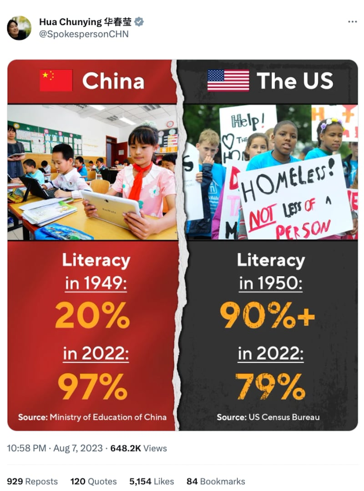

# 事實查覈｜美國文盲比例比七十年前還高了很多？

作者：莊敬，發自臺灣

2023.08.14 17:04 EDT

## 標籤：誤導

## 一分鐘完讀：

中國外交部發言人華春瑩近日在社媒X（原推特）發佈中美識字率對比圖，指美國人的識字率在1950年超過90%，2022年則降到79%。圖片顯示數據來源爲美國普查局。但經查覈，美國普查局早已不統計識字率，成年人讀寫能力的相關統計由美國教育部國家教育統計中心承擔，統計標準也與上世紀五十年代的識字率/文盲率統計不同，也與中國的脫盲率統計完全不一樣，華春瑩把不同統計標準的數據放在同一圖卡相比，可能誤導受衆。

## 深度解析：

中國外交部發言人華春瑩常在社媒發佈中美對比圖。8月7日,她 [發了一張中美識字率(literacy)對比圖](https://twitter.com/SpokespersonCHN/status/1688565373153759232),圖片上顯示美方數據來源是美國普查局,指美國識字率在1950年超過90%,2022年卻跌至79%;而對比圖上也呈現了中國教育部的數據——中國識字率在1949年爲20%,在2022年爲97%。這張對比圖經許多網民轉發,幾位大V級微博主的配文稱中國進步巨大,而美國則嚴重倒退。

中國外交部發言人華春瑩在社媒發佈中美識字率對比圖。圖取自X（原推特）

## 美國識字率數據來源、年份有誤

1950年代美國對於識字率(literacy)的統計,是通過文盲率(illiteracy)來計算的,亞洲事實查覈實驗室在網上搜尋"美國普查局""1950",即找到美國普查局1950年發佈 [各州文盲人數的估計報告](https://www2.census.gov/library/publications/1959/demographics/p23-006.pdf),14歲以上的文盲比率約在三分之二州低於3%,在所有州低於10%。

但以上述同樣方式搜尋，未能找到由美國普查局發佈的2022年文盲率數據。亞洲事實查覈實驗室即向美國普查局查證，普查局公衆資訊辦公室的克里斯蒂娜·巴雷特（Kristina Barrett）回覆表示，普查局已不再追蹤美國的文盲率，大衆讀寫能力相關的統計業務由美國教育部國家教育統計中心負責。

在美國教育部國家教育統計中心網站上,也不再有文盲率的統計,但2022年發佈的 [美國成人低讀寫和算數能力報告](https://nces.ed.gov/pubs2022/2022004/),基於"國際成人能力評估方案"比較了2010年代的兩個時間點(即2012/2014和2017年)美國成年人的讀寫能力和算數技能。這份報告指出,在2012/2014年,21%美國成人英語讀寫技能低,到了2017年,23%美國成人英語讀寫技能低。華春瑩發佈圖片中79%的數字可由2012/2014年的數據推算出來。

報告雖是2022年發佈，但其中最新數據爲2017年，且執行單位也並非華春瑩圖卡上所寫的美國普查局。更重要的是，這份報告與1950年普查局的估計報告，兩者調查的條件和對象不同。

## 中美識字率 調查條件差異大

["國際成人能力評估方案"(PIAAC)](https://www.oecd.org/skills/piaac/Brochure_Survey%20of%20Adult%20Skills_Chinese.pdf)是經濟合作與發展組織(OECD)一項針對成年人(16至65歲)的大規模國際調查,旨在評估成年人的讀寫技能、算數技能、在技術要求高的環境中解決問題的技能。其對於文字能力的定義爲"理解、評價、使用和處理書面文本以參與社會、實現個人目標以及發展個人知識和潛能的能力"。

這個評估不能直接對應1950年美國普查局對識字率/文盲率的統計。根據美國普查局1950年的文盲人數估計報告，文盲定義爲無法以英語或任何其它語言讀寫，統計對象爲14歲及以上的人口。

至於中國識字率的數據,根據中國教育部今年 [6月記者會](https://news.eol.cn/meeting/202206/t20220628_2234576.shtml),文盲率(15歲以上不識字人口占比)下降至2.67%。另據 [《掃除文盲工作條例》](https://www.gov.cn/zhengce/2020-12/25/content_5573970.htm),個人脫盲的標準是:農民識1500個漢字,企業和事業單位職工、城鎮居民識2000個漢字;能夠看懂淺顯通俗的報刊、文章,能夠記簡單的帳目,能夠書寫簡單的應用文。

上述中、美識字率的調查，其受訪者年齡、對識字與否的定義等條件都不相同。對於華春瑩的中美識字率對比圖是否可能誤導受衆，巴雷特表示，理想情況下是相比類似的報告，但這有時對於歷史記錄而言很困難，會需要一名統計學家查看每份報告並比較方法，以及記錄報告中的任何差異，並解釋這些差異。

## 2023/8/16 更新

1. 本文刊出後，我們收到了美國教育部提供背景說明如下：

美國1950年的識字率數據和PIAAC評估美國2010年代的識字率，兩者對識字的定義不同，且基於不同數據來源，無法直接比較。而中國並非PIAAC的參與國家，所以也無法以PIAAC的識字率評量方式進行比較。

2. 由於美國教育部已經提供背景說明，因此我們刪除了原報道第三段最後一句：“亞洲事實查覈實驗室也詢問了美國教育部國家教育統計中心，截稿前尚未獲回覆”。

*亞洲事實查覈實驗室（Asia Fact Check Lab）是針對當今複雜媒體環境以及新興傳播生態而成立的新單位。我們本於新聞專業，提供正確的查覈報告及深度報道，期待讀者對公共議題獲得多元而全面的認識。讀者若對任何媒體及社交軟件傳播的信息有疑問，歡迎以電郵afcl@rfa.org寄給亞洲事實查覈實驗室，由我們爲您查證覈實。*

[Original Source](https://www.rfa.org/mandarin/shishi-hecha/hc-08142023165941.html)