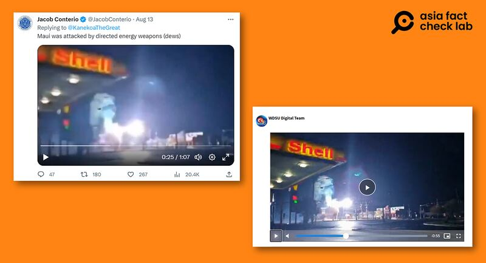
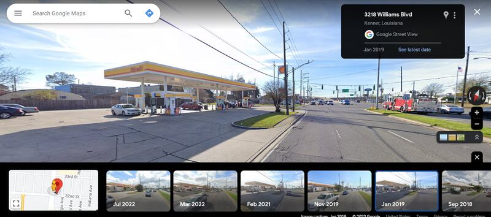
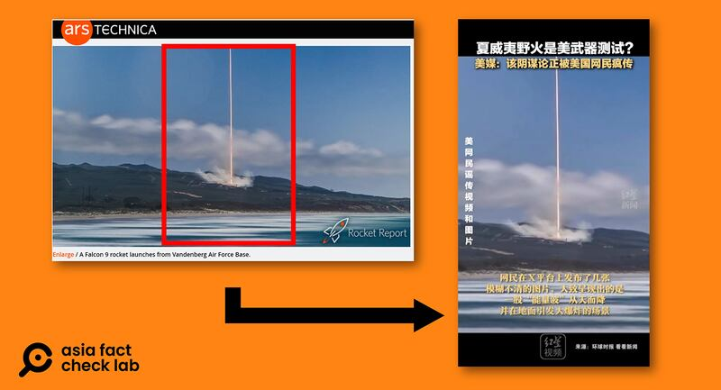
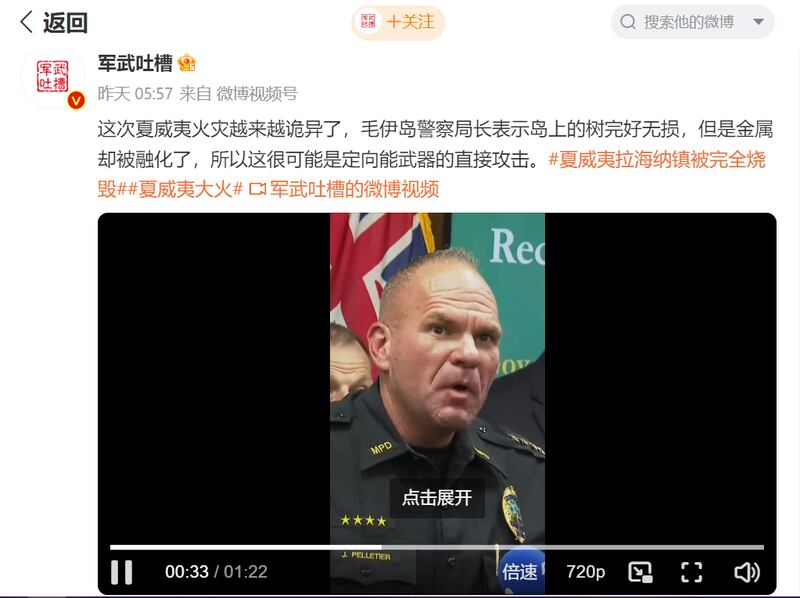

# 事實查覈｜"定向能量武器試驗"造成夏威夷毛伊島火災的"證據影片"是真的嗎？

作者：鄭崇生，發自華盛頓

2023.08.16 16:48 EDT

## 標籤：錯誤

## 一分鐘完讀：

美國夏威夷毛伊島（Maui，又譯茂宜島）發生百年以來最嚴重的火災，截至目前死亡人數已經過百，且還在持續上升。災情發生後，美國軍方試驗定向能量武器（directed energy weapons）造成火災的說法開始在社交媒體上流傳，並有各種“證據視頻”作爲依據。

亞洲事實查覈實驗室發現,這些**"**證據視頻",有的是多年前發生在美國其他地方的災難現場;有的套用了火箭發射現場照片;還有的截取新聞視頻中的當地官員發言場景,但翻譯後的內容與原內容完全不相關。無論中、英文平臺,宣稱這些視頻是美國武器試驗造成大火的證據,是完全錯誤的。

## 深度分析：

8月13日,社媒平臺X(原推特)上署名Jacob Conterio的賬號 [發文](https://twitter.com/JacobConterio/status/1690810795733741568?s=20)寫到:"毛伊島遭定向能量武器攻擊了",並附上一段長約1分7秒的模糊視頻。

經查覈，這段視頻中的場景並非發生在夏威夷，是由一段位於路易斯安那州的風災事故舊視頻編輯而成。2018年12月28日，美國路易斯安那州肯納市（kenner）出現瞬間強風天氣，導致當地電力設施倒塌損毀，引發火光與電流爆炸聲。如下圖所示，左圖是來自Jacob Conterio的視頻約25秒處，右圖則是當地電視臺WDSU網站當時的報導（影片約33秒處），從包括左上角的殼牌石油（Shell）招牌到對照圖片中間的兩團火光，兩段視頻中的場景極爲相似。

網傳視頻截圖和路易斯安那風災事故報道視頻截圖對比 圖截取自X平臺和WDSU網站

根據WDSU [報道](https://www.wdsu.com/article/dramatic-video-shows-electrical-explosions-in-kenner/25702762)中的地址,谷歌地圖顯示當地街景(2019年)也與視頻相符。

谷歌地圖顯示的當地街景 圖截取自谷歌地圖

對照上述這兩個視頻，來自Jacob Conterio影像顯得較爲模糊，亞洲事實查覈實驗室進一步通過由法國博雷利中心（Borelli Center）及法新社媒體實驗室（AFP MediaLab ）支持研發的視覺鑑別工具InVID平臺查覈，發現這可能是經過局部放大裁切，導致影像些許壓縮變形所致。

這一次夏威夷火災在中文世界也引發了一系列"定量武器引發大火"的信息傳播和演繹,比如,紅星新聞等媒體將美國 [SpaceX火箭發射](https://arstechnica.com/science/2019/04/rocket-report-darpa-picks-three-aerojet-short-seller-starlink-launch-date/)的照片挪用爲闡釋該事件的新聞圖片。

火箭發射照片（左）被紅星新聞視頻號（右）挪用爲新聞圖片 圖截取自arsTECHNICA及紅星視頻號

新浪微博認證的熱門 [軍事博主](https://weibo.com/u/7467004060)"軍武吐槽"14日上傳一段視頻並稱:"這次夏威夷火災越來越詭異了,毛伊島警察局長表示島上的樹完好無損,但是金屬卻被融化了,所以這很可能是定向能武器的直接攻擊。"

“軍武吐槽”挪用警察局長髮言視頻截圖 圖截取自微博

然而,亞洲事實查覈實驗室發現,這段視頻從影片人物所處角度到手機直式視頻的呈現方式,都和英國天空新聞臺(Sky News)TikTok官方賬號上的 [內容](https://www.tiktok.com/@skynews/video/7266723624164396320)一樣。 該視頻是12日毛伊郡警察局長佩爾蒂埃(John Pelletier)在記者會上的談話,這場記者會 [路透社](https://www.washingtonpost.com/video/national/maui-police-chief-asks-for-patience-in-victim-identification/2023/08/12/517809d8-be8b-4631-9635-f654c3499b60_video.html)、 [毛伊島當地電視臺](https://www.youtube.com/watch?v=P11bGwCRQYY)等媒體也有報道。在談話中,佩爾蒂埃並沒有提到"定向能量武器",他是在解釋搜救與辨識遇難者的善後工作難度高,希望美國輿論在批評當地救災速度緩慢混亂之餘,能配合並給第一線工作人員多些時間。

“軍武吐槽”引用的視頻中，佩爾蒂埃確實有提到“融化的金屬”，意在強調火災威力之大，造成遺骸認定的困難。其原文是“the remains we're finding is through a fire that melted metal，we have to do rapid DNA to identify them”（這場大火足以熔化金屬，而我們在其中尋找遺骸，必須通過快速DNA檢測來確認他們的身份）。因此，所謂“夏威夷警方認爲這很可能是定向能武器攻擊”的說法，是錯誤的。

毛伊島火災發生的原因目前還不確定, [美聯社](https://apnews.com/article/live-updates-maui-fire-hawaii-wildfire-162a9fcdefe648d6bcd6557af70d894f)引述專家分析,強風加上低溼度的環境,助長野火。 [《紐約時報》](https://www.nytimes.com/2023/08/10/us/maui-wildfires-hawaii.html?_ga=2.233215582.171422323.1692127917-1674928484.1692127917)則引述專家指出,災情也可能是強風吹落的電線、引發野火所致。

*亞洲事實查覈實驗室(Asia Fact Check Lab)是針對當今複雜媒體環境以及新興傳播生態而成立的新單位。我們本於新聞專業,提供正確的查覈報告及深度報道,期待讀者對公共議題獲得多元而全面的認識。讀者若對任何媒體及社交軟件傳播的信息有疑問,歡迎以電郵* *afcl@rfa.org* *寄給亞洲事實查覈實驗室,由我們爲您查證覈實。*

[Original Source](https://www.rfa.org/mandarin/shishi-hecha/hc-08162023164050.html)