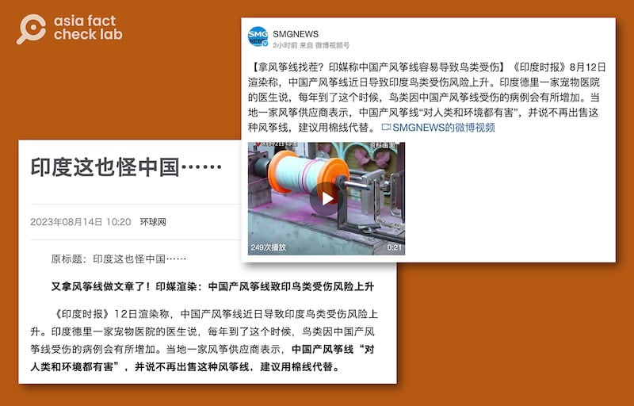

# 事實查覈｜印度禁止"中國風箏線"是反華嗎？

作者：董喆，發自臺灣

2023.08.17 16:26 EDT

## 標籤：錯誤

## 一分鐘完讀：

中國社羣平臺8月14日起廣傳一則信息：“印度又拿風箏線做文章”，稱印度媒體集體用禁中國風箏線操弄反華議題，《看看新聞》相關短視頻更登上抖音熱榜，達數百萬次觀看。

亞洲事實查覈實驗室查到印度國家綠色法庭文件，印度政府明令禁止的是“中國式風箏線”（Chinese Manjha），因其鋒利度可傷人，且不可分解性影響生態環境，文件也說明，“中國式風箏線”泛指使用尼龍材質的風箏線，其得名因原料聚乙烯多進口於中國，並非指在中國生產的風箏線。因此，中國官媒與社媒聲稱印度禁止“中國產風箏線”，並且是“反華”行爲，屬於錯誤資訊。

## 深度分析：

8月15日是印度獨立日，紀念1947年擺脫英國統治成爲主權國家。這一天，印度民衆的傳統是放風箏慶賀。但獨立日前夕，中國官方媒體和社交媒體開始流傳“印度又拿風箏線做文章”來“反華”的消息。

可追蹤到最早的消息是環球網稱：“又拿風箏線做文章了！印媒渲染：中國產風箏線致印鳥類受傷風險上升”，上海廣播電視臺融媒體中心也在微博發表相同主題視頻，稱印度“拿風箏線找茬” 。

環球網、上海文廣等媒體截圖，稱印度在"拿風箏線做文章"。

隨後，大量類似語句的帖子開始在各大社羣平臺上傳散，微博、抖音網友嘲諷“風箏線也要納入大規模殺傷性武器行列了”“禁售中國風箏線，理由是傷鳥又傷人，印度學美反華最後傷到自己！”

認證微博用戶截圖（亞洲事實查覈實驗室製圖）

其中“看看新聞”的抖音號視頻傳播甚廣，該帳號以“安全問題頻發就拿風箏線找碴”爲題，收穫超過數百萬次觀看，更登上熱榜。中國官方媒體“通傳媒”也將這條視頻發至社媒平臺X(原推特)。

"看看新聞"的抖音號以"安全問題頻發就拿風箏線找碴"爲題，收穫數百萬次觀看，更登上熱榜。 （"看看新聞"抖音號截圖）

## 印度禁風箏線說法何來？

中國官媒與社媒相關帖文中提到消息來源是《印度時報》(The Times of India),亞洲事實查覈實驗室找到,印度時報確實在8月14日發出報道,標題爲《 [Freedom curtailed: Kites soar in sky, birds grounded with injuries](http://archive.today/X74jG)》(被限制的自由:風箏高飛空中,鳥類受傷落地)。另一篇被中國官媒點名的則是《印度經濟時報》(The Economic Times)於8月13日的報道 [Birds at high risk of sustaining injuries due to Chinese 'manjha' strings](http://archive.today/bwqbY)(因中國式風箏線,鳥類受傷風險很高)。

兩篇報導皆提及“Chinese Manjha”，並稱這種尼龍材質的風箏線造成許多鳥類傷亡，儘管印度政府於2017年禁止銷售，仍有民衆私下使用，他們預估，今年的獨立日慶祝期間，鳥類傷亡數字將會增加。

## 什麼是Chinese Manjha?

亞洲事實查覈實驗室發現,《 [印度時報](https://timesofindia.indiatimes.com/topic/manjha/3)》、《 [印度經濟時報](https://economictimes.indiatimes.com/topic/manjha)》、《 [印度今日商業](http://archive.today/8FoK9)》(Business Today)、《 [印度快報](http://archive.today/HdHVF)》(The Indian Expres)和《 [印度教徒報](http://archive.today/tNAAh)》(The Hindu)等主流大型媒體皆有"Chinese Manjha"相關報道。

綜合多家報道，Chinese Manjha指的是尼龍材質的風箏線，因爲較傳統棉製風箏線鋒利，在“割風箏”的對戰中更容易取得勝利，加上成本較棉線便宜而受民衆歡迎。但使用這種風箏線卻引起了多起民衆被割傷、甚至致死的意外，以及大量鳥類遭割傷事件。因此，印度各邦陸續禁止民衆販售並使用Chinese Manjha。印度國家綠色法庭（NGT）更在2017年明令禁止印度販售、使用Chinese Manjha。

亞洲事實查覈實驗找到綠色法庭2017年的 [判決書](http://archive.today/31Mni),113頁的文件中詳列法案提倡者、反對意見以及綠色法庭的最終裁決。

裁決書中多個段落提到，“Chinese Manjha”是爲了與“棉質風箏線（Cotton manjha）”做出區別。第33頁提到，“Chinese Manjha”只是代指尼龍、合成、金屬風箏線等。第30頁則直接陳述“Chinese Manjha用於指代尼龍和合成線，但與中國無關，並不特指在中國製造的，或是從中國進口的風箏線。這種產品在印度製造、供應、分發和使用。因此，Chinese Manjha是一個用於指稱這種飛行風箏線的術語。”

因此對“Chinese Manjha”的恰當的中文翻譯應爲“中國式風箏線”，而不是如媒體標題中的“中國產風箏線”。

印度國家綠色法庭稱在"Chinese Majha"只是一個術語（NGT判決書截圖）

《印度教徒報》2023年的 [報道指出](http://archive.today/tNAAh),儘管Chinese Manjha在印度當地製造,但因爲其主要成分來自中國,因此被稱作Chinese Manjha或是Chemical Manjha。

曾獲得CPJ國際新聞自由獎的印度媒體"Scroll.in"在 [2016年的報道](http://archive.today/Ab2r4)中也提過,"這種線之所以被稱爲Chinese manjha,是因爲它的主要成分——聚丙烯——大部分是從中國和臺灣進口的。"該報導更引述班加羅爾風箏線製造商Mohit Kartikeyan的說法,"Chinese manjha都是本地生產,這更多是一種營銷伎倆,人們購買時會認爲這是進口產品"。

亞洲事實查覈實驗室與印度風箏線業者“Manjha Kite Wale”取得聯繫，他也告訴我們，中國式風箏線（Chinese Manjha）得名是因爲其原料從中國進口，但他也補充的確有部分的尼龍風箏線從中國進口，但尼龍風箏線本身是非法的。

*亞洲事實查覈實驗室（Asia Fact Check Lab）是針對當今複雜媒體環境以及新興傳播生態而成立的新單位。我們本於新聞專業，提供正確的查覈報告及深度報道，期待讀者對公共議題獲得多元而全面的認識。讀者若對任何媒體及社交軟件傳播的信息有疑問，歡迎以電郵afcl@rfa.org寄給亞洲事實查覈實驗室，由我們爲您查證覈實。*

[Original Source](https://www.rfa.org/mandarin/shishi-hecha/hc-08172023161903.html)