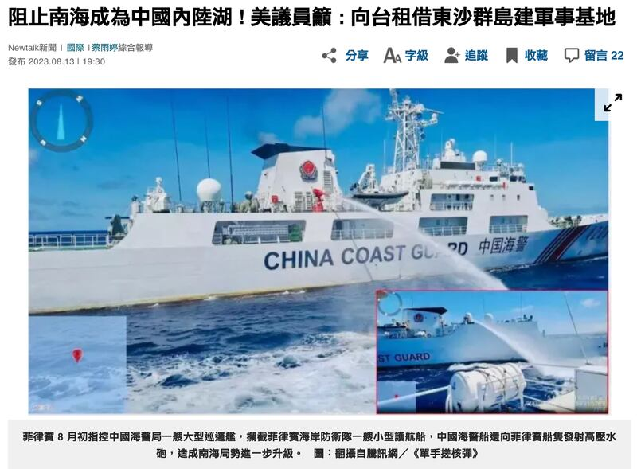
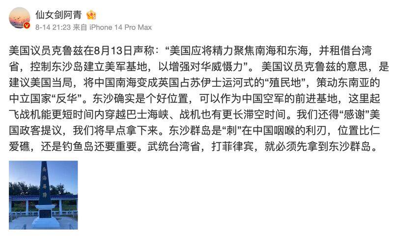
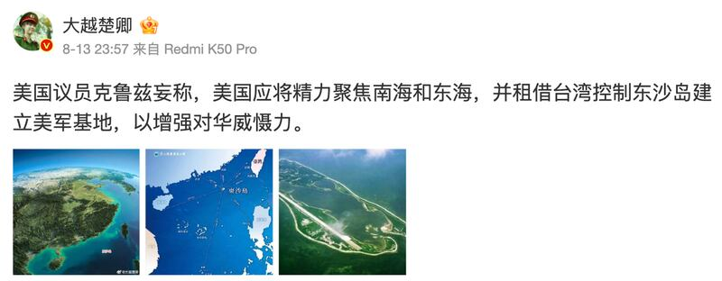

# 事實查覈｜參議員呼籲美國租借東沙島建軍事基地？

作者：莊敬，發自臺灣

2023.08.18 14:43 EDT

## 標籤：錯誤

## 一分鐘完讀：

臺灣的“Newtalk新聞”近日發佈報道《阻止南海成爲中國內陸湖 ! 美議員籲：向臺租借東沙羣島建軍事基地》，被“Yahoo!新聞”“LINE TODAY”等多家平臺轉載，並引發在中國微博等社交媒體上的討論，有用戶發文指：美國議員克魯茲“妄稱”美國應向臺灣租借東沙島建立美軍基地。

經查，美國參議員克魯茲（Ted Cruz）的前顧問雷夫金（Boris Ryvkin）投書英媒《每日電訊報》提出上述主張，而雷夫金並非議員。因此“Newtalk新聞”該篇報道標題有誤，幾位中國博主的發文也是錯誤資訊。

## 深度解析：

臺灣的“Newtalk新聞”8月13日發佈報道，標題稱美議員籲向臺租借東沙羣島建軍事基地，但內文寫的是，美議員的前顧問投書提出呼籲。（“Newtalk新聞”網站截圖）

臺灣的"Newtalk新聞"8月13日發佈 [《阻止南海成爲中國內陸湖 ! 美議員籲 : 向臺租借東沙羣島建軍事基地》](https://newtalk.tw/news/view/2023-08-13/883970)報道,隨即經臺灣人經常使用的新聞與資訊平臺 ["Yahoo!新聞"](https://tw.stock.yahoo.com/news/%E9%98%BB%E6%AD%A2%E5%8D%97%E6%B5%B7%E6%88%90%E7%82%BA%E4%B8%AD%E5%9C%8B%E5%85%A7%E9%99%B8%E6%B9%96-%E7%BE%8E%E8%AD%B0%E5%93%A1%E7%B1%B2-%E5%90%91%E5%8F%B0%E7%A7%9F%E5%80%9F%E6%9D%B1%E6%B2%99%E7%BE%A4%E5%B3%B6%E5%BB%BA%E8%BB%8D%E4%BA%8B%E5%9F%BA%E5%9C%B0-113010877.html)、" [LINE Today"](https://today.line.me/tw/v2/comment/article/1DqGvYB)轉載;截至8月15日,"LINE TODAY"的報道下有超過370則留言,其中部分網民留言質疑美國議員提出此呼籲的動機。

但其實這篇報道的內文指出,是美國共和黨參議員克魯茲(Ted Cruz)的前顧問 [雷夫金(Boris Ryvkin)11 日投書英國《每日電訊報》](https://www.telegraph.co.uk/news/2023/08/11/us-china-south-sea-conflict-defense-base-trade-taiwan/),呼籲美國應將注意力集中在南海和東海,更應與臺灣商談,長期租借東沙羣島並建立基地,增強臺灣對北京的威懾力。

根據雷夫金在 [領英](https://www.linkedin.com/in/boris-ryvkin-28191213/)的介紹,他自2017年3月擔任克魯茲的國安顧問,於2017年10月離任,現任職於私人企業。雷夫金並非議員,"Newtalk新聞"報道的標題有誤,而此錯誤標題也誤導了一些新聞評論和社會輿論。

如臺灣的TVBS電視臺新聞節目 ["新聞大白話"](https://www.youtube.com/watch?v=aC1pFBRWlM4)引用了"Newtalk新聞"的標題,主持人說:"爲了阻止南海成爲中國的內陸湖,美國議員天馬行空想了一個方法,說要跟臺灣租借東沙羣島建軍事基地"、"美國議員提出這個相關提議之後,你(臺灣政府)要趕快表態呀"。

臺灣的新聞節目引用“Newtalk”有誤的報道標題，稱美國議員提出要向臺灣租借東沙羣島建軍事基地。（Youtube截圖）

另在中國微博上，有認證用戶直指“美國議員克魯茲在8月13日聲稱：美國應將精力聚焦南海和東海，並租借臺灣省，控制東沙島建立美軍基地，以增強對華威懾力。”發文沒有引述來源或轉載任何報道，但內容符合雷夫金投書所提出的呼籲。

部分微博主發文稱，美國議員克魯茲妄稱，美國應向臺灣租借東沙島建立美軍基地。（微博截圖）

亞洲事實查覈實驗室以克魯茲全名、東沙島、臺灣等英文關鍵字搜尋，並未看到克魯茲近期有相關發言，搜尋結果顯示多爲克魯茲“前顧問”，也就是雷夫金的投書內容。

亞洲事實查覈實驗室透過電郵向克魯茲辦公室查覈，至截稿前尚未獲回覆。

*亞洲事實查覈實驗室(* *Asia Fact Check Lab* *)是針對當今複雜媒體環境以及新興傳播生態而成立的新單位。我們本於新聞專業,提供正確的查覈報告及深度報道,期待讀者對公共議題獲得多元而全面的認識。讀者若對任何媒體及社交軟件傳播的信息有疑問,歡迎以電郵* *afcl@rfa.org* *寄給亞洲事實查覈實驗室,由我們爲您查證覈實。*

[Original Source](https://www.rfa.org/mandarin/shishi-hecha/hc-08182023142909.html)