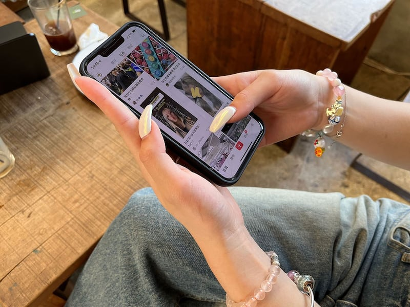
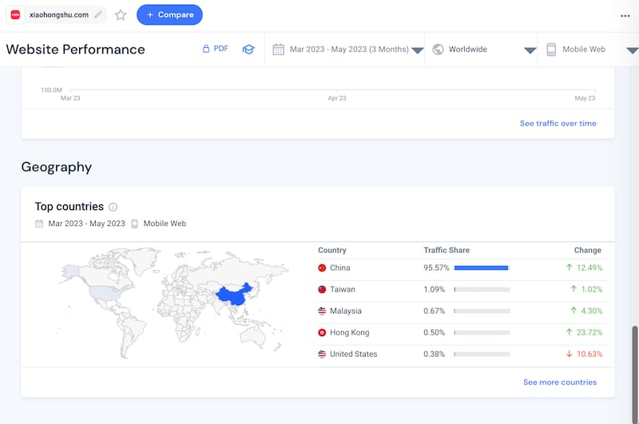
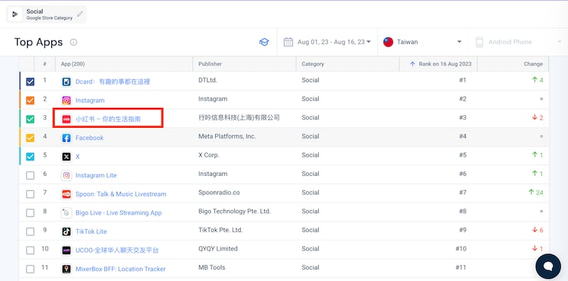
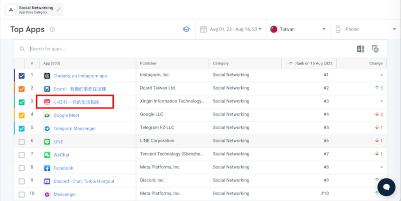
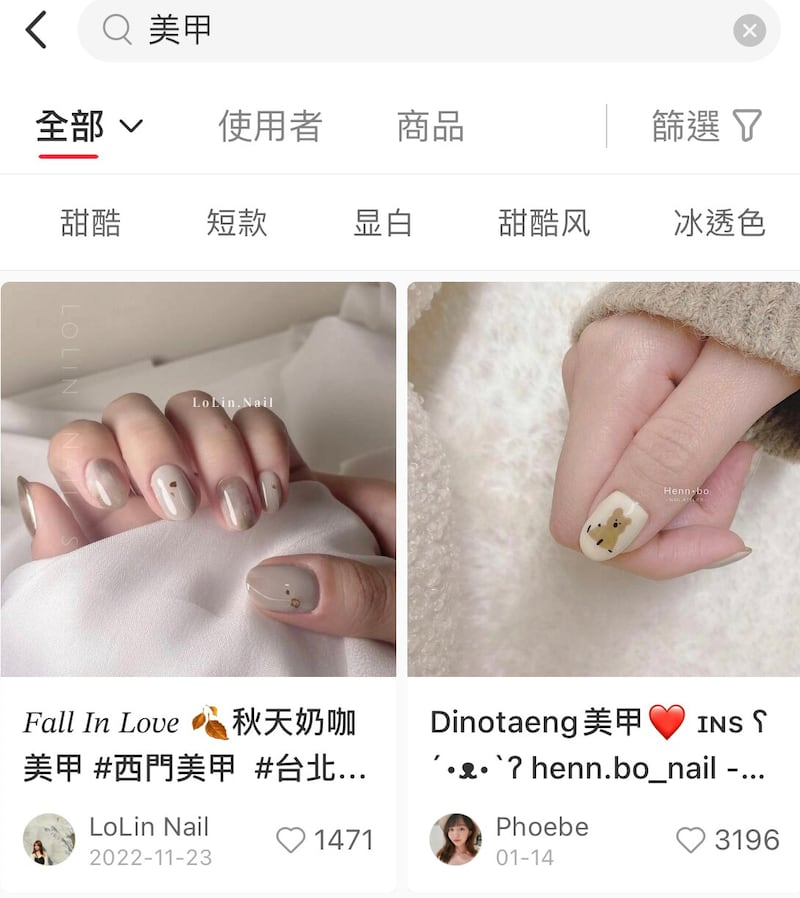
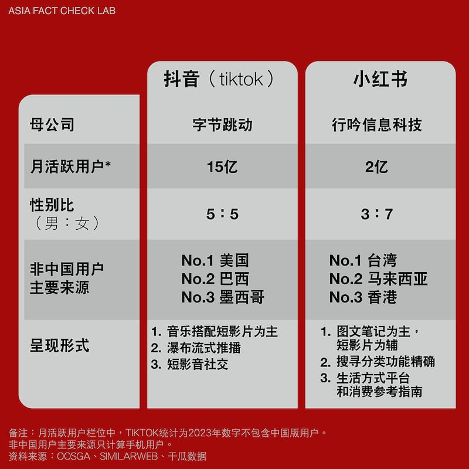
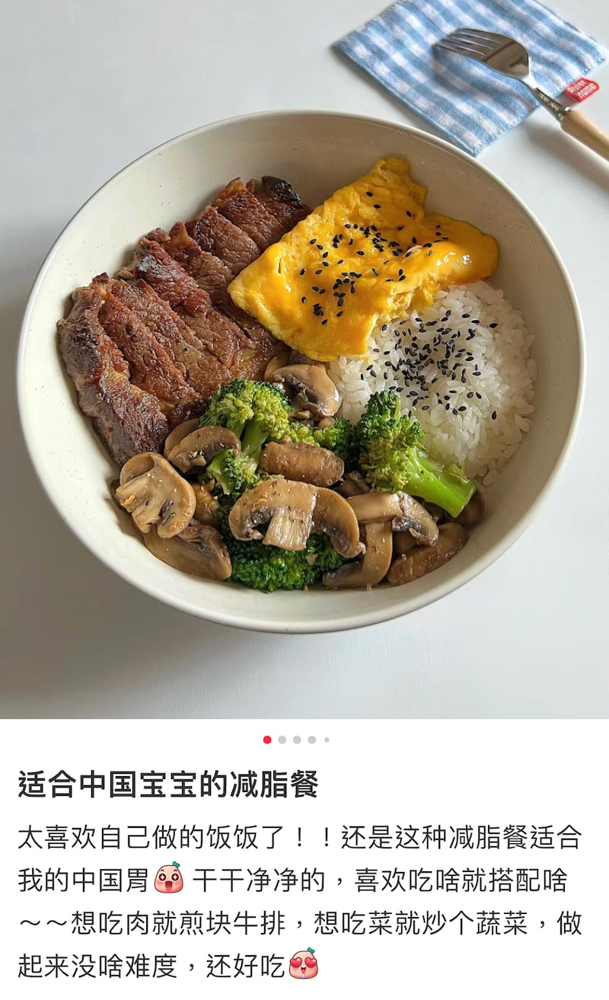
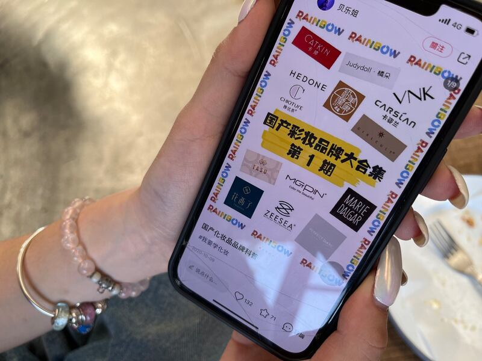
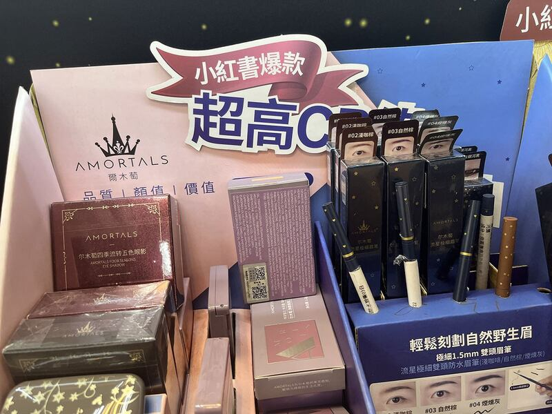
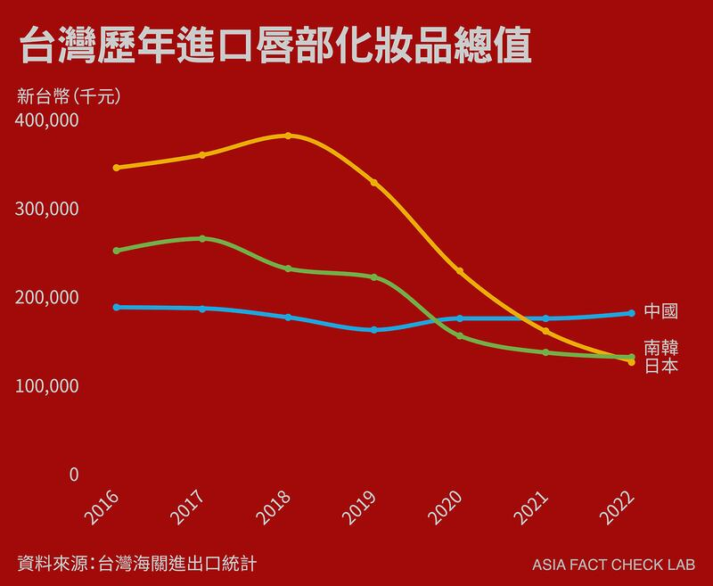

# 探索小紅書之一：這裏的"美好生活"沒有政治

作者：董喆、莊敬

2023.08.20 06:39 EDT

“在Instagram上你要突破演算法很困難，粉絲數到一定程度就停住了；但小紅書的母體是幾千萬甚至上億，隨便發個筆記就可以有上千的觀看量”。

李佳珊(化名)6月剛從大學畢業,是Instagram追蹤數在一萬人以下的 [奈米網紅(Nano Influencer)](https://influencermarketinghub.com/nano-vs-micro-influencer-marketing/),不少小品牌會找上她,用免費商品換取李佳珊的貼文宣傳,對她來說小紅書是面向更大市場的窗口。

李佳珊在小紅書上用分享臺灣的網美咖啡廳，獲得的點贊遠超過Instagram，更有超過百人收藏她的筆記。她說有時自己會用簡體字發文，“因爲觸及率會更高”。

李佳珊分享自己追蹤的小紅書博主。（圖/董喆攝）

小紅書也是李佳珊打造自己的參考書，從髮型、美甲到當紅鞋款，她都在小紅書上找靈感，“Dcard單純分享的文章比較多，母體不夠大，評測也比較少”。

Dcard是臺灣大學生的社羣平臺，擁有逾6百萬用戶，但與有上億活躍者的小紅書相比是小巫見大巫，李佳珊分享，跟風追八卦纔會看Dcard，想要趕上流行則必須勤刷小紅書，因爲華語世界找不到第二個同性質的平臺。

## 臺灣年輕人都在看小紅書？

小紅書是2013年中國創業家毛文超及瞿芳推出的手機社羣軟體，瞄準年輕女性用戶，以“標記我的生活”爲號召，使用者可以上傳筆記分享美妝、穿搭、家居擺設、旅遊或是心靈成長的影片或圖文。

中國千瓜數據的《 [2022年小紅書趨勢報告](https://www.cbndata.com/report/2891/detail?isReading=report&page=6)》顯示,小紅書每月有超過2億的活躍用戶,其中有超過7成爲"90後"。這股熱潮近年也吹向臺灣,根據網站分析軟體SimilarWeb統計,今年3月至5月,臺灣人造訪小紅書的流量佔比超過1%,僅次中國。

小紅書流量地理分佈。 （圖/SimilarＷeb 網站截圖）

今年5月，臺灣女藝人王思佳遭爆假包事件，小紅書用戶扮起偵探查緝，日日比對王思佳在電視節目上分享過的包款與正品對照圖，再度帶動臺灣小紅書下載量，5月小紅書在Google搜尋熱度一度竄升，更一度登上AppStore下載榜首。即便熱度過去，8月前兩週，小紅書在臺灣IOS及Android應用商店社交類程式下載量均居第三。

在Android與IOS系統的下載排行榜上，小紅書排名都位在前段班。 （圖/SimilarＷeb截圖）

## 小紅書：生活美妝的百科全書

小紅書以細緻的分衆與強調真實感的評測獲得使用者好評。以美甲爲例，李佳珊在搜尋列輸入“美甲”，小紅書便會把筆記按照各種風格分類，高級感、清冷感、甜酷風、裸色系、顯白感，十多種風格任君挑選；發一篇筆記詢問橘棕色染髮體驗，就會一呼百應，大批網民曬出自己的染髮照供你參考。

小紅書在美甲欄目的分類細緻。 （圖/小紅書截圖）

李佳珊一邊說一邊點開小紅書最新的熱搜字“多巴胺穿搭”，影片中的博主“白晝小熊”是近期的大勢博主，憑藉者全身亮色系穿搭，用色大膽的妝容，以及跳躍感十足的拍攝手法，短短30天漲了270萬粉絲。

博主白晝小熊因分享多巴胺穿搭爆紅。 （圖/小紅書截圖）

多巴胺穿搭(Dopamine outfit)的特色是全身穿着單一鮮豔顏色的服飾,激發快樂指數,如同大腦的快樂激素多巴胺。這一關鍵字早在2022年9月就出現在西方創意靈感App [Pinterest的年度時尚預測](https://business.pinterest.com/pinterest-predicts/2022/dopamine-dressing/),但直到"白晝小熊"在小紅書颳起旋風,這股潮流才吹向臺灣時尚媒體,"小紅書同款"以及"小紅書爆款"也成爲臺灣美妝或服飾產業的廣告詞,令人難以低估小紅書在流行時尚承先啓後的影響力。

小紅書的“人口紅利”也體現在生活經驗分享。王品宜（化名）是理工科系的大學生，透過在上海工作的朋友推薦，下載了朋友口中“沒那麼有政治味”的小紅書。 “因爲小紅書的筆記通常都跟政治沒有關係，他們宣導的是生活的方式，或是比較偏個人層面自我實現的一些指引，我會覺得好像跟政治局勢比較沒有關係”。政治立場踩在臺灣獨立的王品宜笑稱自己使用小紅書反而有“深入敵營”的感覺。

最初她也被分類細緻以及大量的美妝評測內容所吸引，但除了“打造門面”，她發現小紅書上能挖掘的還有更多。 “我朋友收到一所美國學校的offer，是很偏僻的學校，用Google搜尋不一定找得到那麼多資料，但在小紅書上都會有很多人分享自己的經驗，這是我沒有預期到的。”

王品宜直言，“它有點方便到會變成所有其他平臺的替代品，然後（使用者）就會花更多時間在上面”。

## 小紅書打造的美好中國？

小紅書緊接着抖音在臺灣年輕女性用戶間竄紅，多位小紅書的使用者在受訪時告訴我們並沒有使用抖音的習慣，因爲“小紅書比抖音有質感”，且小紅書推播的軟性內容政治侵略性並不高。

抖音和小紅書主要數據對比（圖/亞洲事實查覈實驗室製圖）

王品宜使用小紅書一年多，得出了小紅書創造中國假象的感想——“它分享的量跟分享的方式，會讓我覺得中國好像真的是一個很好、很適合居住的地方”。

不只是有關中國的負面訊息難以浮出，九成使用者爲中國人的小紅書也充滿以中國爲本位的論述方式。

“中國寶寶體質的減脂沙拉其實就是燙青菜，或像是臺灣會有的健康便當，他們會覺得這是中國人自己的烹調方式”，王品宜認爲不管是飲食、美妝最終都會帶回中國人的身份認同。

小紅書使用者分享“中國式減脂餐” （圖/小紅書截圖）

中國式優越感也在小紅書上隨處可見，王品宜說，小紅書上經常有網友自發性搬運外國博主的影片，“他們不一定會攻擊，但會留言稱讚中國還是比較好”，王品宜觀察到許多各國妝容評比的影片往往都是“中式妝容”勝出，品牌彩妝實測，也經常是“國貨彩妝”勝出。

這裏所說的“國貨彩妝”或是“國產彩妝”，指中國本土彩妝品牌。

## “國貨彩妝”如何因小紅書在臺崛起

中國彩妝有多普及？採訪當天，王品宜嘴上擦的是中國品牌的爆款脣釉，李佳珊則是從包包掏出中國品牌脣蜜。這些品牌拜小紅書所賜風生水起，早已搶進臺灣藥妝店陳列架。

李佳珊分享“國產彩妝”評測。（圖/董喆攝）

我們實際走訪臺灣知名藥妝店鋪，雖不像國際品牌有一櫃共四至五層的陳列架，國貨彩妝被歸納在小衆品牌陳列區，各個打着“小紅書爆款”、“小紅書神級單品”的廣告詞，一區約五至六種中國彩妝品牌。不只線下，網路平臺各家代購業者賣場的單一商品都有破萬以上的銷量，更有賣家專營中國彩妝賣場。

過去被認爲是山寨大國的中國儼然在彩妝市場扭轉形象，而小紅書扮演關鍵角色。

中國彩妝品牌搶進臺灣藥妝店，主打小紅書爆款商品。（圖/董喆攝）

李佳珊明確告訴我們，他對於中國彩妝不再有低價低品質的想法，“有些中國彩妝的單價並不便宜，而且在中國的百貨公司設櫃，也會和向三麗鷗等知名的品牌聯名”。不過她也補充，這樣的想法僅限於美妝產品，對於中國製的影視作品、零食等他仍是興趣缺缺。

王品宜的想法是，“人口數這麼大的一個國家，他的使用者有這麼多的時候，就會更容易覺得那個東西好像是沒有問題的。”

根據臺灣海關進出口統計，2016至2022年南韓跟日本進口脣部彩妝總值持續走跌，但中國脣部彩妝進口總值穩定持平，近幾年則有微幅成長。

臺灣海關統計的脣部化妝品進口量，中國貨已成最大進口（圖/亞洲事實查覈實驗室製圖）

國內某網購平臺提供的數據顯示，某中國品牌脣膏在2020年幾乎未有搜尋量，2021下半年至2022上半年該產品熱度竄升，搜尋量成長幅度超過130％。

我們實際詢問中國彩妝代購業者，想了解中國彩妝銷量是否受小紅書刺激？卻遭業者以“ 因爲內容較爲敏感（Made in China），鄰近選舉，相關議題較不方便討論”爲理由回絕。

儘管使用者覺得美妝生活“不那麼政治”，但在站進出口貿易第一線的業者一語道破了“Made in China”之於兩岸關係的敏感特性。

## 小紅書的統戰風險？

“我是來自灣灣的少數民族，沒錯，就是內陸朋友常說的高山族”，來自臺灣的泰雅族女大生在小紅書上發了一則身穿族服的筆記，引來5百多則留言，中國網民對臺灣原住民投以好奇。

但用上 [央視主播對臺灣"親情呼告"的"灣灣"](https://www.facebook.com/watch/?v=2574920922590825),以及 [不爲臺灣原住民族羣接受的"少數民族"](https://news.ltn.com.tw/news/life/breakingnews/2959666),臺灣人真的在小紅書上被統戰了嗎?

《東方文化學刊》總編輯胡又天是北京大學歷史系碩士，綜合在中國的生活經驗及個人觀察，他分析小紅書是抖音加上微博、推特的綜合，更聚焦於興趣，以興趣爲中心幫助用戶結成小圈子，“小紅書主打一個文化品味，讓你覺得自己是有品味的，不像字節跳動，因爲今日頭條（字節跳動旗下另一產品）一開始給人的印象就是low（低俗），抖音也是low的這種刻板印象”。

但部分人士認爲,小紅書只是包裹生活風格糖衣的毒藥。小紅書主要受衆是90後青年,2021年民進黨立委林楚茵 [就曾示警](https://www.fountmedia.io/article/113883),這正巧與臺灣的天然獨世代重疊,她擔憂"天然獨"變成"潛在統",不自覺遭文化統戰。

*亞洲事實查覈實驗室推出系列專題，觀察小紅書在臺灣爆紅現象，本篇爲第一篇，之後我們將陸續上線更多報導，觀察小紅書的內容審查和演算法機制，揭露小紅書的“去政治化”。*

*同時我們也觀察到在美國，字節跳動推出新產品“Lemon8”，被稱作小黃書的他，存在與TikTok相同的風險嗎？更多的測試及專家分析，將在系列報導中陸續刊出。*

[Original Source](https://www.rfa.org/mandarin/shishi-hecha/tansuo/xhs-08192023111600.html)