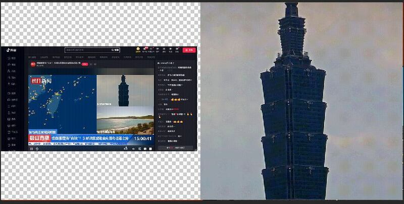
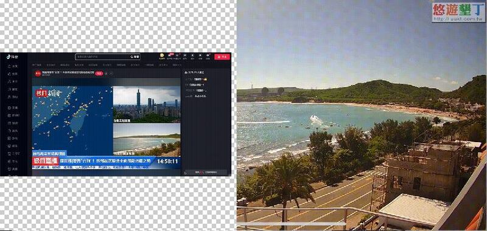
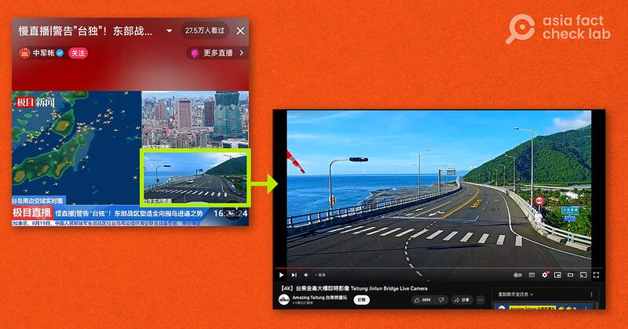

# 事實查覈｜中國官媒實況轉播環臺軍演圍島進逼？

作者：董喆，發自臺北

2023.08.21 16:14 EDT

## 標籤：移花接木

## 一分鐘完讀：

中共解放軍東部戰區19日宣佈在臺灣周邊海空域展開軍演，中國多家媒體轉播臺灣境內多地即時畫面，但亞洲事實查覈實驗室查證發現，多個畫面實際上來自臺灣觀光景點的YouTube即時影像，並非中國官、民媒體所稱“操演實時畫面”。

## 深度分析：

臺灣副總統賴清德甫結束出訪行程，中共解放軍東部戰區19日宣佈在臺灣周邊展開環臺軍演，並稱這項行動是對臺獨分裂勢力與外部勢力勾連挑釁的嚴重警告。

抖音上多個新聞平臺對此次軍演直播即時影像畫面，湖北日報集團下屬的“極目新聞”以“警告臺獨！東部戰區塑造全像圍島進逼之勢”爲標題，用分割畫面呈現周邊空域實時圖以及臺灣境內即時影像。

直播影像包含“臺北實時畫面”“臺灣萬里通海灘”“臺東實時畫面”，亞洲事實查覈實驗室以畫面中多個知名地標進行搜索，發現上述畫面皆是截取自臺灣各縣市風景區的即時影像服務。

臺北實時間畫面出自由臺北市政府觀光傳播局所有的 [【Taipei Live Cam】象山看臺北 - 4K即時影像](https://www.youtube.com/watch?v=z_fY1pj1VBw&ab_channel=TaipeiTravelLiveCam%E5%8F%B0%E5%8C%97%E8%A7%80%E5%85%89%E5%8D%B3%E6%99%82%E5%BD%B1%E5%83%8F) ,且兩者畫面運鏡、佈局皆相同,中國官媒轉播畫面裁去了左上角時間碼。

右：臺北市觀光傳播局直播畫面，左：極目新聞實況畫面

極目新聞畫面中的"臺灣萬里通海灘"實際爲墾丁萬里桐海灘,該畫面是取自臺灣民間機構"我愛墾丁"旅遊票券中心提供的 [【墾丁LIVE】南灣即時影像](https://www.youtube.com/watch?v=h9JmARss84U&ab_channel=%E6%88%91%E6%84%9B%E5%A2%BE%E4%B8%81%E6%97%85%E9%81%8A%E7%A5%A8%E5%88%B8%E4%B8%AD%E5%BF%83),畫面遠處海岸的兩座圓柱形建物以及施工腳手架架、行經車輛皆相符,不過極目新聞僅保留影像的左下部分,裁掉了時間碼以及原單位的Logo。

右：“我愛墾丁”旅遊票券中心直播畫面，左：極目新聞實況畫面

"臺東實時畫面"則是與臺東縣政府交通及觀光發展處建置的 [【4K】臺東金侖大橋即時影像](https://www.youtube.com/watch?v=9QqBz3kNHis&ab_channel=AmazingTaitung%E5%8F%B0%E6%9D%B1%E5%B0%B1%E9%86%AC%E7%8E%A9)相符。

右：臺東交通及觀光發展處金侖大橋即時影像，左：極目新聞實況畫面

## 專家：盜用直播防不慎防

亞洲事實查覈實驗致電臺北市觀傳局及臺東縣交觀處，以上單位均表示未授權給中國官媒使用。“我愛墾丁”旅遊票券中心至截稿前尚未回覆。

臺東縣交觀處回應，4K即時轉播影像秉持公益原則，供應臺灣各家媒體註明來源轉載，並未強制要求正式授權。不過中國官媒轉用一事交觀處並不知情且也未同意。交觀處並表示，直播畫面僅需網址就可以被轉載，因此難以嚴格規範。

臺灣熟悉直播技術的網路媒體工作者告訴亞洲事實查覈實驗室，要盜用直播其實非常容易，他根據工作經驗推測，中國官媒可能利用兩種方式拿到直播畫面，第一，使用YouTube解碼器並搭配軟體，只要在軟體後臺貼上網址就可以同時進行轉播。第二，使用OBS（Open Broadcaster Software）直播軟體，可以同步轉播畫面並自由裁切。

截至21日，中國除了“極目新聞”混淆軍演即時畫面，官方體媒包括武漢市“長江日報”旗下的“九派新聞”，以及直播平臺包括騰訊“虎牙”所屬的“時間直播”和“大象視頻”等直播平臺都以相同手法混用YouTube上臺灣觀光景點即時影像，宣稱是“圍島進逼”即時畫面。

*亞洲事實查覈實驗室（Asia Fact Check Lab）是針對當今複雜媒體環境以及新興傳播生態而成立的新單位。我們本於新聞專業，提供正確的查覈報告及深度報道，期待讀者對公共議題獲得多元而全面的認識。讀者若對任何媒體及社交軟件傳播的信息有疑問，歡迎以電郵afcl@rfa.org寄給亞洲事實查覈實驗室，由我們爲您查證覈實。*

[Original Source](https://www.rfa.org/mandarin/shishi-hecha/hc-08212023154030.html)