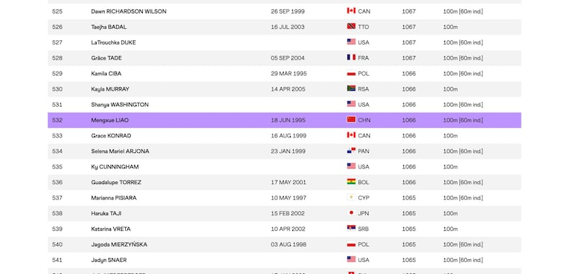

# 事實查覈｜因過於"男性化"，中國女選手被世界田聯除名？

作者：鄭崇生，發自華盛頓

2023.08.23 15:18 EDT

## 標籤：錯誤

## 一分鐘完讀：

近期，不少中文媒體和社交平臺熱轉一條消息，指中國女子田徑選手童曾歡與廖孟雪因“過於男性化”遭世界田徑聯合會除名。

世界田徑聯合會的官方信息顯示,童曾歡和廖孟雪仍是世界田聯註冊在案的中國籍選手。她們的註冊頁面上仍保留着其資料。在世界田聯的運動員排名中,廖孟雪以近期比賽成績依然位列其中**。**因此,所謂童曾歡與廖孟雪疑似因"男性特徵"、被世界田聯"除名"的說法,不是事實。

## 深度分析：

中國田徑女子選手童曾歡和廖孟雪曾經因外貌特徵幾度被熱議，最近，二人被世界田徑聯合會“除名”的消息再次引起廣泛傳播。

中國大陸、臺灣、馬來西亞的中文媒體和社交賬號均有報道、討論，稱兩人受世界田聯新規牽連，“在世界田聯的排名和成績均已被移除”。更有社交媒體文章稱，這些遭遇是因爲兩位運動員“男性特徵明顯”、“性別爭議”等。

在中國,《北京青年報》體育版在其 [騰訊官方賬號](https://web.archive.org/web/20230817092222/https:/new.qq.com/rain/a/20230817A0222Z00)刊發一篇文章,稱今年三月,世界田徑聯合會(World Athletics)宣佈強化對變性人及性別發育差異(Differences of Sex Development, DSD)選手血睾酮(或稱:血清睾固酮)濃度檢測的標準。因此,童曾歡和廖孟雪受到新規牽連,不再出現在世界排名中,過往成績記錄也被移除。這篇文章被中青網、和訊網等多家媒體轉載,並引起社交媒體熱議。

北青報體育版發佈文章稱中國女選手被世界田聯移除排名和成績 （騰訊新聞截圖）

臺灣 [《鏡媒體》](https://www.mirrormedia.mg/story/20230815web001/)和馬來西亞 [《東方日報》](https://www.orientaldaily.com.my/news/sports/2023/08/16/589191)的報道則稱,在世界田聯最新公佈的世界排名中,因爲被懷疑是"男兒身",兩位運動員的名字"雙雙在榜單上消失"。

亞洲事實查覈中心查證發現，以上說法均爲錯誤信息。

在世界田聯的官網上, [童曾歡](https://worldathletics.org/athletes/pr-of-china/zenghuan-tong-14744707)與 [廖孟雪](https://worldathletics.org/athletes/pr-of-china/mengxue-liao-14744705)的個人頁面,如下圖顯示,至發稿時目前仍可以世界田徑聯合會的官網上找到,包括運動員註冊編號、過去成績簡介等信息,均列在頁面上。

廖孟雪、童曾歡的世界田聯個人頁面截圖，其參賽紀錄仍然可見。（世界田徑聯合會官網截圖）

並且,在世界田聯女子100米項目的 [排名榜單](https://web.archive.org/save/https://worldathletics.org/world-rankings/100m/women?page=6)中,仍可見廖孟雪位列第532名。童曾歡雖然沒有出現在榜單中, 但也並沒有證據她受新規影響被"除名"。因爲,世界田聯的 [排名規則(詳見條款7.7,7.8)](https://worldathletics.org/world-ranking-rules/overall-rankings)是,僅統計過去12月內參加5次以上世界田聯認可的比賽的運動員,童曾歡近一年內未達到規定參賽次數,故未進入排名。

世界田聯女子100米排名，廖孟雪第532名（世界田徑聯合會官網截圖）

至於二人近期參賽較少是否與世界田聯新規相關，則無法查證。今年3月世界田徑聯合會頒佈更加嚴格的檢測標準之後，有中國網友爆料“內部文件”截圖，稱中國田徑協會開始更嚴格的執行血睾酮檢測，但相關信息並無官方信源。至截稿，中國田徑協會沒有回覆亞洲事實查覈實驗室的問詢。

*亞洲事實查覈實驗室(Asia Fact Check Lab)是針對當今複雜媒體環境以及新興傳播生態而成立的新單位。我們本於新聞專業,提供正確的查覈報告及深度報道,期待讀者對公共議題獲得多元而全面的認識。讀者若對任何媒體及社交軟件傳播的信息有疑問,歡迎以電郵* *afcl@rfa.org* *寄給亞洲事實查覈實驗室,由我們爲您查證覈實。*

[Original Source](https://www.rfa.org/mandarin/shishi-hecha/hc-08232023151134.html)