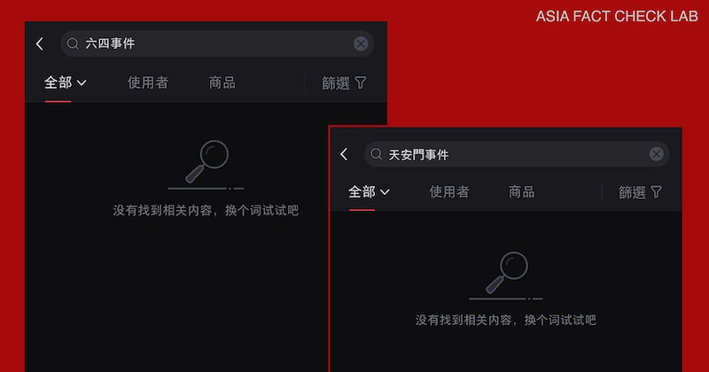
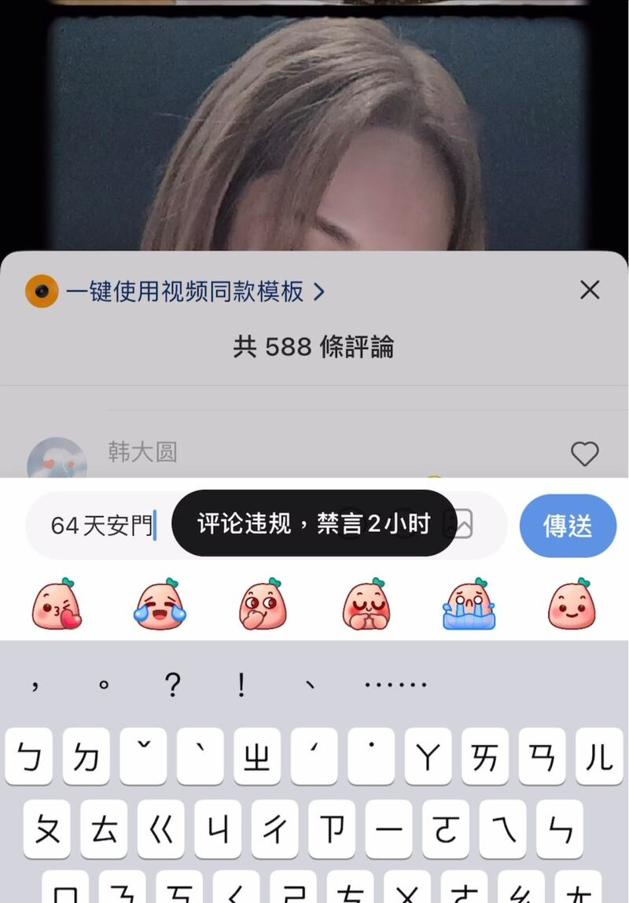
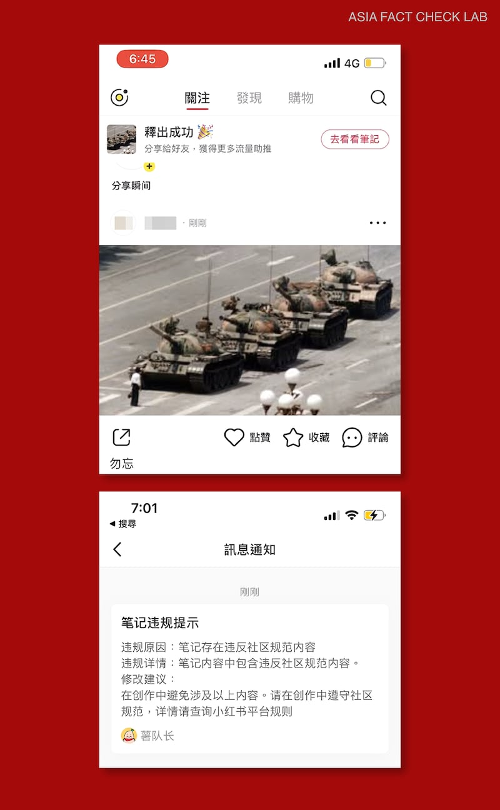
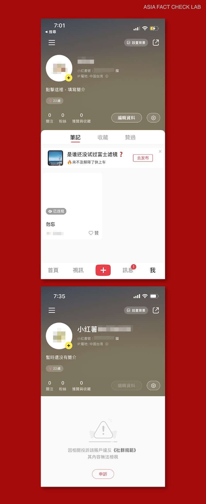
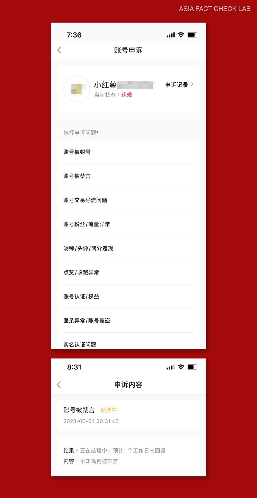
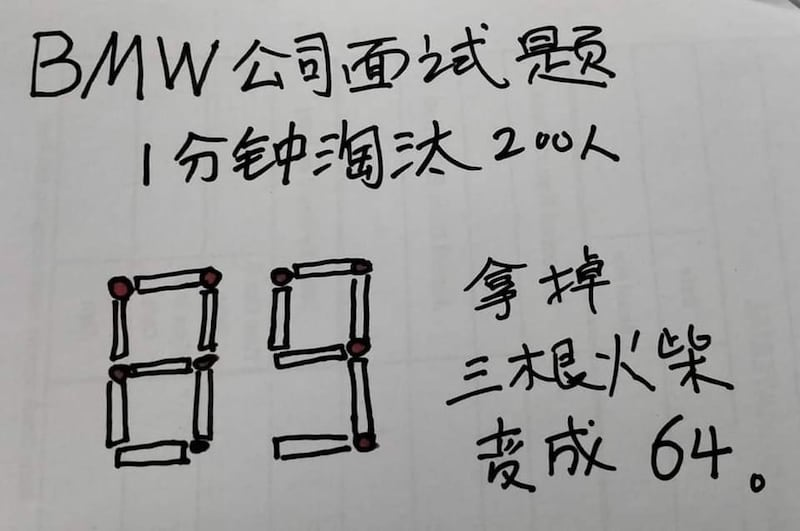
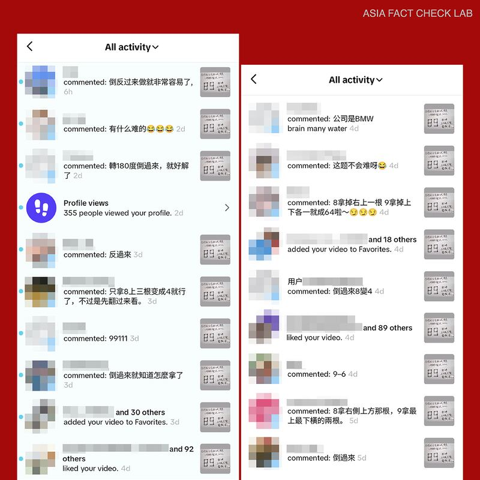
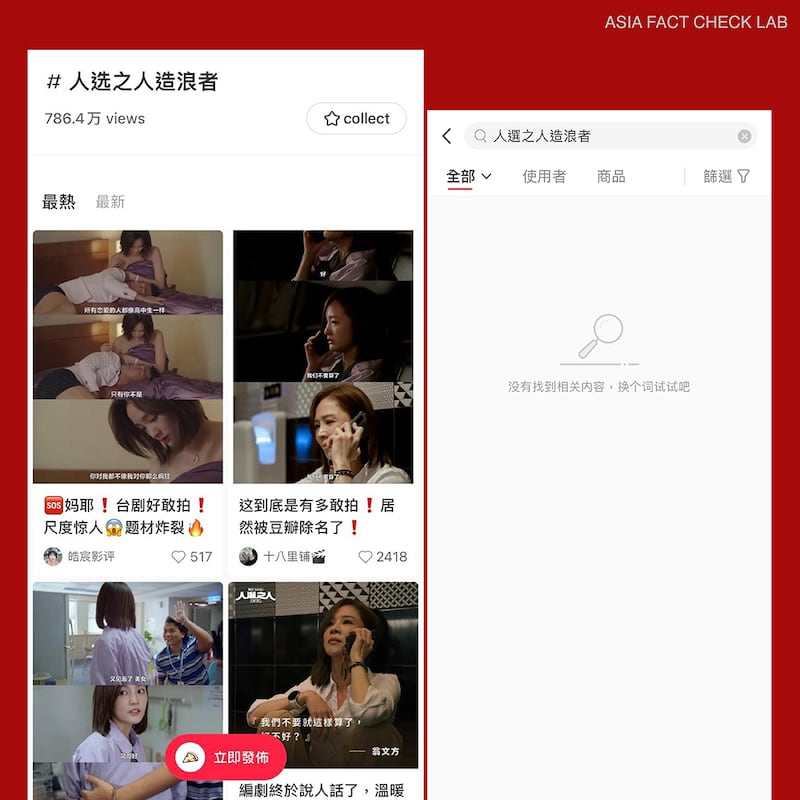
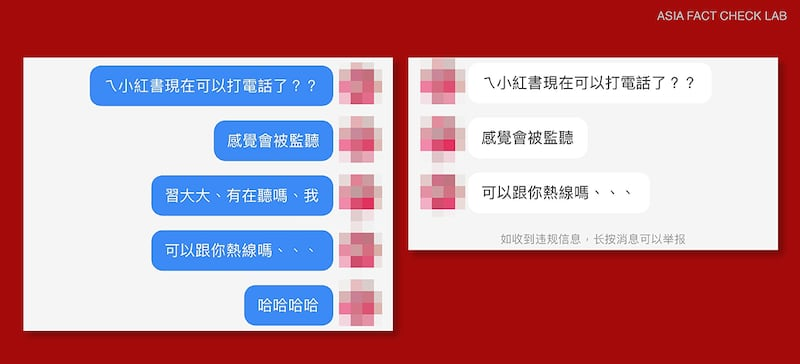

# 探索小紅書之二：換個詞，就能搜到嗎？

作者：董喆、莊敬，發自臺北

2023.08.24 15:11 EDT

在手機應用程式（app）線上商店裏，小紅書自詡“你的生活指南”。它這樣介紹自己：“年輕人的生活方式平臺，每月有超過兩億人在這裏分享生活經驗，發現真實、美好、多元的世界，找到想要的生活。”

但在這本“紅色指南”裏，臺灣用戶定位在“中國臺灣”，找不到六四事件的歷史真相，看不見以臺灣民主選舉爲背景的熱播臺劇，甚至無法在閒聊裏提到“習大大”。亞洲事實查覈實驗室以觀察、測試、採訪等方式，揭露小紅書如何呈現某種中國式，去政治後的“美好”。

## 搜尋六四事件 小紅書：“換個詞試試吧”

每年六月四日前後的時期，被稱爲“一年一度的審查大會”，因爲這段期間，在中國社媒上發佈或轉傳與六四事件有關的字詞、圖案、影像，都可能挑動北京政府的敏感神經，導致發文被刪，甚至永久封號。亞洲事實查覈實驗室在六四事件34週年之際，測試了小紅書的審查機制，並同時在TikTok（抖音國際版）上進行相同的測試，做爲對照。

實驗時間設定於6月2日至5日，由兩位測試者分別在小紅書和TikTok搜尋、留言、發帖。

首先，在小紅書搜尋“六四”、“天安門”、“坦克”等關鍵字，以及坦克符號圖案，獲得結果都與六四事件無關。例如，輸入“六四”找到“身高一米六四”、“身材六四比”等內容；搜尋“天安門”出現天安門太美了、天安門附近美食等貼文；查詢“坦克”則有“學習認識坦克”等資訊。

關鍵字改爲“六四事件”、“天安門事件”、“六四天安門”，卻搜尋不到任何內容。

在小紅書上搜尋“六四事件”、“天安門事件”顯示的結果。（小紅書軟件截圖）

## 搜尋蠟燭圖案 小紅書沒筆記、有商品

另一個測試的目標是“蠟燭”，它用來表達追思和悼念，以往在六四紀念日前後，也有不少網民以張貼蠟燭照片，或者蠟燭的符號圖案（Emoji）這種無聲的方式紀念。實驗室沿用這個方法，於6月4日在小紅書搜尋“蠟燭”，可找到“香氛蠟燭DIY”等貼文（小紅書上稱爲“筆記”），但搜尋蠟燭符號圖案，卻沒有內容。爲確認在小紅書上能否搜尋符號圖案，測試者另輸入微笑表情符號，找到許多使用到微笑表情的筆記。但測試者在小紅書的“商品”頁面搜尋蠟燭符號圖案，卻能找到蠟燭商品，且可以下單購買。

測試者5日又搜尋蠟燭符號圖案，仍未找到相關筆記；等到7日再搜尋，無論是筆記或商品頁面，“蠟燭”又都重新出現。

## 藝人六四發文慶生 敏感留言消息不見？

六四測試還有一個指標是臺灣藝人楊丞琳，這一天是她的生日，許多網民猜測楊丞琳爲避開六四事件爭議，不敢在社媒發佈慶生文，還有人在楊丞琳5月底發的筆記下留言：“中國琳（編按：諷刺楊丞琳傾向討好中共）不敢在小紅書PO她的生日欸”。

不過，這些網民猜錯了，楊丞琳生日當天在小紅書發佈慶生文，也有粉絲髮文祝賀她。在與楊丞琳生日相關的帖子下，測試者留下暗示六四事件的評論，系統顯示發佈成功，帳號也未因此遭禁言。

然而，相隔一段時間檢查，發現測試者雖然仍能看到自己的留言，其他用戶卻看不到，另也找不到上述小紅書用戶所發佈的“中國琳不敢在小紅書PO她的生日欸”評論。

亞洲事實查覈實驗室發現不少使用者遇到類似情況，有人在中國平臺“知乎”詢問，爲何已成功發佈評論，沒有顯示違規或禁言，但別人看不到他的評論；對此，有網民回覆：回答帶有敏感詞被屏蔽了。

在不斷試探小紅書的底線之下，測試者終於遭遇到“粗暴”的待遇：當在留言區輸入“64天安門”，立即被通知：“評論違規，禁言2小時”。

嘗試留言“64天安門”即遭禁言（小紅書軟件截圖）

## 發“坦克人”照片 小紅書立即封號

亞洲事實查覈實驗室測試也發現，發佈與六四事件相關的內容，無論是筆記或留言，都會遭小紅書禁言。 6月4日在小紅書上傳“坦克人”照片，20分鐘內便被告知違規，緊接着收到訊息指其違反社羣規範，因此帳號被封禁；測試者提出申訴，表示不知爲何被禁言，但無下文，至今仍無法發文。

遭小紅書封號的過程（小紅書軟件截圖）

爲測試小紅書是否在六四紀念日後解禁，尚未遭封號的測試者於6月13日發佈寫了數字8964的圖片（下圖）。

六四事件期間，不少網民在推特等平臺轉發圖卡，某公司的面試題，把排成數字“89”的火柴，拿掉三根變成“64”。圖取自網路

測試者發帖後10分鐘內即收到訊息，指作品違反平臺規則，平臺將對帳號採取封號處理。 6月15日帳號復活。

爲了做爲對照，測試者同一天也在TikTok發佈這張圖，至6月19日尚未遭刪除或封號，還收到幾個用戶留言幫忙解題。

在TikTok發佈含有“8964”的圖片，並未遭封號，還有用戶留言幫忙解題。（Tiktok截圖）

## 《人選之人》、“習大大”都是會消失的敏感詞

串流影音平臺網飛（Netflix）播出的臺灣政治幕僚職人劇《人選之人－造浪者》，劇情涉及總統選舉、職場性騷擾、同性伴侶等議題，4月底上架後爆紅，不少中國網民翻牆追劇。 5月中，在小紅書上，“#人選之人造浪者”閱讀數破780萬，熱議“臺劇好敢拍”、“題材炸裂”。

一個月後，再到小紅書搜尋《人選之人－造浪者》，竟顯示“沒有找到相關內容”，用戶有時會以“人選之ren”、“人xuan之人”規避審查。

5月中（左圖）在小紅書搜尋《人選之人－造浪者》，討論度高，但6月中（右圖）再搜尋，卻找不到相關內容。（小紅書軟件截圖）

《人選之人》戲劇上架不久後便陸續“被消失”，包括中國影視網站“豆瓣”、“B站”（Bilibili）都移除相關內容，連許多臺灣年輕人愛用的小紅書也跟上腳步，一名用戶評論：“涉及臺灣民選題材，不封纔怪”。

小紅書用戶王品宜（化名）告訴亞洲事實查覈實驗室，她與友人使用小紅書私訊，對方開玩笑提到“習大大”（指中國國家主席習近平），但她的對話框中，根本沒有出現友人所寫關於“習大大”的那句話，而且她還收到系統提醒，可舉報違規訊息。

小紅書用戶私訊提到“習大大”，對話被審查。（用戶提供小紅書截圖）

針對實驗室以“六四”等敏感題材對小紅書做的系列測試，中山大學資訊工程學系助理教授徐瑞壕首先以“蠟燭”爲例分析。他認爲在商品頁面搜尋蠟燭，就是描述商品，較不容易出現與六四事件相關的訊息，但在文章頁面搜尋，就很有機會搜到與六四事件相關的言論；中國軟體開發商一定會分析，和六四事件相關的訊息有哪些關鍵字，針對這些字詞出現的頻率、熱門程度，決定過濾哪些內容。

在測試小紅書的同時，亞洲事實查覈實驗室同時測試TikTok做爲對照，但測試結果卻顯示，一般臺灣使用者以爲去政治化的小紅書，審查比抖音國際版的TikTok還要嚴格。難道使用TikTok相對安全？

“不能這樣講。”徐瑞壕受訪時說，TikTok雖然允許這些訊息出現，但它有沒有分析、調查發文者的背景，外界並不清楚；訊息會留存在它的資料庫，甚至很多軟體開發商雖然公司設在國外，但有中資或屬中國公司，就有機會把資訊傳回國內公司。

徐瑞壕以中國的微信和WeChat爲例，加拿大多倫多大學蒙克全球事務學院公民實驗室（The Citizen Lab）的研究顯示，即使是非中國使用者以WeChat傳遞圖片給微信使用者，內容仍普遍受到監視，若牽涉敏感的中國政治內容，首次傳給中國帳戶就會被封鎖。

臺灣的國防安全研究院網路安全與決策推演研究所副研究員曾怡碩則認爲，TikTok當然不能言論審查，現在美歐國家對它有疑慮，它要表現自己與國內的抖音脫鉤；但最主要的是，即使它的資料中心在海外，還是必須確定不會透過其他管道流入中國的公司，或海外有特定部門處理這些資訊，這些都需要觀察。

亞洲事實查覈實驗室經觀察、測試、採訪使用者後發現，小紅書這個平臺以推送、審查、遮蔽、禁言、封號等手段，呈現了某種“中國式美好”。但它是否能讓年輕人發現“真實”和“多元”的世界，卻是一個問號。

[Original Source](https://www.rfa.org/mandarin/shishi-hecha/tansuo/xhs-08242023145310.html)