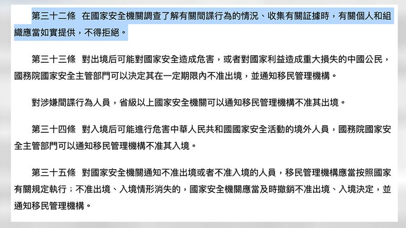

# 探索小紅書之三：你看它，它也在看你嗎？

作者：莊敬、董喆，發自臺北

2023.08.26 07:00 EDT

十九歲的蔡愷恆發現，近來有些同學開始用以"親 "寶" 等中國網路流行用語稱呼朋友，服裝穿搭也開始受中國流行的影響，種種趨勢令這位臺灣政治大學傳播學院二年級的學生有些好奇。1

蔡愷恆曾 [撰文](https://visionproject.org.tw/story/6299)分享對同學的觀察,提到許多同學政治敏感度降低,毫無意識地使用中國的應用程式,像TikTok(抖音國際版)、小紅書等,不自覺在生活中使用"走心""視頻""攝像頭"等中式用語。但就她觀察,還沒有影響到國家認同。她說,曾和使用小紅書的同學討論過,對方認爲小紅書上的內容大多與國家認同無關,比較常看學習英文的訣竅等讀書方法,"就覺得(國家認同)好像比較不會受到影響"。

小紅書是2013年成立的網路購物和社交平臺，聲稱在2019年擁有2億使用者，近年來臺灣用戶明顯增加，尤其受年輕族羣喜愛。但同時臺灣各界也開始關注小紅書可能涉及的文化滲透、認知作戰以及用戶個人資訊安全問題

## 小紅書的演算法

亞洲事實查覈實驗室的測試者5月中開始使用小紅書，起初搜尋“臺灣”二字，被推送的內容大多與臺灣觀光相關。直到5月19日國臺辦宣佈開放臺灣旅行團赴大陸旅遊，看了幾篇相關筆記後，便開始接收到 “統戰” 內容，例如 “都是中國人，我愛祖國” “丫丫（熊貓）都回成都了，臺灣多久能回來呢？” 等筆記。

此後測試者點開小紅書，“猜你想搜”的選項列表總會出現“臺灣是中國的臺灣”。

小紅書上與「中國臺灣」、兩岸統一相關的筆記

雖然許多社媒都會依據用戶的搜尋記錄進而推薦內容，也可能審查暴力、色情等“有傷害性”的內容，但中國平臺的審查範圍更深、更廣，小紅書用戶服務協議列出的“不良信息”還包括危害國家統一、詆譭民族優秀文化傳統、煽動破壞國家宗教政策等。中國數字空間也曾發佈“小紅書審查百科”，描述小紅書監測輿情的方式。

小紅書用戶服務協議

## 臺灣年輕人擔憂個人資訊遭竊

王品宜（化名）自稱是小紅書的重度使用者，但她卻從未使用小紅書的“筆記”(貼文)功能，“發出去之後官方要審查。所以我覺得那個是一個比較危險的使用方式，某種程度上還是會暴露自己更詳細的個資”。

王品宜也爲了不讓小紅書更瞭解自己，有一套對抗演算法的方式。“我會故意點讚我不喜歡的東西”，因此王品宜的小紅書推薦經常出現汽車、行政學知識等自己毫不感興趣的內容，她認爲這樣的作法，可以讓小紅書錯判她的喜好，蒐集到不精準的用戶資料。

但不發文、洗演算法，小紅書就無法取得更多用戶資料嗎？

中山大學資訊工程學系助理教授徐瑞壕說，不只中國應用程式，很多歐美的應用程式也都存在資安風險，像是利用取得麥克風權限側錄任何可以收到的聲音、獲取不該獲取的權限等，但大家可能更在意中國的言論審查制度。

蔡愷恆就是因爲擔心小紅書會竊取自己的資訊，即使周遭許多同學在用，她仍未下載使用。蔡愷恆說，自己對中國應用程式保持警覺，主要是高中時期的老師曾談到中國與臺灣之間的區別、“反送中”事件，也有提及中國軟體、用語等議題，讓她開始關注“如何不被文化入侵”。

“這是在極權政府底下管控的媒體公司，我應該更留意它傳播的資訊是否適當，而且是否經過濾。”蔡愷恆說。

## 小紅書的資料存放在哪裏？

亞洲事實查覈實驗室曾經 [報道](2023-03-24_事實查覈 ｜ TikTok能與中國政府共享美國用戶數據嗎？.md),TikTok在隱私政策的公告中明確表示:"TikTok 可能會將您的數據傳輸到美國以外的服務器或數據中心進行存儲和/或處理。與TikTok可能分享您的數據的其他實體,可能位於美國以外。"

該描述爲TikTok向中國政府交付用戶個資留下了空間。小紅書也有類似情況嗎?實驗室也檢查了小紅書的 [用戶服務協議](https://agree.xiaohongshu.com/h5/terms/ZXXY20220331001/-1)與 [隱私政策](https://www.xiaohongshu.com/crown/community/privacy)。

小紅書的經營者爲行吟信息科技（上海）有限公司及其關聯公司，其用戶隱私政策載明，依據《中華人民共和國網絡安全法》《中華人民共和國個人信息保護法》《中華人民共和國民法典》《信息安全技術個人信息安全規範》以及其他相關法律法規和技術規範明確了收集／使用／對外提供個人信息的原則。

用戶發佈的文字、照片、視頻、音頻、評論、點贊、收藏、分享記錄信息都會存儲在小紅書公司的服務器中。小紅書的隱私政策指出：“我們將在中華人民共和國境內取得的個人信息放於中華人民共和國境內。”

而在以下情形下，小紅書公司會確保在履行了法律規定的義務後，向境內實體提供用戶的個人信息：適用的法律有明確規定；獲得用戶的明確授權；用戶通過互聯網進行跨境交易等個人主動行爲。

經濟民主連合智庫召集人賴中強告訴亞洲事實查覈實驗室，雖然人在臺灣使用小紅書，但資料在中國存取，若中國政府發現用戶發言涉及《反間諜法》《國安法》等，而這樣的臺灣用戶萬一將來到香港轉機，或到中國旅遊、工作，就會有高度風險。

《中華人民共和國反間諜法》截圖

## 臺灣應該預防性禁絕小紅書嗎？

臺灣的數位發展部將小紅書、TikTok等中國公司經營的網路平臺列爲“危害國家資通安全產品”，限制公部門設備安裝使用。至於校園是否封殺中制軟體，教育部將和數發部進一步討論。

臺灣“國防安全研究院”網路安全專家曾怡碩受訪時說，民主國家資訊自由流通，民衆接收到各種訊息，不能因爲中共可能透過平臺從事認知作戰，就認爲臺灣的年輕受衆一定受影響，“爲什麼要對臺

曾怡碩說，社會不該對網路世代年輕人扣帽子，但政府單位應適度提醒可能造成的威脅，第一是中國平臺會散佈統戰的不實訊息，第二是這些平臺可能的資安疑慮。

徐瑞壕教授根據個人觀察認爲，臺灣學生講中國用語，寫簡體字，不一定是因爲使用中國社媒，他們也接觸中國影音節目、網路上很多中文資料，慢慢熟悉和接受中國的講話方式，例如“硬碟”變“硬盤”，“資訊”寫成“信息”等。“我一定要求學生更正，因爲我們並不是在寫文件給中國政府。”

徐瑞壕說，基於臺灣的教育和流通的資訊量，中國平臺要改變臺灣用戶想法並不容易，“但對國外用戶的影響是有的”，很多外國人不瞭解臺灣是中國的，還是一個國家？但在中國政府要求正名下，航空公司、學術會議更改稱呼，外國民衆看久“中國臺灣”，便可能被混淆而產生認知上的落差。

賴中強則認爲，許多中國應用程式有國安疑慮，臺灣政府應該要認真思考像印度政府，以國安爲由，強制下架多款中國應用程式。

[Original Source](https://www.rfa.org/mandarin/shishi-hecha/tansuo/xhs-08252023133943.html)