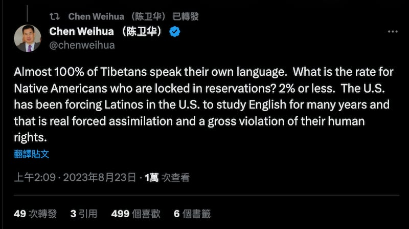
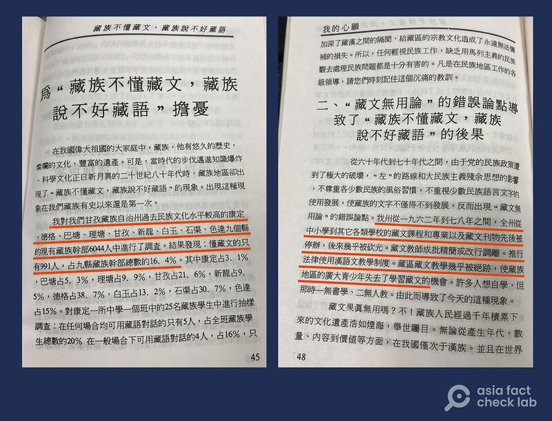

# 事實查覈｜"幾乎100%"的藏人都會說藏語？

作者：董喆

2023.08.29 14:11 EDT

## 標籤：錯誤

## 一分鐘完讀：

8月22日，美國國務卿布林肯發表聲明, 指美國國務院將對一些中國官員實施簽證限制，因爲他們執行強制同化政策，讓超過百萬藏族兒童在政府的寄宿學校就讀，消除年輕藏人的語言、文化和宗教傳統。

《中國日報》歐盟分社社長陳衛華在推特反擊宣稱：“幾乎百分之百的藏人都會說藏語”。亞洲事實查覈實驗室透過查閱資料，採訪專家、人權組織和藏人行政中央等，認爲並非所有藏人都會講藏語，因此，陳衛華的論述是錯誤的。

## 深度分析：

美國國務卿布林肯22日宣佈, [國務院將對一些中國官員實施簽證限制](https://www.reuters.com/world/us-imposes-visa-curbs-chinese-officials-over-boarding-schools-tibetans-2023-08-22/),起因是他們參與的強迫同化政策,讓超過百萬的藏族兒童就讀政府寄宿學校,目的是要消除年輕一代藏人的語言、文化及宗教傳統。

此一政策並未公佈具體中國官員名單，但《中國日報》歐盟分社社長陳衛華在社交平臺X(原推特)反擊，稱“幾乎百分之百的藏人都會說藏語”，並稱美國多年來強迫拉丁裔學習英文。

《中國日報》歐盟分社長稱，幾乎百分之百的藏人都會說藏語（圖/社交媒體X-原推特 截圖）

具有中國官方背景的香港媒體《通傳媒》以及香港衛視轉引陳衛華的言論，製作短視頻反駁布林肯的聲明，並輔以字幕，稱“99%的藏人會說藏語”。

通傳媒、香港衛視等反駁布林肯言論，稱“99%的藏人都會說藏語”。（圖/香港衛視抖音號截圖）

根據中國國家民族事務委員會定義，藏族分佈主要分佈在西藏自治區、青海、甘肅、四川、雲南等省區。這些在中國政府治下的藏人通曉藏語的比例究竟有多高？亞洲事實查覈實驗室查閱了藏人著作、流亡藏人口述以及人權組織報告，並採訪相關專家：

## 1.中國國內藏族“網紅”承認：不是每個藏族人都會說藏語

藏人行政中央官方智庫“西藏政策研究中心”主任達瓦才仁告訴亞洲事實查覈實驗室，青海湖以東的大部分藏人、和四川康定及以東地區大部分藏人不會講藏語，還有青海省西寧市的各縣，藏語在過去幾十年中也幾乎消失殆盡。

達瓦才仁補充，“青海省的海東地區、四川省甘孜州的康定縣、瀘定縣、阿壩藏族羌族自治州的東部各縣，包括岀名的九寨溝，在旅遊勝地之前完全不會藏語，後來成爲旅遊地以後才引進會藏語的人，當地人也學簡單藏語會話以應對遊客。”

達瓦才仁指出,中國國內社交媒體上也有"藏族網紅"爲自己不會說藏語辯護的內容。亞洲事實查覈實驗室發現,在Youtube平臺上, 不少藏族內容製作者發佈的 [短影音](https://www.youtube.com/shorts/Ql29kdFyBEI),表示,"在我們藏區,並不是每個藏族人都會說藏語"、 "就像我們藏族人生長在平原,從小環境不一樣,他們也不會說藏語"。在抖音平臺,自稱藏族人經營的"御草集格桑"賬號也在影片中直說"並不是每個藏族人都會說藏語"

Youtube、抖音等社交平臺都有自稱是藏族的內容製作者稱，很多藏族人不會講藏語。(圖/youtube、抖音截圖)

## 2 .藏學家著作：1980年代起藏人就已經說不好藏語

財團法人達賴喇嘛西藏宗教基金會董事長格桑堅參則提供亞洲事實查覈有關藏語保存的文獻資料。在藏學家得榮・澤仁鄧珠所著的《我的心願》一書中提到， 1980年代就已出現“藏族不懂藏文，藏族說不好藏語”的現象。他曾針對甘孜藏族自治州文化水平較高的九縣（康定、德格、巴塘、埋塘、甘孜、新龍、白玉、石渠、色達）的藏族幹部共6044人進行調查，懂藏文的只有991人。

書中並提及，文化大革命期間，作爲民族自治區的甘孜州，藏文學校、藏文專業、藏文課程和書刊通通被砍光，成千上萬的藏文歷史文獻被燒燬。 1962至1978期間，甘孜州中小學的藏文課程和專業以及藏文刊物先後被停辦。藏文教師成批精簡或改行調離，藏區藏文教學幾乎被絕跡。

《我的心願》一書中提到藏族幹部的藏語水平調查（圖/亞洲事實查覈實驗室製圖）

## 3.人權觀察報告揭雙語教育真相

人權組織“人權觀察（Human Rights Watch）”2020年曾發表報告，指出中國在西藏自治區的教育政策正在大幅限縮藏族人接受母語教育的機會， 政府雖把這種政策稱爲“雙語教育” ，實際上是逐步以漢語取代藏語。

這份報告包含多位藏族中小學老師、學者和前官員的深度訪談。人權觀察發現，西藏當局向西藏學校派遣更多不懂藏語的漢族老師，迫使各地小學在漢族教師人數日益增加下采用漢語教學而放棄藏語。

這份報告還引用了2016年1月《環球時報》曾在一篇有關藏語的文章中，直言藏語使用率大幅降低是因爲學校少用藏語，城市化和在學校說漢語的時間增加，導致藏語陷入危機。文章並說許多藏族家長髮現孩子沒有學到如何使用母語。亞洲事實查覈實驗室試圖檢索這篇文章，但並未找到原文。

## 4.伽羅博士的一手見證

藏族活動人士伽羅博士(Dr. Gyal Lo)在西北民族大學藏語系任教十餘年,2021年他離開中國旅居加拿大。 2023年日內瓦人權與民主峯會中他 [以自身經驗分享中國藏族寄宿學校如何影響藏族文化](https://genevasummit.org/speech/china-2-dr-gyal-l/)。伽羅博士提到,自習近平宣佈學前教育政策後,他走遍東部藏區50多所寄宿學校,發現學生被強制要求用普通話交流,且教師只能用中共批准的教材。

根據 [德國之聲報道](https://www.dw.com/zh/%E9%9B%99%E8%AA%9E%E6%95%99%E8%82%B2%E8%AE%8A%E8%AA%BF-%E8%A5%BF%E8%97%8F%E8%AA%9E%E6%96%87%E5%82%99%E5%8F%97%E5%A3%93%E8%BF%AB%E4%BE%B5%E8%9D%95/a-64950234),伽羅博士指出現在4至6歲接受學齡前寄宿教育的兒童無法以母語跟家人交流。他預估2030年後,整個藏區大概有70%的人不會講藏語。伽羅博士指出,藏區的"雙語教育"早已名存實亡,都以漢語爲主。且2019年6月更有部分藏區校長通知老師要在5年內把藏語完全從學校課程中剔除。

## 其他參考資料：

聯合國報告

[ [中國：聯合國專家對1萬藏族兒童與家人分離和寄宿學校被迫同化感到震驚 |人權高專辦 (ohchr.org)Opens in new window](https://www.ohchr.org/en/press-releases/2023/02/china-un-experts-alarmed-separation-1-million-tibetan-children-families-and) ]

*亞洲事實查覈實驗室(Asia Fact Check Lab)是針對當今複雜媒體環境以及新興傳播生態而成立的新單位。我們本於新聞專業,提供正確的查覈報告及深度報道,期待讀者對公共議題獲得多元而全面的認識。讀者若對任何媒體及社交軟件傳播的信息有疑問,歡迎以電郵* *afcl@rfa.org* *寄給亞洲事實查覈實驗室,由我們爲您查證覈實。*

[Original Source](https://www.rfa.org/mandarin/shishi-hecha/hc-08292023140535.html)