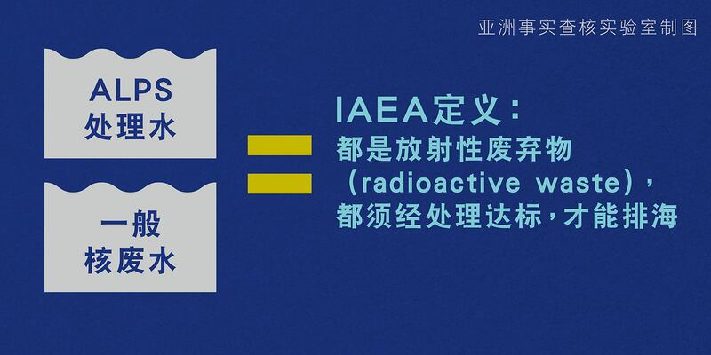
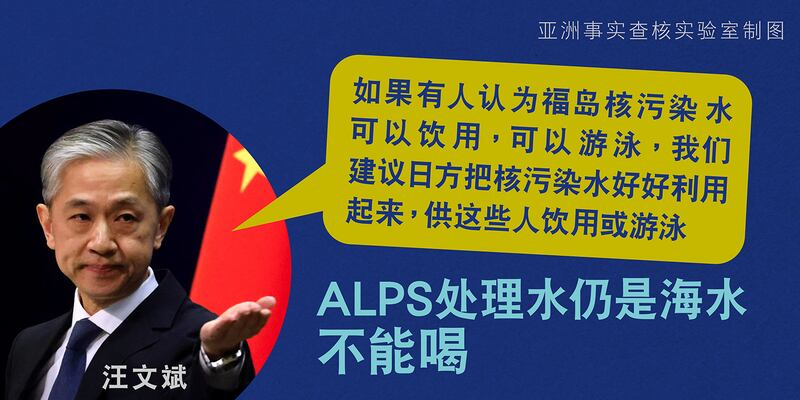
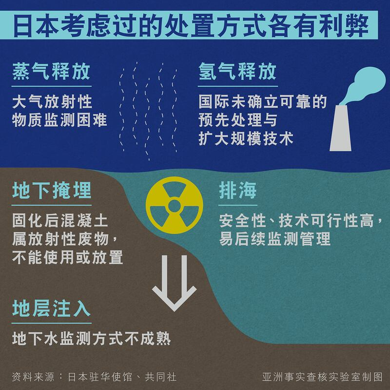
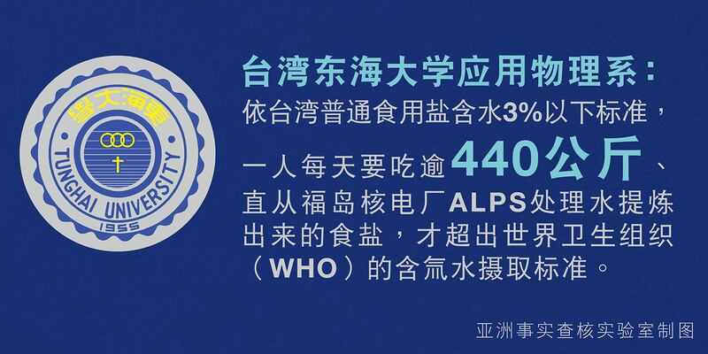
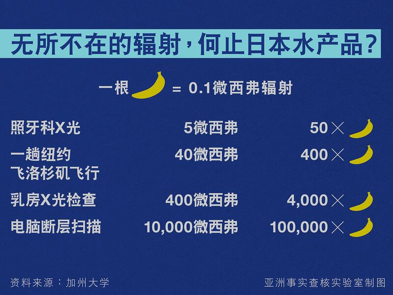

# 事實快查：日本福島核處理水排海的五個問題

作者：鄭崇生

2023.08.31 14:00 EDT

日本東京電力公司在8月24日啓動了福島第一核電站處理水(ALPS)的排海行動,在中國、韓國、臺灣等地引起巨大反響。中國方面,海關總署同一天宣佈全面禁止進口日本水產品以示抗議,民間的反日風潮湧動,傳出在華日本學校 [遭騷擾的事件](https://china.kyodonews.net/news/2023/08/5fbc347f3d44.html)。另外,韓國、 中國和臺灣都傳出有民衆搶購食鹽。

亞洲事實查覈實驗室針對福島處理水排放持續在中文輿論圈傳播的部分資訊進行查覈，整理如下，希望有助於讀者以理性的科學態度、識讀關於相關新聞資訊。

## 1. 中國官方宣稱，ALPS處理水不能與一般核電廠冷卻用核廢水相提並論，日本的說法是“美化洗白”福島核污水？

## 這是誤導說法。

ALPS確實與核電廠冷卻水不同,但不論是中國認定經過融毀核爐心的核污水、或是一般核電廠運轉過程中生成的核廢水、以及日本經過先進液體處理系統過濾的ALPS處理水,在國際原子能機構(IAEA)的定義中都是 [放射性廢棄物](https://www.iaea.org/publications/8154/classification-of-radioactive-waste)(radioactive waste),根據所含放射性物質的活躍程度、壽命長短訂立6種等級,而不論低、中、高階的放射性廢棄物,都需經過不同的處理方式,達到IAEA訂立的安全排放、處置或儲存的國際標準。

根據日本東京電力公司的 [說法](https://www.tepco.co.jp/en/hd/alps_guide/index-tw.html),ALPS處理水會去除絕大多數的放射性物質,但氚無法排除,處理水在排放前會將氚濃度稀釋到1500貝克/每公升,這個水平是世界衛生組織建議飲用水中含氚標準10000貝克/每公升約七分之一。

## 2.外交部發言人汪文斌質疑，既然ALPS處理水安全達可飲用標準，日本怎麼不留着自己喝？

## 這是錯誤說法。

ALPS處理水只處理了放射性物質，但處理後的水仍是海水。人類不能長期飲用海水。中國沿海核電站也是將處理過後達到排放標準的核廢水排入大海，不可能留作飲用水。

## 3. 中、俄曾建議將處理水蒸發處理、排入大氣中，日本卻堅持選擇排海是便宜行事？

## 這是誤導說法。

日本於2016年提出5種處置ALPS處理水的方式，其中確實包括蒸發處理、排放到大氣中，2021年4月最終選擇排海。日本官方指出，排海更具有現實可操作性。另據日本共同社，中、俄兩國在處理水排放前再次提出應蒸發處理，但日本評估，大氣放射性物質的監測比海洋更難，所以仍選擇排海。

關於放射性廢水的處理方式，中國科學家也有不少研究，結論也是任何處理方式的選擇都各有利弊。四位中國科學家今年2月初在國際科學期刊《分子》（Molecules）的投稿中，就分析各種放射性廢水處理淨化的利弊得失。在蒸發處理上，這四位中國科學家提到，儘管蒸發法有淨化係數高、靈活性強、通用性高等優點，但也存在爆炸、設備腐蝕等風險。

換言之，中國科學家研究也沒有做出蒸發釋放一定比排海更好的結論。日本將處理水排海的選擇，未來30年還將持續接受國際原子能機構等各國的監督。

## 4. 韓國、中國與臺灣都出現搶購食鹽的現象，日本ALPS處理水排海後，鹽都不能用了？先屯起乾淨的鹽避免受核污染？

## 這是錯誤說法。

臺灣清華大學原子科學技術發展中心主任葉宗洸接受中央社採訪時解釋，氚是以水的型態存在，但純鹽裏不含水，所以沒有含氚的問題，根本不用擔心。

臺灣的東海大學應用物理系在官方 [臉書帳號](https://www.facebook.com/THUPhys1955/posts/678005727685241?ref=embed_post)上做了詳細科普解釋,希望緩解民衆盲目搶鹽的現象。簡單來說:就算食鹽中含有水分,一個普通人需要每天喫超過440 公斤、直接從福島核電廠ALPS處理水提煉出來的食鹽,纔會超出WHO的含氚水攝取量標準。

市面搶購碘的另一個理由是食用含碘的鹽可以預防核輻射。但世界衛生組織（WHO）表示，日常飲食中加碘食鹽所含碘的濃度、不足以阻止甲狀腺吸收放射性的碘，加碘食鹽不應用作爲碘化鉀的替代品，而攝入過量的碘鹽，會對健康造成危害。

## 5. 中國海關總署以防範日本福島核污染水排海對食品安全造成的放射性污染風險，禁止所有日本水產品進口。日本將處理水排海後，日本水產品不能喫了？

## 這是誤導說法。

按照國際原子能機構的 [報告](https://www-pub.iaea.org/MTCD/Publications/PDF/Pub1419_web.pdf),日本排放的處理水對對人類和環境的輻射影響"微乎其微,可忽略不計。

放射性物質本就存在人類生活中,坐飛機、健康檢查都會收到低劑量的輻射,甚至許多常見食物也有放射性。 [加州大學](https://www.universityofcalifornia.edu/news/what-know-you-go-bananas-about-radiation)就曾經拿香蕉這一種富含鉀的水果來說明,香蕉裏有少量的放射物質鉀-40。以一根普通大小的香蕉約含有0.1微西弗輻射量(microsievert)來比較,住在核電廠50英里內一整年下來暴露於輻射下的數值爲0.09微西弗,還不到喫一根香蕉;而從紐約飛一趟洛杉磯,暴露於輻射的數值則是40微西弗,相當於一口氣喫400根香蕉。

*亞洲事實查覈實驗室(Asia Fact Check Lab)是針對當今複雜媒體環境以及新興傳播生態而成立的新單位。我們本於新聞專業,提供正確的查覈報告及深度報道,期待讀者對公共議題獲得多元而全面的認識。讀者若對任何媒體及社交軟件傳播的信息有疑問,歡迎以電郵* *afcl@rfa.org* *寄給亞洲事實查覈實驗室,由我們爲您查證覈實。*

[Original Source](https://www.rfa.org/mandarin/shishi-hecha/hc-08312023135544.html)