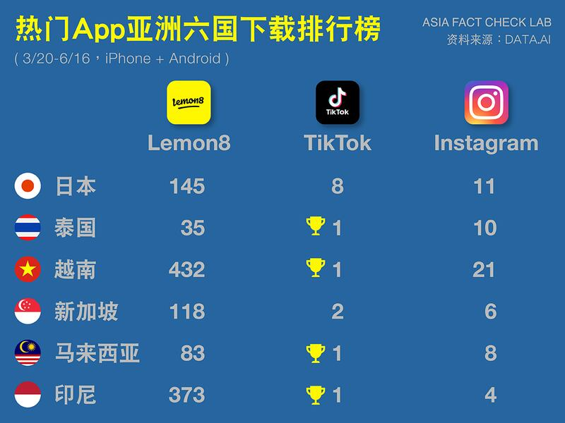

# 探索小紅書之四："美國版小紅書"能保住TikTok的江山嗎？

作者：鄭崇生，發自華盛頓

2023.09.01 14:13 EDT

"怎麼畫芭比(Barbie)腮紅"是琳恩(Victoria Lyn)7月21日在TikTok上發表有關芭比彩妝的第5個創作 [視頻](https://www.tiktok.com/@victorialyn/video/7258314482563255594?lang=en)。這位在TikTok上有500萬追隨者的美妝博主,在TikTok的姐妹品牌Lemon8上,活躍度明顯比較低——至截稿,琳恩在Lemon8上的帳號最新美妝 [短視頻](https://www.lemon8-app.com/victorialyn?region=us)則停在7月14日,雖然同樣也和芭比彩妝有關,但Lemon8上的這段影片,早在10多天前就已經在她的TikTok帳號上發表過了。

Lemon8和美國常見飲料"檸檬水"Lemonade 發音相似, 以黃色爲視覺主色,平臺聚焦時尚、美妝、美食、健身、旅遊、居家、閱讀等軟性內容,產品形式類似於在中文世界近年火爆流行的社交媒體產品小紅書,因此也被稱"美版小紅書"或是"小黃書"。但也因爲與TikTok系出同源,讓Lemon8在美國一推出就引起關注,許多美國 [媒體](https://www.zdnet.com/article/what-is-lemon8-and-why-is-everyone-talking-about-it-on-tiktok/)及 [評論者](https://www.nytimes.com/2023/03/29/technology/tiktok-lemon8-content-creators.html)都認定,這是爲了一旦TikTok遭美國全面封禁做準備。

Lemon8在蘋果系統App Store 上註冊的公司是Heliophilia Pte. Ltd.,總部位於新加坡。美聯社 [報告](https://apnews.com/article/lemon8-tiktok-bytedance-ban-china-data-privacy-054428fd24435bc34f6c2d62186122c9),它和TikTok與字節跳動Bytedance在新加坡的登記地址相同。

## 把"種草文化"推向美國

雖然Lemon8主打美妝、時尚產品或居家資訊分享，和TikTok無所不包的短影音性質完全不同，但Lemon8與TikTok系出同源，按照中國自己的法律，仍受中國政府規管，因此，外界始終質疑Lemon8同樣存在一套審查機制。

亞洲事實查覈實驗室對Lemon8進行了一整套測試，希望瞭解Lemon8是否也有“政治敏感帶”。檢測方法把可能被認爲是敏感內容的#主題標籤，包括：“1989.6.4”、“天安門大屠殺”、“達賴喇嘛”、“西藏”、“雪山獅子旗”的圖、“維吾爾種族滅絕”、“與香港同在”等圖文發表在Lemon8上。截至目前，Lemon8沒有刪除上述相關短文，發文賬號也還在。但過程中，亞洲事實查覈實驗室發現一些值得進一步探究的現象。

美東時間6月14日下午約4時45分，實驗賬號A以英文標題：《巴丟草的反抗藝術與挺身而出》、發文介紹巴丟草即將在波蘭舉行的個展資訊，文中標註的主題標籤包括：習近平、中國、普京、習近平下臺、波蘭、巴丟草。發出約10分鐘後，我們以另一個Lemon8賬號在系統上用英文搜尋“習近平”，在熱門欄目中，第一個顯示的是中國官媒環球電視網（CGTN）有關習近平的報道，其他還出現包括養身與瘦身等不相關的內容，但沒有實驗賬號A的發文。

【圖1】

同樣時間內，在搜索主題標籤的欄目中、不論是熱門或最新發文分類的排序，賬號A發出的上述內容都沒有出現。到同天傍晚接近7時，我們才能在主題標籤搜索欄目的最新發文分類中，找到賬號A的發文。

從這一實驗中，亞洲事實查覈實驗室發現，在Lemon8上發表這類涉及抗議習近平的發文，儘管發文賬號端立刻顯示發文成功，但其他使用者無法第一時間搜索到，要等約莫2小時後，才能以“習近平”搜索到。

在發文後2小時的這一時間段裏，我們也嘗試以“習近平下臺”及“巴丟草”爲關鍵字在Lemon8上搜索，儘管賬號A的發文都有這兩個主題標籤，但這兩個關鍵字都呈現“搜索無結果”，直到同天傍晚10時、也就是發文逾5小時後，才能確定其他Lemon8使用者可以巴丟草爲關鍵字搜索到賬號A的發文。

作爲實驗對照，我們在同一天以同一個賬號A、分享美國樂園之旅短文與照片，在發文約5分鐘後，在所有搜索分類欄目中，都可以找得到圖文。

由此可以確定，不同性質的發文，在Lemon8上搜索到要等待的時間長短有所不同。

究竟Lemon8上發表與搜索涉及“習近平”的負面內容，爲何會有延遲顯示的現象？ Lemon8的算法又是如何運作的？ Lemon8與字節跳動都沒有回覆亞洲事實查覈實驗室的詢問。

而Lemon8在6月30日更新 [《使用者隱私政策》](https://www.lemon8-app.com/legal/privacy?region=us)則明白指出,當使用者在創建、輸入或上傳內容時,Lemon8 能通過"預先載入"(pre-loading)的機制,收集所要發佈的內容,就算用戶最終沒有發表、而是選擇保存,lemon8也可能收集資料。 Lemon8指出,這一做法是爲了讓用戶能"更快發佈圖像和視頻,優化用戶體驗。"

“這就有可能存在一個'先審後上'的'準禁搜機制'，也就是它有一套被動執行的敏感詞系統存在，哪怕決定最後不刪你。”前新浪微博審查員劉力朋查看過上述實驗截圖後，向亞洲事實查覈實驗室提出他的分析結果。

他還指出，像是搜索“習近平”的英文名字，會出現“瘦身”與“健身”的內容，這也顯示Lemon8可能是在短時間內優先展示與關鍵字不匹配的內容。這可以通過算法設置“分詞”的作法，也就是將一組設定爲敏感詞的字拆解、導向其他詞，而這在中國網絡審查上早已運行多年。

不過，劉力朋也強調，這一實驗結果無法完全排除技術上的原因，例如Lemon8搜索系統的性能問題，造成系統延遲等。

## Lemon8能保證使用者數據安全嗎？

和其他多數App應用程序相似，Lemon8會蒐集與儲存使用者的個人資訊包括使用者名稱、生日、性別、電話與電郵地址等聯繫方式、所處位置、IP地址、使用的手機型號、發佈內容，並分析使用者的搜尋紀錄及與相關產品的互動情況，Lemon8的算法會據此分析並推送給用戶“可能感興趣”的內容，並與Lemon8的合作伙伴、同企業集團內的機構分享資訊；而如果使用者還與Lemon8分享自己其他的社交媒體賬號，Lemon8也會蒐集使用者在其他應用程序上的相關資訊。

亞洲事實查覈實驗室還注意到，Lemon8美國版的《使用者隱私政策》中說明，“Lemon8或將所蒐集到的使用者個人資訊儲存在非所處國家的服務器上”，地點包括美國與新加坡，美國用戶的資訊，仍有可能轉移到其它國家的服務器上。

【圖2】

由於來自中國，特別是在西方世界形象有爭議的字節跳動公司，因此外界一般對Lemon8的安全性抱着較大的疑慮。但也有資安專家持不同看法。

喬治亞理工學院（Georgia Institute of Technology）公共政策學系旗下的《互聯網治理項目》（Internet Governance Project）專研網絡治理與網絡安全政策，項目助理主任卡李姆·法哈特（Karim Farhat）則告訴亞洲事實查覈實驗室，生活在網絡時代，當人們決定要使用一款應用程序、不論是臉書（Facebook）、Instagram或是TikTok的使用者條款，某種程度都已經要求人們同意放棄一部分隱私。雖然多年前包括從美國聯邦政府、到個人信用審查機構數據遭駭客入侵的案例，都指向與中國政府有關的機構，但因此對有中國背景的App就有“數據隱私泄漏給中國官方”的憂慮則是“過度了”。

法哈特久不前才撰寫《TikTok與美國國家安全》的 [專項報告](https://www.internetgovernance.org/wp-content/uploads/TikTok-and-US-national-security-3.pdf),和華盛頓主流對字節跳動與TikTok的看法不同。

他認爲，上述例子證明，中國政府如果真想蒐集與美國國家安全相關且有價值的情報，根本不需要通過一家中國民營企業，只要中國有心，都可以通過開源網絡情報（OSINT）分析並取得有價值的資料，包括分析Instagram與Facebook上的內容。

法哈特強調，“數據隱私”與“數字主權”是兩個不同概念，“從技術角度來看，社交媒體平臺的血統與潛在數據泄露的‘直接路徑’其實無關。”

他還指出，字節跳動實際上已是全球最受放大鏡檢視的平臺之一，TikTok使用者的數據，所受到的保護其實比字節跳動的競爭對手更安全與私密。 “如果有真正的證據表明他們是中國政府的代理人，TikTok與字節跳動將在一夜之間失去市場的龍頭地位，但目前還沒有這樣的證據出現。”他告訴亞洲事實查覈實驗室。

## Lemon8爆紅後黃了嗎？

App 數據監測機構data.ai的資訊則顯示，Lemon8在東南亞包括越南、馬來西亞、新加坡、泰國與印尼的受歡迎程度則逐步上升，但仍不敵在多國穩坐下載量第一的TikTok，亞洲事實查覈實驗室根據data.ai數據彙整Lemon8在亞洲六國的下載數量排名，並與TikTok及Instagram比較如下圖。

【圖3】

今年第二季，Lemon8在包括泰國、馬來西亞、新加坡與日本當地的下載量都排名在200之前。而在美國，Lemon8在不分類App 下載量的排名上，至今仍沒有進入前200名；在生活類App下載量的排名上，過去90天的趨勢也呈現在4月爆紅後、目前緩步成長。

【圖4】

分析指出，TikTok上超過百萬人跟隨的網紅大V多數多呈現觀望狀態，仍未在Lemon8上開設賬號。而Lemon8主攻22-26歲女性、聚焦美妝時尚與生活資訊分享，目前主要是與二線品牌及非頂流TikTok網紅合作。

至於Lemon8的發展後勢如何?專門報道全球科技與平臺發展的美國網絡媒體"其他地區"(Rest of World)近來就以"遭遇失敗"來形容Lemon8 在美國的瓶頸—— [報告](https://restofworld.org/2023/lemon8-app-bytedance-user-decline/)引述數據觀測公司Similarweb的資訊,Lemon8的每日活躍用戶數已從4月份的1萬1930人下降至6360人。

琳恩爲作爲有影響力的美妝博主，跟着彩妝品牌的行銷預算選擇在哪一個社交平臺、發什麼樣的內容，這是美國“平臺經濟”正常的運作模式，但她在TikTok與Lemon8上的粘着度差異，也凸顯標榜“每天都有新發現”的小黃書“Lemon8”在美國似乎有些前途未卜。

在加州大學洛杉磯分校UCLA推廣教育學程教授網紅與社媒行銷課程的講師哈柏曼（Lia Haberman）則告訴亞洲事實查覈實驗室，在她看來，一個新的應用程序除非極其與衆不同、讓人們非下載不可、併成爲日常使用的9個程序之一，纔可能有發展，她更關注，當Lemon8的母公司字節跳動停止大撒幣、不再付費給那些創作者後，Lemon8還會受歡迎嗎？ “也許等到今年11月感恩節的餐桌上，再看看還有多少美國青少年討論Lemon8，‘路遙才知馬力’。”她說。

[Original Source](https://www.rfa.org/mandarin/shishi-hecha/tansuo/xhs-09012023140310.html)