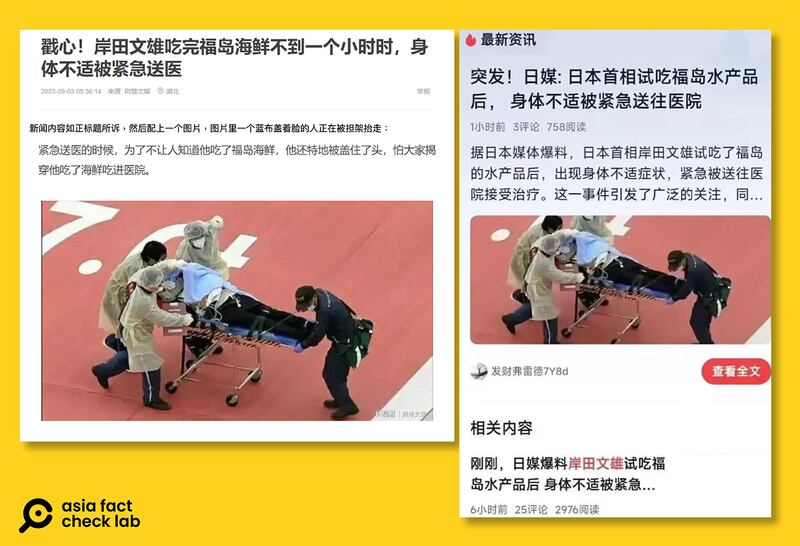
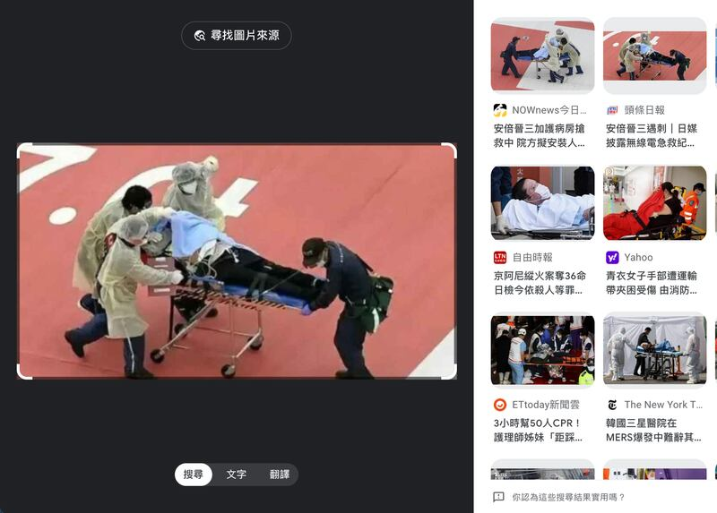
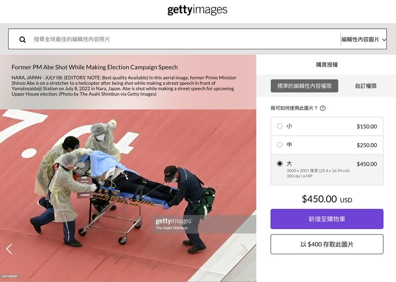
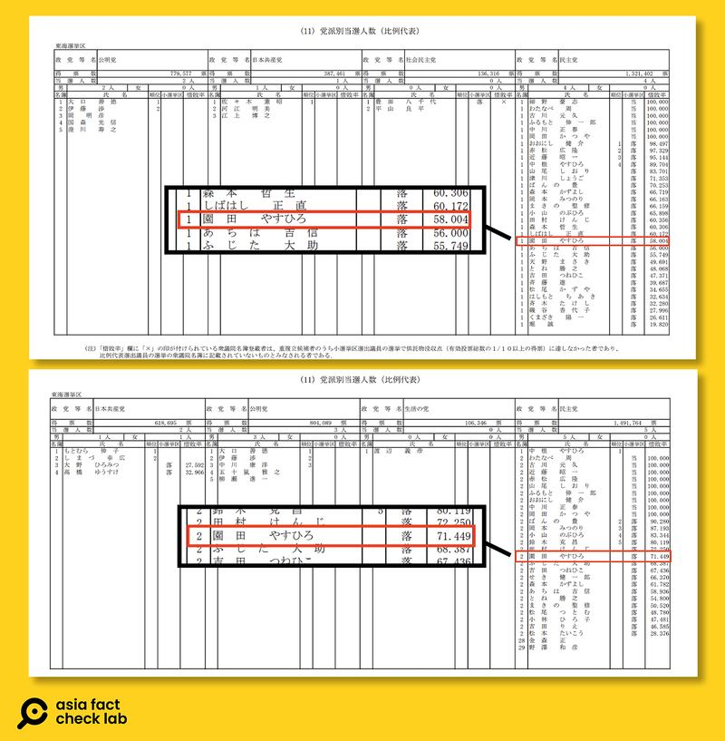

# 事實查覈｜喫核食、喝核水，日本首相、政要一病一死？

作者：董喆

2023.09.04 09:54 EDT

## 標籤：錯誤

## 一分鐘完讀：

日本排放核處理水話題持續在簡體中文世界延燒，中國社羣平臺先後傳出二位日本政要的錯誤資訊。首先是一張照片，被標註爲日本首相岸田文雄因食用福島海鮮緊急送醫。其次是傳聞曾經飲用核處理水的日本前內閣府政務官園田康博前一天死於多發性骨髓瘤。

亞洲事實查覈實驗室查證後發現，被指爲"岸田文雄緊急送醫"的照片是挪用2022年前首相安倍晉三中槍的送醫照；而園田康博本人仍然健在，他接受日本共同社採訪出面闢謠。

## 深度分析：

## 日本首相岸田文雄喫福島海鮮急送醫？

網易號"荊楚文娛"9月3日發表文章，稱日本首相岸田文雄喫完福島海鮮不到一小時，身體不適被緊急送醫。社羣平臺X（原推特）也有網友流傳中國社羣平臺截圖，同樣宣稱日媒報導岸田文雄遭緊急送醫。 "荊楚文娛"發文還特別強調，圖中送醫病患之所以被蓋着臉，是岸田文雄不願意被發現他因爲喫了福島食物生病送醫。

亞洲事實查覈實驗室以"福島"、"岸田文雄"、"送醫"搜尋日本媒體以及國際媒體,皆未有相關報導。 [日本首相官邸](https://www.kantei.go.jp/cn/noda/meibo/fukudaijin/index.html)也未發佈任何新聞。

再以該圖片進行反搜，發現圖片實爲2022年日本前首相安倍晉三中槍，以直升機運送至醫院的新聞照片，與岸田文雄無關。

我們也在圖庫網站gettyimages上找到同一張照片，是由朝日新聞社所提供，照片描述同樣爲安倍遭槍擊後轉送醫院的畫面。

## 日本前內閣府政務官園田康博喝核處理水死亡？

## 

日本政府決議自8月24日開始排放核處理水，簡體中文世界盛傳，當年飲用和處理水的園田康博早就死於多發性骨髓瘤，且全身出血而亡。

根據 [朝日新聞](https://www.asahi.com/special/10005/TKY201110310428.html)2011年10月31日的報導,時任政務次長的園田康博在"應對福島核電廠事故"新聞發佈會上,應在場記者要求喝下福島核電廠第5、6號機組經處理的低濃度放射性處理水。

根據 [日本首相官邸](https://www.kantei.go.jp/cn/noda/meibo/fukudaijin/index.html)以及總務省選舉速報資訊,園田康博曾擔任日本衆議院議員、政務次官、環境副大臣兼內閣府副大臣。 [2012年](https://www.soumu.go.jp/senkyo/senkyo_s/data/shugiin46/index.html)及 [2014年](https://www.soumu.go.jp/senkyo/senkyo_s/data/shugiin47/index.html)二度代表民主黨參與岐阜縣第3區衆議院選舉皆失利,後轉赴民間企業"株式會社ACD"任職。

根據2020年11月1日由"株式會社ACD"發佈的 [職務異動新聞稿](https://www.a-cd.co.jp/news/20201101.html)可見,園田康博卸任代表董事兼總裁一職。

上述資料顯示，園田康博引用核處理水後至2020年皆仍有公開動向。園田康博今年9月2日接受日本共同社採訪，否認因多發性骨髓瘤死亡的虛假訊息，他並再次向經歷震災的福島縣居民表達誠摯歉意。

*亞洲事實查覈實驗室(Asia Fact Check Lab)是針對當今複雜媒體環境以及新興傳播生態而成立的新單位。我們本於新聞專業,提供正確的查覈報告及深度報道,期待讀者對公共議題獲得多元而全面的認識。讀者若對任何媒體及社交軟件傳播的信息有疑問,歡迎以電郵* *afcl@rfa.org* *寄給亞洲事實查覈實驗室,由我們爲您查證覈實。*

[Original Source](https://www.rfa.org/mandarin/shishi-hecha/hc-09042023093849.html)