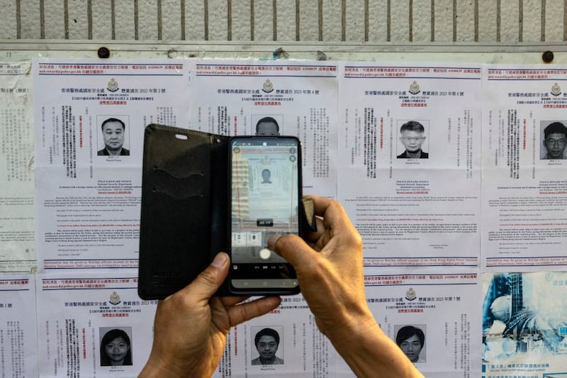
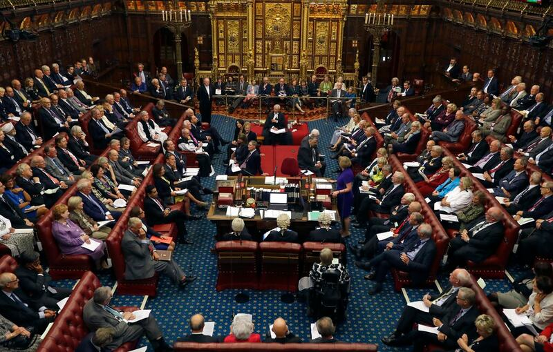

# 事實查覈｜英國國安法比香港國安法更易危害人權？

作者：沉軻，發自華盛頓

2023.09.06 15:54 EDT

## 標籤：部分正確

## 一分鐘完讀：

英國國會在7月11日通過了《 國家安全法》(NSA,以下簡稱國安法)。該法生效幾周後,親北京港媒報紙《大公報》先後發表了以 ["大公報"爲署名的社評](http://www.takungpao.com/opinion/233114/2023/0717/872156.html)和吉林省政協委員、律師陳子遷的 [評論文章](http://www.takungpao.com/opinion/233119/2023/0815/882041.html),批評英國以及歐美國家政府嚴厲譴責2020年通過的 [香港國安法](http://www.npc.gov.cn/npc/c30834/202007/3ae94fae8aec4468868b32f8cf8e02ad.shtml),卻同時頒佈了比中國更嚴苛的國安法,明顯採取了雙重標準。又指出該法某些條文賦予政府的權力容易被濫用。

爲覈查《大公報》社評的批評，亞洲事實查覈實驗室查閱了該法案的文本和立法過程的官方檔案。並訪問了參與該法案修訂的國會議員、英國內政部以及獨立的法律專家。我們發現《大公報》所描述的法律條文字面內容基本屬實，但兩篇社評忽略了英國和中國權力制衡機制的不同，兩國司法體系的專業及可信度也相差極大。

## 深度分析：

2023年7月，八名居住在不同國家的人以違反香港國安法爲罪受到香港政府通緝，其中一些人持有外國國籍 。 （美聯社圖片）

《大公報》批評法案列出的大部分罪名有域外效力，這樣的說法基本屬實。研究國家安全的法律學者薩拉·肯德爾（Sarah Kendall）也同意英國國安法規定的多數罪行具有域外效力，這意味着外國人也可能遭指控違反英國國安法。

## 英國政府可以根據國安法指控並逮捕外國公民？

英國內政部發言人對亞洲事實查覈實驗室說，跟從前的世界相比，現在更易在海外遠處從事間諜活動，因此法律必須針對某些罪行具備域外效力。

但發言人也強調，英國如果要追訴、指控外國公民，先須獲得英國總檢察長的批准，並且必須依照國際間既定的程序，將被告引渡到英國接受法院審判。

經英國下議院和上議院的批准，2023年7月英國議會通過並頒佈了國家安全法，旨在打擊敵對外國勢力。 （美聯社圖片）

## 英國警方可以在無搜查令的情況下執行搜查？法院也能閉門審理？

《大公報》在社評中也批評根據新的國安法，英國警方可以在沒有搜查令的情況下搜查嫌犯。內政部發言人對亞洲事實查覈實驗室強調法案確實允許警察在沒有搜查令的情況下進行搜查。但“這只會在需要緊急行動的極端情況下，警察才能使用這項權力。”再者，若警察局長允許警員進行如此搜查，必須馬上通知內政大臣(Secretary of State for the Home Department)。

《大公報》批評英國法院對於涉及國家安全的案件，無需經過公開審訊。肯德爾證實，的確根據國安法，法院確實可以因“保護國家安全”的理由不進行公開審訊。但目前並不清楚法院會如何執行這項規定。

## 英國警方可以在沒有逮捕令下逮捕並羈押嫌疑人嗎？

《大公報》稱，法律允許警方採取無證逮捕。此說正確。根據國安法條文，一旦警察懷疑有人蔘與外國勢力主導的活動，可以將嫌疑人扣押最多48小時，無需提出指控。

發言人指出，該法還讓警察和檢察官向法院申請延期扣押時間，將嫌疑人接着扣押七天。七天到期，可以再次進一步申請延期七天，總共羈押最長14天。

但英國內政部發言人強調，這項權力是例外情況，僅用於調查涉嫌與外國敵對勢力有關人物。

## 英國可以對嫌犯實施禁止外出、禁用電子設備等強制處分？

《大公報》批評根據國安法，英國警方只要認爲有“合理理由”，就可以禁止疑犯離開住所，或強制其身處某一處所，或禁止使用電腦、手機強制處分。

亞洲事實查覈實驗室發現這樣的批評部分正確：法律確實允許這些強制處分，但並不授權給警察。英國內政部發言人表示，只有內政大臣可以實施以上限制，而且必須先有正當的理由相信特定人物已經或正在參與新的外國勢力威脅活動。同時內政大臣也必有正當理由認爲，只能透過實行限制可以防止嫌疑人蔘與威脅活動，保護英國免受威脅。

內政大臣應當向法院申請頒佈禁令的批准，不過情況緊急即可自主施加限制。儘管如此，若法院認爲內政大臣決定明顯有錯，可以質疑並撤銷內政大臣所下的任何禁令。同時嫌疑人也有權利向法院陳述立場，提出抗告。英國也設置獨立監察人員監督內政大臣頒佈的禁令，確保政府依法執行。

## 英國和中國治下的香港，司法公正度的評價如何？

《大公報》的社評指出，與香港國安法相比，英國國安法條文更嚴，更容易用其蔑視基礎人權“是個加辣版的國安法律”。但《大公報》的批評牽涉到中國治下的香港，與英國法治受信賴的程度和公衆評價問題。

亞洲事實查覈實驗室查閱了在 [世界正義工程發佈](https://web.archive.org/web/20230821153105/https://worldjusticeproject.org/rule-of-law-index/global/2022/historical)的全球法治指數,2015年至2022年中國從最高的71降到95位。而同一時期英國則在10到16位之間。儘管香港的排名也遠高於中國大陸,然而香港國安法實施幾年,名次不斷下降,2022年從兩年前排名全球第16位降到22位。

另外,在世界銀行發佈的以百分評價的 [歷史法治排名](https://info.worldbank.org/governance/wgi/Home/Reports),二十三年來英國的評分每次比中國高35至60分。最近2021年的評分,英國89.42分,中國只有53.85分。

再者，兩地的司法救濟制度也不相同。如果英國公民認爲英國政府違反基本人權，使得自身的接受公平審判和言論自由的權利被剝奪，可以要求歐洲人權法院審理案件。英國是《歐洲人權公約》的簽署國，因此它有義務遵守歐洲人權法院的判決；如果英國的國內法與《歐洲人權公約》存在衝突，英國法院應努力以與公約一致的方式解釋和應用國內法。

與此相比， 一般相信香港缺乏具有國際法律約束力的類似機構， 無法限制北京政府依照本身政治需要闡釋國安法。例如，香港高等法院此前拒絕應港府要求，對反修例歌曲《願榮光歸香港》頒發禁制令，香港政府律政司就以國家安全爲理由提出上訴，批評原釋法官考量有錯，還說"法院應遵從行政機關判斷"。

*亞洲事實查覈實驗室(Asia Fact Check Lab)是針對當今複雜媒體環境以及新興傳播生態而成立的新單位。我們本於新聞專業,提供正確的查覈報告及深度報道,期待讀者對公共議題獲得多元而全面的認識。讀者若對任何媒體及社交軟件傳播的信息有疑問,歡迎以電郵* *afcl@rfa.org* *寄給亞洲事實查覈實驗室,由我們爲您查證覈實。*

[Original Source](https://www.rfa.org/mandarin/shishi-hecha/hc-09062023154433.html)