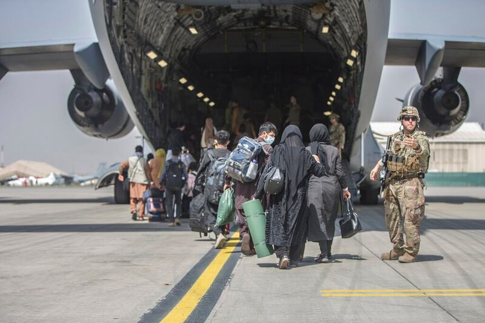
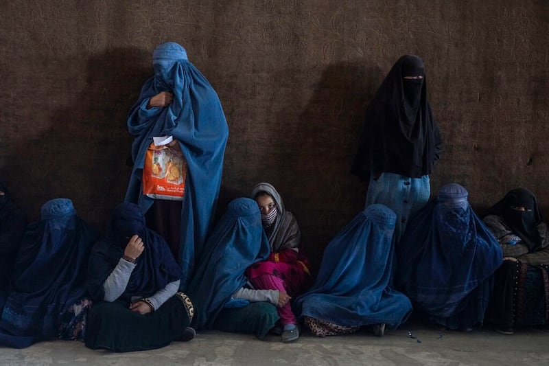
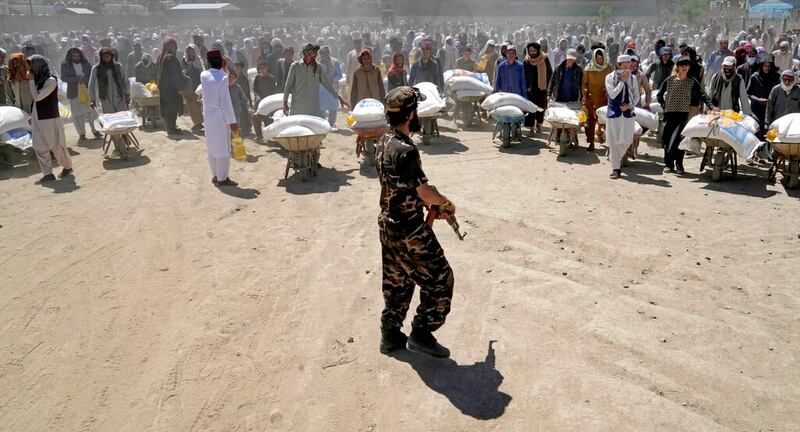

# 事實查覈｜美國自撤軍起就切斷了對阿富汗的所有援助嗎？

作者：沈軻，發自華盛頓

2023.09.07 16:31 EDT

## 標籤：誤導

## 一分鐘完讀：

8月15日,中國外交部發言人汪文斌在回應媒體有關阿富汗的提問時 [表示](https://www.mfa.gov.cn/web/fyrbt_673021/202308/t20230815_11127065.shtml),"某些國家"於美軍撤離後的2年裏,切斷了對阿富汗的援助、凍結資產、實施制裁,致使阿人民的苦難"雪上加霜";反觀中國,卻向阿富汗提供了大量物質上的幫助。汪文斌並在回答問題時並敦促"有關國家"切實從阿中汲取教訓,落實對阿援助承諾,確保阿全部被凍結資產儘快用於阿富汗民生急需。此前,汪文斌也曾多次點名敦促美方解除對阿富汗政府的資產凍結和單邊制裁。

亞洲事實覈查實驗室 （AFCL）發現這些說法有所誤導。雖然美國政府對阿富汗政府實施制裁、凍結了阿政府的資產，並切斷對阿政府的所有援助，但同時也繼續通過國際組織繼續援助阿富汗人民。

## 深度分析：

## 美國停止了援助阿富汗政府嗎？

是的。美國已經停止了對阿富汗政府的援助。

美國國務院在 [關於美阿關係的簡報](https://www.state.gov/u-s-relations-with-afghanistan/)中表示,自從塔利班政權於2021 年接管該國以來,美國就停止直接援助政府的"重建工作"(reconstruction)。 "重建工作"意指美軍在駐紮阿富汗期間向當時的阿國政府提供的援助,內容相當廣泛。

"重建"指將資金用於提供基本物資、促進教育和建造關鍵基礎設施,也指用於建立阿富汗國家安全部隊、打擊毒品販運,以及美國駐地機構運作所需的經費。根據阿富汗重建特別督察長辦公室(Special Inspector General for Afghanistan Reconstruction,SIGAR)提供的 [預算統計](https://www.sigar.mil/pdf/quarterlyreports/2023-07-30qr.pdf)顯示,這些費用佔美國在阿富汗支出的大部分,該政府部門負責監督與阿富汗有關的所有資金。

## 美國停止了所有對阿富汗的援助嗎？

沒有。目前美國仍然在向阿富汗人民提供援助，但會通過聯合國等第三方國際組織分配。

一方面，美國持續在向阿富汗提供食物等人道主義援助。

美國國際開發署（USAID）在電郵採訪中向亞洲事實查覈實驗室表示，“我們最大的人道主義合作伙伴-聯合國世界糧食計劃署​​(WFP)，在當地、區域和國際範圍內，提供糧食採購援助，並基於每天提供2100大卡熱量的目標，爲每人分配食品包。在有市場的地方，糧食計劃署還提供現金和糧食兌換券，確保援助的可持續性，提高目標社區在滿足糧食和營養需求方面，自力更生的能力。”

發言人指出，USAID的所有援助，都不是向塔利班當局、或是通過塔利班提供。 USAID所有人道和發展援助，都是對聯合國機構、經驗豐富且經過篩選的非政府組織、其他國際合作夥伴以及阿富汗當地夥伴的工作支持。

自2021年從阿富汗撤軍以來，美國繼續通過國際組織向阿富汗提供人道主義援助。 （美聯社圖片）

另一方面，美國對阿富汗的援助會側重保障婦女權利等人權，即使有時會遇到阻礙。

上述發言人表示：“我們與夥伴合作，減輕和解決塔利班干擾援助的企圖，並敦促婦女完全、不受阻礙地投入到援助工作中。”

然而根據媒體報道,隨着 [塔利班進一步限制](https://www.cna.com.tw/news/aopl/202212250002.aspx)阿富汗婦女在非政府組織和聯合國機構工作,國際在該國部分地區的援助,也因缺乏合適的人力而嚴重受阻,這可能會影響特定地區的援助分配。

美國和其它國家都嚴厲批評塔利班侵犯人權的紀錄,特別是在對待婦女方面。因此,美國建立援助阿富汗本地人的 "阿富汗基金"之際, [國務院也特別強調](https://www.state.gov/the-united-states-and-partners-announce-establishment-of-fund-for-the-people-of-afghanistan/),在援助當地人民的事上,既不會承認塔利班、也不會與之合作。

“婦女在阿富汗的人道行動中發揮關鍵作用。如果沒有女性工作人員，援助組織就無法接觸處於最危險境地的羣體，包括許多的婦女和女童。我們的合作伙伴繼續在婦女仍可以參與援助環節的地方運作。如果無法做到這一點，我們也準備好做出調整，甚至在某些極端的情況下，暫停或終止援助，以重新評估資金的運用。”

截至2023年8月，地緣政治和人權問題——特別是針對婦女的壓迫政策——導致塔利班政府仍未得到國際社會的承認。（美聯社圖片）

## 2022年，中國向阿富汗提供的援助是否超過美國？

沒有。數據顯示，中國提供的財政援助遠比美國少。

中國向阿富汗提供了多少援助?《南華早報》的 [一則報道](https://www.scmp.com/news/china/diplomacy/article/3184316/china-delivers-us37-million-aid-afghanistan-fulfilling-promise?module=perpetual_scroll_0&pgtype=article&campaign=3184316)指出,在塔利班政權執政後,北京2022年公開提供的捐款總額約爲三億元人民幣(摺合美金約4490萬),分兩次發放,一次是塔利班控制該國後、基於承諾給的兩億元,另一次則是阿富汗大地震後的人道援助。

2022年，阿富汗地震後，中國向阿富汗提供了援助，以幫助阿富汗救災。 （美聯社圖片）

相比之下,SIGAR的最近 [報告預算](https://www.sigar.mil/pdf/quarterlyreports/2023-07-30qr.pdf)顯示,2022年美國對阿富汗的援助已超過15億美元,是美國最大的受援國之一。

這些數字與ForeignAssistance.gov上公佈的 [13億美元數據](https://www.foreignassistance.gov/cd/afghanistan/2022/obligations/0)大致相符,這是一個由美國國會授權的網站,負責追蹤並透明化記錄,美國對外國的財政援助總額。由於該部門2022財年的支出彙報還在進行,具體援助數字與 SIGAR 略有不同。

USAID發言人並表示，“自塔利班於2021年8月接管阿富汗的2年裏，美國政府大幅增加了人道援助資金，並提供逾19億美元，支持阿富汗人民應對持續性的人道危機，其中包括來自USAID的部分，超過14億美元。”

“美國是阿富汗人道援助的最大單一捐助國，也會繼續爲該國的風險族羣提供支持。”

*亞洲事實查覈實驗室(* *Asia Fact Check Lab* *)是針對當今複雜媒體環境以及新興傳播生態而成立的新單位。我們本於新聞專業,提供正確的查覈報告及深度報道,期待讀者對公共議題獲得多元而全面的認識。讀者若對任何媒體及社交軟件傳播的信息有疑問,歡迎以電郵* *afcl@rfa.org* *寄給亞洲事實查覈實驗室,由我們爲您查證覈實。*

[Original Source](https://www.rfa.org/mandarin/shishi-hecha/hc-09072023162350.html)