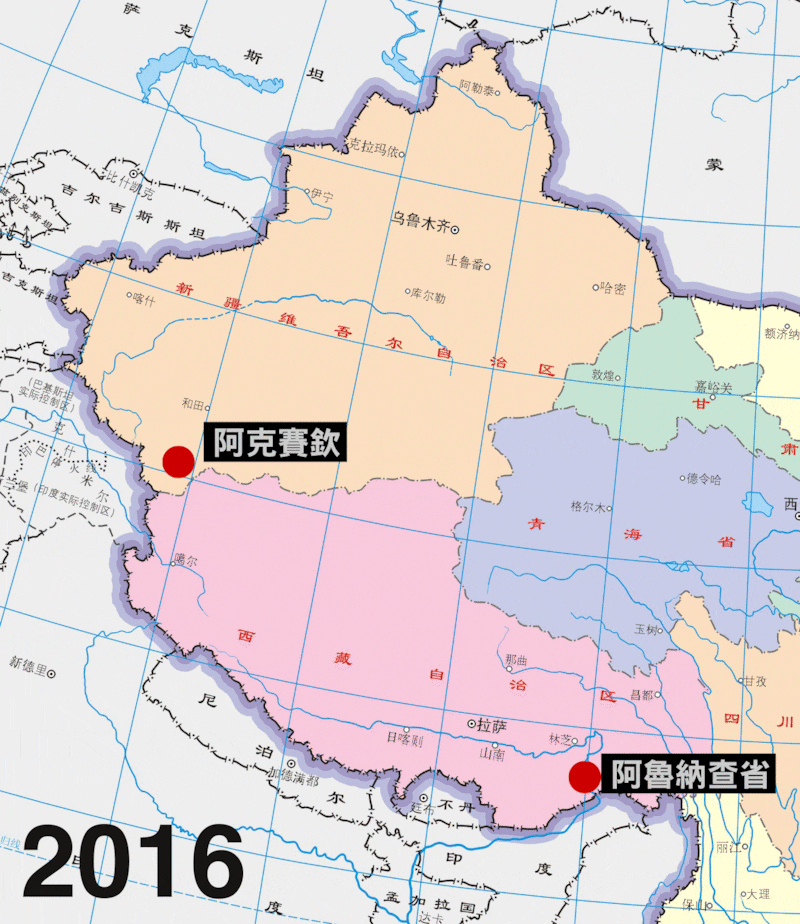
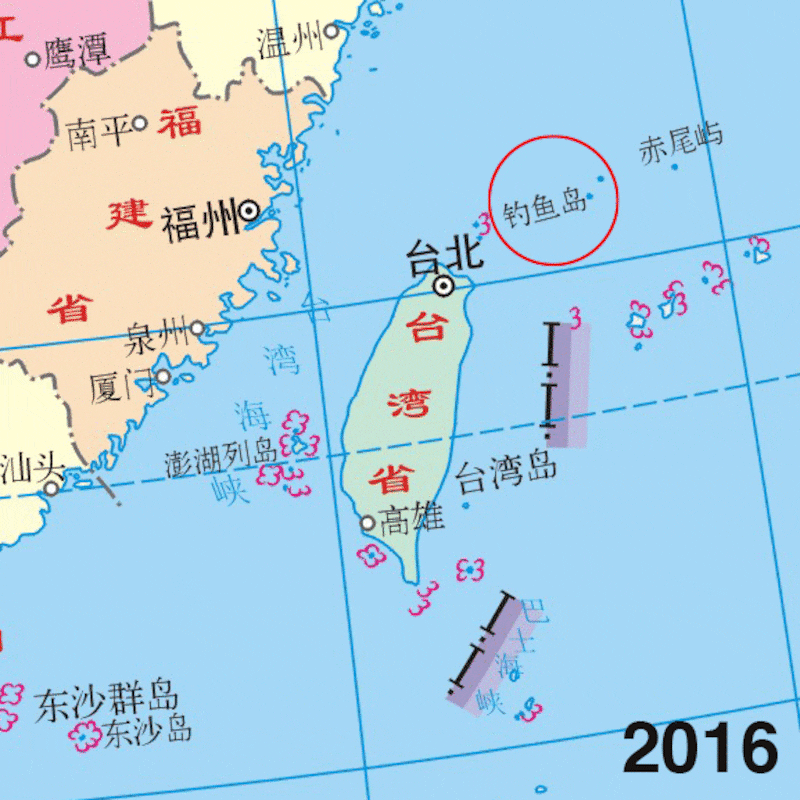
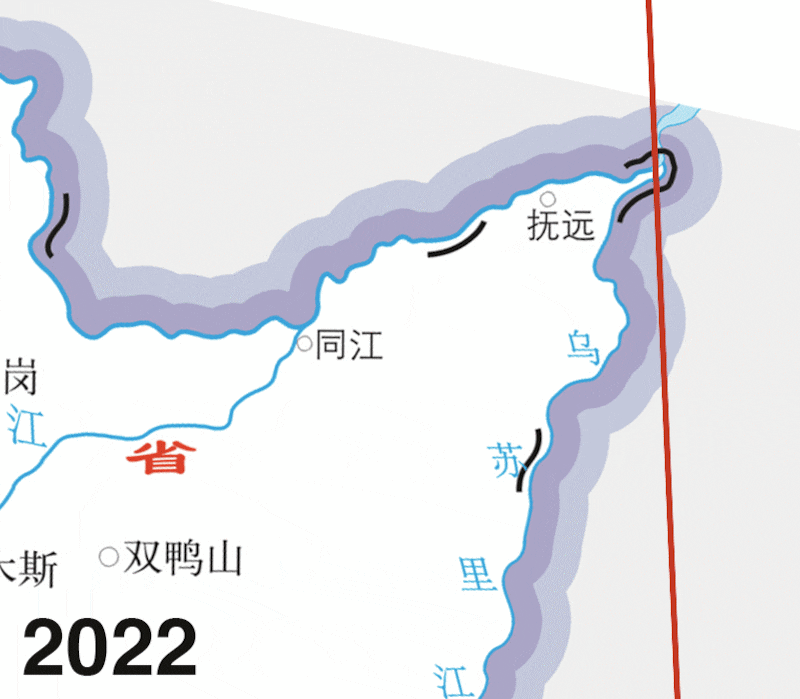
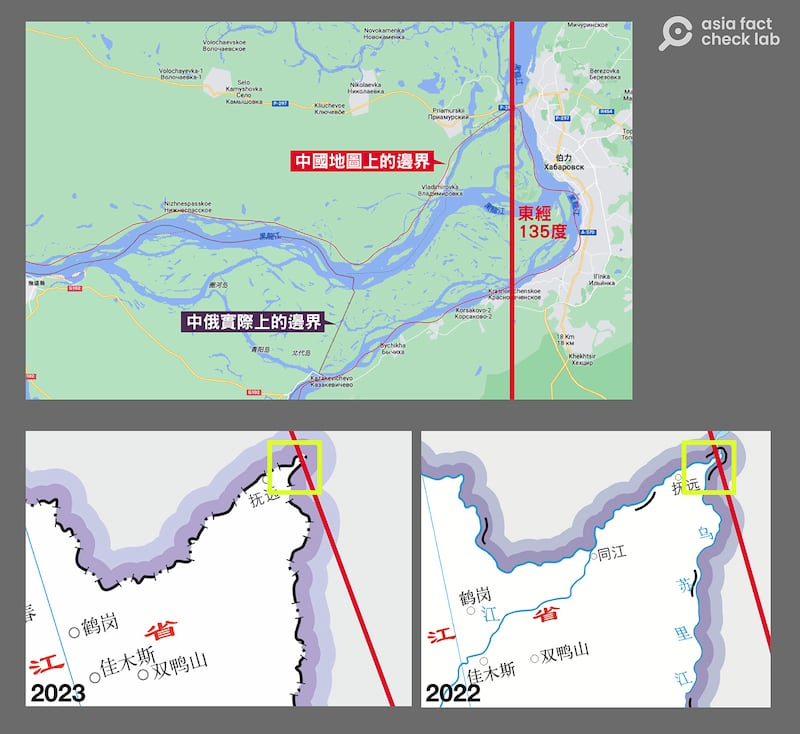

# 事實圖解：中國借2023年官版地圖"擴張領土"？

作者：董喆、鄭崇生，發自臺北、華盛頓特區

2023.09.08 14:43 EDT

## 標籤：部分錯誤

**一分鐘完讀**:

中國政府8月28日公佈“2023年版標準地圖”後，許多媒體報道指中國在該版地圖中將部分爭議領土劃入版圖，形同變相“擴張領土” 。但亞洲事實查覈實驗室發現，中國2023年版的標準地圖，在中印、中俄、臺灣、釣魚島和南海等地的劃界與過去數年的版本基本相同。

中國政府並不是藉由2023年官版地圖“擴張領土”，而是至少自2016年以來，就持續把爭議領土劃入中國境內。

## 深度分析：

一、西藏被印度侵佔的藏南地區在2023年地圖中劃入中國？

經查覈，2023年版標準地圖確實將中印爭議地區阿魯納查省（Arunachal Pradesh）以及阿克賽欽（Aksai Chin）劃入國界，但並非2023年才標註。2022年份標準地圖就已將兩區域納入中國國界，且就網路公開資料上，最早可回溯至2016年（審圖號：GS(2016)2889）版本就已經如此。

值得注意的是，中印兩國儘管仍有邊界紛爭，但中國官版地圖在爭議地區採用的都是“確定界線”而非“未定界線”。

2016至2023官版中國地圖中印邊界對比

二、中國2023年版本地圖將釣魚島列入領土？

標準地圖確實標示了釣魚島， 但中國標準地圖列入釣魚島最早可追溯至2016年（審圖號：GS(2016)2889）版本，並非2023年才第一次列入。

但因島嶼面積小，難以直接以圖面標色判斷中國是否列爲領土。但就政策文件來看，中國國務院新聞辦公室早在2012年發表《釣魚島是中國的固有領土》白皮書，宣稱釣魚島是中國固有領土。

同時，就自然資源部公佈的《公開地圖內容表示規範》明令，“中國全圖除了表示大陸、海南島、臺灣島外，還應當表示南海諸島、釣魚島及其附屬島嶼等重要島嶼。”

2016至2023官版中國地圖東南海域邊界對比

三、中國2023年版本地圖對南海採取十段線主張，藉此將臺灣劃入中國版圖？

標準地圖確實在臺灣東部標示了一段界線，連同傳統“九段線”一共十段。但中國標準地圖採十段線且列入臺灣最早同樣可以追溯至2016年【審圖號：GS(2016)2889】版本，並非2023年才第一次列入。

四、中國2023年版本地圖將黑瞎子島屬於俄羅斯的部分也劃入？

亞洲事實查覈實驗室比較了2022、2023兩年的官版地圖，發現地界的劃定幾乎相同，但兩個版本最大的差異在於：2022年版中俄兩國東段從呼倫湖到興凱湖之間的界線，採用的是代表“未定界”的虛線；但到了2023年，同一段界線已經改爲“確定界線”。

2023年官版中國地圖將2022年中俄未定邊界線改爲確定邊界線

關於中俄兩國東段邊境,涉及的相關條約有三:一是1992年的 [《中蘇國界東段的協定》](https://www.fmprc.gov.cn/web/wjb_673085/zzjg_673183/bjhysws_674671/bhgjty/ldbjty/202303/P020230320538669617544.pdf),確立了國界界點。二是2001年簽訂的 [《中俄睦鄰友好合作條約》](https://www.gov.cn/gongbao/content/2001/content_60963.htm),成爲第三個、也就是後來談判、於2004年簽署 [《中俄國界東段的補充協定》](https://www.fmprc.gov.cn/web/wjb_673085/zzjg_673183/bjhysws_674671/bhgjty/ldbjty/202303/P020230320538049906247.pdf)的基礎,確定黑瞎子島主權一分爲二。 [中國媒體曾形容](http://www.chinanews.com.cn/gj/gjxqdb/news/2008/07-11/1309302.shtml),"一島兩國"的黑瞎子島主權能通過談判要回來一半,已是勝利。

2008年,中俄雙方還在黑瞎子島上舉行界碑揭牌儀式,中國媒體當時 [報道](https://www.chinanews.com.cn/gn/news/2008/10-14/1410535.shtml)已明白寫出黑瞎子島只有西側屬於中國。2016年, [中國國家主席習近平登島談生態保育](http://www.xinhuanet.com/politics/2016-05/25/c_1118926335.htm),英國廣播公司(BBC) [指出](https://www.bbc.com/zhongwen/simp/china/2016/05/160525_china_xi_heixiazi),習近平是首位登上黑瞎子島的中國領導人。

中俄地圖邊界與實際邊界對比圖

亞洲事實查覈試驗室查覈中國官媒報道及google地圖顯示，中國領土的極東點並沒有超過東經135度。但對照中國2022和2023年的官版標準地圖，卻發現極東點明顯超越了東經135度，顯示中國確實將黑瞎子島屬於俄羅斯的部分也劃入本身領土。

*亞洲事實查覈實驗室(* *Asia Fact Check Lab* *)是針對當今複雜媒體環境以及新興傳播生態而成立的新單位。我們本於新聞專業,提供正確的查覈報告及深度報道,期待讀者對公共議題獲得多元而全面的認識。讀者若對任何媒體及社交軟件傳播的信息有疑問,歡迎以電郵* *afcl@rfa.org* *寄給亞洲事實查覈實驗室,由我們爲您查證覈實。*

[Original Source](https://www.rfa.org/mandarin/shishi-hecha/hc-09082023143602.html)