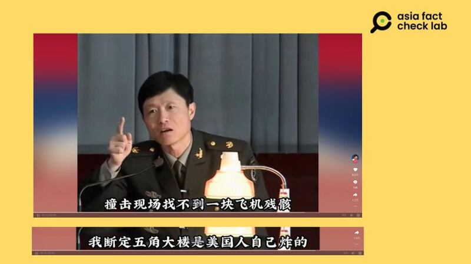
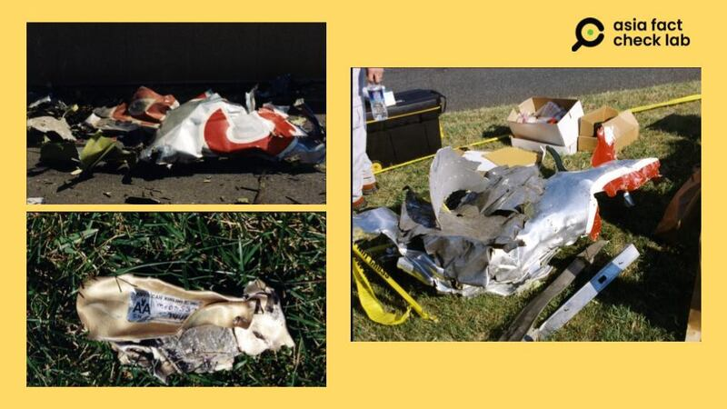
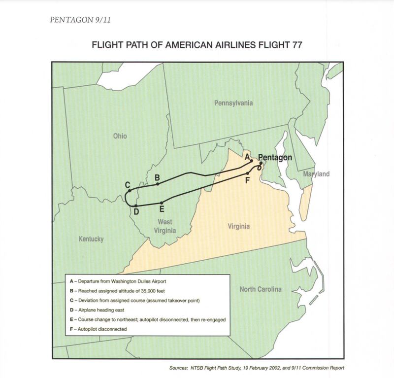

# 事實查覈 | 美國自導自演9·11事件？沒有飛機撞上五角大樓？

作者：鄭崇生，發自華盛頓

2023.09.11 17:21 EDT

## 標籤：錯誤

## 一分鐘完讀：

9·11事件22週年之際，世界各地媒體再次回顧當年的災難事件。中國社交媒體上的大部分討論爲回顧當年的新聞事件，但也有人稱9·11事件是“美國自導自演”的“謊言”。

一段已故中國南開大學教授艾躍進聲稱“沒有飛機撞進五角大樓”的舊視頻流傳最廣，該信息在紀念日期間在社交媒體平臺流傳，並由一批有影響力的用戶轉發。艾躍進關於事發現場“無殘骸”的說法與事實不符，他所引述的法國記者質疑9·11真實性的論斷也早已被多方闢謠。根據大量史料和新聞報道，流傳於中國社交媒體上的9·11陰謀論是不實信息。

## 深度分析：

截至美東時間9月11日上午12時,在 [新浪微博熱搜榜](https://m.s.weibo.com/vtopic/detail_new?click_from=searchpc&q=%23%E7%BE%8E%E5%9B%BD911%E4%BA%8B%E4%BB%B622%E5%91%A8%E5%B9%B4%23)上,9·11事件22週年的話題已經有超過7000萬人次的閱讀量,還一度登上熱搜第5名。但相關討論中,出現了一些質疑,宣稱9·11事件是"美國自導自演"的。

其中,自我介紹爲"媒體記者",新浪微博上有超過300萬粉絲的博主 ["小凡好攝"](https://weibo.com/1659893422/NiHSnc6Uf?refer_flag=1001030103_)等轉發一段前中國南開大學教授、軍事思想專家的 [艾躍進](https://www.thepaper.cn/newsDetail_forward_1459736)的講座視頻,以"9·11事件是誰幹的"爲題再次傳播的虛假信息,並標註爲"黃媒不會說的真相"(注:黃媒是中國官方媒體常用來形容香港獨立媒體的貶抑說詞)

新浪微博用戶"小凡好攝"轉發質疑9·11事件真實性的視頻（新浪微博截圖）

在這段至今在抖音等多個平臺流傳的 [舊視頻中](https://www.douyin.com/video/7183671295429594405),艾躍進說,"沒有飛機撞上五角大樓,那架飛機在進入華盛頓、還沒進的時候,就被打下來了,美國不願意承擔攻擊民航機的罪責",質疑9·11事件是美國一手自導自演。

艾躍進生前在講座上稱9·11事件中五角大樓"是美國人自己炸的"（抖音視頻截圖）

他還引述在歐洲爭議頗大的法國記者梅桑（Thierry Meyssan）2002年出版《9·11：漫天大謊》（9/11: The Big Lie）一書的內容，聲稱自己相信梅桑的觀點，包括撞擊現場找不到一塊飛機殘骸、五角大樓當年的意外是美國人自己炸的，意在爲發動阿富汗戰爭找藉口。

然而，艾躍進的說法不是事實。

2001年9月11日事發第一時間,美國輿論焦點確實多聚焦於紐約雙子星大樓,但恐怖分子劫機並自殺式攻擊五角大樓後,仍有許多美國媒體 [報道](https://web.archive.org/web/20090630075834/http:/archives.cnn.com/2001/CAREER/trends/09/11/witnesses/)並訪問目擊者,描述當時看到飛機低飛的情況。

另外,美國 [聯邦調查局](https://vault.fbi.gov/9-11-attacks-investigation-and-related-materials/9-11-images)(FBI)也曾公佈美國航空AA、編號77事故班機的殘骸 [照片](https://vault.fbi.gov/9-11-attacks-investigation-and-related-materials/9-11-images/9-11-pentagon-debris-1),在國防部的 [調查報告](https://history.defense.gov/Portals/70/Documents/pentagon/Pentagon9-11.pdf)中,還公開這架班機遭劫持後的航行軌跡,並詳細記錄當北美防空司令部(NORAD)出動三架F-16軍機升空,但在戰機抵達華盛頓地區前、美國航空遭劫持的客機就已經撞擊五角大樓。

美國聯邦調查局公佈的殘骸照片（美國聯邦調查局網站，亞洲事實查覈實驗室拼接製圖）

國防部公佈的失事飛機軌跡（美國國防部網站）

國防部後來也公佈停車場監視器拍攝到 [撞擊第一時間](https://www.youtube.com/watch?v=0SL2PzzOiF8)的瞬間畫面。

關於9·11的陰謀論,22年間在世界各地都時有浮現。梅桑當年出版有關9·11陰謀論的書籍在歐洲熱賣,中國媒體曾 [報道](http://news.sina.com.cn/w/2002-04-11/1448542778.html)過各方對該陰謀論的質疑。英語社交媒體上直到去年仍有所謂"事故現場沒有殘骸"等錯誤訊息流傳, [美聯社](https://apnews.com/article/fact-check-911-pentagon-airplane-debris-598153051732)、 [今日美國](https://www.usatoday.com/story/news/factcheck/2022/09/22/fact-check-baseless-claims-9-11-attack-pentagon-circulate/10390801002/)等媒體還爲此發佈了闢謠的事實查覈文章。

*亞洲事實查覈實驗室（Asia Fact Check Lab）是針對當今複雜媒體環境以及新興傳播生態而成立的新單位。我們本於新聞專業，提供正確的查覈報告及深度報道，期待讀者對公共議題獲得多元而全面的認識。讀者若對任何媒體及社交軟件傳播的信息有疑問，歡迎以電郵afcl@rfa.org寄給亞洲事實查覈實驗室，由我們爲您查證覈實。*

[Original Source](https://www.rfa.org/mandarin/shishi-hecha/hc-09112023171438.html)