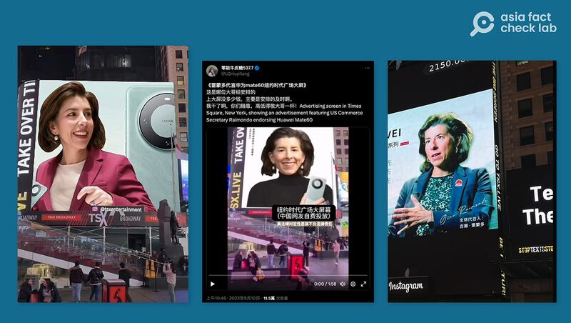
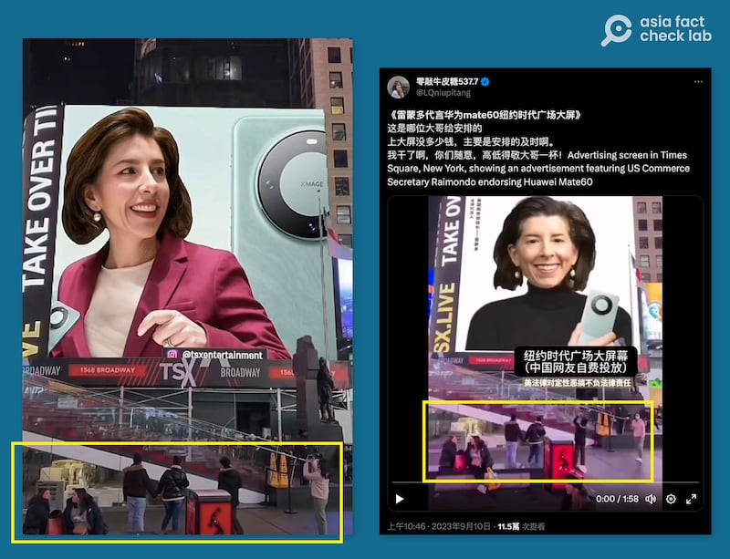
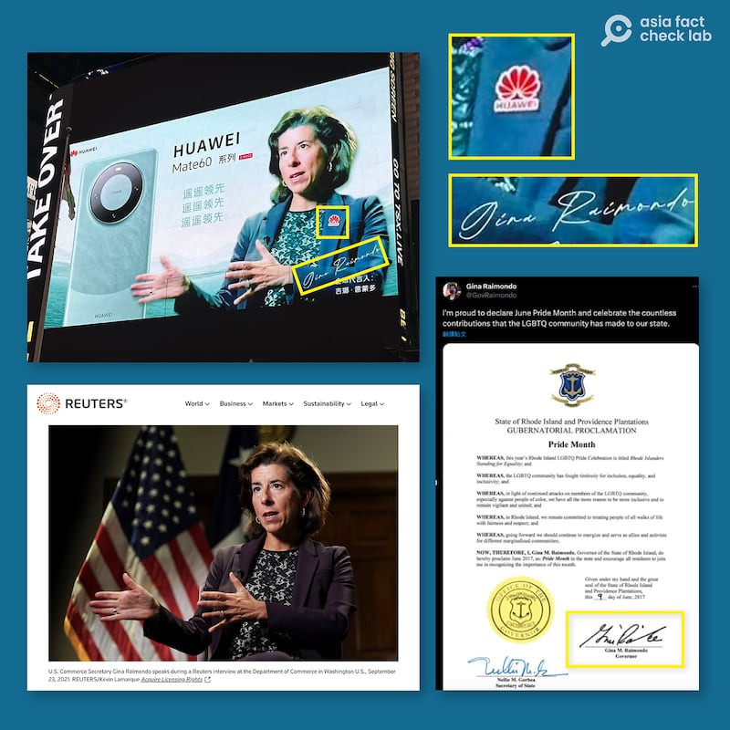
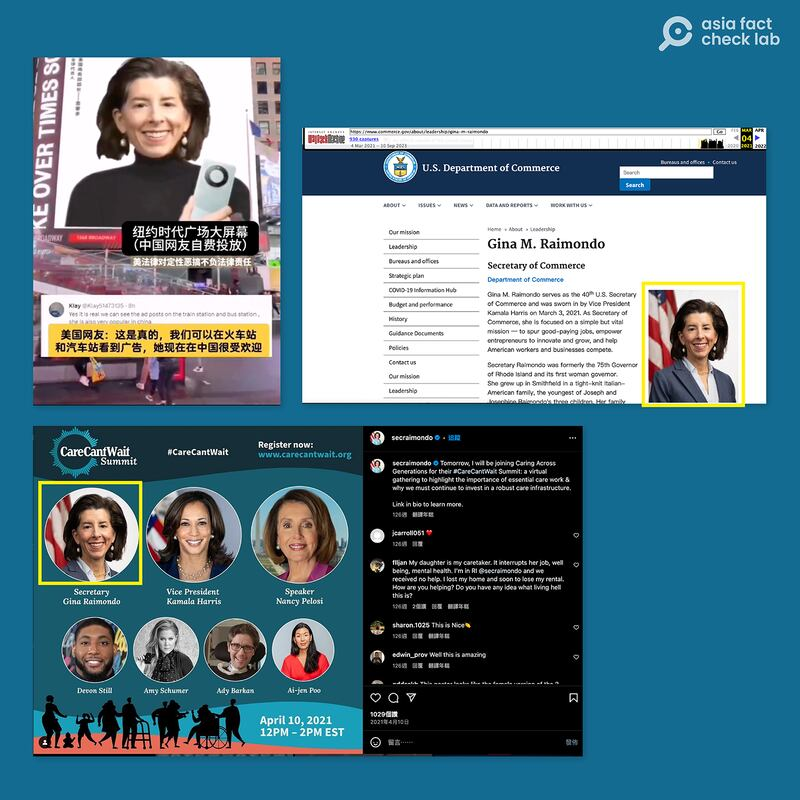
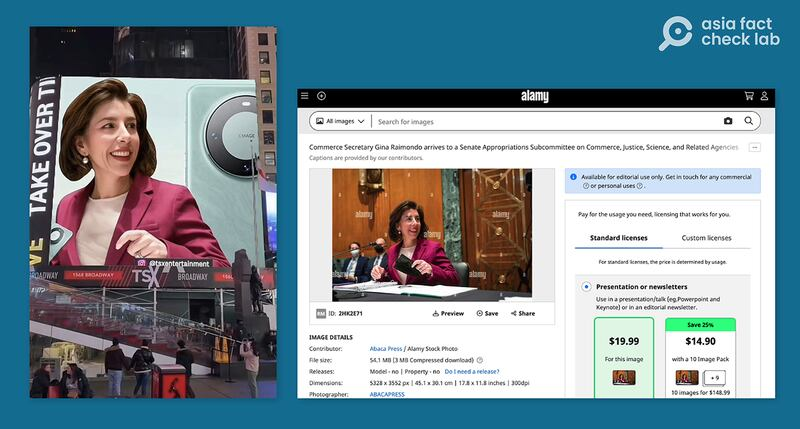
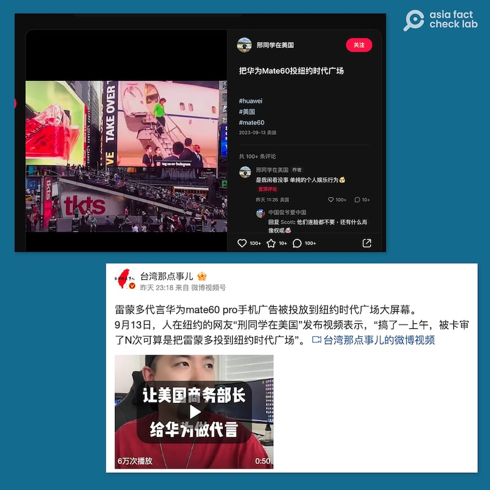

# 事實查覈｜美商務部長代言華爲？登上時代廣場廣告牌？

作者：董喆

2023.09.14 15:32 EDT

## 標籤：部分錯誤

## 一分鐘完讀：

中國和國際多個社交媒體平臺盛傳美國商務部長吉娜·雷蒙多（Gina Raimondo）“代言華爲”，相關“廣告”照片甚至登上美國紐約時代廣場的廣告牌。經查證，該“廣告”內容爲網友惡搞，將雷蒙多和華爲產品圖片拼接而成。至於盛傳於網絡的多個“雷蒙多代言華爲登上時代廣場”視頻，經分析，其中部分視頻爲僞造，但也有一段視頻大概率屬實，自稱發佈者的網友表示是爲了“個人娛樂”，將拼接內容送上付費廣告牌。

亞洲事實查覈實驗室發現，許多媒體的社媒賬號、時代廣場廣告牌在推送相關內容時，並沒有註明是惡搞、娛樂作品，有誤導受衆的可能。

## 深度分析：

八月底,美國商務部部長吉娜·雷蒙多訪華引發各方關注,隨後中國社交網站出現一批惡搞圖片、視頻,將對中國態度強硬的雷蒙多的照片拼接成華爲手機廣告,意在嘲弄美國對中國和華爲公司的限制。其中,隸屬於中央電視臺的抖音號"小央視頻" [發佈短視頻](https://www.douyin.com/user/MS4wLjABAAAADxxSM17aDo5GBB7mt6bHbOS2jzQpBxevn8Lh2rMkY8g?modal_id=7275599983103986985),將雷蒙多對華強硬的發言與其"代言華爲"的網友惡搞內容拼接在一起,受到大量關注,點贊數達40餘萬。

儘管大部分人都意識到這一系列"廣告"是搞笑作品,但社交媒體上也有不少人信以爲真,例如,在X上,就有部分不瞭解背景的網友 [發問](https://twitter.com/bunbuttf1/status/1698952774623625440)爲何雷蒙多會支持華爲。

## 網傳時代廣場刊登“華爲廣告”是真的嗎？

一週之後,該"廣告"內容繼續發酵, [網易](https://www.163.com/dy/article/IE98GA5P0556125Z.html)、小紅書與 [X](https://twitter.com/LQniupitang/status/1700702239306973574)(原推特)上開始流傳"雷蒙多代言華爲"登上美國時代廣場的廣告牌。亞洲事實查覈實驗室在X以及中國社交平臺上發現了至少三個宣稱是在美國紐約時代廣場投放雷蒙多代言華爲的視頻與照片,以及不少網友討論其是否爲真。

網傳時代廣場廣告牌上刊登"雷蒙多代言華爲"（抖音，X等社交媒體截圖）

根據網傳照片，“雷蒙多代言華爲廣告”刊登的版位由美國公司TSX ENTERTAINMENT負責， 民衆可以通過APP上傳自己的照片，付費出現在美國時代廣場看板。該公司提供直播網站和一段時間內的過往視頻，因保存時效有限，亞洲事實查覈實驗室並沒有直接取得相關畫面求證。

然而經分析,網上流傳的其中兩段視頻是造假、拼接而成。這些畫面中,行人衣着身着厚皮衣、羽絨衣甚至頭戴毛帽。而根據 [timeanddate網站](https://www.timeanddate.com/weather/usa/new-york/historic?month=9&year=2023)紀錄的九月紐約氣溫,落在攝氏33到21度之間,不可能出現大量民衆穿着冬裝的畫面。

網傳時代廣場照片中，民衆身穿冬季服裝，不太可能是紐約九月初的街景。（X等平臺截圖）

## “雷蒙多華爲廣告”是怎麼拼接成的？

針對兩張所謂“廣告”的截圖，亞洲事實查覈實驗室分別對其投放內容做查覈。

第一張圖中雷蒙多身着藍色西裝外套，左方展示華爲最新的Mate60系列手機。經查覈，原圖爲路透社記者Kevin Lamarque所攝，時間爲2021年9月23日的一次專訪中。原圖中雷蒙多身着的應爲深紫色西裝外套，且其手勢與耳環皆與合成圖相符，但左胸前並未有華爲標誌，“廣告”中的華爲胸章應是製作添加上的。

其中一張"雷蒙多代言廣告"由路透社照片拼接而成，並使用僞造簽名。（社交媒體、路透社、雷蒙多官方X賬號截圖）

另外,合成廣告上的簽名也與雷蒙多正式簽名不同。我們在雷蒙多的官方X帳號找到一張2017年她爲同志驕傲月簽署的 [相關文件](https://twitter.com/govraimondo/status/873286467702968320),其簽名與合成圖相去甚遠。因此合成廣告上的簽名應屬僞造。

另一張網傳"廣告"照片用雷蒙多官方形象照片拼接而成（社交媒體、美國商務部官網截圖）

另一張廣告照則是雷蒙多身着黑色套頭毛衣，並手持華爲最新型手機。亞洲事實查覈實驗室以局部照片反搜，發現此照片可能是截取雷蒙多2021年上任商務部長時的形象照，該照片還發佈於2021年4月她的官方Instagram帳號，其配飾與臉部角度皆與廣告合成照相同。

另一張"雷蒙多華爲廣告"爲新聞圖片拼接（社交媒體和Alamy圖庫截圖）

第三張廣告是雷蒙多身着粉色套裝,身後擺放華爲最新手機。亞洲事實查覈實驗室以搜尋引擎反搜,在 [alamy圖庫](https://www.alamy.com/commerce-secretary-gina-raimondo-arrives-to-a-senate-appropriations-subcommittee-on-commerce-justice-science-and-related-agencies-hearing-on-expanding-broadband-access-on-capitol-hill-in-washington-dc-usa-on-tuesday-february-1-2022-photo-by-sarah-silbigerpoolabacapresscom-image459203109.html)中發現此張合成圖中取自2022年2月1日雷蒙多出席國會撥款委員會商務、司法、科學及相關機構小組聽證會的照片,且原圖中雷蒙多手持口罩,在合成圖中被移除。

## 網友：發佈視頻是“單純個人娛樂”

通過進一步查證，我們發現，儘管網傳的部分視頻與截圖爲假，但在衆多有關時代廣場“雷蒙多代言華爲廣告”內容中，有一段視頻，極有可能是真的。

微博視頻號“臺灣那點事兒”發貼表示，人在紐約的網友“刑同學在美國”（其中“刑”應爲“邢”的錯用）發佈視頻，稱“搞了一上午，被卡審了N次，可算是把雷蒙多投到紐約時代廣場”，視頻中還展示了該網友用TSX公司後臺上傳視頻的手機界面，顯示他多次付款（40美元）失敗後，最終通過。但該視頻號並未提供視頻原始鏈接。

自稱購買投屏廣告的網友講述、展示發佈過程（小紅書、新浪微博截圖）

通過搜尋,我們找到小紅書賬號"邢同學在美國",發表其把華爲Mate60投放到紐約時代廣場的 [影片](https://www.xiaohongshu.com/explore/65012ba50000000014027b1b?app_platform=ios&app_version=7.92&share_from_user_hidden=true&type=video&xhsshare=CopyLink&appuid=5481dba1d6e4a97e1fef4bbf&apptime=1694648333),影片中使用雷蒙多手持華爲手機的照片以及訪華時下飛機時新聞剪輯,結尾時大字幕顯示華爲廣告語"遙遙領先"。該賬號在回覆留言時稱"是我閒着沒事,單純的個人娛樂行爲",但展示在時代廣場的影片中,並未出現任何有關該作品並不真實,爲娛樂目的的提示。

亞洲事實查覈實驗室試圖聯繫廣告牌公司TSX ENTERTAINMENT，詢問是否有收到與雷蒙多代言華爲的廣告刊登委託，以及該公司對投屏廣告的審覈標準，截至截稿時間，未獲得回應。

*亞洲事實查覈實驗室(Asia Fact Check Lab)是針對當今複雜媒體環境以及新興傳播生態而成立的新單位。我們本於新聞專業,提供正確的查覈報告及深度報道,期待讀者對公共議題獲得多元而全面的認識。讀者若對任何媒體及社交軟件傳播的信息有疑問,歡迎以電郵* *afcl@rfa.org* *寄給亞洲事實查覈實驗室,由我們爲您查證覈實。*

[Original Source](https://www.rfa.org/mandarin/shishi-hecha/hc-09142023152132.html)