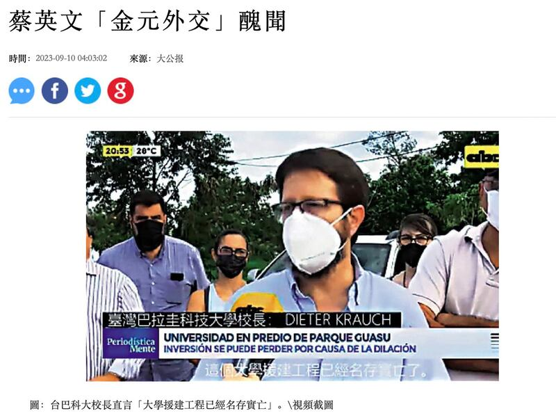
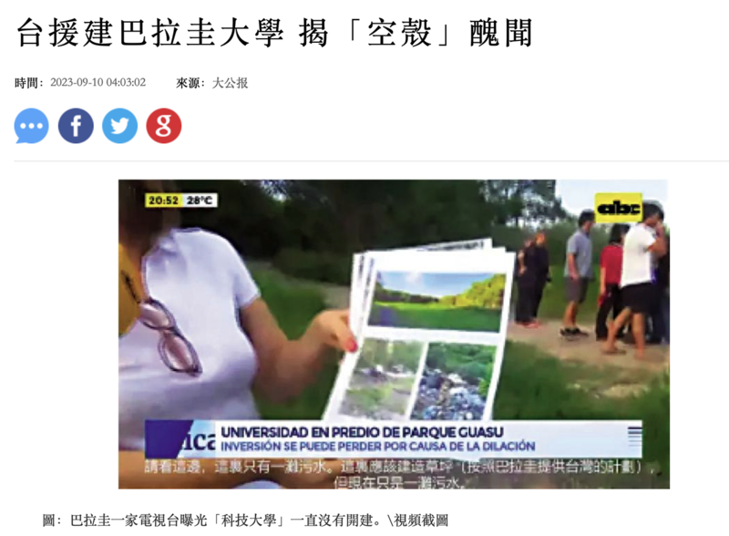

# 事實查覈｜臺灣在巴拉圭援建的大學是“空殼”嗎？

作者：莊敬

2023.09.15 13:27 EDT

標籤：錯誤

## 一分鐘完讀：

《大公報》等中國媒體近日刊文，指巴拉圭電視臺去年調查發現，由臺灣出資援建的“臺灣巴拉圭科技大學”一直沒有開建，疑爲“空殼大學”，校長受訪時甚至直言，大學援建工程已經名存實亡；報道並附上校長受訪的視頻截圖爲證。

經查詢學校網站、其他媒體報道等資料，視頻中受訪者並非臺巴科大校長，且該受訪者當時談論的是工程因環境問題遭推遲，而非名存實亡。臺科大駐巴計劃辦公室則表示，“巴國政府允諾的實體校舍刻依據民主法治程序推動興建中”。

## 深度分析：

今年8月中，臺灣副總統賴清德出訪巴拉圭期間會見“臺巴科技大學”學生，卻有網民爆料臺巴科大爲空殼學校。臺灣的外交部隨即駁斥此網路不實訊息，並說明今年已是計劃運作的第5年，但由於實體校舍尚待建設，因此首屆學生前兩年暫借用巴國奧運委員會的場地研習基礎課程，後兩年在臺灣科技大學完成課程，並於今年7月畢業。

臺灣與巴拉圭於2017年12月簽署設立“臺巴科技大學”意向書，這所學校由巴方編列預算，負擔興建校舍，臺灣負責由臺灣科技大學派遣師資、設計課程等，設有機電工程、資訊工程、營建工程、工業工程等四個科系。

雖然臺灣方面已澄清網傳謠言,但該計劃運作第5年仍未完成興建實體校舍,引起議論。近日有多家中國、香港媒體接連針對此事刊文,包括 [星島網](https://www.singtao.ca/6366692/2023-09-06/news-%E6%B0%91%E9%80%B2%E9%BB%A8%E5%A4%96%E4%BA%A4%E5%A4%A7%E6%92%92%E5%B9%A3%EF%BC%9F%E7%B6%B2%E5%82%B3%E5%8F%B0%E6%8F%B4%E5%B7%B4%E6%8B%89%E5%9C%AD%E5%BB%BA%E3%80%8C%E7%A9%BA%E6%AE%BC%E3%80%8D%E5%A4%A7%E5%AD%B8/?variant=zh-hk)報道、《巴士的報》博客 ["毛拍手"](https://www.bastillepost.com/hongkong/article/13324118-%E5%8F%B0%E5%B7%B4%E7%A7%91%E6%8A%80%E5%A4%A7%E5%AD%B8%E7%88%86%E3%80%8C%E7%A9%BA%E6%AE%BC%E9%A8%99%E5%B1%80%E3%80%8D%E9%86%9C%E8%81%9E-%E7%B6%B2%E6%8F%AD%E8%94%A1%E6%94%BF%E5%BA%9C%E6%92%92%E9%8C%A2)、觀察者網作者 ["橙哥迷妹](https://user.observersnews.com/main/content?id=1080748&s=fwzxhfbt)"都發表相關文章。

《大公報》官網"大公網"9月10日刊登《 [臺援建巴拉圭大學揭"空殼"醜聞](http://www.takungpao.com.hk/news/232110/2023/0910/890979.html)》、《 [蔡英文"金元外交"醜聞](http://www.takungpao.com.hk/news/232110/2023/0910/890981.html)》,提及去年巴拉圭一家電視臺發現,這所大學一直沒有開建,仍是一片荒地;校長接受媒體採訪時甚至直言,大學援建工程已經名存實亡。 "大公網"文章並附上巴拉圭電視臺去年採訪的視頻截圖爲證(下圖)。

大公網報道臺灣援建巴拉圭大學“空殼”醜聞的兩篇報道均附上巴拉圭電視臺採訪視頻截圖，稱臺巴科大校長直言援建工程已名存實亡。（圖/大公網截圖）

## 校長證實援建工程已名存實亡？

亞洲事實查覈實驗室“大公網”的視頻截圖，與文章中稱“校長證援建工程已名存實亡”均爲錯誤信息。

首先,臺巴科大網站上的文件,以及巴國媒體 [《今日報》(Hoy)](https://www.hoy.com.py/nacionales/universidad-taiwan-paraguay-en-dos-anos-estara-la-sede-en-terreno-de-copaco)2022年的報道顯示,臺巴科大校長是維拉斯格(Carlino Velázquez),並非視頻中的受訪者克勞赫(Dieter Krauch);而克勞赫在"領英"上自介爲 [臺巴科大學術副校長](https://www.linkedin.com/in/dieter-krauch-2aa0426a/?originalSubdomain=py),2021年 [臺灣駐巴使館新聞稿](https://www.taiwanembassy.org/py/post/13935.html)稱克勞赫爲臺巴科大工程學院院長。

亞洲事實查覈實驗室找到《大公報》的視頻截圖來源-巴拉圭ABC電視臺去年4月11日的 [採訪視頻](https://www.youtube.com/watch?v=UyIGibgrHFo),將西班牙語翻譯成中、英文後的內容顯示,克勞赫等受訪教職員與學生當時談論校舍工程因環境問題、政治利益而遭推遲,巴拉圭可能面臨失去這項計劃的風險。

此外,巴拉圭《國家報》(La Nacion)去年4月11日也發佈 [相關報道](https://www.lanacion.com.py/politica/2022/04/11/dilatacion-en-la-construccion-de-la-sede-de-la-universidad-taiwan-hay-trabas-politicas-lamentan/),克勞赫受訪時說,校舍工程只想使用公園附屬的部分土地,但政府以環境問題爲由而推遲,他很遺憾巴拉圭政府總說應該投資教育,卻讓一個培養高級專業人員的計畫面臨政治性的障礙。據 [2018年資料](https://www.taiwanembassy.org/py/post/10358.html),建校預定地位於亞松森通往巴國國際機場主要幹道交匯處,毗鄰Ñu Guazú公園等綠地園區。

後續巴拉圭媒體的 [報道](https://www.hoy.com.py/nacionales/universidad-taiwan-paraguay-en-dos-anos-estara-la-sede-en-terreno-de-copaco)顯示,原毗鄰公園綠地的建校預定地因環境問題受阻後,臺巴科大尋找其他土地作爲替代方案。

## 臺巴科大實體校舍“推動興建中”

亞洲事實查覈實驗室向多個相關單位查證，臺科大駐巴計劃辦公室主任陳堯中回覆表示，巴國政府允諾的實體校舍刻依據民主法治程序推動興建中，期間巴方協調暫借奧林匹克委員會及軍事學校校舍供該校使用，臺灣政府另安排大三學生赴臺在臺灣科技大學研習進階及實驗課程與企業實習；該校第一屆學生已於今年順利畢業。

陳堯中並說，今年7月巴拉圭候任總統貝尼亞（Santiago Peña）訪臺時曾與臺巴科大留臺學生互動，並表達將加速該校永久校區的興建。

亞洲事實查覈實驗室另發送電郵詢問臺巴科大、視頻中的受訪者克勞赫、巴拉圭駐臺使館，至截稿前尚未獲回應。

*亞洲事實查覈實驗室(Asia Fact Check Lab)是針對當今複雜媒體環境以及新興傳播生態而成立的新單位。我們本於新聞專業,提供正確的查覈報告及深度報道,期待讀者對公共議題獲得多元而全面的認識。讀者若對任何媒體及社交軟件傳播的信息有疑問,歡迎以電郵* *afcl@rfa.org* *寄給亞洲事實查覈實驗室,由我們爲您查證覈實。*

[Original Source](https://www.rfa.org/mandarin/shishi-hecha/hc-09152023132348.html)