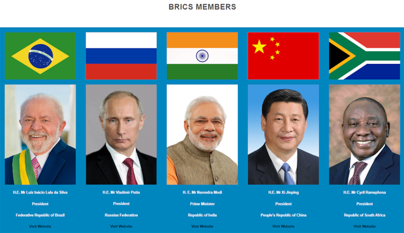

# 事實查覈｜金磚國家擴張到84國了嗎？

作者：Taejun Kang

2023.09.16 09:00 EDT

標籤：錯誤

## 一分鐘完讀：

在2023年的"金磚國家(BRICS)峯會"之後,金磚國家的領導人們決定接納新成員。一條在韓語社交媒體圈傳播的 [貼文](https://web.archive.org/web/20230913054152/https://cafe.daum.net/trumpandtheknight/nck5/6760)聲稱,金磚國家目前已經有84名正式成員。類似說法在中文互聯網也有出現。

經亞洲事實查覈實驗室查證,這個說法是錯誤的,2023年金磚國家確實決定 [接納六名新成員](https://web.archive.org/web/20230913065052/https://www.reuters.com/world/brics-poised-invite-new-members-join-bloc-sources-2023-08-24/),未來正式成員將是11名,而不是84名。

## 深度分析

金磚國家日前在南非約翰內斯堡舉行年度領袖峯會，在峯會上決議該組織將接納新成員。消息一傳出，韓國最有影響力的在線社區之一 “Daum Cafe”上就出現這樣一則貼文：

“事實上，正式的BRICS成員數爲84名。他們都同意並支持Nesara Gesara。BRICS正在主導世界。”這則貼文不僅在“Daum Cafe”上被大量用戶轉發、分享。也在韓國最大的博客平臺Naver Blog以及兩家持反美和親中立場的韓文報紙網路版上分享。

金磚國家"擴員到84國"的說法也見諸中文互聯網,例如,Youtube上擁有25萬粉絲的中文賬號"環球新視野"發佈短視頻, [標題](https://www.youtube.com/watch?v=8caPznk3sRs)稱"金磚會議成員名單太恐怖!84國齊聚要讓美國償命!"

韓國社交媒體流傳金磚國家“擴大到84國” （圖/Daum Cafe 截圖）

## 金磚國家擴員的事實是什麼？

金磚國家峯會 [官網顯示](http://web.archive.org/web/20230913064617/https://brics2023.gov.za/),聯盟目前共有五個正式成員,分別是巴西、俄羅斯、印度、中國和南非。在今年8月的峯會期間,金磚國家的領導人決定接納六個新成員國:阿根廷、埃及、埃塞俄比亞、伊朗、沙特阿拉伯和阿拉伯聯合酋長國,他們將在2024年1月正式加入。

金磚國家有五個正式成員（圖/BRICS官網截圖）

金磚國家領導人確實爲未來的擴員留下了機會，目前數十個國家表達了加入的興趣，希望金磚國家可以平衡全球競爭格局。 但目前的進展是，金磚國家的官方成員總數將達到11個，而不是84個。

## 貼文中的“Nesara Gesara”指的是什麼？

Nesara Gesara是一種 [陰謀論](https://web.archive.org/web/20230913064413/https://www.usatoday.com/story/news/factcheck/2022/04/13/fact-check-no-congress-has-not-passed-nesara/9515254002/),暗示美國將進行某種大規模的經濟重整行動,藉以消除所有債務。

這個理論源自20世紀90年代美國部分政治人物提出的國家經濟安全與復甦法案（National Economic Security and Recovery Act，NESARA），提案倡導取消貸款的複利利息、用國家銷售稅代替所得稅，並將美元恢復爲金本位。雖然這些措施從未正式提交給國會，但陰謀論者認爲，這項決議在9/11事件後已經由布什總統祕密批准，但並不爲人知。

在韓國，這樣的陰謀論在反美和親中的互聯網用戶之間廣泛傳播，相信者認爲中國將領導世界秩序，從而認爲聲稱擴大金磚集團可以爲建立中國領導世界的新秩序奠定基礎。

亞洲事實查覈實驗室（Asia Fact Check Lab）是針對當今複雜媒體環境以及新興傳播生態而成立的新單位。我們本於新聞專業，提供正確的查覈報告及深度報道，期待讀者對公共議題獲得多元而全面的認識。讀者若對任何媒體及社交軟件傳播的信息有疑問，歡迎以電郵afcl@rfa.org寄給亞洲事實查覈實驗室，由我們爲您查證覈實。

[Original Source](https://www.rfa.org/mandarin/shishi-hecha/hc-09152023173309.html)