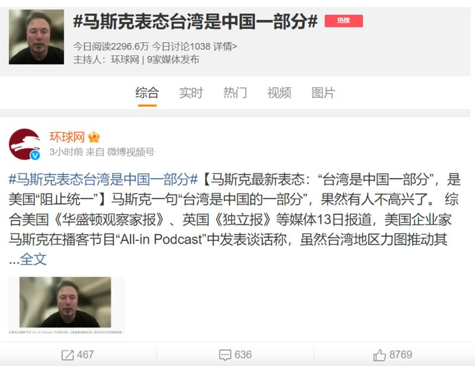

# 事實查覈｜馬斯克表態臺灣是中國的一部分？

作者：莊敬

2023.09.18 15:35 EDT

## 查覈結果：誤導

## 一分鐘完讀：

9月14日，話題“馬斯克表態臺灣是中國的一部分”一度登上微博熱搜，許多網民轉發“環球網”的《馬斯克最新表態：臺灣是中國一部分，是美國阻止統一》報道。

美國企業家馬斯克（Elon Musk）近日確實在一場活動談論了中國，但其原話是“中國的政策一直是統一臺灣和中國，從他們的角度來看，也許這就類似於夏威夷，（臺灣）是中國不可分割的一部分”。馬斯克這段談話貌似立場親中，引發不少討論，然而，對於臺灣問題，他當時在談的是他所瞭解的中方立場，而非他的個人想法。部分媒體轉載時忽略前後文，以“馬斯克表態”爲題，造成誤導。

## 深度分析：

9月14日午間,話題"馬斯克表態臺灣是中國的一部分"登上微博熱搜第5名。許多網民轉發環球網刊登的《 [馬斯克最新表態:臺灣是中國一部分,是美國阻止統一](https://world.huanqiu.com/article/4EX9IFfjVbr) 》,這則報道引述英國 [《獨立報》](https://www.independent.co.uk/news/world/americas/taiwan-elon-musk-china-twitter-b2411012.html) ,指馬斯克在一場活動表示,他認爲自己很瞭解中國,並且將臺灣與中國的關係比作夏威夷州與美國的關係,"他堅稱臺灣是中國不可分割的一部分,卻被武斷地(認爲)不屬於中國"。

該文寫道，馬斯克隨後提到“統一政策”，宣稱是美國阻止了任何形式的統一努力。

四川廣播電視臺新媒體" [四川觀察"抖音號](https://www.douyin.com/video/7278577468548648252) 則將馬斯克的發言剪輯成14秒短片,標題寫着"馬斯克公開表態:臺灣是中國不可分割一部分,並向美國發出警告:中國軍事實力將超美"。另有作者在"今日頭條"等平臺 [發文](https://www.toutiao.com/article/7279961823883969059/?source=aweme_search&wid=1695016001166) ,稱馬斯克發表重要聲明:"臺灣是中國的一部分,美國應該停止干涉中國的統一進程。"

9月14日午間，“馬斯克表態臺灣是中國的一部分”登上微博熱搜，許多網民轉發“環球網”的相關報道。（圖/微博截圖）

馬斯克的言論在中國、臺灣引起廣泛討論。臺灣的外交部長吳釗燮在社媒X（原推特）回應此事說：“臺灣不是中華人民共和國的一部分，更不能被賣掉”，外交部發言人劉永健在記者會上說，如果爲了商業利益做此發言，如此言論不值得重視，發言者也不值得尊重。

## 馬斯克說了什麼？

亞洲事實查覈實驗室重新觀看了馬斯克的發言,他在9月13日通過視頻參加播客節目"All-In Podcast"舉辦的"All-In Summit 2023",在 [視頻](https://www.youtube.com/watch?v=tKqJ5-kkUGk) 的32分45秒處,主持人問馬斯克,如何看待美中關係走向。馬斯克首先說明旗下企業並非全部進入中國市場,例如中國不允許使用"星鏈"(Starlink)衛星網絡服務。之後自視頻33分40秒處,他開始談論美中臺關係。

馬斯克表示，“我認爲我很瞭解中國，我到訪中國多次，過去多年見了許多層面的高階領導人。”

“最根本的問題是臺灣。”馬斯克說，中國的政策一直都是要以某種形式統一臺灣和中國，“從他們角度來看，也許這類似於夏威夷，是中國不可分割的一部分，卻自稱不是中國一部分，主要是因爲美國特別地阻止了任何形式的統一努力。”

接着馬斯克表示，中國的軍事實力不斷增強，美國的軍事實力則停滯，就戰略上，可以想像保衛臺灣並不容易，因爲它離中國很近；因此當未來中國在區域的軍事實力超越美國時，就可能發生用武力將臺灣併入，“他們（指中國）是這麼說的，如果沒有外交解決方案，就只能武力解決。”

這並非馬斯克第一次談論臺灣,他去年接受《 [金融時報》採訪](https://www.ft.com/content/5ef14997-982e-4f03-8548-b5d67202623a) 時說:"我的建議是⋯⋯爲臺灣構思某種合理可行的特別行政區,這可能不會讓所有人都滿意。"

雖然馬斯克的言論常引爭議，但檢視“All-In Summit 2023”的完整視頻便可知，馬斯克當時在說“從他們（指中國）的角度”，並沒有說“我的想法”，也沒有說出“美國應該停止干涉中國的統一進程”，部分中國媒體報道與網絡文章卻忽略前後文，傳播含有誤導或錯誤資訊的內容。

## 專家評馬斯克：不太瞭解國際關係

美國在臺協會（AIT）臺北辦事處前副處長葛天豪（David Keegan）認爲，馬斯克表現出不太瞭解國際關係，也不太知道捍衛民主和自治權的重要性；馬斯克所說有關臺灣和中國關係的言論，並不正確且具誤導性，但這對他而言並不重要，重要的是能取悅北京當局。

AIT臺北辦事處前處長包道格（Douglas Paal）則指出，馬斯克的言論令人困惑，他似乎不太瞭解有關臺灣的政策；考量特斯拉在中國的投資，馬斯克的發言可能出於私利。

至於美國對兩岸事務的立場，包道格說，美國幾十年來一貫的立場是，應由臺灣人民以和平、民主的方式決定。葛天豪也說，美國明確表態，致力於和平解決臺灣與中國的分歧，且解決方案應符合臺灣人民意願。

*亞洲事實查覈實驗室（Asia Fact Check Lab）是針對當今複雜媒體環境以及新興傳播生態而成立的新單位。我們本於新聞專業，提供正確的查覈報告及深度報道，期待讀者對公共議題獲得多元而全面的認識。讀者若對任何媒體及社交軟件傳播的信息有疑問，歡迎以電郵afcl@rfa.org寄給亞洲事實查覈實驗室，由我們爲您查證覈實。*

[Original Source](https://www.rfa.org/mandarin/shishi-hecha/hc-09182023152820.html)