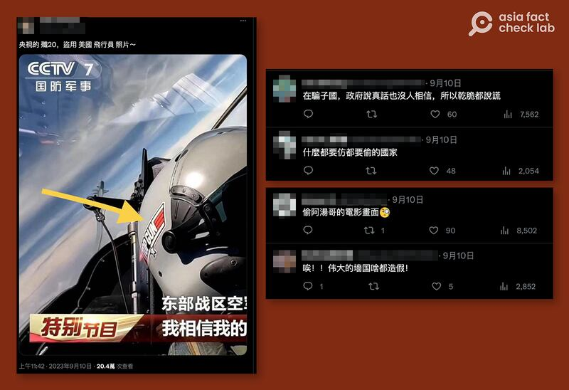
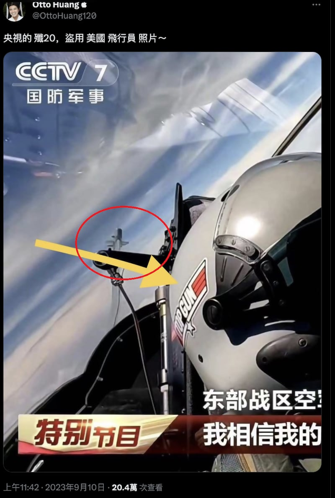
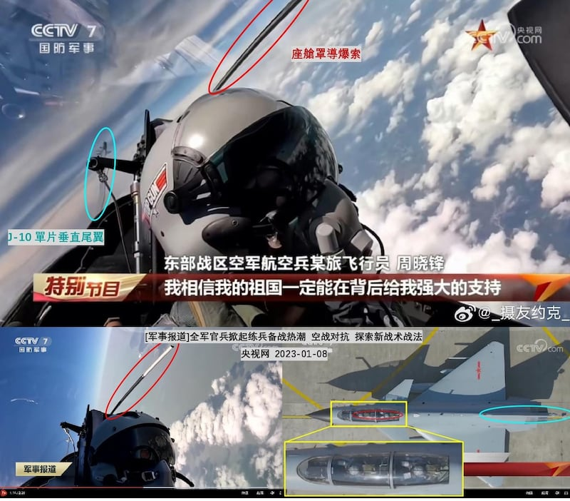
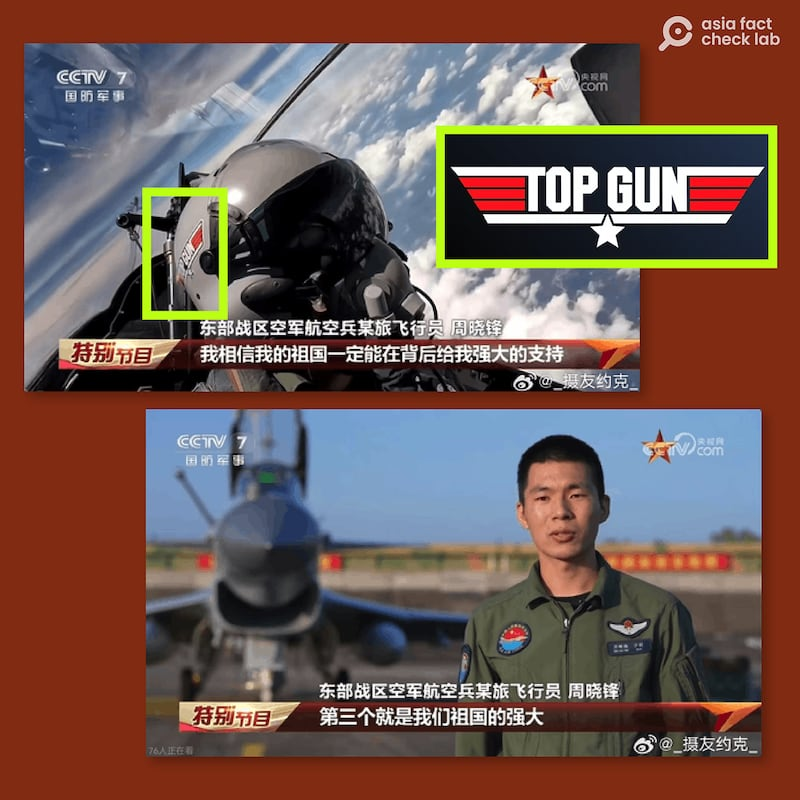

# 事實查覈｜頭盔上貼着“TOP GUN”，央視畫面中的飛行員是解放軍嗎？

作者：董喆，發自臺北

2023.09.19 15:12 EDT

## 查覈結果：正確

## 一分鐘完讀：

近期X(原推特)上流傳一張中央電視臺國防軍事頻道的 [節目截圖](https://archive.ph/Muktn), 一名解放軍飛行員頭盔上貼着"Top Gun"標誌的貼紙,推主聲稱"央視的殲20,盜用美國飛行員照片"。亞洲事實查覈實驗室詢問多位軍事專家,確認該圖爲殲10戰機,並非盜用美軍飛行員照片。

## 深度分析：

一名推主近日在Ｘ（原推特）發佈一張CCTV7(央視國防軍事頻道)節目的截圖，畫面中飛行員的頭盔上貼着美國電影《壯志凌雲》中代表美軍頂級飛行員的標誌“TOP GUN”，博主留言稱“央視的殲20，盜用美國飛行員照片”。

留言處網民稱“在騙子國，政府說真話也沒人相信，所以乾脆都說謊”、“唉！！偉大的牆國啥都造假！”

網傳央視節目截圖中，飛行員頭盔上有“TOP GUN”字樣的貼紙，被網友質疑爲盜用照片（圖/推特截圖）

## 圖中戰機是解放軍的殲20嗎？

首先爲了確認圖中的戰機是否爲殲20，亞洲事實查覈實驗室分別詢問兩位軍事專家與研究員。

臺灣國防安全研究院“中共政軍與作戰概念研究所”副研究員舒孝煌博士告訴我們，以美軍F-22和中共的殲20爲例，都是外傾雙垂尾，且爲強調匿蹤，飛機垂尾頂端都沒有外露天線，照片中的天線則是外露的（紅圈處）。

專家稱，圖中紅圈部分的天線，不應出現在美國F-22或是中國的殲-20飛機上(圖/推特截圖)

解放軍研究專家，“中國人民解放軍基地及設施”互動地圖創建人、臺灣戰略模擬學會兼任研究員溫約瑟則以殲10照片對照分析，照片有拍攝到一片垂直尾翼，殲10的垂直尾翼只有一片（藍圈處），殲20則有兩片。另外殲20的座艙上方彈射起爆線是S型，殲10則是一條直線（紅圈處），後者與照片中之特徵符合。

殲10的垂直尾翼只有一片（藍圈處），殲20則有兩片。另外殲20的座艙上方彈射起爆線是S型，殲10則是一條直線（紅圈處）（圖／溫約瑟製作提供）

根據上述專家所言，照片中的戰機應爲殲-10而不是原博主所宣稱的殲20。

## 解放軍頭盔真的貼了TOP GUN貼紙嗎？

美國電影《壯志凌雲》（Top Gun）以美國海軍陸戰隊飛行員的訓練成長爲故事背景，是廣受歡迎的經典，2022年上映的《壯志凌雲2·獨行俠》（Top Gun: Maverick）在製作期間，曾因影片主角衣服上的臺灣和日本國旗的去留引發爭議，並經歷了中國騰訊公司因中美關係低走而將投資撤出的風波。代表美軍頂級飛行員的“TOP GUN”貼紙出現在解放軍飛行員頭盔，似乎不太“政治正確”。

爲求證推主說法是否屬實，亞洲事實查覈實驗室在推文留言處找到原始出處，爲另一名網友于8月1日的嘲諷推文。照片中出現關鍵字“CCTV 7 國防軍事”以及“特別節目”、“東部戰區空軍”，搭配發文日期爲2023年8月1日，推測應是2023年中國八一建軍節特別節目。

亞洲事實查覈實驗室觀看央視 ["2023年八一特別節目-我們的節日"](https://tv.cctv.com/2023/08/01/VIDAaQvQae2kL9cc20mp7q1J230801.shtml?spm=C55953877151.PZoCQI3fz1JO.0.0)整集節目,但並未發現相同視角的片段。

我們透過舒孝煌取得另外兩張截圖，出處是微博號“攝友約克”，透過字幕與右上方logo確定出自同一節目，飛行員爲東部戰區空軍航空兵某旅飛行員周曉鋒，頭盔的確貼着“TOP GUN”貼紙。

舒孝煌分析，此段畫面並未造假，圖中飛行員駕駛的是殲10C，影片有他站在飛機前的畫面，也打出飛行員周曉鋒字樣，顯然屬東部戰區某旅。很多民主國家的軍隊都允許軍人使用裝飾品適當展現個人風格，但目前無法確知解放軍空軍是否也允許。因此，該頭盔上的貼紙或許是飛行員的個人行爲，“但顯然央視在播出時沒有察覺這貼紙傳達的訊息‘政治不正確’”。

圖中飛行員據稱屬於東部戰區某旅（圖/舒孝煌提供央視節目截圖）

如前所說，，目前央視官網的這段節目中，已經看不到相關畫面。舒孝煌推測，也許是節目方意識到這段畫面有問題，緊急下架，他說明，央視的軍事節目經常會混剪視頻，模糊時間地點，以免泄密，但“這段可能是沒有政治審查到”。

*亞洲事實查覈實驗室（Asia Fact Check Lab）是針對當今複雜媒體環境以及新興傳播生態而成立的新單位。我們本於新聞專業，提供正確的查覈報告及深度報道，期待讀者對公共議題獲得多元而全面的認識。讀者若對任何媒體及社交軟件傳播的信息有疑問，歡迎以電郵afcl@rfa.org寄給亞洲事實查覈實驗室，由我們爲您查證覈實。*

[Original Source](https://www.rfa.org/mandarin/shishi-hecha/hc-09192023150643.html)