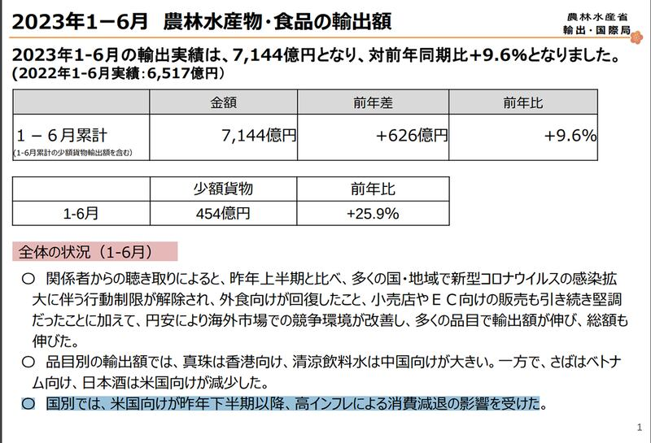
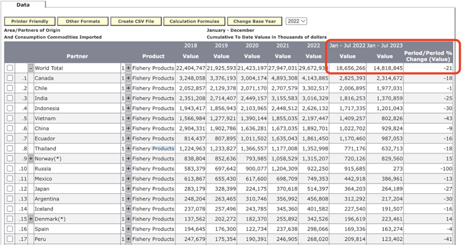

# 事實查覈｜因核處理水排放，美國2023年減少進口日本海鮮？

作者：沈軻，發自華盛頓

2023.09.20 16:32 EDT

查覈結果：誤導

**一分鐘完讀**  近期,中國多家官方媒體報道稱,美國政府在日本核處理水問題上雙重標準,並引用2023年上半年美國從日本進口的數據,稱水產進口量減少是因爲美國政府雖表面上支持福島核處理水排放,實際上卻擔心日本水產會影響健康。

經查覈，這個說法有誤導性。2023年上半年，美國從日本進口水產確實出現了下降，但原因與核處理水無關。日本農林水產省表示，自2022年下半年以來，美國的通貨膨脹率過高，導致消費下降、進口量減少；美國的進口數據也顯示，總體漁業產品進口2023年上半年同比走低，美國從加拿大、智利等多個國家的漁業品進口量都出現了大幅下降。

**深度分析**  日本啓動福島核處理水排放計劃後,中國官方媒體《 [環球時報](https://www.globaltimes.cn/page/202308/1297053.shtml)》、《 [觀察者網](https://www.guancha.cn/internation/2023_08_25_706345.shtml)》和央視自媒體帳號" [玉淵譚天](https://world.huanqiu.com/article/4EGXHOPPV0T)"等紛紛發文,批評美國政府"何等虛僞",一邊宣傳福島核處理水安全,另一邊卻減少了從日本的水產品進口量。多則報道都引用了日本農林水產省發佈的報告,稱美國是2023年上半年減少進口日本水產最多的國家,日本酒、魚糜(魚漿)和扇貝三種食品進口量降幅最大,後兩者的產地或是原料來源地均處於核處理水排放影響區域。

亞洲事實查覈實驗室發現，美國2023年從日本的水產品進口量確有下降， 但卻與福島核處理水排放事件無關。

## 美國進口日本水產品下降的原因是什麼？

根據來自日本農林水產省發佈的 [報告](https://www.maff.go.jp/j/press/yusyutu_kokusai/kikaku/attach/pdf/230804-1.pdf),2023年上半年,日本農產品和其他產品對美國出口減少了約83億日元(約5616.4萬美元),其中,明顯減少的的產品包括木材、威士忌、清酒、扇貝和魚漿。但該報告明確總結道,這是因爲自2022年下半年以來,美國的通貨膨脹率過高,而導致消費下降、因此日本對美國出口量減少。

日本農林水產省的解釋,與美國國內的統計數據相符。根據美國勞工統計局的消費者物價指數(Consumer Price Index, CPI)支持, [數據顯示](https://www.bls.gov/cpi/data.htm),美國在2022年經歷的8%通膨率,是該國自1981年以來的年度最高漲幅。

日本政府報告的首頁稱，對美國的出口之所以大幅下降，是因高通膨率降低消費者需求所致。 （日本農林水產省網站截圖）

美國整體進出口數據也表明,水產品進口減少的目的國家並不僅僅是日本。通過查詢 [美國農業部進口數據庫](https://apps.fas.usda.gov/gats/),我們發現,2023年上半年,美國漁業產品(Fishery Products)進口整體減少了兩成,除日本外,美國從其他主要進口國如加拿大,智利、越南等國家的漁業產品進口量都發生了大幅下降。

美國進口數據顯示，漁業產品整體2023年同比發生了下降（美國農業部進口數據庫截圖）

除了美國本身的通脹原因，日本農林水產省的報告也說明，日元疲軟、捕撈限制導致鱈魚等魚漿產品主要原料的價格飆升，也是影響出口的原因。

《觀察者網》特別指出，日本青花魚的出口大幅下降與美國減少進口有關。 但日本官方報告卻明確指出，青花魚出口下降是由於上半年漁獲量減少，該產品對非洲及東南亞的出口都銳減。

## 美國曾經檢出過有害的日本進口海鮮嗎？

2011年福島核事故發生後,美國確實基於安全考慮對部分日本產品發佈 [進口警報](https://www.taec.go.tz/wp-content/uploads/2021/10/13.-Import-Alert-99-33.pdf),但這些措施已經於2021年由美國食品藥物管理局(FDA) [取消](https://www.fda.gov/news-events/public-health-focus/fda-response-fukushima-daiichi-nuclear-power-facility-incident#medical)。

不僅日本海鮮，來自世界各地的所有的進口貨品都需經過 FDA的放射性物質檢查。FDA在2011年至2021年期間，對1749種疑似受到福島水質影響的食品進行了取樣和檢測，其中3種被發現含有微量放射性同位素-銫134和銫137，但檢出量仍遠低於該部門建議的安全水平。

接受檢測的品項，包括十三批扇貝、一批清酒和一批蟹肉棒（某些魚漿常見的共同成分），均未發現任何同位素的痕跡。之後，FDA在2021年解除進口警報到2023年7月28日這段期間，又採檢了51 個樣品，都沒發現可檢測到的銫含量。

因此，目前沒有證據表明，美國從日本進口的產品的放射性物質含量會危害公衆健康。

截至發稿，日本農林水產省和美國FDA均未回應亞洲事實查覈實驗室有關詢問。

*亞洲事實查覈實驗室（Asia Fact Check Lab）是針對當今複雜媒體環境以及新興傳播生態而成立的新單位。我們本於新聞專業，提供正確的查覈報告及深度報道，期待讀者對公共議題獲得多元而全面的認識。讀者若對任何媒體及社交軟件傳播的信息有疑問，歡迎以電郵afcl@rfa.org寄給亞洲事實查覈實驗室，由我們爲您查證覈實。*

[Original Source](https://www.rfa.org/mandarin/shishi-hecha/hc-09202023163149.html)