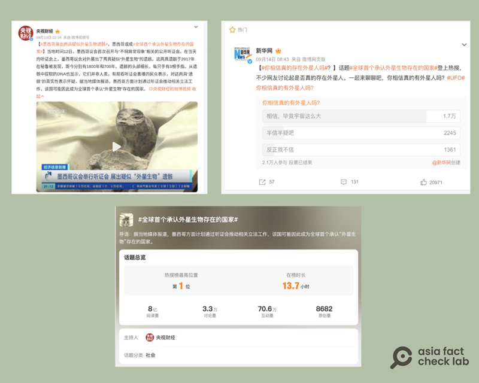

# 事實查覈｜墨西哥或爲“全球首個承認外星人存在的國家”？

沈軻，發自華盛頓

2023.09.21 14:56 EDT

查覈結果：錯誤

## 一分鐘完讀：

墨西哥一位研究不明飛行物體（UFO）的記者海梅·莫桑（Jaime Maussan）9月13日在國會聽證會上展示了兩個所謂“外星人屍體”的物體，引發世界範圍內的關注。隨後，在中國新聞媒體及社交網站上，此事被傳爲墨西哥或成爲“全球首個承認外星生物存在的國家”，一度登上社交媒體熱榜。

經查覈，上述說法是錯誤的，墨西哥政府並沒有承認外星人存在，政府召開聽證會也並不意味着該國準備承認。並且，在國際和墨西哥國內，學術界和媒體界都提出了不少針對所謂“外星人屍體”的質疑。

## 深度分析：

9月13日，墨西哥國會第一次就地外生命議題召開聽證會，莫桑在會議開始約兩個半小時後公開展示了這些“屍體”，稱它們“非人類，不在我們地球進化而成”。

墨西哥國會聽證中有人展示所謂"外星人屍體"的消息很快在世界範圍內成爲熱點新聞,在中國的社交媒體微博,這則新聞則被總結爲"墨西哥或成爲'全球首個承認外星生物存在的國家'", [相關話題](https://m.s.weibo.com/vtopic/detail_new?click_from=searchpc&q=%23%E5%85%A8%E7%90%83%E9%A6%96%E4%B8%AA%E6%89%BF%E8%AE%A4%E5%A4%96%E6%98%9F%E7%94%9F%E7%89%A9%E5%AD%98%E5%9C%A8%E7%9A%84%E5%9B%BD%E5%AE%B6%23)一度登上熱搜第一名。並且主持該話題的,爲中央電視臺財經頻道的微博號@央視財經。

在這個熱點話題之下，有新聞晨報、新華網等官方媒體，也有衆多有影響力的用戶參與，網友討論或戲謔，或驚訝，也有人提出質疑，但參與討論的不少新聞媒體和大V，並沒有對此進行深入報道、解釋。

中國新聞媒體和社交媒體盛傳墨西哥可能成爲“全球首個承認外星生物存在的國家”，該話題一度更登上微博熱搜第一名。（圖/微博截圖）

## 墨西哥政府認可外星人存在嗎？

經亞洲事實查覈實驗室查證,事實並非如此。墨西哥莫雷納黨現任黨首、衆議員塞爾吉奧·古鐵雷斯·盧納(Sergio Gutiérrez Luna)在聽證會後 [表示](https://apnews.com/article/extraterrestrials-ufo-mexico-congress-af7d54fabf3278ef83c39d899c457c76),國會並未對莫桑的觀點發表任何立場。

根據墨西哥 [國會公報](https://comunicacionsocial.diputados.gob.mx/index.php/notilegis/anuncian-sergio-gutierrez-y-jaime-maussan-primera-audiencia-publica-para-la-posible-legislacion-de-fenomenos-aereos-anomalos-no-identificados-en-mexico)記載,在聽證會上發言時,莫桑說他希望墨西哥政府能夠規範並將涉及不明飛行物的法律納入國家空域保護法,從而成爲世上第一個認可外星具有生命的國家。然而,此話只是莫桑個人表達意見,並不代表墨西哥政府的立場。

## “外星人屍體”的證據可信嗎？

對於墨西哥國會聽證中展示的所謂"外星人屍體",國際和墨西哥本國的科學界都 [高度存疑](https://www.nytimes.com/2023/09/13/world/americas/alien-mummy-congress-mexico.html)。

這並不是莫桑第一次展示"外星人屍體"。 2015 年,在參與名爲 "BeWitness "的活動中,他 [曾展示了幾張模糊不清的照片](https://skepticalinquirer.org/wp-content/uploads/sites/29/2015/09/p30.pdf),強調照片中有一具外星人屍體。後來網友揭露騙局,該"屍體"原來是美國原住民的兒童,死後被製成木乃伊,至今保存在科羅拉多州一家博物館。

2017年, 莫桑再次 [聲稱](https://skepticalinquirer.org/wp-content/uploads/sites/29/2015/09/p30.pdf),在祕魯納斯卡古遺址發現的一具頭骨拉長、有三根手指的木乃伊是外星生命的證據,並且爲付費視頻訂閱服務"蓋亞" 製作了與納斯卡木乃伊 [有關節目](https://www.gaia.com/search?q=jamie%2520maussan)。後來電腦斷層攝影 [分析表明](https://www.iaras.org/iaras/filedownloads/ijbb/2021/021-0007(2021).pdf),該"屍體"頭骨是由美洲駝和其他動物的部件而製成的。

最近這一次的國會聽證會中,莫桑引用了墨西哥國立自治大學物理研究所(UNAM)對屍體進行放射性碳測定年份的結果。但聽證會結束後,該研究所迅速 [發表了聲明](https://www.dgcs.unam.mx/boletin/bdboletin/2023_700xc.html),澄清雖在2017 年6 月爲客戶對皮膚和腦組織樣本進行了碳測定,但是並未對樣本的來源做出結論,強調"否認對結果的任何後續使用、解釋或不實陳述。"

與此同時,墨西哥國立自治大學天文學研究所還 [提醒](https://twitter.com/iaunam/status/1701639051105689680?s=20),迄今學界沒有觀測或實驗可以證明有地外生命或外星人造訪地球,更呼籲對這一公衆關心的領域進行進一步的科學調查,以堅持嚴格的標準。

*亞洲事實查覈實驗室（Asia Fact Check Lab）是針對當今複雜媒體環境以及新興傳播生態而成立的新單位。我們本於新聞專業，提供正確的查覈報告及深度報道，期待讀者對公共議題獲得多元而全面的認識。讀者若對任何媒體及社交軟件傳播的信息有疑問，歡迎以電郵afcl@rfa.org寄給亞洲事實查覈實驗室，由我們爲您查證覈實。*

[Original Source](https://www.rfa.org/mandarin/shishi-hecha/hc-09212023145441.html)